台積公司���年度 永續報告書 尊尊 O ESG 指導委員會主席的話

  
0 公司简介 創創創創創創創創創創創創創創創創創創創創創創創創創創創創創創創創創創創創創創創創創創創創創創創創創創創创

| 4   | 9   |
|-----|-----|
| 5   | 1   |
| 6   | 1   |

7 追求的, 00 4 0 產品質 5 0 客戶關係管理 7 負任的採購者
  
7 實踐永續管理 永
  
O ESG 管理平台 重大性分析與和和人才通 1
  
::
1 2 3

|           |
|-----------|
| ♀ 水管理  |
|           |
| 空气 空气 |

3 綠綠綠綠

|      |
|------|
| 人   |
| 00   |

1

| 1   |
|-----|

| 10   |
|------|

县县 134
  

|  社會影響力   | 172   |
|---------------|-------|
|               | 175   |
|               | 1     |

| 97   |
|------|
| 10   |
| 17   |

1 改改 營運與治理
  
  
111 1 199 附附
  
0 永續揭露框架

| 00   |
|------|

205 208 GRI
聯合國全球盟約對照表 台台 永永永永永永 利

| 20   |
|------|
| 2    |

|  上市上市上市上   | 209   |
|-------------------|-------|
| 公協會與非        | 21    |
| O ESG 續效摘要    | 2     |
|                   | 21    |
| 0 聯絡資訊        | 2     |

創新,驅動台積公司不斷成長 片片晶圓,承載未來發展榮景 構築世界共好的永續藍圖 身為負責任的全球企業公民 我們串聯各界夥伴投入資源 實現科技、自然與人文的共榮 匯集每一分正向力量 如漣漪般層層擴散 創造更多美好改變

導言 實踐永續管理 **營運與治理** 附錄
追求創新的先行者 負責任的採購者 綠色力量的執行者 員工引以為傲的公司 改變社會的力量

# Esg 指導委員會主席的話

在台積公司,我們相信「共好」的價值觀。遍布全球各地的台積人, 將我們深耕的永續理念厚植在公司經營的各項環節,讓台積公司 的存在,得以成為驅動世界更美好的力量。 回顧過去一年,根據美國國家海洋暨大氣總署(National Oceanic and Atmospheric Administration, NOAA)所 發 布 的「 民 國 112 年度全球氣候報告(Annual 2023 Global Climate Report)」, 民國 112 年是史上最熱的一年。我們無可忽視地感受到了氣候變 遷的影響,並可預見,隨著全球暖化,氣候變遷將為我們生態系 統與社區帶來衝擊。

在全球實踐環境承諾、驅動低碳轉型的過程中,企業成為愈發關 鍵的要角。台積公司透過持續投資實現淨零排放的各項綠色行 動、創新的節能減碳技術,每一年,我們都更加勇於設定積極目 標與付諸行動,迎向氣候變遷的挑戰。 民國 112 年,台積公司加速 RE100 的執行,以提前 10 年達成 目標。民國 129 年全公司生產營運據點的再生能源使用比例將 達成 100%,穩健邁向民國 139 年淨零排放目標。海外據點目前 已全面使用再生能源,將接續展開因地制宜的環境保育行動。我 們 發 布《 生 物 多 樣 性 宣 言 》,目 標 於 民 國 139 年 達 成 淨 零 毀 林、 自 然 與 生 物 多 樣 性 無 淨 損 失(No Net Loss)與 淨 正 向 影 響(Net Positive Impact)。透過定期且持續性的透明揭露,我們攜手各 我相信台積公司的永續行動,將如 漣漪般擴大,發揮影響力。

劉德音 界利害關係人,齊步跨足永續的未來。

第二十八屆聯合國氣候變遷大會(28th Climate Change Conference of Parties, COP28)是《巴黎協定(Paris Agreement)》簽 署 以 來 首 次進行全球盤點(Global Stocktake, GST),揭示我們需要更大 幅、快速且持續性地控制溫室氣體排放量。台積公司更加專注於 推動低環境影響性的營運模式,透過專責的綠色製造組織整合資 源,深化氣候與能源、水管理、資源循環、空氣汙染防制各面向 的專案執行成效。同時,建立負責任的半導體供應鏈,成為供應 商持續強化碳管理與氣候風險應變能力的堅定支持者。

在這一年,台積公司也慎重地修訂《人權政策》,包括回應聯合國 大會民國 111 年所決議之——享有潔淨、健康與永續環境是一項 基本人權。我們將環境權利納入六大人權承諾之一,並進一步支 持多項國際婦女與兒童相關準則規範、揭露人權管理方針,將人 權保障範疇自員工與供應鏈延伸至更廣泛的利害關係人。以擁抱 創新與改變的精神,台積公司矢志打造讓每個人都能感到安心的 包容職場,並推己及人地透過台積電文教基金會與台積電慈善基 金會,為在地社區提供服務。 台積公司致力為人類福祉與生態環境帶來貢獻。過去一年,我為全 體台積人齊力帶來的改變感到驕傲;未來,我相信台積公司的永續 行動,將如漣漪般擴大,發揮影響力。

董事長暨 ESG 指導委員會主席 劉德音董事長於民國 113 年 6 月 4 日正式退休

導言 實踐永續管理 **營運與治理** 附錄

## Esg 委員會主席的話

近年全球政經局勢與環境變化,極端天氣事件、地緣政治衝突及 後疫情時代對工作模式與供應鏈帶來衝擊;世界經濟論壇(World Economic Forum, WEF)最新發布的《全球風險報告》亦指出, 未來 10 年環境相關議題仍將主導全球風險格局,加以多極化
(Multipolar)國際競爭、人工智慧(AI)發展,更加凸顯「重建信 任」的重要性。台積公司致力兼容科技與永續發展,攜手利害關 係人以具體行動迎向共榮及成長。

視,民國 112 年正式成立人權工作小組,以董事會為最高治理層 級,發布首本《人權報告》;同時為深化多元、公平、共融(DEI) 文化,持續支持女性人才職涯各階段發展,並成立員工資源團體
(ERGs)照顧代表性偏低群體,亦將 DEI 與人權的重要性延伸至 供應鏈管理。此外,積極打造安全零事故的健康職場,不僅推展 多項身心健康促進活動,亦持續內外串聯,確保工作者的安全健 康。

民國 112 年,台積公司持續領先業界,成功量產 3 奈米增強型
(N3E)技 術, 透 過 288 種 製 程 技 術 為 客 戶 實 現 1 萬 1,895 種 產 品創新,推動科技與社會不斷進步;藉由 AI 實現智能精準製造, 優化工作流程及作業效率,以高品質製造模式協助客戶成功;開 拓全球人才布局,擴大產學合作計畫,由內而外激發創新動能, 培育質量兼具的半導體人才。

秉持「不遺落任何人」的信念,台積公司連續 3 年自主發布《聯合 國永續發展目標行動報告》,揭示 SDGs 目標進展,並透過台積電 文教基金會與台積電慈善基金會的六大主軸推動各項公益專案, 民國 112 年整合環境損益與社會影響力,發布第一本《永續影響 力 評 價 報 告 》, 系 統 性 檢 視 資 源 投 入 與 成 果 產 出, 從 外 部 性 觀 點 衡量台積公司對整體價值鏈帶來的改變。

除深耕先進技術藍圖,台積公司亦積極落實淨零承諾,宣布民國 129 年提前達成 RE100 目標,響應 COP 28「轉型脫離化石燃料」 決議,推行 822 項節能專案、建立零廢中心;此外,引領供應鏈 永續轉型,民國 112 年首創供應商環境資訊數位平台、邀請供 應商加入再生能源聯合採購,將綠色營運相關努力揭露於第一本
《氣候暨自然報告》,深化產業影響力。

資訊透明化是實踐 ESG 的重要精神,透過發布不同主題的 ESG 報告,維護與利害關係人的信任關係,同時帶來精進永續治理的 機會。展望未來,台積公司對內將持續以 ESG AWARD 打造全員 ESG 文化,將高階主管薪酬連結 ESG 成果,加快推動永續進程; 對外則緊密關注、呼應全球 ESG 倡議與趨勢,以「驅動美好的改 變」為核心,為環境及社會不斷創造共享價值。

善盡企業環境責任之外,台積公司進一步展現對人權的關懷與重 台積公司致力兼容科技與永續發展, 攜手利害關係人迎向共榮與成長。

何麗梅 資深副總經理暨 ESG 委員會主席 追求創新的先行者 負責任的採購者 綠色力量的執行者 員工引以為傲的公司 改變社會的力量

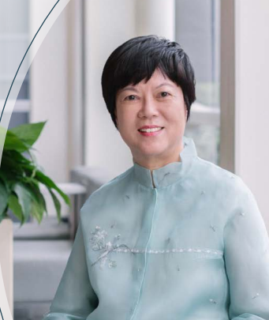

導言 實踐永續管理 **營運與治理** 附錄

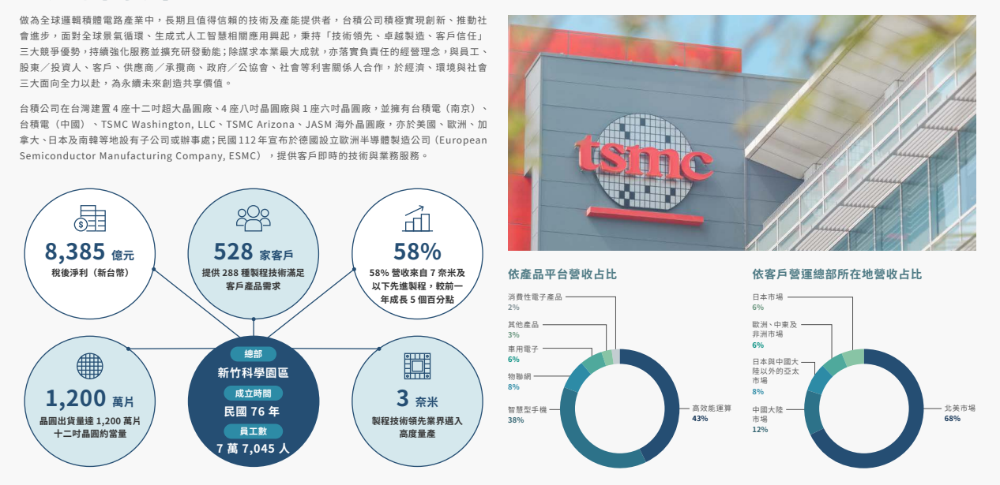

追求創新的先行者 負責任的採購者 綠色力量的執行者 員工引以為傲的公司 改變社會的力量

# 公司簡介

6

導言 實踐永續管理 **營運與治理** 附錄
# 創新的價值

半導體驅動科技不斷演進,並已大幅改變人類生活、學習與工作方式,包括通訊技術、資訊處理、環保節能、醫療照護、智能家居、智慧交通、生活娛樂等多元面向,半導體技術皆扮演關鍵角色。台積公司透過高 效能運算、智慧型手機、物聯網、車用電子及消費性電子五大技術平台,提供完備且具競爭優勢的邏輯製程技術、特殊製程技術、矽智財與封裝測試技術,攜手客戶加速實現產品創新,持續為經濟成長、環境保護 與社會進步做出貢獻。 

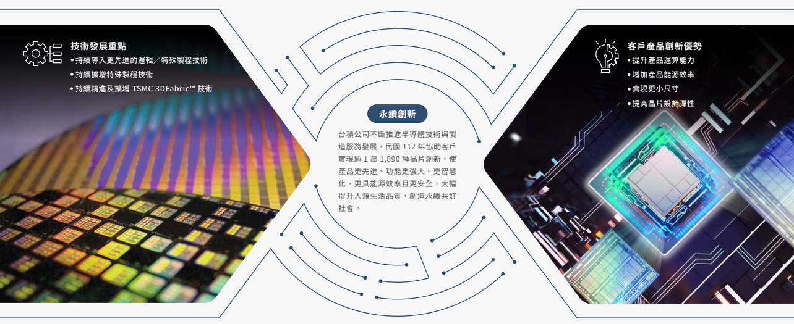

7

導言 實踐永續管理 **營運與治理** 附錄
追求創新的先行者 負責任的採購者 綠色力量的執行者 員工引以為傲的公司 改變社會的力量 五大技術平台 高效能運算支援強大的人工智慧驅動技 術,可更快、更準確於資料中心伺服器、中 央處理器/繪圖處理器上訓練複雜的預測 模 型,以執行模 擬 與分析,並 透 過早 期 預 警系統確認解決方案與優化資源,協助減 輕極端氣候災害

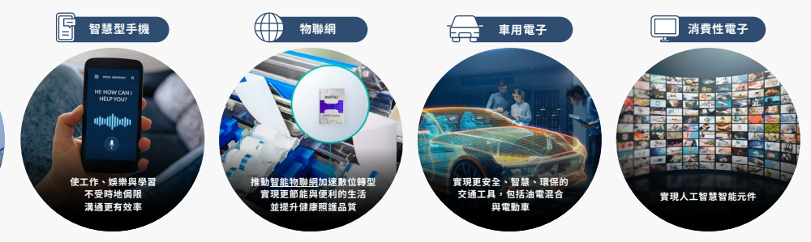

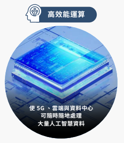

| 應用處理器   | 互補式金氧半導體   |
|--------------|--------------------|
| 基頻處理器   | 影像感測器         |
| 射頻收發器   | 藍芽               |
| 無線區域網路 | 全球定位系統       |
| 近場通訊     | 超寬頻等           |

智慧型手機透過神經處理單元的整合,可 強化其邊緣人工智慧能力,有助執行複雜 的終端裝置工作,例如自然語言處理、影 像辨識與預測分析,有效縮短回應時間、 提升隱私性,並提供更個人化的體驗 智慧物聯網具產業轉型、提高效率、減少 浪費與損失、提升個人生活品質的潛力。 例如 COVID-19 期間,超低功耗 RAIN RFID 標籤晶片加速全球關鍵醫療物資運送,創 造顯著社會價值( 感謝 Impinj 公司授權 使用照片)
汽車產業正經歷根本性變革,促進電動車 更低碳環保、由人工智慧驅動的先進駕駛 輔助系統更安全,並實現自動駕駛。透 過 人工智慧協助優化電池性能、管理能源消 耗並檢測潛在危險,提升道路安全 支 援 人 工智慧 的 消費性電子改 變了人 類 生 活,提升自動化、設備連接與用戶體驗。 例如智慧型數位電視配備語音辨識技術與 影像品質增強功能。消費性電子的持續創 新將為人工智慧的推進鋪路,提供更豐富 且沉浸式的現代生活 中央處理器 繪圖處理器 可程式邏輯閘 網路處理器 陣列 高速網路晶片等 伺服器處理器 人工智慧機器學習 加速器 客戶產品/應用 8

| 超低功耗微控制器   | 互補式金氧半導體   | 微控制器         | 近場通訊         | 微控制器     | 近場通訊     |
|--------------------|--------------------|------------------|------------------|--------------|--------------|
| 應用處理器         | 影像感測器         | 基頻處理器       | 雷達             | 基頻處理器   | 藍芽         |
| 基頻處理器         | 近場通訊           | 射頻收發器       | 乙太網交換機     | 射頻收發器   | 嵌入式快閃記 |
| 射頻收發器         | 藍芽               | 無線區域網路     | 電源管理晶片等   | 無線區域網路 | 憶體         |
| 無線區域網路       | 嵌入式快閃記憶體   | 互補式金氧半導體 | 互補式金氧半導體 | 電源管理晶片 |              |
| 無線射頻辨識等     | 影像感測器         | 影像感測器       | 時序控制器等     |              |              |

導言 實踐永續管理 **營運與治理** 附錄
永續績效

追求創新的先行者 負責任的採購者 綠色力量的執行者 員工引以為傲的公司 改變社會的力量 58 億 4,600 萬元 全年研發總支出占營收 8.5%(美元)
100%
美國專利獲准率達 100%,居前十大專利 權人中第一 1.86 兆元

帶動國內 1.86 兆元產值(新台幣)、27.2 萬個就業機會

11,895 種 以卓越製造服務為 528 家客戶提供產品 94%
客戶信任滿意度

96%
全球廢棄物回收率 8.3 億度電 新增年節能量,執行 822 項電力節能措施 12%
台灣廠區再生水替代率 RE100
「 全球營運 100% 使用再生能源 」目標 提前至民國 129 年 99%
揮發性有機氣體削減率 259 萬 6,322 人次 年度員工訓練完訓總人次 2,398 億元 全球員工整體薪資福利費用(新台幣)
6,133 個 全球新增優質工作機會

103 萬 1,433 人次 社會參與受益人次 14 億 5,400 萬元 社會參與總投入(新台幣)
追求創新的先行者 負責任的採購者 綠色力量的執行者 員工引以為傲的公司 改變社會的力量

導言 實踐永續管理 **營運與治理** 附錄

## 永續故事

永續故事不僅是台積公司追求永續發展過程中的 重要實踐,更期待成為社會美好改變的漣漪效應起 點,攜手利害關係人持續發揮影響力。 矢志成為「追求創新的先行者」,台積公司強化創 新能量,提升品質競爭力及客戶信任與滿意,積極 維持於本業的領先地位;身為「負責任的採購者」, 台積公司深化與供應鏈合作,將碳排放管理系統 化,並輔導供應商厚植營運韌性,帶動產業升級; 秉持「綠色力量的執行者」精神,台積公司以先進 製程協助全球節約能源,亦戮力實現水資源正效益 與循環經濟,致力以創新技術促進環境保護。 同時,台積公司以多元共融文化釋放人才潛能,提 供優質薪酬福利與培育制度,布局全球人才庫,打 造「員工引以為傲的公司」,並導入 AI 技術與升級 防護具,全方位守護職場安全。 除謀求本業發展,台積公司更透過「台積電文教基 金會」及「台積電慈善基金會」投入多元社會議 題,聆聽、扶持與賦能關注對象,推動各項公益專 案,呼應聯合國永續發展目標,帶動「改變社會的 力量」,創造共好價值。

## 創新管理

強化跨領域創新動能 首建「生產設備零件能源監控系統」, 精準掌握用電效率,協助 EUV 微影機 台 完成 4 項元件改善方案,估計年省 94 萬度電 查看完整內容 以「課程合作、產學研究合作、職涯引 導」建立校園合作長期計畫,全年投入 新 台幣 7,400 萬元產學合作資源,培 養 超過 1 萬名大學生與研究生,提升 半導體人才質量 查看完整內容

## 產品品質

以創新帶動品質競爭力 創新發展 E UV 曝光關鍵技術,研發「 複合材料完美比例、創新雙層複材 技術、濕式埃米級厚度蝕刻自校技 術、量測專屬全自動化設計系統」四 大概念突破生產瓶頸,成功開發「 高 穿 透率 E UV 光罩護膜」, 提升 1 2% 光相對穿透率,更獲 3 項專利 查看完整內容 深化客戶信任與滿意 客戶關係管理 持續優化「TSMC-Online™」,以「標 準化操作介面、個人化工作區、智慧 化引導服務」三大嶄新機制,提升系 統使用便利性,同時製作 1 0 支功能 教學影片,提升客戶資訊獲取效率

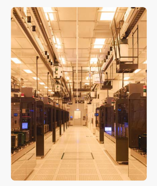

查看完整內容

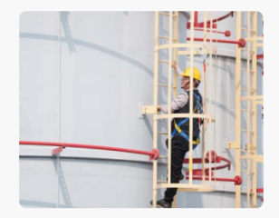

## 永續供應鏈管理

攜手供應商提升營運韌性 以「供應商環境資訊數位平台」建構 供應商環境資料收集與分析管理、碳 排熱點辨識功能,並針對關鍵排放源 供應商訂定 90 萬公噸減碳方案,持續 精進減碳效益 查看完整內容 透過「維舊如新」專案協助供應商釐 清產線異常問題點,並輔導其建立異 常事件的程序化管理及應變機制,當 年度單一供應商單一廠區產線異常下 降率達 93.5%,有效提升供應鏈韌性 查看完整內容

導言 實踐永續管理 **營運與治理** 附錄

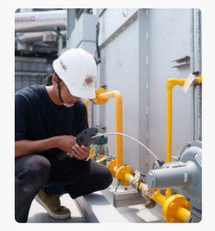

## 氣候與能源

先進製程協助全球節電 戮力實踐民國 139 年淨零排放承諾, 並攜手客戶以創新技術協助其他產業 與民生節約能源。依工研院推估,民 國 1 19 年台積公司每用 1 度電生產, 可為全球減省 4.28 度電;其中,高效 能運算相關的半導體產品,每使用 1 度電更能為全球減省 6 .8 度電,實現 更具能源效率的資訊與通信科技

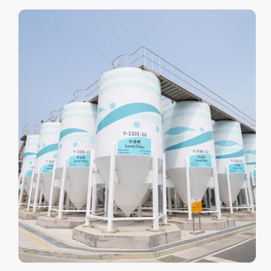

查看完整內容

## 水管理 復育行動實現水資源正效益

藉由「多元供水整合平台」全方位掌 握廠內用水管理,同時擴大再生水挹 注替代率;JAS M 廠區進一步推動涵 養水工程,以涵養池搭配環廠雨水收 集系統成功復育約 200 萬立方公尺地 下水,促進水資源正效益(Water Positive)
查看完整內容

## 資源循環

創造資源循環與再生價值 整合資源、提升驗證效率,台灣廠區 成功聯合取得 UL 2799 最高等級鉑金 級驗證,創全球半導體業首例 查看完整內容

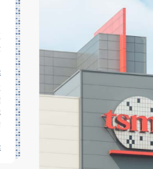

攜手供應商提升廢活性碳再生技術並 回用於台灣所有廠區,並進一步與環 境部合作研擬租賃模式,建立以租代 買的循環採購商業模式,再創資源循 環里程碑 查看完整內容 技術升級即時掌控潛在風險

## 空氣汙染防制

以源頭分流及多段式處理技術強化防 制設備效能,開發導入「低氮氧化物 均溫燃燒技術」,成功降低 6 0% 氮 氧 化物排放量;藉由「空汙快篩即時感 測儀」將檢測時間由 1 週縮短至 1 分 鐘,透過連續式監測即時掌握異常汙 染源,優化處理程序,並降低現場作 業人員採樣接觸酸鹼氣體風險 查看完整內容

導言 實踐永續管理 **營運與治理** 附錄 追求創新的先行者 負責任的採購者 綠色力量的執行者 員工引以為傲的公司 改變社會的力量

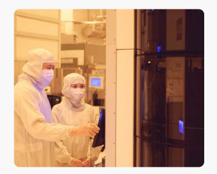

## 多元與共融

塑造共融文化釋放人才潛能 營造平等及多元包容的友善職場,舉 辦第一屆「多元共融系列活動」,提 升同仁多元共融意識;同時致力協助 女性人才發展、提升管理階層女性占 比,開辦「導師訓練工作坊」,鼓勵女 性人才勇於實現職涯目標 查看完整內容 人才吸引與留任 布局全球人才庫 廣納全球人才,為志同道合的團隊注 入新血;藉由提供具競爭力的薪酬與 福利,吸引、培育並留任人才 查看完整內容 落實工作與生活平衡,鼓勵「日日都 是運動日」的生活型態,促進員工參 與者認識多元的永續議題,運動會首 度導入 ISO 20121 活動永續性管理系 統,ESG 效益再升級 查看完整內容

## 人才發展

培育人才發揮所長 藉由能力導向的學習模組、多元彈性 的學習方式,並結合各職級培訓與發 展計畫,協助員工終身學習;新 增
「組織發展討論」計畫,開發客製化訓 練方案,執行學習與能力發展活動, 精進組織學習發展力

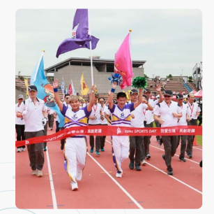

查看完整內容

## 職業安全與衛生

全方位防護職場安全 導 入 A I 技術提升健康風險分級正確 率,推動安全衛生及健康促進專案, 並與研發單位合作落實化學品源頭風 險管控 查看完整內容 與供應商合作,新增 52 款舒適便利的 防護具料號品項,確保員工與承攬商 皆能使用合適的防護具,營造友善安 全職場 查看完整內容 串聯夥伴提升永續價值 長期關注多元社會議題,透過「台積 電文教基金會」及「台積電慈善基金 會」推動各項公益專案,除以六大主 軸聆聽、扶持與賦能關注對象,並進 一步運用「衝擊報導與投資標準架構
(Impact Reporting and Investment Standards, IRIS+)」,衡量長期耕耘 的「厚學計畫」與「技職培力」專案 影響力,確保資源投入有效解決問 題,呼應聯合國永續發展目標,持續 擴大社會影響力

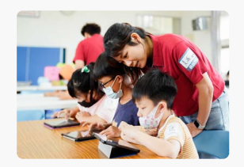

查看完整內容

## 社會影響力

導言 實踐永續管理 **營運與治理** 附錄
追求創新的先行者 負責任的採購者 綠色力量的執行者 員工引以為傲的公司 改變社會的力量

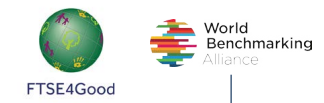

道瓊永續世界指數組成 企業評比「最佳」 等級
ISS ESG **可持續水管理標準(Alliance for** 

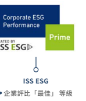

Water Stewardship, AWS)
世界標竿聯盟(World Benchmarking Alliance)
全球 2,000 大最具影響力公司(SDG2000)
連續四年獲得白金等級認證

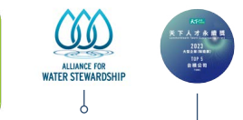

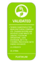

UL 2799 鉑金級 UL Solutions 天下人才永續獎:大型 企業製造業組第一名 MSCI ESG 指數 富時社會責任指數(FTSE4Good) **天下雜誌**
FTSE4Good 新興市場指數成分股 FTSE4Good 環球指數成分股 FTSE4Good 臺灣永續指數成分股 MSCI ESG Research 的 MSCI ESG 評等 - AAA 評等 MSCI 全球社會責任投資指數成分股 MSCI 全球伊斯蘭指數成分股 MSCI 新興市場 ESG 領導者指數成分股 企業騎士(Corporate Knights)及 As You Sow **財富雜誌(FORTUNE)**
2023 清淨低碳全球 200 大企業
《 Financial Times 》與 Statista 2023 年亞太地區氣候領袖 富比世雜誌(Forbes)
2023 全球最佳雇主之一 2023 最受推崇企業之一 晨星(Morningstar)
2023 最永續企業之一 Sustainalytics 企業 ESG 風險評等「低風險」— 半導體業
「公司治理評鑑」前 5% 公司(連續 9 年)
Institutional Investor Magazine 亞洲最受尊崇企業之一(科技/半導體業) 亞洲最佳 ESG 指標企業第一名(科技/半導體 業)— 機構投資人及券商分析師投票 臺灣證券交易所 台灣永續能源研究基金會 台灣十大永續典範企業獎首獎(連續 8 年) 年度最佳報告書 循環經濟領袖獎 資訊安全領袖獎 永續供應鏈領袖獎 水資源管理領袖獎 氣候領袖獎 道瓊永續指數

企業(連續 23 年)
MSCI 全球 ESG 領導者指數成分股

| 附附   |
|--------|

寶寶

| 營運   |
|--------|

等

| 負   |
|------|

| 追求的,   |
|-----------|

00

| 改改   |
|--------|

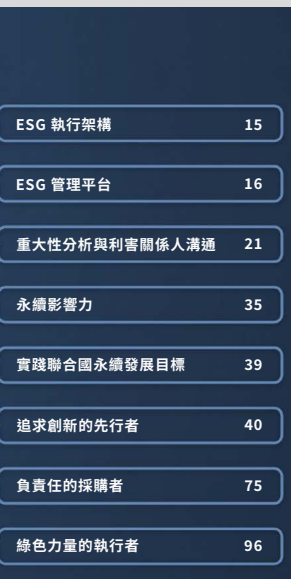

| 員員   |
|--------|

員員 133 171 改改

綠色

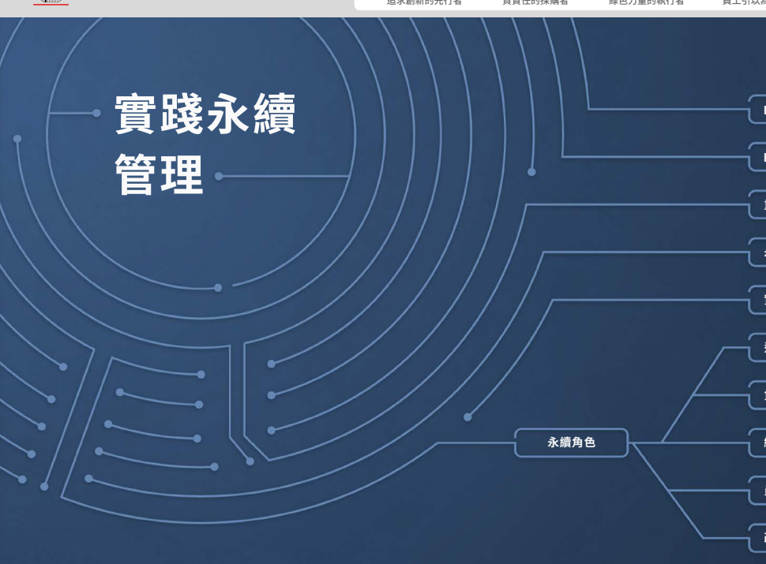

112 年度永續報告書

導言 實踐永續管理 **營運與治理** 附錄

追求創新的先行者 負責任的採購者 綠色力量的執行者 員工引以為傲的公司 改變社會的力量

# Esg 執行架構

秉持「提升社會」的 ESG 願景,台積公司以《ESG 政策》為永續發展最高指導原則,由台積公司創辦人張忠謀博士親自定義的「ESG 矩陣表」則清楚闡明台積公司 ESG 涵蓋範圍。透過「ESG 執行架構」,台積公 司於專業積體電路製造服務本業中實踐永續治理,深耕 ESG 五大方向、發揮影響力,並不斷厚植六大永續管理能力,攜手員工、股東/投資人、客戶、供應商/承攬商、政府/公協會與社會等利害關係人持續共創 價值。

委員會

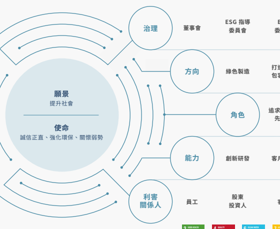

ESG

包容職場

建立責任

供應鏈 綠色製造 培育人才 關懷弱勢

經濟成長 **負責任的**

採購者

綠色力量 的執行者

員工引以為傲

的公司

改變社會

的力量

追求創新的

先行者

投資人 客戶 供應商

承攬商

政府

公協會 員工 社會

| 建立責任 供應鏈   |              |          |                 |        |
|-------------------|--------------|----------|-----------------|--------|
| 綠色製造          | 培育人才     | 關懷弱勢 |                 |        |
| 包容職場          | 員工引以為傲 |          |                 |        |
| 追求創新的        | 綠色力量     | 改變社會 |                 |        |
| 先行者            | 採購者       | 的執行者 | 的公司          | 的力量 |
| 管理              | 環境管理     | 人力資源 | 利害關係 人議合 |        |
| 創新研發          | 管理         |          |                 |        |
| 政府              |              |          |                 |        |
| 承攬商            |              |          |                 |        |

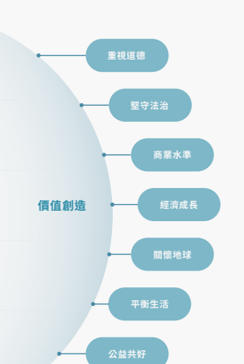

導言 實踐永續管理 **營運與治理** 附錄
# Esg 管理平台

台積公司由董事會/提名及公司治理暨永續委員 會督導企業永續發展,並建構「ESG 指導委員會」 與「ESG 委員會」二大管理平台,由董事長擔任 ESG 指導委員會主席、ESG 委員會主席擔任執行 秘書,每季與經營團隊共同審視攸關公司營運的 ESG 議題,依循《ESG 政策》的願景與使命,確 立各個永續議題的中長期發展策略與目標。

「ESG 委員會」落實「ESG 指導委員會」決議,整 合並串聯跨部門資源,指示專責組織企業永續部與 跨組織管理代表共同辨識利害關係人關注且與台 積公司營運相關的重大議題,並依議題設置任務 小組,鏈接競爭優勢與核心職能,擬定相應策略、 目標與行動方案,每季由 ESG 委員會主席向董事 會/提名及公司治理暨永續委員會報告 ESG 執行 成果及未來工作計畫,汲取回饋與建言。民國 112 年 ESG 委員會共督導 75 個永續專案的發展進程, 同時持續舉辦 ESG AWARD,扎根企業永續文化, 促使 ESG 策略落實於日常營運中,以具體行動接 軌全球永續發展趨勢,實踐「提升社會」的 ESG 願景。

董事會/提名及公司治理暨永續委員會

永續發展最高治理單位

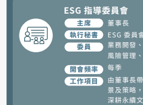

ESG 委員會主席
業務開發、財務、人力資源、資訊技術及資材暨 風險管理、法務、營運、研究發展等高階主管 由董事長帶領經營團隊檢視、擬定公司 ESG 願 景及策略,與 ESG 委員會一同推動相關作為, 深耕永續文化,驅動更多正向改變

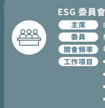

每季
由董事長指派高階主管擔任委員會主席

 相關功能組織推派管理代表 工作項目 鑑別永續重大議題,擬定因應行動方案 督導跨部門溝通、資源整合協調 編列各組織與 ESG 相關預算 追蹤各面向永續議題實踐績效,建立持續改善 計畫,精進公司永續發展 每季由主席向董事會報告執行成果與工作計畫 追求創新的先行者 負責任的採購者 綠色力量的執行者 員工引以為傲的公司 改變社會的力量 營運與治理

ESG 部門&各組織

業務開發、客戶服務、環保安全衛生、財務、人力資源、資訊技術及資材 暨風險管理、投資人關係、法務、營運、公共關係、品質暨可靠性、研究 發展、台積電慈善基金會、台積電文教基金會

導言 實踐永續管理 **營運與治理** 附錄
追求創新的先行者 負責任的採購者 綠色力量的執行者 員工引以為傲的公司 改變社會的力量 米玉傑

研究發展資深副總經理 積極培育創新人才,鼓勵同仁勇於挑 戰、同心協力開發領先全球的半導體 技術,協助客戶實現創新,為世界帶 來永續美好的未來。

## 吳顯揚

研究發展/平台研發副總經理 技術領先是台積公司持續成長的重要 基 石,我 們 承 諾 一 同 營 造 開 放 創 新、 多元共融的研發環境,並推展研發組 織數位卓越,充分發揮同仁潛能,實 現企業永續經營。

張曉強

業務開發、海外營運辦公室資深副總 經理 邁入 AI 時代,半導體技術是 AI 產品及 應用創新的核心。我們致力與全球客 戶建立有意義的夥伴關係,發展永續 技術藍圖,共同開發更強大及能源效 率更好的產品,驅動更美好的社會。

方淑華

 法務副總經理暨法務長/公司治理主管
「誠信正直」的核心價值驅動台積公司 實踐公司治理、從業道德與風險管理 的最高標準,同時兼顧所有利害關係 人的利益,以追求企業營運的永續。

秦永沛

營運、海外營運辦公室資深副總經理 台積公司從環境永續、綠色製造的核 心價值出發,發展先進卓越技術、導 入智慧數位管理,與合作夥伴共同打 造淨零永續的未來。

莊瑞萍

營運/晶圓廠營運一副總經理 透過智能精準製造提升全球生產效率 和品質,同時致力於永續發展,打造 高效、永續的製造環境,並實踐能源 節約和減少碳排放等生態永續措施。

導言 實踐永續管理 **營運與治理** 附錄
追求創新的先行者 負責任的採購者 綠色力量的執行者 員工引以為傲的公司 改變社會的力量 魯立忠

 台積科技院士、研究發展/設計暨技術 平台副總經理 台積公司的 OIP 3DFabric 聯盟可協 助客戶實現更高水準的 3DIC 整合。針 對先進封裝設計法則的聯合生態系統創 新,促進系統性能不斷提高,同時保持 可永續的能源效率。

何麗梅

 人力資源資深副總經理 因應公司全球化發展,營造多元共融 的環境為人才願景關鍵,我們尊重差 異,讓同仁發揮潛能,激發團隊熱情, 進而落實公司及產業永續人才發展。

品質暨可靠性、營運/先進封裝技術暨 服務副總經理 台積公司全方位投注品質熱忱,透過 精益求精的品質文化、持續創新的品 質能力,攜手客戶與供應商實現高品 質的產品,驅動產業共榮成長。

何軍

侯永清 歐亞業務、研究發展/技術研究資深副 總經理 在瞬息萬變的年代,台積公司秉持「客 戶信任」的核心價值持續創新,強化供 應鏈韌性,積極全球布局和提供先進技 術與產能,深化客戶合作以實現客戶成 功,共創雙贏局面。

## 林錦坤

資訊技術及資材暨風險管理資深副總經 理/資訊安全長 台積公司致力驅動產業的正向循環,建 構綠色責任供應鏈,推廣 ESG 到更多 供應商,使 ESG DNA「無所不在」,朝 向民國 139 年淨零排放,大步邁向永 續共好的未來。

導言 實踐永續管理 **營運與治理** 附錄
追求創新的先行者 負責任的採購者 綠色力量的執行者 員工引以為傲的公司 改變社會的力量 莊子壽

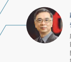 營運/廠務副總經理 廠務透過建設低碳綠建築廠房、精進 節 能 減 碳 措 施、推 動 資 源 循 環 利 用、 開發低碳技術、發展智慧管理等綠色 製 造 作 為,建 構 台 積 公 司 永 續 營 運 環境。

張宗生

台積科技院士、營運/先進技術暨光罩 工程副總經理 台積公司在先進製程研發過程中,也 將環境永續因子融入其中,導入創新 節能元件,深化低碳製造能力,提升新 廠能源使用效率,持續為永續發展而 努力。

## 廖永豪

營運/晶圓廠營運二副總經理 台積公司為推動低碳轉型、邁向淨零 永續,以綠色思維引導技術創新、數位 轉 型,透 過 跨 國 界、跨 領 域 合 作,擴 散綠色影響力。

曾繁城

 台積電文教基金會董事長 台積電文教基金會以「青年培育」、「教 育合作」及「藝文推廣」做為工作主軸, 致力達成聯合國永續發展目標,號召 青 年 支 持 永 續 生 活,帶 動 社 會 正 向 循環。

張淑芬

台積電慈善基金會董事長 台積電慈善基金會鼓勵志工用專業 長期服務,也協力政府和企業一同用 行動來關心偏鄉的需要!在台積公司 ESG 全面的努力下,我們持續連結第 一線的溫度。

黃仁昭

財務副總經理暨財務長兼發言人 儘管產業不確定性持續存在,台積公 司透過良好的財務績效、長期且永續 的股利政策、健全的公司治理,持續 為投資人帶來長期報酬,並加速客戶 實現產品創新,用科技驅動更永續的 社會。

ESG 指導委員會 民國 112 年

## Esg 議題呈報董事會要點 民國 112 年 當年度執行成果 成果實績

因應民國 139 年淨零排放藍圖,將全球營運 100% 使用再生能源目標提前至民國 129 年, 同時持續精進綠色製造績效 打造低碳供應鏈,首創國內再生能源聯合採購創新模式,倡議多元共融及人權議題,完善 供應鏈 ESG 發展 強化女性人才職涯各階段發展,擴大支持員工資源團體,舉辦多元共融系列活動,以開放 型管理模式打造包容職場 擴大全球產學合作,積極推廣科普及 STEM 教育 推動歷屆 ESG AWARD 酷炫點子獎付諸實行,第四屆 ESG AWARD 新增「ESG 熱情推動 獎」,建置全球 ESG 交流社群 以永續報告書為 ESG 管理工具,更新《氣候暨自然報告》,持續編製《聯合國永續發展目 標行動報告》、《重大性分析報告》,擴大永續資訊揭露透明度

## 次年度工作目標

提升製程生產能效,持續採購再生能源、擴大再生水使用與資源循環,實踐淨零排放承諾 輔導供應商制定減碳計畫,推動碳排資訊數位管理,提升供應商永續管理能力 更新《多元與共融宣言》,並以《人權政策》為依歸,將人權保障延伸至價值鏈各階段 持續建立各教育階段學用合作計畫,栽培半導體及 STEM 人才 攜手跨界夥伴推動偏鄉關懷、長者照護、藝文普及、教育培力,建構穩健社會支持網絡 首次發布《人權報告》,並結合社會影響力與環境損益分析發行《永續影響力評價報告》
審視民國 139 年淨零排放目標相關行動方案進展,支持供 應鏈購買再生能源並加速 RE100 進程 發布《生物多樣性宣言》,目標於民國 139 年達成淨零毀 林、自然與生物多樣性無淨損失(No Net Loss)與淨正向 影響(Net Positive Impact)
修訂《人權政策》,支持人權相關準則規範,擴大利害關係 人涵蓋範疇 實踐永續發展,持續接軌全球永續標準、管理趨勢及企業 最佳實務並設定台積公司 ESG 目標 為公司創新的永續文化挹注動能,推動第四屆 ESG AWARD,吸引 3,166 件來自員工與組織的永續提案,較 第三屆成長近 68% 訂定與監督企業永續相關預算與財務控制,統籌 ESG 資源 需求、分配與執行規畫 增加再生水替代率,創新空汙檢測與防制設備處理技術; 啟用台灣首座零廢製造中心,提升廠內廢棄物回收率與資 源再生活化比例;成立生態任務小組進行生物多樣性評估 並擬定行動計畫 戮力減緩氣候變遷影響,海外營運據點持續達成範疇一與 範疇二淨零排放;持續擴增陸域風場供電,並將民國 119 年再生能源使用比例由 40% 提升為 60%;提出 822 項節 能方案,共計減 8 億度用電量 落實永續供應鏈管理,要求原物料及設備供應商參與 CDP 供應鏈碳揭露專案,並推動供應鏈再生能源使用與「1+N 碳管理模式」;發行《新建廠工程承攬商環安衛藍皮書》, 強化承攬商施工安全管理 針對顯著人權議題落實盡職調查、訂定管理方針;設計與 發布「供應鏈人權議題補充問卷」;首次要求供應鏈訂定多 元共融政策,並設為年度目標,攜手供應商推動人權管理 推出一系列新人關懷措施,成立 GlobalFamily @tsmc 與 Accessibility@tsmc,提供支持、釋放員工潛能 台積電文教基金會與台積電慈善基金會積極關注社會脈 動,以具體作為落實社會共好 

## Esg 委員會

 民國 112 年 成果實績

導言 實踐永續管理 **營運與治理** 附錄
追求創新的先行者 負責任的採購者 綠色力量的執行者 員工引以為傲的公司 改變社會的力量

# 重大性分析與利害關係人溝通

台積公司依循《GRI 通用準則 2021(GRI Universal Standards 2021)》 的《GRI 3: 重 大 主 題 2021
(GRI 3:Material Topics 2021)》、世界經濟論壇 (World Economic Forum, WEF)與歐洲財務報導 諮詢小組(European Financial Reporting Advisory Group, EFRAG)針對企業永續報導指令(Corporate Sustainability Reporting Directive, CSRD)發布 的歐盟永續報導標準(European Sustainability Reporting Standards, ESRS),透過衝擊、風險與 機會(Impacts, Risks, and Opportunities, IRO)的雙重重大性(Double Materiality)原則, 建構台積公司動態與雙重重大性(TSMC Dynamic &
 Double Materiality, TDDM)方法學。此方法學整 合「利害關係人關注度」、「組織營運衝擊」與「永 續發展衝擊」三重維度,以溝通力、成長力與影響 力排序 ESG 議題優先順序與重要性,決定重大性 矩陣,做為台積公司精進永續管理,強化與利害關 係人溝通的重要基礎。詳細資料請參考最新發行的
《台積公司重大性分析報告》。

台積公司每 2 年 1 次進行重大性分析,民國 112 年共 1,693 位內外部利害關係人,與超過 200 位 負責推動永續業務的台積公司主管及同仁參與調 查;綜合考量利害關係人關注度、組織營運衝擊 與永續發展衝擊的問卷調查結果,鑑別出 14 個 重 大 議 題, 經 ESG 委 員 會 確 認 後, 向 董 事 會 呈 報。台積公司重大議題除設定民國 119 年長期目 標、追蹤管理績效,並進一步整合企業風險管理
(Enterprise Risk Management, ERM) 流 程, 辨識風險因子、風險趨勢、嚴重度與發生機率,從 機會與風險角度規畫 ESG 策略藍圖與洞察永續影 響力。 台積公司動態與雙重重大性(TDDM)分析方法及 民國 112 年重大性分析流程與結果,經獨立第三 方立恩威國際驗證股份有限公司查證,前 5 項重 大議題分別為永續供應鏈管理、氣候與能源、人才 吸引與留任、人才發展、創新管理,引領台積公司 落實四大永續發展趨勢。 因應《GRI 通用準則 2021》將人權調整至《GRI 2: 一 般 揭 露 2021》, 台 積 公 司 將「 商 業 與 人 權 」 的 重大議題調整至「營運與治理」章節;同時考量人 權議題涵蓋的多面性及對企業永續的重要性,預計 民國 113 年發布第一本人權主題式報告,說明人 權政策與承諾、盡職調查流程、減緩與補救機制與 長期目標。詳細資料請參考最新發行的《台積公司 人權報告》。

導言 實踐永續管理 **營運與治理** 附錄
追求創新的先行者 負責任的採購者 綠色力量的執行者 員工引以為傲的公司 改變社會的力量 台積公司重大性分析流程 動態重大性 **雙重重大性**

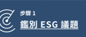

治理面 6 個 經濟面 5 個 環境面 5 個 社會面 6 個

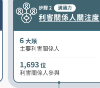

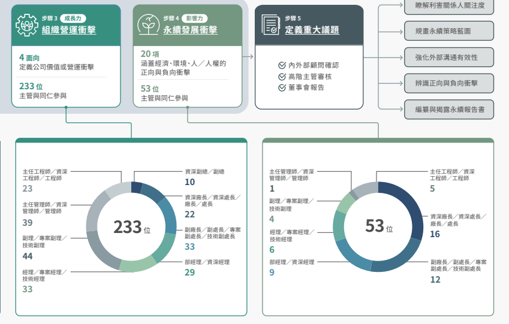

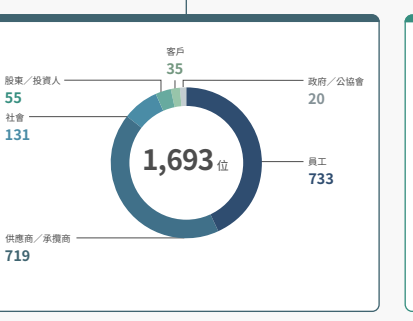

導言 實踐永續管理 **營運與治理** 附錄
追求創新的先行者 負責任的採購者 綠色力量的執行者 員工引以為傲的公司 改變社會的力量

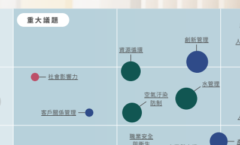

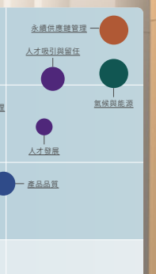

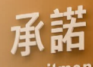

## 台積公司重大性矩陣

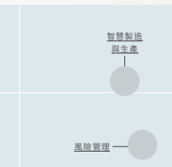

| 資源循環        |                  |                |                  |
|-----------------|------------------|----------------|------------------|
| 社會影響力      | 氣候與能源       |                |                  |
| 水管理          |                  |                |                  |
| 空氣汙染 防制   |                  |                |                  |
| 風險管理        | 客戶關係管理     | 人才發展       |                  |
| 財務績效        | 商業與人權       |                |                  |
| 職業安全 與衛生 | 產品品質         |                |                  |
| 公司治理        | 多元與共融       |                |                  |
| 生物多樣性      | 從業道德         |                |                  |
| 稅務            | 數據與資訊安全   |                |                  |
| 改變社會的力量  |                  |                |                  |
| 組織營運衝擊    | 追求創新的先行者 | 負責任的採購者 | 利害關係人關注度 |

綠色力量的執行者 員工引以為傲的公司

改變社會的力量 **組織營運衝擊**

低 高

導言 實踐永續管理 **營運與治理** 附錄
重大議題與價值鏈

| 永續角色                                                 | 重大議題                                                                                                                    | GRI 準則特定主題                                                                  | SASB 準則                                              | 上游註 1   |        |          |
|----------------------------------------------------------|-----------------------------------------------------------------------------------------------------------------------------|-----------------------------------------------------------------------------------|--------------------------------------------------------|------------|--------|----------|
| 永續角色                                                 | 重大議題                                                                                                                    | GRI 準則特定主題                                                                  | SASB 準則                                              | 上游註 1   | 向心力 | 營運風險 |
| 台積營運註 2                                             | 下游註 3                                                                                                                    | 營收成長 客戶滿意                                                                 | 員工 向心力                                            | 營運風險   |        |          |
| 台積營運註 2                                             | 下游註 3                                                                                                                    | 營收成長 客戶滿意                                                                 | 員工                                                   |            |        |          |
| 採購階段                                                 | 晶圓製造                                                                                                                    | 封裝/測試                                                                        | 客戶使用                                               |            |        |          |
| 採購階段                                                 | 晶圓製造                                                                                                                    | 封裝/測試                                                                        | 客戶使用                                               |            |        |          |
| 創新管理 創新管理                                        | 間接經濟衝擊、能源 間接經濟衝擊、能源                                                                                       | TC-SC-410a.2 TC-SC-410a.2                                                         |                                                        |            |        |          |
| 追求創新的先行者 追求創新的先行者                        | 產品品質 產品品質                                                                                                           | 顧客健康與安全 顧客健康與安全                                                     | TC-SC-410a.1 TC-SC-410a.1                              |            |        |          |
| 客戶關係管理 客戶關係管理                                | 客戶隱私 客戶隱私                                                                                                           |                                                                                   |                                                        |            |        |          |
| 負責任的採購者 負責任的採購者                            | 永續供應鏈管理 永續供應鏈管理                                                                                               | 採購實務、供應商環境評估、供應商社會評估 採購實務、供應商環境評估、供應商社會評估 | TC-SC-440a.1 TC-SC-440a.1 TC-SC-110a.1,  TC-SC-110a.1, |            |        |          |
| 氣候與能源 氣候與能源                                    | 能源、排放、經濟績效 能源、排放、經濟績效                                                                                   | TC-SC-110a.2,  TC-SC-110a.2,  TC-SC-130a.1 TC-SC-130a.1                           |                                                        |            |        |          |
| 綠色力量的執行者 綠色力量的執行者                        | 水管理 水管理                                                                                                               | 水與放流水 水與放流水                                                             | TC-SC-140a.1  TC-SC-140a.1                             |            |        |          |
| 空氣汙染防制 空氣汙染防制                                | 排放 排放                                                                                                                   |                                                                                   |                                                        |            |        |          |
| 資源循環 資源循環                                        | 廢棄物 廢棄物                                                                                                               | TC-SC-150a.1 TC-SC-150a.1                                                         |                                                        |            |        |          |
| 多元與共融 多元與共融                                    | 員工多元化與平等機會 員工多元化與平等機會 經濟績效、市場地位、勞雇關係、員工多元化 經濟績效、市場地位、勞雇關係、員工多元化 |                                                                                   |                                                        |            |        |          |
| 人才吸引與留任 人才吸引與留任                            | TC-SC-330a.1  TC-SC-330a.1                                                                                                  |                                                                                   |                                                        |            |        |          |
| 與平等機會 與平等機會                                    |                                                                                                                             |                                                                                   |                                                        |            |        |          |
| 員工引以為傲的公司 員工引以為傲的公司                    | 人才發展 人才發展                                                                                                           | 訓練與教育 訓練與教育                                                             | TC-SC-320a.1,  TC-SC-320a.1,                           |            |        |          |
| 職業安全與衛生 職業安全與衛生                            | 職業安全衛生 職業安全衛生                                                                                                   | TC-SC-320a.2  TC-SC-320a.2                                                        |                                                        |            |        |          |
| 改變社會的力量 改變社會的力量                            | 社會影響力 社會影響力                                                                                                       | 經濟績效、間接經濟衝擊 經濟績效、間接經濟衝擊                                     |                                                        |            |        |          |
| 註 1:「上游」邊界為台積公司採購的原物料、設備及相關服務 | 註 3:「下游」邊界為台積公司提供完成生產的客戶產品                                                                          |                                                                                   |                                                        |            |        |          |

註 1:「上游」邊界為台積公司採購的原物料、設備及相關服務 註 2:「台積營運」邊界為台積公司所提供的晶圓製造與封裝/測試業務 註 3:「下游」邊界為台積公司提供完成生產的客戶產品 註 4:「 」代表議題在該階段具有實質衝擊,或為台積公司推動 ESG 重點

導言 實踐永續管理 **營運與治理** 附錄
追求創新的先行者 負責任的採購者 綠色力量的執行者 員工引以為傲的公司 改變社會的力量

## 重大議題與風險管理

| 重大議題                                 | 創新管理                     | 產品品質                            | 客戶關係管理                       | 永續供應鏈管理                     |                                    |
|------------------------------------------|------------------------------|-------------------------------------|------------------------------------|------------------------------------|------------------------------------|
| 無法洞察技術的改變及                     | 專利與營業秘密保護─          | 產品品質與良率受到挑戰              | 客戶無法獲取所需的技術服務         | 採購集中、供應商不符台積公司或法規 |                                    |
| 發展創新技術                             | 未適當保護公司的研發         | 要求                                |                                    |                                    |                                    |
| 創新成果                                 |                              |                                     |                                    |                                    |                                    |
| 風險考量及屬性 策略                      | 先進製程在技術難度、         | 公司以專利與營業秘密                | 晶圓產品品質檢驗隨製程與技術複雜度 | 若客戶不瞭解台積公司所提供的技術服 | 供應鏈中斷(包含原物料、機台設備) |
| 營運                                     | 生產成本及供應鏈難度         | 保護研發創新成果,確                | 增加備受挑戰,若未檢出不合格產品, | 務,可能會尋求其他公司的解決方案   | 將影響公司營運及對客戶的承諾       |
| 劇增,若無法洞察技術                     | 保技術領先地位,捍衛         | 將造成客戶損失並影響企業聲譽        | 台積公司透過與客戶的定期及不定期會 | 請參閱「永續供應鏈管理」章節及台積 |                                    |
| 發展趨勢、即時開發,                     | 公司與客戶全球營運自         | 品質異常的原物料可能造成產品報廢並  | 議,瞭解並收集客戶的技術需求。截至 | 公司 112 年度年報「6.3 風險管理」  |                                    |
| 公司競爭優勢及市占率                     | 由;若缺乏完善保護,         |                                     |                                    |                                    |                                    |
| 風險評估及減緩作為                       | 影響客戶及公司營運           | 民國 112 年,已提供客戶生產製造的技 |                                    |                                    |                                    |
| 將受影響                                 | 將影響公司技術競爭           | 術種類達 994 種、先進封裝技術種類達 |                                    |                                    |                                    |
| 請參閱「產品品質」章節                   |                              |                                     |                                    |                                    |                                    |
| 優勢                                     |                              |                                     |                                    |                                    |                                    |
| 請參閱「創新管理」章節                   | 149 種                       |                                     |                                    |                                    |                                    |
| 請參閱「創新管理」章節                   | 請參閱「客戶關係管理」章節   |                                     |                                    |                                    |                                    |
| 及台積公司 112 年度年 報「6.3 風險管理」 |                              |                                     |                                    |                                    |                                    |
| 風險發生機率及趨勢                       | 幾乎確定                     |                                     |                                    |                                    |                                    |
| 趨勢上升                                 | 很可能                       |                                     |                                    |                                    |                                    |
| 趨勢持平                                 | 可能                         |                                     |                                    |                                    |                                    |
| 趨勢下降                                 | 不太可能 罕見                |                                     |                                    |                                    |                                    |
| 風險嚴重度                               | 災難性 嚴重 中等 輕微 不顯著 |                                     |                                    |                                    |                                    |

導言 實踐永續管理 **營運與治理** 附錄
追求創新的先行者 負責任的採購者 綠色力量的執行者 員工引以為傲的公司 改變社會的力量

## 重大議題與風險管理

| 重大議題                                           | 氣候與能源                           | 水管理                         | 資源循環                           | 空氣汙染防制                       |                                    |
|----------------------------------------------------|--------------------------------------|--------------------------------|------------------------------------|------------------------------------|------------------------------------|
| 氣候災害造成營運衝擊                               | 空氣汙染物排放影響環境               |                                |                                    |                                    |                                    |
| 電力供應短缺或中斷                                 | 水源供應短缺或中斷、廢水排放影響環境 | 廠商未妥善處理廢棄物,汙染環境 |                                    |                                    |                                    |
| 溫室氣體排放上升、溫 室氣體排放減量法規及 其他要求 |                                      |                                |                                    |                                    |                                    |
| 風險考量及屬性 策略                                | 更多利害關係人要求台                 | 不穩定的電力供應,產           | 不穩定的水源供應,產能受限,影響公 | 廢棄物處理廠商未依許可規定處理,可 | 空汙防制設施若操作不當或故障,導致 |
| 營運                                               | 積公司增加使用再生能                 | 能受阻,影響公司營運           | 司營運及滿足客戶需求的能力         | 能使台積公司遭主管機關要求負連帶清 | 汙染物排放超過法規標準,將使公司受 |
| 源,可能造成公司成本                               | 及滿足客戶需求的能力                 | 理及環境改善責任,影響企業聲譽 | 罰,影響企業聲譽                   |                                    |                                    |
| 廢水排放異常,汙染環境違反法規且聲                 |                                      |                                |                                    |                                    |                                    |
| 增加,若無法滿足此要                               | 請參閱「氣候與能源」                 | 譽受損                         | 請參閱「資源循環」章節             | 請參閱「空氣汙染防制」章節         |                                    |
| 求,恐影響蓋廠進度與                               |                                      |                                |                                    |                                    |                                    |
| 風險評估及減緩作為                                 | 章節                                 | 請參閱「水管理」章節           |                                    |                                    |                                    |
| 客戶產品下單 請參閱「氣候與能源」 章節             |                                      |                                |                                    |                                    |                                    |
| 風險發生機率及趨勢                                 | 幾乎確定                             |                                |                                    |                                    |                                    |
| 趨勢上升                                           | 很可能                               |                                |                                    |                                    |                                    |
| 趨勢持平                                           | 可能                                 |                                |                                    |                                    |                                    |
| 趨勢下降                                           | 不太可能 罕見                        |                                |                                    |                                    |                                    |
| 風險嚴重度                                         | 災難性 嚴重 中等 輕微 不顯著         |                                |                                    |                                    |                                    |

導言 實踐永續管理 **營運與治理** 附錄
追求創新的先行者 負責任的採購者 綠色力量的執行者 員工引以為傲的公司 改變社會的力量 重大議題與風險管理

| 重大議題                                                             | 多元與共融                   | 人才吸引與留任           | 人才發展                                                                        | 職業安全與衛生   | 商業與人權               |                            |                           |
|----------------------------------------------------------------------|------------------------------|--------------------------|---------------------------------------------------------------------------------|------------------|--------------------------|----------------------------|---------------------------|
| 員工無法適切發揮潛能                                                 | 無法即時招募到或是流失過多   | 人才無法與時俱進         | 發生地震、                                                                      | 發生職災、職     | 新興傳染病               | 無法適切保護員工以及供應商 |                           |
| 質量俱優人才                                                         | 火災                         | 業疾病、化學             | 員工人權                                                                        |                  |                          |                            |                           |
| 品危害                                                               |                              |                          |                                                                                 |                  |                          |                            |                           |
| 風險考量及屬性 策略                                                  | 若員工組合無法反映社會現     | 若無法即時招募到及留用質 | 若人才無法與時俱進,將                                                          | 地震、火災導     | 人員未落實作             | 新興傳染病,               | 若不能適切保護員工及供應  |
| 營運                                                                 | 況,將削弱公司瞭解社會及     | 量俱優人才,公司業務可能 | 侵蝕公司競爭優勢及成長                                                          | 致內部機台、     | 業安全規範,             | 造成人員群聚               | 商員工人權, 不僅影響企業 |
| 掌握市場各面向能力,進而                                             | 因此受影響                   | 動能                     | 設備損壞,造                                                                    | 導致失能傷害     | 感染導致公司             | 聲譽及客戶與公司業務往來   |                           |
| 影響企業競爭優勢                                                     | 請參閱「人才吸引與留任」     | 請參閱「人才發展」章節   | 成營運中斷及                                                                    | 營運中斷         | 意願,亦將侵蝕同仁的向心 |                            |                           |
| 財產損失                                                             | 力並減損招募人才的吸引力     |                          |                                                                                 |                  |                          |                            |                           |
| 風險評估及減緩作為                                                   | 請參閱「多元與共融」章節     | 章節                     | 請參閱「商業與人權」、 「永續供應鏈管理」章節及 最新發行的《台積公司人 權報告》 |                  |                          |                            |                           |
| 請參閱「職業安全與衛生」章節及台積公司 112 年 度年報「6.3 風險管理」 |                              |                          |                                                                                 |                  |                          |                            |                           |
| 風險發生機率及趨勢                                                   | 幾乎確定                     |                          |                                                                                 |                  |                          |                            |                           |
| 趨勢上升                                                             | 很可能                       |                          |                                                                                 |                  |                          |                            |                           |
| 趨勢持平                                                             | 可能                         |                          |                                                                                 |                  |                          |                            |                           |
| 趨勢下降                                                             | 不太可能 罕見                |                          |                                                                                 |                  |                          |                            |                           |
| 風險嚴重度                                                           | 災難性 嚴重 中等 輕微 不顯著 |                          |                                                                                 |                  |                          |                            |                           |

導言 實踐永續管理 **營運與治理** 附錄

## 高階主管薪酬 Esg 指標

| 台積公司提供高階主管限制員工權利新股,將各                                           | 永續角色                                       | 重大議題                                                                                        | 永續影響力指標                           | 民國 112 年目標 與達成情形註                           |         |      |
|--------------------------------------------------------------------------------------|------------------------------------------------|-------------------------------------------------------------------------------------------------|------------------------------------------|--------------------------------------------------------|---------|------|
| 年度可既得的最高股數設定為 110%,其中 100%                                           | 民國 119 年目標                                |                                                                                                 |                                          |                                                        |         |      |
| 依據台積公司股東總報酬率指標相對達成情形計 算,再由薪酬暨人才發展委員會評估公司「ESG | 大學生與研究生產學合作累計培養人數             | >3 萬 5,000 名                                                                                 | >10,000 名                              |                                                        |         |      |
| 成果」為調整項,於可既得股數正負 10% 區間內                                          | 創新管理                                       |                                                                                                 |                                          |                                                        |         |      |
| 調整。前述「ESG 成果」被定義為台積公司永續                                           | 女高中生 STEM 探索活動學生參與人次             | >3,000 人次                                                                                    | - - - -                              |                                                        |         |      |
| 追求創新的先行者                                                                     |                                                |                                                                                                 |                                          |                                                        |         |      |
| 影響力指標,連結台積公司重大議題中的 18 個民                                         | 產品品質                                       | 因安全疑慮導致產品被客戶召回 客戶信任及滿意度 供應商碳排放量減少比例 全球在地採購間接原物料比例 | 0 件                                     | -                                                     |         |      |
| 國 119 年長期目標,根據當年度目標達成情形,                                          | 客戶關係管理                                   | >90%                                                                                           | >90%                                    |                                                        |         |      |
| 由薪酬暨人才發展委員會決議高階主管獲得限制 員工權利新股的股數。                      | 30%                                            |                                                                                                 |                                          |                                                        |         |      |
| 負責任的採購者                                                                       | 永續供應鏈管理                                 | 67.5%                                                                                           |                                          |                                                        |         |      |
| 高階主管限制員工權利新股與績效連結                                                   | 第一階供應商訂定多元、公平與共融政策或聲明比例 | 100%                                                                                            |                                          |                                                        |         |      |
| 氣候與能源                                                                           | 全公司生產營運據點再生能源使用比例             | 60%                                                                                             | 12%                                      |                                                        |         |      |
| 面向                                                                                 | 權重                                           | 指標                                                                                            | 水管理                                   | 單位產品用水量降低比例(公升/十二吋晶圓當量-光罩數) | 30%     | 2.7% |
| 綠色力量的執行者                                                                     | 空氣汙染防制                                   | 單位產品空氣汙染物排放量降低比例 廢棄物回收率                                                   | 65% 100%                                 | 58%                                                    |         |      |
| 資源循環                                                                             | -                                             |                                                                                                 |                                          |                                                        |         |      |
| 股東總報酬率                                                                         | >20%                                          | >14%                                                                                           |                                          |                                                        |         |      |
| 女性主管比例                                                                         |                                                |                                                                                                 |                                          |                                                        |         |      |
| 多元與共融                                                                           |                                                |                                                                                                 |                                          |                                                        |         |      |
| 100%                                                                                | 情形 指標相對達成                              | 新聘技術職新鮮人女性比例                                                                        | >30%                                    | >25%                                                  |         |      |
| 財務                                                                                 | 員工引以為傲的公司                             | 人才吸引與留任                                                                                  | 「員工意見調查」中「永續敬業度」排名結果 | Top 25%                                                | Top 75% |      |
| 人才發展                                                                             | 員工全年平均學習時數                           | 100 小時                                                                                        | 75 小時                                  |                                                        |         |      |
| 職業安全與衛生                                                                       | 事件發生千人率 累積志工投入時數                | <0.2                                                                                           | <0.2                                    |                                                        |         |      |
| ±10%                                                                                | 台積公司永續 影響力指標                        | 60 萬小時                                                                                       | - -                                    |                                                        |         |      |
| 改變社會的力量                                                                       | 社會影響力                                     | 累積配捐計畫(Matching Donation)捐贈金額                                                       | 新台幣 7,000 萬                          |                                                        |         |      |
| ESG 成果                                                                             | 註:目標達成情形相關說明請參閱各章節           | 超越                                                                                            | 達成                                     | 未達成                                                 |         |      |

導言 實踐永續管理 **營運與治理** 附錄

## 利害關係人溝通

期待公司永續發展,關注有意義的工作內容、安全健康的工作環境、優 質的薪酬與福利及於工作中持續成長,同時追求工作與生活平衡 106 場 **4,911 件**
晶園會議(勞資會議) 內部溝通管道處理件數

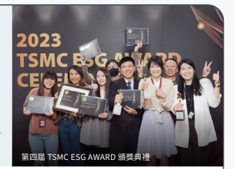

公司不斷提升產假福利與宣導強化友 善職場,身為二寶媽的我感受到友善 及支持,有更多時間恢復並照顧家中 成員,讓媽媽這個角色獲得更多合理 公平對待。

馬徽齡 員工 台積公司

| 關注議題                                                        | 溝通方式/頻率                                                                                                                                                |                                                                                                      |
|-----------------------------------------------------------------|---------------------------------------------------------------------------------------------------------------------------------------------------------------|------------------------------------------------------------------------------------------------------|
| 多元與共融                                                      | 員工核心價值調查、全球員工意見調查/2 年 1 次                                                                                                                 | 員工申訴直通車(Ombudsman)、吹哨者舉報程序,以及違反從業道 德舉報系統、性騷擾申訴處理委員會/不定期 |
| 人才吸引與留任                                                  | 員工教育訓練/每年                                                                                                                                            | 員工網站(myTSMC)、電子郵件及其他公告方式(如公司內部海報宣                                         |
| 社會影響力                                                      | 晶園會議(勞資會議)/每季                                                                                                                                    | 傳)、員工內部電子刊物「e 晶園」報導/不定期                                                         |
| 人才發展                                                        | 各階層主管及同仁溝通會,如董事長/總裁溝通會、 跨層級溝通會及各組織溝通會/每季                                                                               | 多元員工意見管道,如各廠馬上辦中心/員工意見箱/各廠健康中心/                                       |
| 從業道德/法規遵循                                              | 健康中心網站/員工 PIP 與資安意見反應信箱及專線等/不定期                                                                                                     |                                                                                                      |
| 人力資源業務夥伴團隊/不定期                                    |                                                                                                                                                               |                                                                                                      |
| 風險管理 關注內容                                               | 台積回應                                                                                                                                                      |                                                                                                      |
| 期望公司為社會做出更多貢獻,邁向永 續發展                       | 透過 106 場晶圓會議、4,911 件員工意見交流等,強化內部溝通 舉辦第一屆「多元共融系列活動」,總計逾 1,150 人次參與                                               |                                                                                                      |
| 期望公司建構多元共融的友善職場,釋                              | 支持成立員工資源團體:Women@tsmc、Global Family@tsmc、Accessibility@tsmc,支持同仁自我實現                                                                    |                                                                                                      |
| 放人才潛能                                                      | 舉辦課程以提升尊重與共融意識,「認識台積人權政策,打造友善職場,杜絕性騷擾」完訓率 97%                                                                        |                                                                                                      |
| 期望工作的同時能兼顧家庭與生活,實 現共同成長                   | 推出「台積寶寶茁壯計畫 2.0」,支持家庭和生活平衡的工作環境 舉辦第四屆 TSMC ESG AWARD,做為推動永續思維與行動的平台,並擴及海外子公司,共募集 3,166 件永續創新 |                                                                                                      |
| 期望參與更豐富的 ESG 活動,提供實現                             | 提案                                                                                                                                                          |                                                                                                      |
| 永續行動的機會                                                  | 提供有薪志工假,支持同仁參與志工服務,擴大社會參與 提供「年度從業道德與法規遵循」教育訓練,總計 7 萬 3,034 名台積公司與子公司同仁完訓                         |                                                                                                      |
| 期望獲得業務相關的法規資訊與遵循指 引,如貪腐零容忍、利益迴避等 | 提供反托拉斯遵法訓練、內線交易防制與出口管控法規遵循線上課程予指定同仁及主管                                                                                  |                                                                                                      |
| 期望瞭解風險管理流程、方法與工具,                              | 首次舉辦風險管理高峰會及風險意識文化調查,分別共 704 位主管、3 萬 411 位同仁參與                                                                              |                                                                                                      |
| 提升風險管理能力                                                | 發布風險管理電子報及線上訓練課程,總計 7 萬 2,635 位同仁參與                                                                                                  |                                                                                                      |

29

導言 實踐永續管理 **營運與治理** 附錄
追求創新的先行者 負責任的採購者 綠色力量的執行者 員工引以為傲的公司 改變社會的力量

股東/

 投資人
財務績效 風險管理 人才吸引與留任 水管理 長期關注台積公司的投資價值,聚焦市場展望、成長策略、獲利能力、 股利政策、股東投資報酬及永續表現 479 家 367 場次 投資機構溝通家數 交流會議 關注議題 **溝通方式/頻率**
創新管理 氣候與能源 股東大會/每年 公司年報、永續報告書、主題式報告書(聯合國永 續發展目標行動報告、重大性分析報告、永續影響 力評價報告、氣候暨自然報告、人權報告)、美國 證期局 20-F 報告書發行/每年 法人說明會/每季 海內外投資機構研討會/不定期 面對面會議、視訊會議及電話會議/不定期 公開資訊觀測站發布重大訊息或於公司網站公 布公司各項新聞/不定期

| 關注內容                                                | 台積回應                                                                                                                    |
|---------------------------------------------------------|-----------------------------------------------------------------------------------------------------------------------------|
| 長期獲利能力                                            | 儘管面臨毛利率短期不利因素,台積公司仍相信能達到長期財務目標,預估營業毛利率達 53% 或以上,平均股東 權益報酬率達 25% 或以上 |
| 地緣政治與經濟情勢對經營環境影響及 對策                 | 於法人說明會中說明地緣政治與經濟情勢及相關法規對半導體需求的影響及台積公司作為                                              |
| 海外投資營運風險及相關人才招募挑戰                      | 於法人說明會中說明海外建廠計畫與人才招募最新執行情形                                                                        |
| 人工智慧應用對半導體需求的影響,以 及技術發展與競爭優勢 | 於法人說明會中說明人工智慧相關機會、公司策略及技術發展近況                                                                  |
| 氣候變遷因應措施與再生能源使用                          | 宣布加速 RE100 永續進程至民國 129 年、民國 119 年使用再生能源目標由 40% 提升至 60%                                          |
| 水資源風險管理與再生水替代率                            | 持續與政府合作興建再生水廠,民國 119 年目標再生水替代率 60% 以上                                                            |

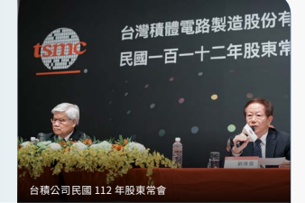

富達國際深信實踐永續可帶來優異長 期表現,瞭解公司永續策略是投資評 估的重要環節。台積公司將永續理念 融入經營策略,設定目標、定期檢視 與揭露,此承諾讓我們為客戶創造長 期價值的同時實現永續效益。

Terence Tsai 分析師及投資組合經理 富達國際

導言 實踐永續管理 **營運與治理** 附錄
追求創新的先行者 負責任的採購者 綠色力量的執行者 員工引以為傲的公司 改變社會的力量

創新管理 產品品質 客戶關係管理 風險管理 關注台積公司技術發展與生產規畫資訊,包括符合客戶產能需求、產 品品質、完整的客戶資訊保護機制,協助客戶取得產品應用成功,贏 得市場先機 100 場次 **1,500** 場次 季評核會議 主管級客戶會議

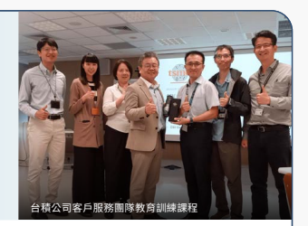

台積公司是晶片先進製程技術的領導 者,具備堅實的經驗、高度的誠信與 對半導體產業負責任的態度。

恩智浦半導體公司 關注議題 **溝通方式/頻率**
客戶滿意度調查/年度 商業及技術評核/每季 客戶會議/不定期 客戶拜訪或稽核/不定期

關注內容 **台積回應**

| 技術發展時程與計畫   | 配合技術藍圖發展時程,提供客戶生產製造的技術種類達 994 種、先進封裝技術種類達 149 種                              |
|----------------------|-------------------------------------------------------------------------------------------------------------------|
| 產品品質             | 不斷精進生產技術及產品品質,每 100 萬片十二吋晶圓產出的工程缺失件數改善至民國 108 年的 25%                        |
| 產能規畫與生產資訊   | 客戶自助式晶圓指令系統「TSMC-Online™」改版升級,民國 112 年每月平均瀏覽數超過 5 萬次以取得完整技術及 生產資訊服務 |

風險管理與營運韌性 由客戶針對營運持續計畫稽核共計 16 場次,台積公司稽核結果平均分數達 96 分

導言 實踐永續管理 **營運與治理** 附錄
追求創新的先行者 負責任的採購者 綠色力量的執行者 員工引以為傲的公司 改變社會的力量 承攬商 供應商/
關注台積公司於新製程技術開發、品質提升、氣候變遷、環保安全衛 生、從業道德與行為準則及資訊安全規範與發展,期許深化雙方合作 關係,實現永續供應鏈管理模式 218 場次 **194 家**
供應商稽核溝通會議 環保安全衛生訓練家數

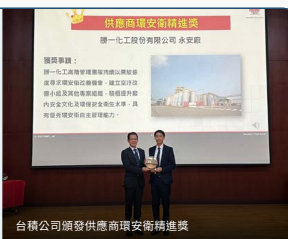

關注議題 永續供應鏈管理 從業道德/法規遵循 產品品質 職業安全與衛生 氣候與能源 溝通方式/頻率 供應商行為準則宣導/每年 供應商永續管理自評問卷/每年 環保安全衛生訓練/每年 永續供應鏈環安衛論壇/每年 關鍵排放源供應商減碳追蹤會議/雙月、每半年 供應商會議/不定期 現場輔導稽核/不定期 供應鏈員工申訴管道/不定期 Supply Online 360 全球責任供應鏈管理整合 平台/不定期

關注內容 台積回應

| 期待提升永續韌性與台積公司一同成長        | 「台積電供應商永續學院」陸續上線7大學程、共 80 門課程,使用人次達 220 萬                                                                                                                                                                  |
|-------------------------------------------|-------------------------------------------------------------------------------------------------------------------------------------------------------------------------------------------------------------------------------------------|
| 期待掌握從業道德與法規遵循,建構永        | 第一階供應商行為準則相關規範簽署完成率 100%                                                                                                                                                                                               |
| 續管理基礎                                | 發布「供應鏈人權議題補充問卷」,將多元、公平與共融議題推廣至供應鏈 70 家關鍵供應商接受第三方機構執行永續風險稽核、完成 39 場再次稽核                                                                                                      |
| 期待提升永續風險管控能力,精進原物 料品質 | 輔導 10 家供應商精進生產流程與品質 舉辦「永續供應鏈環安衛論壇」與多項輔導課程及多元主題工作坊,賦能供應商永續營運                                                                                                                         |
| 期待建立有效的環境安全衛生管理機制        | 持續提升供應鏈環境安全衛生與損失防阻能力,頒獎表揚績優供應商,民國 112 年由辛耘企業股份有限公司湖口 廠獲「供應商環安衛楷模獎」、勝一化工股份有限公司永安廠獲「供應商環安衛精進獎」 導入節能經驗,輔導 10 家供應商、發掘 42 件潛在節能方案 |
| 期待培養碳排放管理能力,實現綠色低        | 要求 135 家原物料及設備供應商參與 CDP 供應商碳揭露專案                                                                                                                                                                                    |
| 碳供應鏈                                  | 與關鍵排放源供應商合作提出具體減碳計畫,預計民國 119 年實現累計減碳 90 萬公噸                                                                                                                                                             |

長春公司獲得民國 112 年「台積公司優 良供應商卓越表現及綠色製造獎」,達 成電子化學品循環回用目標,今後將持 續合作,再創資源永續循環里程碑。

蔡智全 總經理

長春集團所屬長春石油化學股份有限公司 減碳雖是挑戰也是商機,我們將與台積 公司共同努力,攜手落實減碳政策、堅 定往前,讓這條路走得更穩健。

孫啟發 副總經理 勝一化工股份有限公司

導言 實踐永續管理 **營運與治理** 附錄
追求創新的先行者 負責任的採購者 綠色力量的執行者 員工引以為傲的公司 改變社會的力量

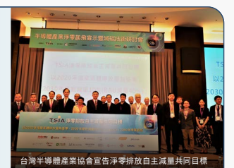

公協會 46 個 **106 個**
政府部門 公協會 關注製程技術與產業發展、人才吸引與留任、淨零排放、水資源管理、 供應鏈管理、海外投資及法規修訂趨勢 政府/
創新管理 氣候與能源/資源循環/水管理 公司治理/法規遵循/風險管理 空氣汙染防制 人才吸引與留任 永續供應鏈管理 關注議題 **溝通方式/頻率**
公協會溝通平台/每月 公文往來與參訪/不定期 面談提供產業經驗與建言、專題演講/不定期 會議(如說明會、公聽會、座談會、研討會、聯誼會)/不定期

| 關注內容                              | 台積回應                                                                                                                                                                                                                                                       |
|---------------------------------------|----------------------------------------------------------------------------------------------------------------------------------------------------------------------------------------------------------------------------------------------------------------|
| 產業發展/智慧財產權保護/營業秘密    | 獲邀至美國專利局分享半導體先進製程技術;主導產業供應鏈合作智權策略聯盟,參與智權法規修訂並提供建言                                                                                                                                                             |
| 保護                                  | 參與產業促進協會及同業公會,提供營業秘密註冊與智慧管理公益分享 參與出口管控最新法規說明會議,進行產業實務交流                                                                                                                                                  |
| 公司治理、法規遵循與風險管理          | 強化風險管理資訊揭露,包含風險胃納聲明、敏感性分析與壓力測試、關鍵新興風險等 推動海內外產學合作計畫,培育頂尖半導體人才                                                                                                                                        |
| 全球人才布局與培育                    | 與美、日、德產官學界代表就半導體產業發展與人才培育議題進行交流 與能源署、標準局合作啟動「綠電分配沙盒計畫」,獲產業界認同與加入 參與臺灣碳權交易所首批交易及全球自然碳權相關基金投資,支持碳權市場發展                                                         |
| 再生能源/碳權交易/資源循環/ 水管理 | 啟用零廢製造中心,攜手 5 家供應商成功將約 200 公噸廢液回收再生成可利用能源 擴大使用再生水,南科廠區再生水使用量由每日 6,500 立方公尺提升至近 5 萬立方公尺 代表台灣半導體產業協會與環境部溝通「氣候變遷因應法」相關子法及「半導體製造業空氣汙染管制及排放標準」 |
| 環保相關法規因應、建言與推動          | 修訂,促進產業正向發展                                                                                                                                                                                                                                         |
| 提升供應鏈永續韌性與環安衛管理        | 舉辦多項永續與環安衛主題工作坊、輔導訓練及互動式課程,打造責任供應鏈                                                                                                                                                                                           |

台積公司持續推動半導體製程技術創 新,經本院專業團隊分析,其以半導 體為核心的 I CT 致能技術,將為全球 減碳帶來重要貢獻。

劉文雄 院長 工業技術研究院 33

導言 實踐永續管理 **營運與治理** 附錄

追求創新的先行者 負責任的採購者 綠色力量的執行者 員工引以為傲的公司 改變社會的力量

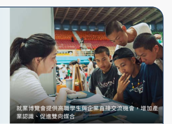

慈善基金會,藉由舉辨高中職就業博覽 會,讓學生及家長看見未來豐富的發展 藍圖,提供升學以外其他更多元的選擇 與機會。

彭富源 署長 教育部國民及學前教育署 文教基金會舉辦青年築夢計畫激勵年輕 人走出教室、踏入社會,在實踐中學習 與成長。

楊家彥 創辦人暨執行長 樹冠影響力投資 為偏鄉建構社會支持系統 690 216 公益合作團體數 公益專案數

關注台積電文教基金會提供教育及藝文資源,培育新時代全方位人才, 發揮社會影響力

| 關注台積電慈善基金會結合產官學與志工服務,從教育、健康到環境面   |
|------------------------------------------------------------------|

關注議題 社會影響力 溝通方式/頻率 志工幹部會議/ 每季 1 次
「把愛送出去」公益平台/不定期 台積電文教與慈善基金會官方網站/不定期 ESG 網站與電子報、ESG 信箱、社群網站
(臉書與 LinkedIn)/不定期 關注內容 **台積回應**
培育青年並推廣科普、扶持偏鄉學子與 賦能教師、厚植文學涵養及推廣藝術 偏鄉培力以縮短技職學用落差、關懷長 者與布建社會支持網、提倡環保並減少 資源浪費 民國 112 年,台積電文教基金會投入新台幣 1 億 1,824 萬元,以「青年培育、教育合作、藝文推廣」三大主軸, 促進社會共好、扎根藝術與教育。持續辦理台積電女科學家之旅、培育未來女性科學人才;青年築夢計畫吸引 180 組青年學子共同關心永續議題;新增台積電硬筆書法大賞競賽,發揚書篆藝術;推動「校園戲曲傳承計畫」及「 台積戲苑」;舉辦第 20 屆心築藝術季,吸引 5 萬 2,252 人次,提升藝文涵養 民國 112 年,台積電慈善基金會投入新台幣 2 億 5,672 萬元,以偏鄉培力為核心發展「教育培力、健康長壽、保育 環境」三大主軸,並攜手員工第一線志工服務。為接軌教育與就業謀生能力,辦理科普教育、職業探索工作坊與就 業博覽會等活動;除扶助弱勢家庭經濟,更串聯愛互聯平台、整合醫療社福機構深化長者照護;協助7間弱勢機構 與240間偏鄉小學以綠能公益支持其營運,並分享公司節能技術與生態保育經驗,強化環保推廣能量 專案合作與拜訪/不定期 贊助各項公益、教育專案/不定期 志工服務活動/每周 15 場志工活動

112 年度永續報告書

導言 實踐永續管理 **營運與治理** 附錄

追求創新的先行者 負責任的採購者 綠色力量的執行者 員工引以為傲的公司 改變社會的力量

# 永續影響力

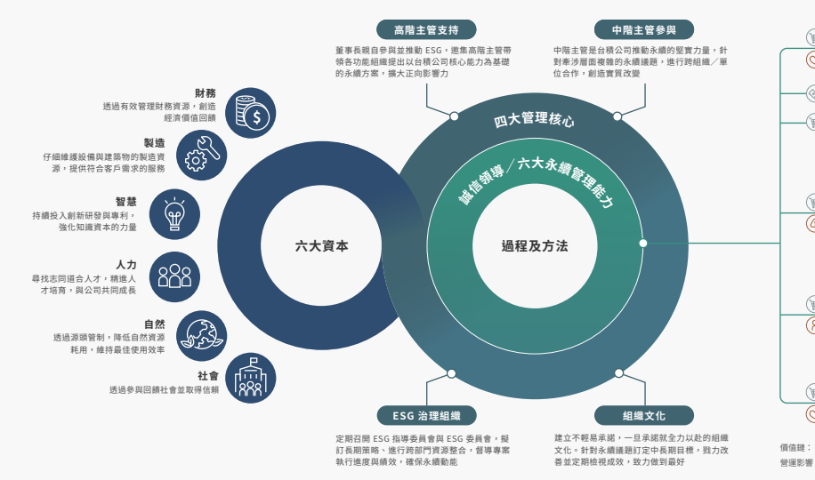

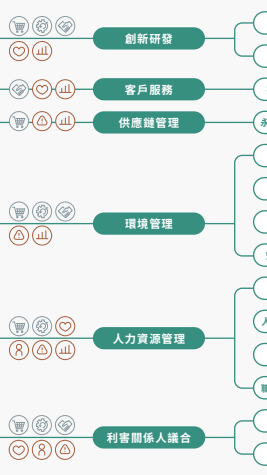

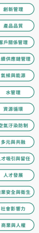

營運影響: 客戶滿意 員工向心力 營運風險 營收成長 價值鏈: 採購階段 公司營運 客戶使用 台積公司結合六大資本、四大管理核心與六大永續管理能力,積極打造「技術領先、卓越製造、客戶信任」三大競爭優勢,持續驅動科技創新,促進客戶產品成功,創造有獲利的成長;帶動半導體產業鏈產值、創 造直接與間接工作機會,尊重人權並保障工作者健康及安全;發揮綠色創新,提升能資源使用效率並維護自然生態與生物多樣性;投入企業資源與員工參與、擴展社會共好行動。台積公司期許自己以具體的 ESG 作 為為利害關係人創造正向影響與減緩負向衝擊,累積企業長期價值,同時透過財務損益(Profit and Loss, P&L)思維,建立以三重盈餘(Triple Bottom Line, TBL)為基礎的永續影響力管理架構,從外部性觀點衡 量台積公司對整體價值鏈的貢獻,實踐「提升社會」的 ESG 願景。

台積公司參考自然資本議定書(Natural Capital Protocol)、社會與人力資本議定書(Social & Human Capital Protocol)及「ISO 14008: 2019 環境衝擊與相關考量面之貨幣評價標準」等國際公認方法學, 透過因果關係為導向的永續衝擊路徑(Sustainability Impact Pathway),從上游採購、台積公司營運到客戶使用階段,以易於解讀的貨幣化形式,全面檢視價值鏈各項活動直接與間接對經濟、環境及社會帶 來的正向(效益)與負向(成本)影響,促進利害關係人溝通,期許驅動經濟成長、降低環境資源耗損、維護人權、落實多元、公平與共融,進一步提升社會福祉,驅動美好的改變。詳情請參閱《台積公司民國 112 年度永續影響力評價報告》。

| 永續衝擊路徑                               | 永續價值                                   |                                            |                                        |                                  |                  |            |
|--------------------------------------------|--------------------------------------------|--------------------------------------------|----------------------------------------|----------------------------------|------------------|------------|
| 衝擊成因                                   | 重大議題註 1                               | 營運過程投入與產出註 2                     | 導致或促成福祉的改變                   | 衝擊對象                         | 影響力指標       | 衝擊等級   |
| 採購需求帶動產業供需關係                   | 社會                                       | 推升供應鏈產值                             | ●●●●●●●●                               |                                  |                  |            |
| 採購需求創造供應鏈就業機會                 | 外部員工註 3                               | 供應鏈就業機會                             | ●●●●●● - ●                             |                                  |                  |            |
| 工作者遭受強迫勞動失去自由及身心健康的風險 | 外部員工                                   | 侵犯人權風險-強迫勞動                     | - ● ●●●●●●                             |                                  |                  |            |
| 支付供應商採購金額                         | PI5478                                     | 童工無法接受優質教育造成未來收入損失的風險 | 外部員工                               | 侵犯人權風險-雇用童工           | - ●●●●●●●        |            |
| 供應鏈生產過程衍生溫室氣體排放導致環境衝擊 | 環境                                       | 供應鏈溫室氣體排放                         | ●●● ●●●●●                              |                                  |                  |            |
| 上游採購                                   | 永續供應鏈管理                             | 供應鏈生產過程衍生空汙排放導致環境衝擊     | 環境                                   | 供應鏈空汙排放                   | ●●●● ●●●●        |            |
| 環境                                       |                                            |                                            |                                        |                                  |                  |            |
| 供應商輔導成效                             | 環境 環境                                  |                                            |                                        |                                  |                  |            |
| OI6697                                     | 協助供應商節電避免溫室氣體排放衍生環境衝擊 | 供應鏈節電輔導                             | - ● ●●●●●●                             |                                  |                  |            |
| OI4015                                     | 協助供應商節水避免水資源稀缺衍生環境衝擊   | 供應鏈節水輔導                             | - ●●●●●●●                              |                                  |                  |            |
| OI7920                                     | 協助供應商減廢避免廢棄物衍生環境衝擊       | 供應鏈減廢輔導                             | - ●●●●●●●                              |                                  |                  |            |
| 營業淨利                                   | FP1301                                     | 為投資人帶來報酬,促進經濟成長動能         | 股東/投資人                           | 營業淨利                         | ●●●●●●● -        |            |
| 財務績效                                   | 折舊及攤銷                                 | FP9573                                     | 帶動產業技術發展,為供應商帶來收入     | 供應商                           | 折舊及攤銷       | ●●●●●●● -  |
| FP5261                                     |                                            |                                            |                                        |                                  |                  |            |
| 納税                                       | 支持政府擴大基礎建設及社會福利             | 政府、社會                                 | 納稅                                   | ●●●●●● - ●                       |                  |            |
| 溫室氣體排放                               | OI1479                                     | 溫室氣體濃度變化促成全球暖化               | 環境                                   | 營運溫室氣體排放                 | ●●●● ●●●●        |            |
| 使用再生能源(自發自用)  OI2496           | 溫室氣體濃度變化減緩全球暖化               | 環境                                       | 使用再生能源效益                       | ●●● ●●●●●                        |                  |            |
| 氣候與能源                                 | 使用再生能源(外購)                       | OI3324                                     | 溫室氣體濃度變化減緩全球暖化           | 環境                             | 使用再生能源效益 | ●●● ●●●●●  |
| 節能措施推動成效                           | OI6697                                     | 溫室氣體濃度變化減緩全球暖化               | 環境                                   | 推動節能措施效益                 | ●●● ●●●●●        |            |
| 公司營運                                   | 水資源耗用                                 | OI0263                                     | 水資源存量改變造成鄰近社區用水壓力     | 環境                             | 營運水資源耗用   | - ●●●●●●●  |
| 使用再生水                                 | OI1927                                     | 水資源存量改變避免鄰近社區用水壓力         | 環境                                   | 使用再生水效益                   | - ●●●●●●●        |            |
| 水管理                                     | 節水措施推動成效                           | OI4015                                     | 水資源存量改變避免鄰近社區用水壓力     | 環境                             | 推動節水措施效益 | - ● ●●●●●● |
| 廢水排放                                   | OI0386                                     | 水體中汙染物濃度改變造成健康及生態衝擊     | 環境                                   | 營運廢水排放                     | - ● ●●●●●●       |            |
| 空氣汙染防制                               | 空汙排放                                   | -                                         | 大氣中空汙物濃度改變造成健康及生態衝擊 | 環境                             | 營運空汙排放     | - ● ●●●●●● |
| 資源循環                                   | 廢棄物處置                                 | OI6192                                     | 焚化及掩埋處理衍生空汙及溫室氣體排放   | 環境                             | 營運廢棄物處置   | - ● ●●●●●● |
| 影響力指標:                               | 社會外部性                                 | 環境外部性                                 | 附加價值收入(GVA)                    | 衝擊等級: - 正向影響 - 負向影響 |                  |            |

導言 實踐永續管理 **營運與治理** 附錄

| 永續衝擊路徑       | 永續價值                                 |                        |                                      |                                                  |                      |              |           |
|--------------------|------------------------------------------|------------------------|--------------------------------------|--------------------------------------------------|----------------------|--------------|-----------|
| 衝擊成因           | 重大議題註 1                             | 營運過程投入與產出註 2 | 導致或促成福祉的改變                 | 衝擊對象                                         | 影響力指標           | 衝擊等級     |           |
| 員工薪酬與福利     |                                          |                        |                                      |                                                  |                      |              |           |
| 人才吸引與留任     | 員工支持計畫 遭受職場性騷擾              | OI4724                 | 高於生活工資的薪酬提升幸福感與購買力 | 內部員工註 3                                     | 兼顧生活品質的薪酬   | ●●●●●● - ●   |           |
| OI2742             | 帶薪休假及家庭友善支持帶來工作與生活平衡 | 內部員工               | 生活與家庭友善支持                   | - ●●●●●●●                                        |                      |              |           |
| OI9077             | 造成身心傷害衍生醫療成本及未來福祉損失   | 內部員工               | 性騷擾                               | - ●●●●●●●                                        |                      |              |           |
| 人才發展           | 員工訓練發展                             | OI7877                 | 培訓獲得專業技能及就業力提升         | 內部員工                                         | 訓練創造員工未來收益 | ●●● ●●●●●    |           |
| 多元與共融         | 員工性別薪酬比例                         | OI1855                 | 高薪職位因性別差異衍生職業隔離       | 內部員工                                         | 平等機會             | ●●●● ●●●●    |           |
| 公司營運           | 健康管理改善人數                         | OI4061                 | 透過衛教改善同仁生活型態與健康狀況   | 內部員工                                         | 員工健康管理         | - ● ●●●●●●   |           |
| 職業安全與衛生     | 員工職業災害事件                         | OI3757                 | OI6525                               | 工作者身心靈影響及醫療資源支出                   | 內部員工             | 員工職災事件 | - ●●●●●●● |
| 承攬商職業災害事件 | OI3757                                   | OI6525                 | 工作者身心靈影響及醫療資源支出       | 外部員工                                         | 承攬商職災事件       | - ●●●●●●●    |           |
| 社會影響力         | 社會投入                                 | OI1619                 | 促進當地社區關係及改善生活品質       | 社會                                             | 社會投入價值         | ●●● ●●●●●    |           |
| 客戶使用           | 創新管理                                 | 產品節能效益           | PI7623                               | 協助客戶產品節能避免降低溫室氣體排放衍生環境衝擊 | 客戶、環境           | 產品節能設計 | ●●●● ●●●● |
| 影響力指標:       | 社會外部性                               | 環境外部性             | 附加價值收入(GVA)                  | 衝擊等級: - 正向影響 - 負向影響                 |                      |              |           |

## 註 1:因應《Gri 通用準則 2021》將人權調整至《Gri 2:一般揭露 2021》,並考量人權議題涵蓋的多面性及對企業永續的重要性,台積公司 將「商業與人權」的重大議題納入營運與治理的一環,並將與其相關的投入與產出結果體現於各重大議題

註 2:衝擊報導與投資標準(Impact Reporting & Investment Standards, IRIS)為全球影響力投資聯盟(Global Impact Investing Network, GIIN)開發用於衡量企業社會、環境與經濟績效的標準化指標架構,以提升影響力投資的可比較性 註 3:外部員工為供應商或承攬商員工;內部員工為台積公司員工 註 4:供應鏈環境及社會外部性係以單年度交易 3 次以上且金額大於新台幣 1,000 萬元的第一階供應商為主,共 1,131 家,依其產業屬性與 採購金額採投入產出分析模型(Input-Output Model)計算,包含因採購需求帶動產業鏈供需效應衍生的經濟效益、創造的就業機會 與薪資收入,以及伴隨而來的環境衝擊及人權風險。此方法是根據產業統計數據分析供應鏈中的潛在機會與風險,而非實際發生事件, 係數來源包含產業關聯統計編製報告(主計總處,2020)、EXIOBASE 2、UNICEF 及 Walk Free 資料庫 註 5:環境外部性係針對台積公司採購與生產對外潛在影響的貨幣化評估;至於因執行環境保護計畫而生的成本與經濟效益,請參考台積公司 民國 112 年年報「環保支出」
註 6:考量各國經濟條件差異,價值化係數以各地區購買力平價(Purchasing Power Parity, PPP)衡量的人均國民總所得(Gross National Income, GNI)進行調整,並考量通膨及匯率因素,將時間邊界拉齊至以民國 106 年為基準的貨幣價值,方法學參考 OECD (2012) 及 PwC UK (2015)
註 7:關於永續影響力方法學及分析結果相關資訊,請參閱《台積公司民國 112 年度永續影響力評價報告》
歷年數據(108-112 年)

| 正向影響             | 負向影響           |                          |            |
|----------------------|--------------------|--------------------------|------------|
| 單位:新台幣百萬元   | 單位:新台幣百萬元 |                          |            |
| 貨幣價值             | 影響等級           | 貨幣價值                 | 影響等級   |
| >1,000,000          | ●●●●●●●●           | <-1,000,000            | ●●●●●●●●   |
| 500,000 至 1,000,000 | ●●●●●●● -          | -500,000 至 -1,000,000 | ●●●●●●● -  |
| 100,000 至 500,000   | ●●●●●● - ●         | -100,000 至 -500,000   | ●●●●●● - ● |
| 50,000 至 100,000    | ●●●●● ●●●          | -50,000 至 -100,000    | ●●●●● ●●●  |
| 10,000 至 50,000     | ●●●● ●●●●          | -10,000 至 -50,000     | ●●●● ●●●●  |
| 1,000 至 10,000      | ●●● ●●●●●          | -1,000 至 -10,000      | ●●● ●●●●●  |
| 100 至 1,000         | - ● ●●●●●●         | -100 至 -1,000         | - ● ●●●●●● |
| 0 至 100             | - ●●●●●●●          | 0 至 -100               | - ●●●●●●●  |

導言 實踐永續管理 **營運與治理** 附錄

追求創新的先行者 負責任的採購者 綠色力量的執行者 員工引以為傲的公司 改變社會的力量

## 衝擊評估及管理做法 上游採購

台積公司善用全球半導體業領導地位,提升在地 供應商技術與能力,運用投入產出模型(Inputoutput Model)分析採購活動衍生的社會與環境 外部性。民國 112 年因採購需求帶動供應鏈創造 新台幣 1 兆 8,603 億元產值,創造 27 萬個供應鏈 員工就業機會與新台幣 1,990 億元薪資收入;供 應鏈產生的環境足跡及人權侵害風險亦帶來新台 幣 156 億元潛在社會成本。為促進供應鏈永續營 運,台積公司透過熱點分析找出具顯著衝擊的產業 類別及地區,納入採購策略及選商標準,並透過輔 導及設定目標,攜手供應商找出製程最佳化及環境 足跡最小化機會,同時針對關鍵原物料進行盤查評 估,截至民國 112 年已累計分析超過 120 種原物 料,持續發掘改善契機,帶動產業永續轉型。

## 公司營運

台 積 公 司 透 過 附 加 價 值 收 入 法(Gross Value added, GVA)檢視營運過程為利害關係人創造的 正向影響,包括營業淨利、納稅、折舊及攤銷等。 社會價值方面,參考哈佛商學院的影響力加權會 計(Impact-Weighted Accounts, IWA)及價值 平衡聯盟(Value Balancing Alliance, VBA)影 響力陳述方法,評估公平的就業機會、兼顧生活品 質的薪酬與福利、訓練創造的未來收益為員工帶來 的正向影響;並運用願付價值法(Willingness to Pay, WTP)及價值移轉法(Value Transfer)計 算工傷及健康促進產生的社會成本與效益。環境價 值則應用環境損益(Environmental Profit and Loss, EP&L)方法學,評估生產過程因耗用能資 源及排放汙染物所衍生的負面影響,以及導入節能 措施、布局再生能源及再利用水資源產生的環境 效益。 民國 112 年,台積公司於經濟面向創造新台幣 2 兆 1,617 億元營業收入,繳納稅額、配發股利、 折舊及攤銷則為利害關係人帶來新台幣 1 兆 129 億元的附加價值收入,不僅協助客戶產品成功,支 持政府擴大基礎建設及社會福利,亦為投資人創 造優質報酬。社會面向上,高於生活工資的薪酬 共計新台幣 1,816 億元,提升員工幸福感與購買 力;完善的人才訓練計畫及職涯規畫提升員工就業 競爭力,帶來新台幣 74 億元薪資成長收益;台積 公司及同仁投入公益活動則創造新台幣 15 億元社 會價值;多元化健康促進活動帶來新台幣 1.9 億元 的健康改善效益;因性別薪資差距衍生新台幣 360 億元的潛在補償成本;職災及性騷擾則帶來新台幣 5,620 萬元的身心影響與醫療成本。環境面向上,

 生產營運過程產生的環境足跡與資源耗用產生新 台幣 217 億元的環境外部成本;為減緩營運過程 造成的環境衝擊,台積公司積極落實綠色製造,推 動源頭減量、製程節能、循環再生及末端防制等行 動,共創造新台幣 28 億元環境效益。

## 客戶使用

台積公司協助客戶生產更先進及更具能效的產品, 持續開發領先全球的高效節能半導體技術,促進節 能的資訊與通信科技技術及產品應用演進。經工研 院產業科技國際策略發展所(Industry, Science and Technology International Strategy Center, ISTI)根據全球用電、國內生產毛額與電 子產品數量進行模型推導分析,民國 119 年台積 公司每用 1 度電生產,可為全球其他產業與民生 用電減省 4.28 度電,推估民國 109 年至 119 年協 助全球節電效益從 169 億度增加至 2,354 億度, 創造新台幣 2,136 億元正向影響,透過半導體創 新實現電子產品各種智慧應用,有效促使全球節 能。民國 112 年,台積公司提供 288 種製程技術, 為 528 家客戶實現 1 萬 1,895 種產品創新,持續 為現代社會進步賦能。

台積公司持續為現代社會進步賦能

導言 實踐永續管理 **營運與治理** 附錄
# 實踐聯合國永續發展目標

秉持「不遺落任何人」(Leaving No One Behind)信念,台積公司積極以「ESG 執行架構」為基礎 實踐 SDGs,參考聯合國開發計畫署(United Nations Development Programme, UNDP)發布的
《永續發展目標影響力標準(SDG Impact Standards for Enterprises)》, 以 策 略(Strategy)、 管 理 方 法(Management Approach)、 透 明(Transparency)、 治 理(Governance) 四 大 關 鍵 要 素
(Core Elements),鏈結台積公司重大議題管理,建立影響力衡量方法,民國 113 年發布第一本永續影 響力評價報告,期望為加速實現 SDGs 做出貢獻。 台 積 公 司 依 循 全 球 永 續 性 報 告 協 會(Global Reporting Initiative, GRI) 及 聯 合 國 全 球 盟 約(The United Nations Global Compact)共同發布的《SDGs 揭 露 實 務 指 引 》, 鑑 別 與 台 積 公 司 具 相 關 性 的 SDGs 目 標 , 並 遵 循 GRI 與 Support the Goals 組 織 定 義 的 揭 露 框 架, 從 規 畫(Plans)、 承 諾
(Commitments)、 行 動(Actions)、 進 展(Progress)、 供 應 商(Suppliers) 五 大 面 向 說 明 行 動 成果,串聯內外部資源發揮永續影響力,展現對聯合國 2030 永續發展議程(The 2030 Agenda for Sustainable Development)的堅定支持。 民國 112 年,在 ESG 指導委員會帶領下,台積公司持續聚焦 9 個永續目標, 推動 23 個永續作為與 57 個可衡量的民國 119 年長期目標,實踐 SDG 3(健康與福址)、SDG 4(優質教育)、SDG 6(淨水與衛生)、 SDG 7(可負擔的潔淨能源)、SDG 8(就業與經濟成長)、SDG 9(工業、創新及基礎建設)、SDG 12(責 任消費與生產)、SDG 13(氣候行動),並持續以科技驅動永續創新,強化有利於科學、技術與創新發展的 環境,促進包容性的科技轉型、縮短數位落差,強化利害關係人合作,以具體行動實踐共好,落實 SDG 
17(多元夥伴關係)。詳情請參閱《台積公司民國 112 年度聯合國永續發展目標行動報告》。

追求創新的先行者 做為全球最大的專業積體電路製造服務提供者,台積公司以嶄新的商業模式,堅 實的研發能量,攜手客戶加速釋放創新。透過無所不在的積體電路,持續驅動科 技進步與永續發展的無限可能

## 負責任的採購者

台積公司致力落實負責任採購,在技術、品質、交期、人權、環保安全各方面與供 應鏈夥伴積極合作。面對氣候變遷的嚴峻挑戰,更進一步強化綠色創新與氣候韌 性,一同為打造半導體低碳供應鏈而不懈努力

## 綠色力量的執行者

以成為全球環保標竿企業自期,台積公司積極厚植綠色管理於日常營運,將創新 技術應用至氣候與能源、水管理、資源循環及空氣汙染防制等面向,全方位推展 各項強化環保的永續行動,落實與地球生態共生共榮的堅定信念

## 員工引以為傲的公司

台積公司重視對員工的承諾,深植以人為本、開放溝通的企業文化,致力推動多 元與共融的職場環境,營造可持續學習,安全且有樂趣的工作氛圍,並提供優質 的薪酬與福利,戮力成為員工引以為傲的公司 改變社會的力量 致 力 於成 為 提 升 社 會 向 上 的力 量,「台積 電 文 教 基金 會」與「台積 電 慈 善 基金 會」關注社會脈 動與需求,整合公司內外部資源,投 入 跨年齡層學子 教育培力、 關懷偏鄉弱勢及照護獨老與孕育國人藝文涵養,為共好、美善社會奠定基礎 綠色製造

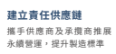 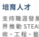

支持職涯發展,並攜手學 界 推 動 STEAM (科 學、技 術、工 程、藝 術 與 數 學) 教育,培育未來人才 ESG 發展方向 流程與報導 **台積公司永續角色**

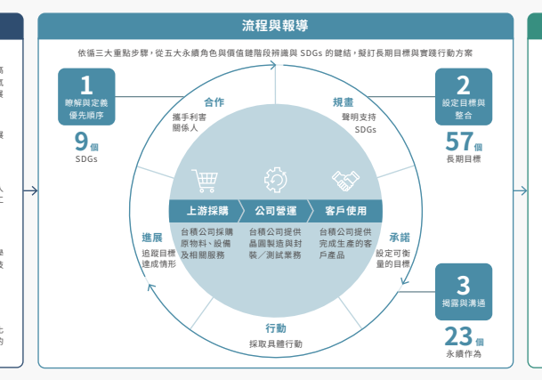

落實清潔生產,領先開發高 效節能半導體技術以因應氣 候變遷,促進全球永續發展 建 立 安 全、健 康、重 視 人 權且能釋放員工潛能的工 作環境 整合資源投入教育、文化 與社會發展,實現均等的 共好願景

導言 實踐永續管理 **營運與治理** 附錄
追求創新的 先行者 做為全球最大的專業積體電路製造服 務提供者,台積公司以嶄新的商業模 式,堅實的研發能量,攜手客戶加速 釋放創新。透過無所不在的積體電 路,持續驅動科技進步與永續發展的 無限可能。

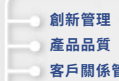

>**8,700**/>10萬

全球專利申請件數/營業秘密註冊件數 283 件 994/149 種

提供客戶生產製造技術/先進封裝技術 推出品質既可靠性創新檢測

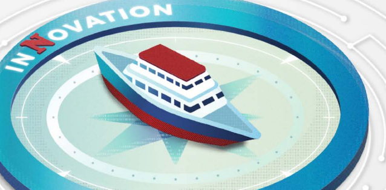 方法,提升產品、技術、製 造品質 40

導言 實踐永續管理 **營運與治理** 附錄
創新管理持續保持技術領先,每年研發支出為營收 2 奈米(N2)製程技術試產 技術領先 持續投入先端製程研發,以維持半導體技 術領先地位

| 經由大學合作計畫深化產學合作,自民國  110 年至民國 113 年累計培養大學生與研 究生超過 1 萬 7,000 名   |
|------------------------------------------------------------------------------------------------------|

## 保護智慧財產權

專利保護: 以「質量並重」 為核心強化專利管理,針 對每一世代製程技術,超前部署申請專 利,擴建專利家族防護網,維持技術領先 營業秘密保護: 經由營業秘密註冊與管理,記錄並整合運 用具有公司競爭優勢的營業秘密,強化公 司營運及智慧財產創新 強化產學合作 鏈結海內外學術研究機構,透過大學合作 計畫挹注資源、建立長期互動機制,培育 下一代半導體人才 經由大學合作計畫深化產學合作註 2,自民 國 110 年至民國 119 年累計培養大學生與 研究生超過 3 萬 5,000名

經由大學合作計畫深化產學合作,自民國 110 年至民國 112 年累計培養大學生與研 究生達 1 萬 2,677 名註 3 目標:10,000 名 經由大學合作計畫深化產學合作,在全球 培養大學生與研究生,當年度參與人次達 1 萬 1,670 名 目標:8,000 名
-
推動女高中生 STEM 探索活動,接觸學生 人次超過 3,000 名 推動女高中生 STEM 探索活動,接觸學生 NEW 人次超過 2,500 名 NEW
適用全球廠區 適用台灣與其他特定廠區 僅適用台灣廠區 超越 達成 未達成 註 1:台積公司自民國 103 年起研發支出逐年增加,並連年屢創新高。民國 112 年研發支出為 5,846 百萬美元,為民國 103 年研發支出的 3.1 倍,約占民國 112 年營收的 8.5%。歷年營 收及研發支出數據請見持續投資技術研發 註 2:產學合作項目包括各項學程、實習計畫、各式建教合作專案等 註 3:因累計參與人數更能展現台積公司投入人才培育的資源與效益,自民國 113 年起取消當年 度參與人次目標 41

## 119 年目標 113 年目標 112 年成果

成功量產 3 奈米增強型(N3E)技術 目標:3 奈米增強型技術量產 研發支出為營收之8.5%註 1 目標:8.5%

營業秘密註冊數量累計超過 200,000 件 營業秘密註冊數量 >60,000 件

全球專利獲准數量累計超過 80,000 件 之 8.5%

| 全球專利申請數量 >8,500 件         | 全球專利申請數量 >8,700 件  目標:>7,500 件 營業秘密註冊數量 >40,000 件  目標:>40,000 件   |
|-------------------------------------|-------------------------------------------------------------------------------------------------|
| 與 8 家公司分享營業秘密註冊管理制度 | 與 23 家公司分享營業秘密註冊管理制度  目標:8 家                                                |
| 協助 6 家公司成功建構營業秘密註冊及 | 協 助 7 家公司成功建構營業秘密註冊及                                                            |
| 管理系統                            | 管理系統  目標:6 家                                                                            |
| 綠色營業秘密註冊數量 >500 件       | 綠色營業秘密註冊數量 >500 件  目標:>500 件                                                   |

導言 實踐永續管理 **營運與治理** 附錄
追求創新的先行者 負責任的採購者 綠色力量的執行者 員工引以為傲的公司 改變社會的力量 始於「成為大家的代工廠」的創新商業模式,台積 **創新管理架構**
公司創辦人張忠謀博士創立全球首家專業積體電 路製造服務公司,大幅降低半導體業進入障礙,促 成全球無晶圓廠 IC 設計業興起與茁壯。台積公司 自民國 76 年成立至今,以創新為成長基礎,從經 營模式到技術突破,持續於各面向追求卓越表現, 同時積極培養創新文化,透過技術論壇、提案競 賽、優良案例發表等內部分享交流機制,建立鼓勵 創意發想的工作環境,激發同仁實踐創新提案。民 國 112 年,舉辦第一屆數位轉型競賽,鼓勵員工 運用數位轉型技術強化公司競爭優勢,激發更多數 位化、自動化、智能化相關創新,在瞬息萬變的時 代中持續保持領先地位。 因應 AI 技術崛起,台積公司加速科學探索與科技 創新步伐,不斷提升整體營運動能及效率,民國 112 年成功量產 N3E 技術,並制定 N2 技術發展 基礎製程,預計民國 113 年試產。此外,亦與客 戶、供應商、產官學界進行跨領域合作,包括產 品、技術人才及綠色創新等,以因應半導體業的快 速變革,持續落實創新不懈的企業精神。

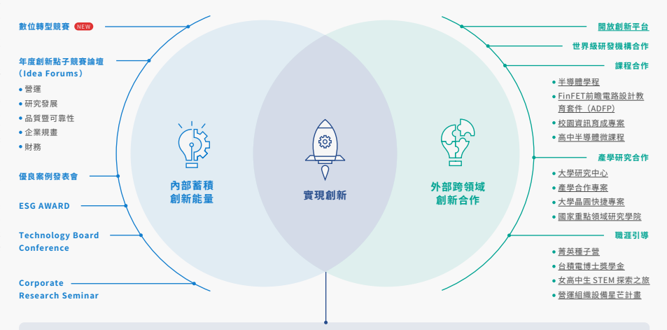

保護智慧財產權 創新案例 全方位專利管理全體系 營業秘密 開發「高穿透率 EUV 光罩護膜」,獲 � 項專利 導入全新世代低溫聚醯亞胺,環保材料再升級 高效能運算技術平台,用電 � 度省 �.� 度 改造超重力旋轉床,提升 IPA 削減率 ��%
創新空汙即時快篩技術,� 分鐘取得氣體 濃度數據 智能精準製造 **技術領先**

導言 實踐永續管理 **營運與治理** 附錄
追求創新的先行者 負責任的採購者 綠色力量的執行者 員工引以為傲的公司 改變社會的力量

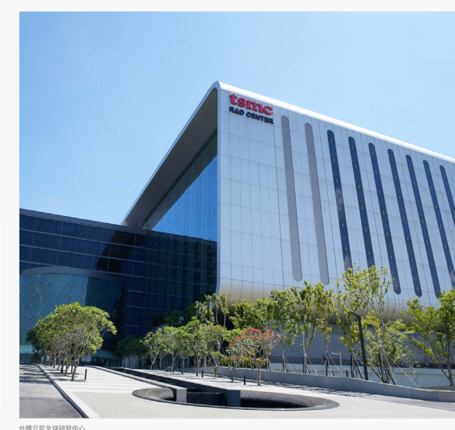

## 技術領先

民國 112 年,台積公司持續投資研究發展,全年 研發總支出占營收 8.5%,投資規模與世界級科技 企業相當。面對摩爾定律每 2 年大幅提升半導體 運算能力的持續性挑戰,台積公司積極提供客戶先 進技術與設計解決方案,為客戶的產品成功創造貢 獻。民國 112 年,台積公司除完成 2 奈米技術發 展基礎製程,同時持續精進良率並發展 16 埃米製 程技術;相較 2 奈米製程,16 埃米製程技術將進 一步提供速度及密度優勢,推進更前瞻技術的探索 性研究。

在發展互補式金氧半導體(CMOS)邏輯技術之 外,台積公司亦廣泛研究其他半導體技術,提供客 戶 行 動 系 統 單 晶 片(SoC)及 其 他 應 用 所 需 功 能, 範圍涵蓋導線與封裝技術整合、微機電系統、人工 智慧邊緣運算等。 民國 112 年,台積公司持續與許多世界級研究機 構緊密合作,包括美國 SRC(Semiconductor Research Corporation)及比利時 IMEC
(Interuniversity Microelectronics Centre)
等,同時擴大與全球頂尖大學的研究合作,達到半 導體技術進步與新世代人才培育二大目標。

持續投資技術研發

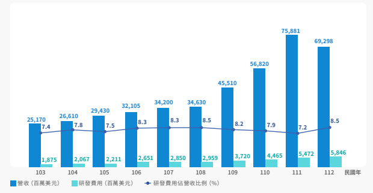

台積公司全球研發中心

導言 實踐永續管理 **營運與治理** 附錄
追求創新的先行者 負責任的採購者 綠色力量的執行者 員工引以為傲的公司 改變社會的力量

| 領先積體電路製造服務業的技術與創新領先業界試產 3 奈米製程技術                                                                                                     | 領先業界量產 3 奈米製程技術                                                                                                         | 領先業界量產 3 奈米增強型技術                                                                                                                                                       |        |
|-------------------------------------------------------------------------------------------------------------------------------------------------------------------|-------------------------------------------------------------------------------------------------------------------------------------|-------------------------------------------------------------------------------------------------------------------------------------------------------------------------------------|--------|
| 成功試產 3 奈米增強型技術                                                                                                                                         |                                                                                                                                     |                                                                                                                                                                                     |        |
| 110                                                                                                                                                               | 111                                                                                                                                 | 112                                                                                                                                                                                 | 民國年 |
| 通過第五代 CoWoS®(Chip on Wafer on Substrate)驗證, 矽中介層面積達創紀錄的 2,500 平方毫米,可容納至少 2 個系 統單晶邏輯晶片與 8 個高頻寬記憶體(HBM)小晶片堆疊 | 第三代 HBM 完成 CoWoS®-S 認證,矽中介層具有次微米級的 繞線層及整合電容(Integrated Capacitors, iCap),可上置 SoC 與 HBM 等各式晶片 | CoWoS®-S 的 3.3 倍光罩尺寸矽基板技術完成驗證,可整合多個  SoC、第三代 HBM 及具備第二代嵌入式深溝槽電容(Deep Trench  Capacitor, DTC),為客戶高效能運算產品生產準備                 |        |
| 第七代 InFO-PoP(Integrated Fan-Out Package-on-Package,  InFO-PoP)通過驗證,適用於具備增強散熱性的行動應用                                                       | 第八代 InFO-PoP 通過驗證,可支援行動應用及增強散熱性能; 如期開發下一代 InFO-PoP ,提供背面線路重佈層                               | 多晶片整合型扇出層疊封裝(Integrated Fan-Out Multi-chips  with Package-on-Package, InFO-M-PoP)成功整合多個異質 SoC  與封裝堆疊,並量產於穿戴式裝置相關產品                         |        |
| 量產第三代 InFO-oS(InFO on Substrate, InFO-oS),提供更 多的晶片分割及整合、更大的封裝尺寸與更高頻寬                                                             | 第四代 InFO-oS 完成驗證,提供更多的晶片整合、支援更大封 裝尺寸與頻寬需求                                                            | 第五代 InFO-oS 通過驗證,提供更多的晶片分區整合、更大的封裝 尺寸和更高頻寬                                                                                                          |        |
| 擴大十二吋雙重擴散金屬氧化半導體(Bipolar-CMOS-DMOS,  BCD)技術組合,涵蓋 90 奈米、 55 奈米、 40 奈米及 22 奈米 技術,支援不同整合度的行動電源管理晶片應用        | 55 奈米 BCD 針對行動電源開關應用提升5伏元件品質因素優 化。持續擴展 40 奈米、 22奈米、 0.13 微米 BCD 技術以因應 車用市場需求         | 拓展 0.13 微米及 90 奈米 BCD 技術以因應車用市場需求,其中 0.13  微米 45 伏元件進入可靠度驗證階段。55 奈米 BCD 成功導入量產, 並進一步針對高效能及低功耗行動裝置應用提供多樣化的元件 |        |
| 達成 13% 畫素尺寸微縮於四相偵測(Quad Phase Detection,  QPD)感測器結構,應用於行動影像感測市場                                                                   | 運用 3 片晶圓堆疊技術,試產全球最小電壓式全域快門金屬氧 化物半導體影像感測器晶片,用於近紅外線與安控相機市場                        | 試產嵌入式橫向溢出整合電容器(Lateral Overflow Integration  Capacitor, LOFIC)像素的影像感測器技術,具有高動態範圍,提 供客戶應用於高階手機及先進駕駛輔助系統影像感測               |        |
| 量產 28 奈米和 40 奈米電阻式隨機存取記憶體(RRAM),為價 格敏感的物聯網市場提供低成本解決方案                                                                     | 22 奈米 RRAM 準備量產,做為低成本嵌入式非揮發性記憶體解 決方案,支援價格敏感的物聯網市場                                            | 22 奈米電阻式隨機存取記憶體技術已進入量產,作為低成本嵌入式 非揮發性記憶體解決方案,支援對價格敏感的物聯網市場                                                                      |        |
| 維持 28 奈米嵌入式快閃記憶體的穩定高良率且通過技術驗證, 可應用於消費電子級與第一級車用電子技術                                                                   | 28 奈米嵌入式快閃記憶體已進入量產,並可支援高效能行動運 算與高效能低漏電製程平台                                                    |                                                                                                                                                                                     |        |

導言 實踐永續管理 **營運與治理** 附錄
追求創新的先行者 負責任的採購者 綠色力量的執行者 員工引以為傲的公司 改變社會的力量

## 民國 112 年領先積體電路製造服務業的技術與創新

半導體技術的創新深刻影響人類生活各層面,5G 行動通訊與高效能運算等應用,不僅提升生活品質與便利性,半導體技術應用亦也有助終端產品節能,引領科技與文明進步,邁向低碳永續未來。

| 製程技術                                                              | 產品應用                                         | 創新/突破                                 | 客戶成功   |                |                              |
|-----------------------------------------------------------------------|--------------------------------------------------|--------------------------------------------|------------|----------------|------------------------------|
| 3 奈米鰭式場效電晶體(Fin Field-Effect Transistor, FinFET)(N3)技術 | 邁入量產第 2 年                                  | 領先業界推出最先進產品                     |            |                |                              |
| 3 奈米 FinFET 增強型(N3E)技術                                       | 開始量產                                         | 領先業界推出最先進產品                     |            |                |                              |
| 3 奈米 FinFET 強效版(N3P)技術                                       | 業界最先進及成熟的 FinFET 電晶體                 | 領先業界推出最先進產品                     |            |                |                              |
| 4 奈米 FinFET 強效版(N4P)技術                                       | 開始量產                                         | 推出效能與能源效率領先業界的產品           |            |                |                              |
| 12 奈米 FinFET 精簡型強效版(N12eTM)技術                             | 相較於上一代 N22 技術,可節省大於 50% 的功耗     | 領先業界推出最先進產品                     |            |                |                              |
| 領先業界採用 5 奈米邏輯技術,提供車規級可靠度與                       |                                                  |                                            |            |                |                              |
| 5 奈米 FinFET 車用(N5A)技術                                         | 協助客戶開發業界最先進的先進駕駛輔助系統晶片     |                                            |            |                |                              |
| 車用設計支援平台                                                      |                                                  |                                            |            |                |                              |
| N6 射頻(Radio Frequency, RF)(N6 RF)技術                           | 接獲多個客戶產品投片                             | 推出 RF 效能領先業界及具成本效益的產品     |            |                |                              |
| 16 奈米 FinFET 精簡型(16nm FinFET Compact, 16FFC)嵌入式磁性隨機     | 通過 AEC-Q100 的 1 級車用可靠度認證              | 推出領先業界車用與工業應用的高效能微控制器 |            |                |                              |
| 存取記憶體(Magnetoresistive Random-access Memory, MRAM)技術         | 持續協助客戶領先業界,將世界最小畫素的產品導入   |                                            |            |                |                              |
| CMOS 影像感測器(CMOS Image Sensor, CIS)技術                         | 領先業界推出全球最具高動態範圍性能的先進產品     |                                            |            |                |                              |
| 市場                                                                  |                                                  |                                            |            |                |                              |
| TSMC-SoIC®(系統整合晶片)晶片對晶圓(Chip on Wafer, CoW)整合        | 領先業界整合 SoIC 及 CoWoS®-S 成高效能系統產品, | 推出效能及能源效率領先業界的產品           |            |                |                              |
| CoWoS®-S 技術                                                         | 且大幅提升效能                                   |                                            |            |                |                              |
| CoWoS®-R 線路重佈層(Redistribution Layer, RDL)技術                  | 領先業界量產,提供訊號整合較佳的高效能運算產品   | 領先業界推出先進產品                       |            |                |                              |
| 5G行動通訊                                                            | 高效能運算                                       | 超低功耗物聯網                             | 車用       | 真無線藍芽耳機 | 無線連接數位電視/視訊轉換器 |
| 穿戴式裝置                                                            | 用於軟體定義汽車的新電子/電氣架構的區域控制器   | 高端工業控制器                             |            |                |                              |

導言 實踐永續管理 **營運與治理** 附錄

## 推進領先技術,釋放全球創新動能

創新,是台積公司成長的基礎,透過創新所帶來 的力量不僅推動公司持續維持技術領先地位,亦 驅動各個產業面向的創新突破,進而解決人類社 會發展面臨的挑戰,成為科技與社會前行的動力。 做為值得信賴的專業積體電路製造服務公司,本著 對於技術領先的堅持,台積公司持續推出具更高 晶片密度與更低功耗的新世代製程技術,並提供 多樣且完備的特殊製程及三維晶片堆疊(3D Chip Stacking)與封裝服務,實現各式各樣的晶片創 新。民國 112 年,台積公司提供 288 種製程技術, 為 528 家客戶實現超過 1 萬 1,890 種產品創新, 並 於 技 術 論 壇「 創 新 專 區 」(Innovation Zone)

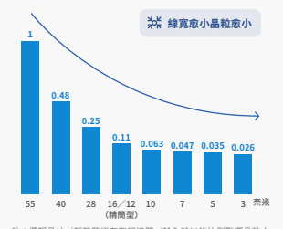

邀請 48 家新創客戶,展示有助提升人類未來生活 的創新技術與產品,包括高能效人工智慧晶片、 車 用 電 子 控 制 器、 氮 化 鎵(Gallium Nitride, GaN)電源模組、能源採集控制器、醫療感測器 等,為全球注入源源不絕的創新動能,驅動現代社 會持續進步。

## 為客戶創新賦能 驅動更智慧永續的世界

民 國 112 年, 台 積 公 司 持 續 為 客 戶 創 新 賦 能, 攜 手 Impinj 以 領 先 業 界 的 65 奈 米 製 程 技 術, 協助其推出新世代 RAIN RFID 標籤晶片 Impinj M800 系列,並成功導入全球物聯網市場,新一

註:邏輯晶片/靜態隨機存取記憶體/輸入輸出的比例影響晶粒大 小與耗電量,已重新調整校正 註:邏輯晶片/靜態隨機存取記憶體/輸入輸出的比例影響晶粒大 小與耗電量,已重新調整校正 代 Impinj M800 系 列 標 籤 晶 片 高 可 讀 性 及 低 功 耗的優異功能,有助貼附於日常用品上的 RAIN RFID 標籤縮小尺寸並減少環境外部性,相較上 一代 Impinj M700 系列,M800 系列每片晶圓的 晶片數量增加 25%、能耗降低 30%,進而減少 Impinj 產品碳足跡,透過使用 RAIN RFID 技術的 日常用品,包括食品包裝、汽車零件、包裹郵件 等,創造更智慧、更永續的世界。

Impinj 創新的標籤晶片可應用於追蹤醫療用品與 設備,確保關鍵醫療保健物品於正確時間、地點被 使用,並保障物流優先配送;例如 COVID-19 流

行期間,Impinj 標籤晶片協助醫院精確追蹤與追 溯醫療設備與藥品,包括疫苗、藥丸、藥瓶及注射 器等,並提供其劑量、有效期限與召回相關資訊, 彰顯科技可為社會帶來的價值。此外,Impinj 標 籤晶片亦為環境永續創造正面影響。以食品業應用 為例,使用 Impinj M800 系列標籤晶片有助提升 庫存準確性,避免生產過量或庫存過剩;對服飾業 而言,附加於商品的 Impinj 標籤晶片,有助於產 品生命週期各階段的追蹤與追溯,減少碳排放並落 實循環經濟。隨著新一代 RAIN RFID 技術的推出, 將能進一步提高供應鏈物流效率,協助節省運輸成 本、碳排放,推動供應鏈升級與永續發展。

46

導言 實踐永續管理 **營運與治理** 附錄
追求創新的先行者 負責任的採購者 綠色力量的執行者 員工引以為傲的公司 改變社會的力量 台積公司與客戶攜手創新

提高標籤可讀性 提高標籤可讀性 相較上一代 M700 相較上一代 M700 系列晶片,每片 系列晶片,每片 晶圓的晶片數量 晶圓的晶片數量 更寬的調頻範圍 更寬的調頻範圍
透過低能耗與即時追蹤的標籤讀取,優化物流 管理,實現高效營運,創造環境與社會雙贏 47

導言 實踐永續管理 **營運與治理** 附錄

追求創新的先行者 負責任的採購者 綠色力量的執行者 員工引以為傲的公司 改變社會的力量

## 保護智慧財產權

因應全球化布局,台積公司根據營運發展與研發藍 圖,採用專利與營業秘密二大智權類型,雙軌保護 技術創新成果與商業機密資訊,強化「技術領先、 卓越製造、客戶信任」三大競爭優勢。技術領先方 面,台積公司智權與研發團隊超前部署每一世代關 鍵創新技術的智權戰略版圖,自研發規畫初期至開 發量產緊密合作,涵蓋最新 3 奈米及 2 奈米製程技 術,靈活運用智權資產確保技術領先。卓越製造方 面,舉凡產能規畫、製程管控、智慧製造等關鍵資 訊,台積公司均以營業秘密嚴謹保護,並積極申請 部署具戰略價值的生產技術專利,強化競爭優勢。 客戶信任方面,持續維持全球專利戰略布局及國際 排名領先地位,保護台積公司及客戶機密資訊,維 護全球營運自由,深化與客戶的合作夥伴關係。

## 台積公司專利版圖建構史

專利奠基期 專利成長期 **專利倍增期**

制定專利申請管理 數位管理系統 優化專利管理制度,導入

標準規範及流程 **專利申請**

第 2 名 美國專利申請排行維持第 2 名 第 1 名 本國專利申請數量連續蟬聯 8 年第一

>6,000 件 全球專利獲准,全美百大排行榜唯一台灣公司 第 3 名 美國專利獲准排行維持第 3 名

| 研發投資設定專利目標,部署技術藍圖規畫專利產出  擴建關鍵技術專利家族,建構台積全球專利戰略版圖  全方位專利管理全體系,落實申請維護運用整合管理 專利管理系統 AI 升級,程序費用時效全面自動管控 年度全員智權系列推廣,增設獎項擴辦智權頒獎典禮   |
|------------------------------------------------------------------------------------------------------------------------------------------------------------------------------------------------------------------------------------------------|

第 1 名 本國專利獲准數量,連續蟬連 4 年第一

| >8,700 件 全球專利申請   |
|---------------------------|

 第 1 名

100% 美國專利獲准率近 100%,在前十大專利權人中名列第一

  行榜

76 87 100 民國年

7 奈米 3 奈米

0.18 微米

| 104                             | 105                                                                                             | 108                                                                 | 110                                                                                         | 111   | 112   |
|---------------------------------|-------------------------------------------------------------------------------------------------|---------------------------------------------------------------------|---------------------------------------------------------------------------------------------|-------|-------|
| 進入全美前 10 大 專利獲准排行榜 | 美國專利申請單年 突破 3,000 件                                                                  | 成為首家取得台灣 智慧財產管理系統 (TIPS)最高等級 AAA 級驗證的企業 | 連續 2 年於全美前 10 大專利申請排名榜躍居第二 連續 2 年於全美前 10 大專利獲准排名榜躍居第三 |       |       |
| 進入全美前 10 大 專利申請排名榜 | 連續 3 年以專利數量及強度指標,獲國際智權權威機 構柯睿唯安(Clarivate)、律商聯訊(LexisNexis) |                                                                     |                                                                                             |       |       |

| 28 奈米         |             |         |         |        |
|-----------------|-------------|---------|---------|--------|
| 0.13 微米       | 40/45 奈米 | 20 奈米 | 10 奈米 | 5 奈米 |
| 90 奈米 65 奈米 | 16/12 奈米 |         |         |        |

導言 實踐永續管理 **營運與治理** 附錄

追求創新的先行者 負責任的採購者 綠色力量的執行者 員工引以為傲的公司 改變社會的力量

## 全方位專利管理體系

台積公司以四大智慧財產權管理政策達成管理目標,以完整的專利管理體系進行專利布局與保護,包括 專利全程策略及專利管理制度,並透過創新專利策略與多元風險控管,規畫前瞻近中長程技術專利藍圖; 同時,應用專利地圖競爭情報監控分析;舉辦前瞻發明論壇挖掘核心技術創新,超前部署具戰略價值的 新興關鍵技術提案。此外,台積公司鎖定關鍵技術指標擴建專利家族,專利部署申請維護全程分級管理, 並以研發投資金額設定年度專利產出目標,民國 109 年至 111 年的平均研發專利生產力(Patent/RD Spend Productivity)為 1,即台積公司每挹注百萬美元的研發投資產出 1 件美國專利申請,表現優於 業界。 台積公司專利智權部門設計多元獎勵制度鼓勵專利產出,包括頒發專利申請獲准個案獎金、年度智慧財

前瞻研發技術專利版圖部署 台積公司專利管理全體系

產權頒獎典禮,並透過「多產發明人獎」表揚任職期間獲准美國專利超過 100 件的同仁,截至民國 112 年已達 160 位,其中 1 位已累積取得逾 1,600 件專利,另有 594 件美國專利來自年度「專利新人獎」的 434 位同仁。此外,每年亦進行系列專利推廣活動,民國 112 年「年度專利競賽」吸引 1,772 件發明提 案競逐;舉行 102 場駐廠教育訓練協助同仁精進專利提案;「專利知識有獎徵答」則超過 2,200 位同仁參 與,提升智權法律觀念。 此外,台積公司持續推動產業技術與智權升級,連續 10 年獲邀參加美國專利局舉辦的年度技術論壇,針 對半導體先進技術進行演講、協助專利審查委員掌握專利技術,強化審查品質效率;同時亦主導產業供 應鏈合作智權策略聯盟,參與智權法規修訂並提供產業政策建言,協助打造健全的專利保護環境。

追求創新的先行者 負責任的採購者 綠色力量的執行者 員工引以為傲的公司 改變社會的力量

導言 實踐永續管理 **營運與治理** 附錄

## 營業秘密

營業秘密意指對強化企業競爭優勢具貢獻、企業應 保密的技術或商業創新。台積公司營業秘密管理奠 基於「智財策略、競爭優勢、創新文化、永續經 營」四大願景,以註冊系統與獎勵制度雙軌並行方 式,持續深化公司營運及智慧財產創新。台積公司 營業秘密發展與時俱進,民國 112 年註冊數量累 計逾 34 萬件,並推出營業秘密智慧管理 2.0 版─
「 新探線上線下融合服務 」(Innovation Talent Scouting Online Merge Offline Service, ITS OMO),積極培育更多營業秘密優秀人才,激勵科 技與永續創新。

102 民國年

## |   營業秘密獎項激發同仁創新 |   新綠色智財創造產業與環境共好 營業秘密歷年註冊數量

自 民 國 102 年 起 至 112 年 年 底, 台 積 公 司 營 業 秘 密註冊案件累計達 34 萬 8,503 件,參與註冊同仁 逾 3 萬 8,000 位, 且 民 國 112 年 註 冊 案 件 總 數 首 次單年超過 10 萬件,展現強大的創新動能與潛力。 為 肯 定 與 激 勵 此 豐 碩 註 冊 成 果, 台 積 公 司 頒 發 年 度 金 質 營 業 秘 密 獎 鼓 勵 優 質 的 發 明 創 新, 截 至 民 國 112 年 共 頒 發 2,738 件 金 質 營 業 秘 密 奬, 累 積 6,762 位 同 仁 獲 獎; 民 國 112 年 特 別 頒 發「 營 業 秘 密 成 長 最 佳 貢 獻 獎 」、「 營 業 秘 密 多 產 最 佳 貢 獻 獎」予領導研發與製造團隊績效卓著的副總經理; 同時,頒發「營業秘密智慧管理 2.0 專案最佳夥伴 獎」予參與新探人才線上線下融合服務的資訊技術 處長及廠長,肯定其對培育創新人才及提升營業秘 密註冊質與量的貢獻。 

綠色製造是台積公司永續經營的重要基石,透過推 動「綠色營業秘密註冊專區」鼓勵同仁發展氣候與 能源、水管理、資源循環及空氣汙染防制相關的 營業秘密,民國 112 年綠色營業秘密註冊案件數 量共 633 件,參與同仁除來自主責節能減碳或資 源循環的廠務組織,研發、製造等部門同仁亦踴躍 投入,豐富綠色營業秘密案件多樣性。為激勵綠 色創新,台積公司設置「綠色營業秘密獎(Green Trade Secret Award)」,民國 112 年頒發 13 件、 共 62 位同仁獲獎,藉此肯定同仁創新成果,期待 綠色創新文化持續深植於日常業務運作。 

建立「智財策略、競爭優勢、創新文化、永續經營」四大營業秘密 管理願景 推出「綠色營業秘密獎」並建立「綠色營業秘密註冊專區」,獎勵 7 大關鍵貢獻 推動「先進製程技術量產晶圓廠營業秘密註冊 100% 覆蓋率專案」 推動「供應鏈策略夥伴營業秘密管理分享」公益服務專案 營業秘密註冊數量累計超過 15 萬件 112 推出營業秘密智慧管理 2.0 版─
「新探線上線下融合服務」 
營業秘密註冊數量累計逾 34 萬 件、單年註冊數量逾 10 萬件 111 擴大發起「營業秘密註冊制度同學會」
建立「鼓勵綠色營業秘密註冊與公益分享及獎勵指引」 推動「卓越製造營業秘密註冊專案」 營業秘密註冊數量累計逾 24 萬件、註冊人數逾 3 萬人

導言 實踐永續管理 **營運與治理** 附錄

追求創新的先行者 負責任的採購者 綠色力量的執行者 員工引以為傲的公司 改變社會的力量

## 焦點案例 營業秘密智慧管理 2.0 強化人才創新

為培育創新潛力人才並提升營業秘密品質與量能,民國 112 年台積公司打造營業秘密智慧管理 2.0 版─「新探線上線下融合服務」,於晶圓十二 B 廠、晶圓十五 A 廠、晶圓十五 B 廠試行成功,由 多次榮獲金質營業秘密獎的 6 位同仁擔任金牌導師,一對一指導經人工智慧(AI)新探系統篩選 的 18 位創新潛力發明人;未來將擴大實施至經系統分析後選定的其他部門及廠處,預計每年培育 100 位創新潛力人才。此外,台積公司亦持續建置「營業秘密智慧管理策略中心」,激發創新並智 慧化管理風險,落實興利與防弊兼具的目標。

擴大貢獻範圍,優化註冊營業秘密內容。
AI 新探系統 依營業秘密註冊案件創新指標、發明人創新 指標,分析篩選具創新潛力的部門與尚未獲 獎的潛力發明人 一對一專屬指導 遴選先前多次獲獎的同仁擔任金牌導師,以潛 力發明人註冊案件為基礎進行專屬指導,提 升創新實力 導師一對一指導發明人,拓展更多元創新思維,從不同角度思考解決方案並進一步 林志陽 試行專案潛力發明人

## 智能精準製造

智能精準製造是台積公司實踐卓越製造的核心,透過「全球製造與管理平台」落實四大策略,分別為全 球一體化製造、智能製程控制、敏捷製造與品質管制、極大化機台效率,確保海內外廠區的營運效率及 產品品質一致,成為全球半導體產業中長期且值得信賴的技術及產能提供者。因應台積公司全球布局以 及全球氣候變遷與能源使用的挑戰,民國 112 年台積公司針對精準製程控制、製造手法與生產參數一致 性、優化人員效率進一步強化運作機制,持續為智能化生產挹注新動能。

「智能製程控制」方面,台積公司持續強化先進封裝廠區的製程能力,從晶圓(Wafer)至後段封裝製程 的裸晶(Die),皆有完整生產履歷可供查詢與進行故障分析,並建置智慧偵測、智能診斷與自我反饋等 系統功能,減少人為操作失誤,實現更為精準的製程控制。「敏捷製造與品質管制」方面,引入新機台驗 證平台,提升 3 奈米製程超過 2,800 台新機的驗機效率,同時透過比對 30 個以上品質防禦系統,制定相 同機台參數與品質規格的管制界限,確保機台參數設定與表現一致,除提高作業效率,亦改善新機台投 入量產的週期時程。「全球一體化製造」方面,台積公司以跨域易於溝通與合作的全球製造與管理平台, 完成 32 個廠房作業流程智能系統開發,涵蓋台灣與海外各廠區,有效提升生產效率。

晶圓至裸晶生產履歷

導言 實踐永續管理 **營運與治理** 附錄

## 焦點案例 精準監控生產設備零件耗能,年省 94 萬度電

為精進生產設備零件能源使用效率,民國 112 年台積公司首建「生產設備零件能源監控系統」,應 用物聯網技術整合跨域資料打造透明化資訊平台,針對跨機台與跨單元用電細節,以大數據分析計 算效能指標,鑑別機台是否有零件老化造成用電增加或用電轉換率差的情形,有效掌握用電效率與 趨勢變化,亦能計算機台修復及保養、元件改善的節能效益。以半導體黃光機台中最先進的 EUV 微影機台為例,民國 112 年設備單位透過生產設備零件能源監控系統完成驗收 4 項元件改善方案, 並通過台積公司全面環安衛管理系統(Total ESH Management, TSM)節能管理方案驗證,估 計年省 94 萬度電,生產設備零件能源監控系統未來將持續推廣至全球廠區,落實綠色製造。

## 超大型十二吋晶圓廠ㄧ(Gigafab®)卓越製造

等大學交流 AI 與 半導體製造領域 的最新應用發展
追求創新的先行者 負責任的採購者 綠色力量的執行者 員工引以為傲的公司 改變社會的力量

導言 實踐永續管理 **營運與治理** 附錄

## 開放創新平台

隨著現今科技快速發展,AI、高效能運算、自動駕 駛與行動裝置推動半導體產業持續進步,並影響人 們對運算及其潛在新應用的看法及使用模式。台積 公司以創新為目標,透過開放式創新平台(Open Innovation Platform®, OIP)集結電子設計自動 化(Electronic Design Automation, EDA)聯盟、 矽 智 財(Intellectual Property, IP) 聯 盟、 設 計 中心聯盟(Design Center Alliance, DCA)、雲端 聯盟、價值鏈聯盟(Value Chain Alliance, VCA)
及 3DFabricTM 聯盟,與所有 OIP 夥伴緊密合作, 跨領域整合專業知識、加速開發創新解決方案,以 滿足客戶的技術要求,進而實現產品與服務差異化 的新價值。 民國 112 年,台積公司舉辦開放創新平台生態系統 論壇,慶祝與 OIP 夥伴 15 週年的合作與創新。隨 著產業轉趨擁抱 3D IC 及系統級創新,完整產業合作 模式的需求日趨重要。自 OIP 成立後,台積公司建 立全新合作典範,透過設計技術協同優化(Design Technology Co-Optimization, DTCO),攜手 OIP 夥伴提供解決方案,並匯集客戶與聯盟夥伴的創造 性思維,以因應不斷增長的需求及半導體設計複 雜性,降低設計門檻並加速產品上市週期。隨著 矽製程技術持續發展,台積公司積極提升客戶晶 片 級 產 品 的 功 耗、 效 能 及 面 積(PPA),OIP 生 態 系 統 亦 擴 大 範 圍 至 記 憶 體、 基 板、測試、製造 與封裝整合,為實現系統技術協同優化(System Technology Co-Optimization, STCO) 而 促 成 更 廣泛的合作模式,優化客戶的產品性能與功效。

台積公司 OIP 生態系統在過去 15 年來持續精進, 透過 6 個聯盟、超過 110 個合作夥伴協助客戶應 對前瞻邏輯製程、先進 3D IC 晶片堆疊解決方案、 類比、射頻(Radio Frequency, RF)與矽光子等 特殊製程的設計挑戰。截至民國 112 年,矽智財 聯盟合作夥伴從 25 個增加至 39 個、矽智財組合 由 1,500 個擴大至超過 7 萬 3,000 個,且能支援 廣泛的設計應用;電子設計自動化聯盟自 0.5 微米 至 2 奈米,提供超過 4 萬 8,000 個技術文件、3,400 個製程設計套件及驗證過的電子設計自動化工具 與功能,即時支援客戶最新的半導體設計創新。 此外,民國 112 年台積公司更進一步於海內外舉行 3 場 3DFabricTM 聯盟研討會,除分享 3DFabricTM
技術應用與 3Dblox 標準提升設計效率,同時針對 3D IC 設計面臨的挑戰與聯盟夥伴一起發展解決方 案,透過跨領域合作整合專業能力,強化系統級設 計生產力。台積公司匯集 OIP 夥伴共同發展的成 果,協助客戶克服技術壁壘、開發創新產品,驅動 全球科技不斷發展。

## 台積公司 Oip 六大聯盟

台積公司集結客戶與開放創新平台不同聯盟夥伴 的創新構想,目標為降低設計障礙、提高首次投片 成功、縮短產品設計時程、加速產品上市及縮短量 產與獲利時程,致力提供客戶全面性的解決方案與 服務。

## 民國 112 年 Oip 六大聯盟進展 矽智財聯盟

建構 N3E 與 N3P 矽智財,增強整體矽智財組合 新增類比、基礎矽智財合作夥伴 啟用 3DFabric 測試晶片流程,為矽智財夥伴驗證 3D IC 矽智財

電子設計自動化聯盟 與電子設計自動化聯盟合 作,推出 6 個設計參考流程 認 證 N2、N3E、N3P 及 3DFabric 技術的電子自動 化設計工具 設計中心聯盟 新增 3 家合作夥伴,擴大 對亞洲與歐洲地區客戶的 設計服務支援

首次與 2 家雲端聯盟夥伴利 用雲端高效能運算礎架構, 在準確性無虞下,更有效加 速驗證並快速執行多晶片機 械應力的物理分析及模擬, 確保高品質 3D IC 設計 3DFabricTM 聯盟 新增 3 家電子設計自動化、 矽智財與基板領域的專業合 作夥伴 強化 3Dblox 於支援系統原 型設計與設計重複使用功能

## 價值鏈聯盟

提供從設計到量產的彈性特殊應用晶片(Application Specific Integrated Circuit, ASIC)服務模式,支援超過 900 家無晶圓 廠客戶、系統客戶與 3D Fabric 業務 首次推出 N3 CoWoS 測試晶片,提供客戶先進技術服務

導言 實踐永續管理 **營運與治理** 附錄

## 完整的生態系統設計解決方案

民國 112 年,台積公司於技術論壇與開放創新平台生態系統論壇中揭示一系列與 OIP 聯盟夥伴針對行動 裝置、高效能運算、車用與物聯網應用平台推出的最新完整設計解決方案,為表揚 OIP 聯盟夥伴合作成 果,台積公司頒發 15 個獎項予電子設計自動化合作夥伴、6 個獎項予矽智財合作夥伴、1 個獎項予雲端 合作夥伴,以及 1 個獎項予 3DFabric 聯盟合作夥伴,表彰優秀夥伴加速半導體產業創新的貢獻。

## 先進技術

完備的 3 奈米系列產品,包括 N3E、N3P 及 N3X,速度與密度皆提升 主要的 N3E 與 N3P 電子設計自動化工具皆通過認證,矽智財已可供客戶採用 N3AE(Auto Early)利用 N5A 設計規則及學習,推進車用電子設計開發時程 N2 技術提供全節點效能及功耗優勢,主要的電子設計自動化工具與基礎矽智財已 可供客戶進行設計

## 類比電晶體

具結構化布局與更高良率的類比電晶體,提升類比設計生產力 參數化單元配備具彈性的電晶體,方便遷移及提高生產效率 覆蓋 N40 到 N2 的全類比遷移 電子設計自動化工具已可支援類比遷移

## 3Dfabrictm聯盟

與新夥伴合作降低 3D IC 設計障礙,加速採用生態系統解決方案 促進夥伴間設計實現與生產提升的多方合作

## 3Dblox 標準

新的電子設計自動化 3D IC 整合中心包含 3DFabricTM 與 3Dblox 標準設計語言, 實現晶片與封裝及多物理場分析 電子設計自動化工具已可支援 3Dblox 標準 釋出台積公司 3DFabricTM 套件,包括支援 CoWoS®、InFO 及 TSMC-SoIC®等 3DFabricTM 技術的設計流程、技術檔案與文件

導言 實踐永續管理 **營運與治理** 附錄
追求創新的先行者 負責任的採購者 綠色力量的執行者 員工引以為傲的公司 改變社會的力量

## 強化產學合作

台灣半導體產業以完整的產業價值鏈與領先的晶 圓製造技術,於全球半導體供應鏈中具重要地位。 面對國際競爭與日益複雜的製程發展,產業對人 才需求及期望亦隨之提升;培育人才是台積公司 ESG 五大方向的關鍵一環,並以「課程合作、產 學研究合作、職涯引導」三大面向建立校園合作長 期計畫,提升半導體人才。

「課程合作」意指台積公司與多所大學、高中合作 半導體相關教學課程,包括半導體學程、鰭式場效 電晶體(Fin Field-Effect Transistor, FinFET)前 瞻電路設計教育套件、校園資訊育成專案、高中半 導體微課程等,提供學生貼近產業的半導體知識, 實踐學用接軌。 

「產學研究合作」則包含大學研究中心、產學合 作 專 案、 大 學 晶 圓 快 捷 專 案(TSMC University Shuttle Program)、國家重點領域研究學院等多 項專案,攜手產業界與學界共育未來人才。 台積公司的「職涯引導」涵蓋菁英種子營、台積 電博士獎學金、女高中生 STEM 探索之旅、營運 組織設備星芒計畫四大專案,希望透過多元活動, 引領學生進一步認識半導體產業未來趨勢與發展, 開啟新視角並激發其投入半導體領域的興趣,進而 提升台灣半導體產業關鍵人才質量及研發能量。

## 校園合作計畫

半導體學程 高中半導體微課程 課程合作 民國 108 年起,攜手國內大學開辦半導體學程,內容涵蓋元 件/整合、製程/模組、設備工程、先進封裝、智慧製造與 前瞻電路設計六大主修領域,定義先進半導體人才應具備的 專業知能與課程藍圖 FinFET前瞻電路設計教育套件(ADFP)
民國 111 年推出 N16 製程的 ADFP,協助大學升級前瞻電路 設計教學,縮短學用落差

## 校園資訊育成專案

民國 109 年起全方位推動數位轉型,進入校園發展資訊教 育、吸引優秀學生加入半導體製造數位轉型行列,打造人才 生態系 台積公司從推廣科普教育角度出發,民國 111 年推出「 SEMI神秘積星站(Semiconductor in Our Life)」,以混 成學習模式帶領學子認識半導體對生活與科技發展的重要性

## 產學研究合作

大學研究中心

民國 102 年起與 4 所國立大學攜手成立研究中心,鼓勵學界 提出突破性的半導體研究計畫,並致力於發展尖端技術,積 極培育半導體研究人才

## 產學合作專案

民國 94 年起,以產學合作專案持續鼓勵大學教授專注研究最 先進的半導體產業相關技術,並提供機會讓有興趣的學生參 與,從中獲得實作經驗,進而投入半導體產業

## 大學晶圓快捷專案

提供實體晶片驗證平台,協助全球大學師生將積體電路 設計無償轉為實體晶片,並驗證其設計應用於終端裝置 的效能 民國 111 年起,積極支持台灣 6 所大學設立「國家重點領域 研究學院」,持續提供經費支持半導體領域前瞻研究與人才 培育 國家重點領域研究學院 職涯引導 菁英種子營

民國 100 年起舉辦「菁英種子營」,提升學生對半導體產 業重要性的瞭解、打造開放平台促進學界與業界互動,激發 參與營隊學生投入半導體領域博士級研究的興趣

## 台積電博士獎學金

民國 109 年起創設「台積電博士獎學金」,支持優秀學生投 入半導體相關科系攻讀博士學位,持續推動先進技術與卓越 製造發展

## 女高中生 Stem 探索之旅

民國 109 年起,舉辦「女科學家之旅」活動與「挺身而進, 成就更好的妳」職涯講座,讓女學生瞭解科學領域的挑戰與 樂趣,為半導體產業儲備生力軍

## 營運組織設備星芒計畫

由廠務及人力資源處發起的「設備星芒計畫」於民國 111 年 獲得 TSMC ESG AWARD 酷炫點子獎肯定,並於民國 112 年啟動專案,培育高工技職學生了解半導體設備領域實作知 識與技能 

導言 實踐永續管理 **營運與治理** 附錄

## 課程合作 |   半導體學程

台積公司攜手國內大學開辦半導體學程,建立紮實 學理基礎。民國 112 年新增國立中正大學、逢甲 大學、元智大學及中原大學,累計合作學校達 13 所、合作學程增至 44 個,已超過 6,300 位學生登 錄修習。台積公司亦推派主管擔任業師,與 8 所大 學合作開授「半導體製程─設備與技術」與「半導 體智慧製造」二門課程,協助學生接軌最先進產業 知識與實務,民國 112 年逾 950 位學生參與;台 積公司亦釋出內部培訓資源,開放半導體學程學生 至台積公司新人訓練中心(Newcomer Training Center)修習課程,民國 112 年亦進一步擴展至 非半導體學程合作學校,儲備未來人才量能。 

## |   Finfet **前瞻電路設計教育套件**

為協助教學環境與半導體產業尖端技術接軌,台積 公司推出 N16 製程的 FinFET 前瞻電路設計教育套 件(ADFP), 搭 配 OIP 生態系夥伴,協助大學升 級超大積體電路(Very-Large-Scale IC, VLSI) 設 計 教 學, 從 成 熟 的 平 面(Planar) 製 程 推 進至鰭式場效電晶體(FinFET)製程。民國 112 年, 已 成 功 推 廣 至 全 球 105 所 大 學, 超 過 186 位 教 授 獲 授 權 於 相 關 課 程 教 學 使 用, 受 惠 學 生 逾 2,000 人次;未來將搭配台積公司 N16 及 N7 製程晶圓快捷專案,矢志成為教育及研究兼備的 FinFET 設計全球人才培育平台。

## |   校園資訊育成專案

台積公司透過 AI、雲原生等技術實現智慧工廠及 現代化工作流程,推動全方位數位轉型。為培育未 來資訊人才、提升學生程式開發能力,台積公司自 許成為資訊教育開拓先鋒,自民國 111 年起與國 立陽明交通大學資訊工程學系合作,開授 3 學分 的「雲原生軟體開發與最佳實踐」研究所課程,截 至民國 112 年已開授 2 班次,累計 62 位資訊技術 組織主管及同仁投入、257 位學生修習課程,並於 民國 112 年 9 月拓展至國立臺灣大學,開授雲原 生課程秋季班。

## |   高中半導體微課程

為啟發高中學生對科學與半導體興趣,台積公司與 大學教授、高中教師合作開發半導體微課程「SEMI 神 秘 積 星 站(Semiconductor in Our Life)」, 以混成式教學厚實學子半導體基礎知識,截至民國 112 年,累計於 10 所高中推動半導體微課程,共 計 512 人參與。民國 112 年,首次舉辦高中暑期 營隊,邀請修習「半導體微課程」學生參與,營隊 活動內容包含產業先進製程與未來展望講座,亦透 過小組實作活動培養團隊合作能力、提升學習興趣 與自我效能;同年啟動「校園師資培訓計畫」,每 年提供 2 梯次的實體工作坊,深化課程合作的高 中教師教學力。

## 產學研究合作 |   大學研究中心

為鼓勵學界投入前瞻半導體研究,台積公司與國立 陽明交通大學、國立臺灣大學、國立成功大學及國 立清華大學攜手成立研究中心,致力發展半導體 材料、元件、製程和晶片設計等領域的尖端技術, 並積極培育半導體研究人才。截至民國 112 年, 已有 295 位教授及超過 3,871 位頂尖學生加入研 究中心,持續推動半導體技術進步與創新;台積公 司亦與海外 8 所頂尖大學建立跨國研究合作關係, 共同驅動半導體技術發展。

## |   產學合作專案

台積公司與國內多所知名大學緊密合作,攜手執行 各項產學計畫,鼓勵更多大學教授投入新興半導體 元件、製程、材料、設備、封裝技術與電路設計等 半導體研究領域;民國 112 年進一步新增「綠色 製造和循環經濟」、「特殊製程技術」2 大主題,共 計 10 所國內大學與 19 所海外大學、245 位教授 與台積公司共同展開 296 件產學合作專案,自民 國 102 年累計至今已提出 286 件美國專利申請。

透過台積公司講師細心講解與引導,我 們學習觀察機台構造並實際操作,對未 來應用所學非常有幫助。

楊舒雯 國立中央大學機械工程學系碩士生

## 焦點案例 釋出「新人訓練中心」資 源,加速產學接軌

為鼓勵更多學子畢業後投入半導體產業,台 積公司新人訓練中心專業講師設計「半導體 設備元件基礎」與「半導體機台基礎」二門 課程,自民國 111 年起免費開放半導體學 程學生前來選修,民國 112 年更擴大推廣 至 4 所非學程合作學校的理工相關科系,透 過新人訓練中心講師專業解說與機台實作, 提供最先進的半導體製程與設備實務知識, 落實學用合一。截至民國 112 年年底,累 計開辦 42 個培訓梯次,投入講師 1,398 人 次,協助 3,011 人次學子通過學科與術科 認證,為產業人才培育創造貢獻。

台積公司新人訓練中心擴大開放予大學學子,強化產業人 才競爭力

導言 實踐永續管理 **營運與治理** 附錄

## |   大學晶圓快捷專案

民國 112 年台積公司透過大學晶圓快捷專案,協 助全球 18 所頂尖大學師生將設計的電路轉化為實 體晶片,並驗證其設計的有效性;此外,合作學校 首度加入日本的大學,擴大台積公司全球人才培 育範疇。民國 112 年總計發表 57 篇論文,主要聚 焦於 5G 與無線通訊、高速有線通訊、電子元件、 電機工程、AI、安全應用、雷達應用與物聯網;其 中 16 篇發表於學術權威期刊固態電路雜誌(IEEE Journal of Solid-State Circuits, JSSC), 以 及 具「IC 設計界奧林匹克」美譽的國際固態電路研 討 會 論 壇(International Solid-State Circuits Conference, ISSCC)等。

在邁向智慧殿堂的道路上,由衷感謝台 積公司晶圓快捷專案一路相伴,期許在 人才培育與電子元件創新領域中相互扶 持,共同為半導體的未來貢獻力量。

金雅琴 國立清華大學電機資訊學院 電機工程學系既電子工程研究所教授 感謝台積公司晶圓快捷專案提供豐沛的 晶片製造資源,讓我學習晶片設計與下 線流程的完整知識,進而在加入公司後 快速融入環境。

李昀翰 國立台灣大學研究生 現為設計暨技術平台工程師

## |   國家重點領域研究學院

因應教育部提出「國家重點領域產學合作及人才培 育創新條例」,台積公司自民國 111 年起,支持國 立臺灣大學、國立成功大學、國立清華大學、國立 陽明交通大學、國立中山大學及國立中興大學設立 半導體或重點科技研究學院,民國 112 年持續提 供逾新台幣 2 億元經費,支持台灣半導體領域前 瞻研究,並規畫獎學金計畫鼓勵有志投入半導體領 域研究的學生,培育頂尖研發人才。

大學晶圓快捷專案-民國 112 年合作重點 學校與研究方向

國立臺灣大學 洛杉磯加州大學 國立清華大學 都柏林大學

## 職涯引導 |  **「 博士獎學金」與「菁英種子營」並進**

為持續精進整體半導體產業技術,博士級科學研 究人才是不可或缺的重要資產。台積公司創辦「台 積電博士獎學金」,支持優秀學生攻讀半導體相關 博士學位,孕育博士級科學研究人才,民國 112 年新增 32 位獎助學生,截至民國 112 年,已累計 107 位博士生受惠,其中 2 位已取得博士學位。 同時,台積公司亦透過「菁英種子營」激發學生攻 讀博士學位的興趣,民國 112 年共 84 位大學生參 與,活動整體滿意度達 9 成以上。

## |   女高中生 **Stem 探索之旅**

台積公司積極培育半導體女性人才,透過推動高中 女校 STEM 探索活動,啟發女學生對科學領域的 興趣並做為職涯目標,民國 112 年共觸及女學生 3,627 人次;其中台積電文教基金會舉辦 7 梯次「女 科 學 家 之 旅 」, 吸 引 1,387 名 女 學 生 參 與 19 場 半 導體科普相關活動。

在職涯講座中,我回憶起高中時對科學 實驗充滿好奇及熱忱的自己,希望透過 分享經驗鼓勵學子勇敢追夢,將 STEM 視為職涯目標,未來與台積公司共同推 動科技發展。

德州大學奧斯汀分校 洪麗鈞 聖功女中校友 現為 3D IC Integration Division 部經理 台積公司亦持續舉辦「挺身而進,成就更好的妳」 職涯講座,除介紹半導體產業趨勢,同時邀請女性 同仁校友分享職場與科技領域工作內容,鼓勵女學 生勇於挑戰並超越自我,民國 112 年完成 10 間學 校講座,總計逾 2,240 名女學生參與,為未來科 技研發挹注更多女性人才動能。

## |   營運組織設備星芒計畫

為提前培育半導體設備機台改造及廠務工程人才, 民國 112 年台積公司首次啟動「營運組織設備星 芒計畫」, 與 3 所高工技職校園合作,透過獎助學 金、企業參訪與分享會,協助技職學生於求學階段 提前了解半導體設備及廠務相關工作,培養成為設 備及廠務工程師所需的實作技能,擴大產業人才 庫,期能加入半導體領域共同驅動科技進步,獲獎 學子達 111 人次。

台積公司於花蓮高工舉辦設備星芒計畫企業分享會 註: 依合作單位名稱英文字母排序

導言 實踐永續管理 **營運與治理** 附錄
產品品質 

強化品質文化 推行持續改善活動,強化內部品質文化 推動在地供應商參加「台灣持續改善競 提升品質能力 推出品質暨可靠性創新檢測方法,提升產 品、技術、製造品質 目標:278 件

品質暨可靠性創新檢測方法累積達 3,000 件註 3 290 件品質暨可靠性創新檢測方法 283 件品質暨可靠性創新檢測方法 適用全球廠區 適用台灣與其他特定廠區 僅適用台灣廠區 超越 達成 未達成 註 1:以下條件符合其一即為在地主要原物料供應商(1)佔85% 採購支出(2)單一採購來源(3)每季度皆有持續交易訂單且應用於關鍵製程;「主要原物料」、「後段封裝材料」供應商更名為「晶圓 製造原物料」、「先進封裝原物料」供應商 註 2:供應商因投入後疫情時代產能修復作業,參賽資源及意願受到影響,台積公司將持續輔導供應商提升參賽意願及提案品質 註 3:累積件數自民國 110 年起計算 創造持續改善活動效益達新台幣 200 億元

 並推動優良案例參加「台灣持續改善競賽」
創造持續改善活動效益達新台幣 150 億元 並推動至少 6 件優良案例參加「台灣持續 改善競賽」
創造持續改善活動效益超過新台幣 1 4 0 億元 目標:新台幣 140 億元 9 件優良案例參加「台灣持續改善競賽」
目標:6 件 14% 在地主要原物料供應商進入「台灣持 續改善競賽」決賽 目標:20%
74% 晶圓製造原物料供應商參與「台灣持 註 2 續改善競賽」
目標:100%
60% 先進封裝原物料供應商參與「台灣持 續改善競賽」
目標:60%
20% 在地主要原物料供應商進入「台灣持 續改善競賽」決賽;其中,晶圓製造原物 料供應商參與率 100%、先進封裝原物料 供應商參與率 60%
推動在地主要原物料供應商註 1 參加「台 賽」,提升在地供應鏈的品質文化及競爭力 註 2 灣持續改善競賽」且 60% 晉級決賽;其 中,晶圓製造原物料供應商目標參與率達 100%、先進封裝原物料供應商目標參與 率 75%

## 119 年目標 113 年目標 112 年成果

導言 實踐永續管理 **營運與治理** 附錄
產品品質 

強化綠色化學品管理 建立化學實驗室有害物質分析能力,確保 員工健康及安全 強化有害物質管理機制,提升綠色製造能力 實現品質應用 依據公司技術藍圖,於設計開發階段即完 成最先進製程、特殊製程及晶圓級封裝製 程的可靠性認證作業,確保品質安全無虞

| 建立 100% 有疑慮材料的致癌、致生殖突                                                         | 持續達成 100% 有疑慮材料的 CMR 檢測   | 持續達成 100% 有疑慮材料的 CMR 物質                |
|----------------------------------------------------------------------------------------------|---------------------------------------|----------------------------------------------------|
| 變、致畸胎物質(Carcinogenic, Mutagenic                                                      | 並協助有疑慮物質全數供應商發展 CMR    | 檢測並協助有疑慮物質全數供應商發展                 |
| and Toxic for Reproduction, CMR)分析能                                                      | 檢出能力                              | CMR 檢出能力                                       |
| 力並協助有疑慮物質的供應商同步發展相                                                         | 目標:100%                            |                                                    |
| 同能力註 4 100% N‒ 甲基吡咯烷酮                                                              | 海外廠蝕刻製程 NMP 100% 替代          | 目標:100% 海外廠蝕刻製程 NMP 完成 71% 替代        |
| 註 5                                                                                         |                                       |                                                    |
| (N-methylpyrrolidone, NMP)替代 (民國 105 年為基準年) 所有製程皆不使用大於 4 個全氟碳鏈的 | 註 6                                  |                                                    |
| 采鈺公司含全氟己酸(Perfluorohexanoic                                                        | 采鈺公司含 PFHxA 相關物質光阻替代完   |                                                    |
| 全氟烷基物質(Perfluoroalkyl                                                                 | acid, PFHxA)相關物質光阻替代 64%     | 成 14% 目標:采鈺公司含 PFHxA 相關物質光阻替代 36% |
| Substances, PFASs)                                                                          |                                       |                                                    |

| 依據公司技術藍圖,於設計開發階段即完   | 程及晶圓級封裝製程的可靠性認證作業 依研發組織目標完成最先進製程、特殊製                            | 完成強化版 N3E 製程技術、22 奈米消費性   |
|----------------------------------------|----------------------------------------------------------------------------------------------------|------------------------------------------|
| 成最先進製程、特殊製程及晶圓級封裝製   | 電子嵌入式磁性隨機存取記憶體製程強化版                                                             |                                          |
| 程的可靠性認證作業                     | 矽智財、系統整合晶片(TSMC-SoIC®)晶片 對晶圓(Chip on Wafer, CoW)堆疊技術 的品質及可靠性認證作業 |                                          |
| 因安全疑慮導致產品被客戶召回的情況     | 因安全疑慮導致產品被客戶召回的情況                                                                 | 因安全疑慮導致產品被客戶召回的情況       |
| 0 件 NEW                               | 0 件                                                                                               | 0 件 NEW                                 |

適用全球廠區 適用台灣與其他特定廠區 僅適用台灣廠區 超越 達成 未達成 註 4:因應製程技術發展,每年新增供應商之有疑慮材料須通過 CMR 檢測,維持 100% 檢出 註 5:民國 112 年因產能利用率不如預期及設備供應商供貨延遲,影響 NMP 替換進度,預計民國 113 年完成全面替換 註 6:因采鈺公司客戶對於替代光阻要求額外的驗證,100% 替代完成的時間將延至民國 114 年

## 119 年目標 113 年目標 112 年成果

導言 實踐永續管理 **營運與治理** 附錄

追求創新的先行者 負責任的採購者 綠色力量的執行者 員工引以為傲的公司 改變社會的力量

台積公司積極關注各營運層面的品質水準,精進技術開發、晶圓製造、客戶服務及供應鏈管理四大範疇的品質管理,民國 112 年進一步導入九宮格思考法,將持續改善的精神注入日常工作環節,提供卓越的半導體 製造服務。民國 112 年,台積公司品質暨可靠性實驗室提出 283 項創新檢測方法,推動製程技術進展;此外,因應全球製造策略布局,台積公司持續運用最佳標準方法輔導供應商提升原物料品質,打造具韌性的原 物料供應鏈,以因應地緣政治、物料短缺等種種挑戰。

註 1:優化化學品槽車清洗流程,提升效率並減少清洗所需化學品,確保原物料供料無虞,協助海內外擴廠進度順利
註 2:開發數位轉型工具應用於晶圓出貨品質保證作業,透過授課與練習提升作業人員技能,實現遠距品質管理 註 3:運用實驗設計找出最佳製程參數,解決 SoIC 晶片邊緣缺陷問題,提升良率

導言 實踐永續管理 **營運與治理** 附錄

追求創新的先行者 負責任的採購者 綠色力量的執行者 員工引以為傲的公司 改變社會的力量

## 強化品質文化

台積公司竭力推廣「精益求精、持續改善」的品質文化,民國 112 年導入九宮格思考法,將原有的六大面向拓展為「定義、帶領、溝通、獎勵、遴選、融入、輔導、驅策」八大面向,積極將品質思維落實於日常營運, 為長期成功及永續發展奠定基礎;透過舉辦全公司性的訓練課程、競賽及相關推廣活動,促進跨組織學習與合作,持續強化員工問題解決能力,民國 112 年提出逾 1 萬 2,000 件改善案例,創造效益逾新台幣 140 億元。 

制定《品質政策》,建立品質核心價值觀:
內/外部客戶滿意 品質是每個人的責任 追求卓越、精益求精 於線上「品質學院」平台首頁及線下辦公區張貼宣導文宣 建立「品質學院」平台,激發創新構想 設計品質海報,強化正確品質意識 品質學院累積點閱率 **235,209** 人次 建立階層式架構推行持續改善活動:
提案英雄榜 優良案例發表會 持續改善競賽 台灣持續改善競賽 累積 **7,866** 件提案英雄榜獎勵件數,獎金累積達新台幣**1,388 萬**元 首次全球組織同步參與優良案例發表會,並增設新秀組及人員培育組 15 個廠處舉辦持續改善競賽 榮獲 7 座金塔獎、2 座銀塔獎、2 座最佳改善創新獎

改善與精進 2,969 名員工參與 舉辦品質論壇,鼓勵員工投入品質創新
設立「傑出改善工程師」機制,建立專家人才庫 設立「持續改善小組(CIT)/實驗設計(DOE)專業評審」 機制,強化品質工具、統計、創意手法應用與提升案例品質 累積頒發 **1,504** 個傑出改善工程師相關獎項 培育 106 名 CIT 專業評審、16 名 DOE 專業評審 透過內部品質稽核、客戶稽核及第三方稽核,驅動品質 品質管理系統每年通過第三方稽核認證 新人訓練加入品質文化課程,建立新進員工對品質及 企業核心價值的認知 超過 **16,147** 名新進同仁完成品質文化課程 探討品質個案,引導同仁反思並採取改善措施 由「CIT/DOE 專業評審」協助同仁應用品質工具解決問題 及執行持續改善專案 宣導 4 件品質個案,強化同仁品質意識,避免錯誤再發生 共輔導 89 人次精進「持續改善專案」

追求創新的先行者 負責任的採購者 綠色力量的執行者 員工引以為傲的公司 改變社會的力量 持續改善活動推行架構 民國 112 年優良案例發表會獲獎案例

台灣持續改善競賽 由經濟部工業局指導、財團法 人中衛發展中心主辦的全國性 競賽,為台灣具指標性的跨產 業改善案例交流平台 全公司優良案例發表會 連續舉辦 31 年,為台積公司歷 史最悠久的競賽活動。獲獎案 例將有機會代表公司參加台 灣持續改善競賽 全公司

廠處持續改善競賽 台積公司各廠處舉辦持續 改善競賽,遴選案例代表 各廠處參加全公司優良案 例發表會

廠處

由員工依不同主題提出 優良提案,鼓勵員工在 工作流程中發掘持續改 善的機會,為普及率最 高的獎勵項目

開發新製程,提升光電轉換效率 薄膜製程最佳化,改善亮點叢

提升機台活水率 83%
優化製程氣體流量比例 細部拆解分析,縮短傳送及 生產時間

超過零漏液 1 年 建構溫度壓力監控機制 每年焊道超音波無損檢 改良電解槽設計以根除問題

人機協同廠自動化 提升派工精準度 20%
客製化自動生產排程,減少關鍵 產能浪費 環安衛與綠色企業形象組

減少氨氣排放量 63%
調整源頭排放模式 處理設備參數最佳化

槽車清洗流程優化 減少槽車清洗天數 **>65%**
建立標準化洗車流程並垂直展開 至供應商、水平展開至各物料 提案英雄榜

追求創新的先行者 負責任的採購者 綠色力量的執行者 員工引以為傲的公司 改變社會的力量 NEW
新秀組 黃光排程智慧決策 機台閒置時間減少 32%
時區規畫光罩排程 動態預估流程時間 策略挑選生產路徑 實驗設計組 薄膜製程品質改善 改善薄膜均勻度 45%
改善製程機台零件設計,解決反 應物混合不佳的問題

## 助理工程師及模組副工程師組

設備保養效率提升 預計年效益新台幣 2,600萬元 導入自動控制模組 設計雙軸滑軌平台 運用影像模組及演算法

全方位健檢廠務品質監控系統 提出劇情式稽核手法,推敲劇本 走向搭配風險分析找出可疑點

新人訓練機制優化 新人滿意度 **100%**
線上課程汰舊換新 開辦進階實體課程 建立名詞解釋與問答資料庫

直接人員優良提案組

改善高空作業提升安全 減少高空作業時間 100 **小時/年**
開發具自轉功能的急救輪,搬 運車更省力 製作拖車連桿,保持安全車距 透過實體產線解說,強化新人訓練機制

導言 實踐永續管理 **營運與治理** 附錄

追求創新的先行者 負責任的採購者 綠色力量的執行者 員工引以為傲的公司 改變社會的力量

台積公司全面推行品質運動,除內部推動持續改善 活動,亦長期參與「台灣持續改善競賽」跨產業交 流改善手法及實務經驗,促進在地產業共同進步; 民國 112 年台積公司獲得 7 座金塔獎,創歷史新 高,以及 2 座銀塔獎、2 座最佳改善創新獎。為落 實與供應鏈共好的精神,台積公司同時鼓勵在地主 要原物料供應商參與「台灣持續改善競賽」,雖然 供應商因投入後疫情時代產能修復工作,參賽資源 及意願受到影響,民國 112 年仍促成 74% 晶圓製 造原物料供應商、60% 先進封裝原物料供應商參 賽,且 14% 進入決賽,共獲得 1 座金塔獎、7 座 銀塔獎、1 座銅塔獎。得獎名單公告於台積公司官 網,激勵供應商持續投入改善活動。

民國 112 年台積公司參與「台灣持續改善競賽」金塔獎案例 供應商參與「台灣持續改善競賽」比例

| 提案主題                                 | 改善效益                                                                                       |     |
|------------------------------------------|------------------------------------------------------------------------------------------------|-----|
| EUV 光罩護膜穿透率改善                   | 預計改善效益                                                                                   |     |
| 13 億 (新台幣) 減少含氟溫室氣 體使用量 |                                                                                                |     |
| 物聯網晶片良率改善                       | EUV 光相對穿透                                                                                 |     |
| 12% 率提升                               |                                                                                                |     |
| 同步榮獲最佳改善創新獎                   | >70% 良率損失改善                                                                             | 70% |
| 人員手動作業次                           |                                                                                                |     |
| 70% 數降低                               |                                                                                                |     |
| 精進車用晶片關鍵製程                     | 人員月工時降低                                                                                 |     |
| 15% 預計改善效益                         |                                                                                                |     |
| 1.43 億                                  |                                                                                                |     |
| 優化先進製程生產週期                     | 生產週期改善                                                                                   |     |
| 35%                                      | (新台幣)                                                                                     |     |
| 提升產品進機傳送效率                     | 25% 改善產品進機台傳送時間                                                                     |     |
| 老廠智能轉型                             | 6.2% 機台每天產出的晶圓數提升                                                                  |     |
| 智慧工廠助產能再突破                     | 2.6% 十二吋廠區瓶頸機群的機台每小時產出晶圓數提升 十二吋廠區瓶頸機群的機台每小時產出晶圓數提升 |     |
| 同步榮獲最佳改善創新獎                   |                                                                                                |     |

晶圓製造原物料供應商目標參與率 先進封裝原物料供應商目標參與率
晶圓製造原物料供應商實際參與率 先進封裝原物料供應商實際參與率 台積公司參與「台灣持續改善」競賽獲獎數

在地主要原物料供應商參與「台灣持續改善」競賽獲獎數

64

導言 實踐永續管理 **營運與治理** 附錄

追求創新的先行者 負責任的採購者 綠色力量的執行者 員工引以為傲的公司 改變社會的力量

## 提升品質能力

品質能力的不斷提升是技術領先的重要後盾,台積 公司積極投入檢測技術精進與研發,民國 112 年 共推出 283 項創新檢測方法,確保元件特性、製 程良率及產品可靠性符合客戶要求及標準,持續降 低產品的品質風險;其中高效節能的可靠性測試 方法,透過電流測試參數最佳化及運用產線機台 進行試驗,除成功實現 99% 節電效益,研發人員 亦能更快解決問題,加速客戶產品上市時程。此外 因應全球製造策略布局,製程關鍵材料之一的氫氟 酸需求遽增,台積公司攜手供應商以磷肥廢料替代 螢石,在不影響原有製程品質前提下成功產製氫氟 酸,創造資源循環價值的同時亦成功擴展原物料產 能,建構堅韌且友善環境的原物料供應鏈。

台積公司以永續經營為目標,積極投入人才培育並 促進在地產業升級,民國 112 年持續與美國哈佛 大學、國立成功大學的專家學者交流,共同開展多 年期計畫,針對先進半導體材料的機械特性與應 力行為進行實驗評估與研究,加速先進封裝技術 研發進程、穩定產線品質,驅動科技創新。同時, 為深化在地供應鏈競爭力,民國 112 年攜手國際 半 導 體 產 業 協 會(Semiconductor Equipment and Materials International, SEMI) 舉辦第五 屆「策略材料高峰論壇」,邀集海內外專家分享最 新材料技術發展;參與美國亞利桑那州「電子級特 殊氣體與系統」會議,與在地供應鏈分享技術目標 與品質管理的重要性。

| 品質暨可靠性實驗室永續行動                                                         |                                                                                                                                                                                                           |    |
|------------------------------------------------------------------------------------|-----------------------------------------------------------------------------------------------------------------------------------------------------------------------------------------------------------|----|
| 建立 100% 有疑慮材料的 CMR 檢測能力並推動供應鏈源頭管理 評估與選用先進製程技術材料 |                                                                                                                                                                                                           |    |
| 先進材料分析中心                                                                   | 提供分析技術交流平台,強化供應商分析能力  加速有害物質替代並協助國內外新建廠區高關注物質(SVHC)排放設計                                                                                                  |    |
| 化學分析實驗室                                                                     | 驗證台積公司回收再利用的材料品質,確保符合先進製程要求 因應台積公司替換全球暖化潛勢(GWP)物質驗證替代材料品質 NEW 開發低耗能高產能製程,提升 EUV 能源使用效率 推行數位轉型及數據自動化處理,提升工作效率 |    |
| 穿透式電鏡實驗室 表面分析實驗室                                                    | 自行開發機台用耗材,降低成本並延長 3 倍使用壽命 選用環境友善材料與製程替代 完成最先進製程、特殊製程及晶圓級封裝製程的可靠性認證作業                                                                       |    |
| 可靠性實驗室                                                                       | 開發高效節能的可靠性測試方法 NEW                                                                                                                                                                          |    |
| 先進故障分析實驗室 製程故障分析實驗室                                              | 加速提升先進製程良率與產品可靠度                                                                                                                                                                          |    |
| 封裝故障分析實驗室                                                                 | 申請多項創新發明之國內外專利                                                                                                                                                                              |    |
| 產品故障分析實驗室                                                                 | 捐贈機台予大專院校與小學使用,並提供機台操作及維修教學,培育科技人才                                                                                                                                      |    |
| 掃瞄式電鏡實驗室                                                                   | 持續推動產學合作專案                                                                                                                                                                                      | 65 |

導言 實踐永續管理 **營運與治理** 附錄

## 強化綠色化學品管理

為掌握具風險疑慮的材料流向,台積公司先進材 料分析中心建立 CMR 物質篩檢機制,並依製程發 展持續更新篩檢範疇,確保員工及供應鏈安全。 民國 112 年,新增並完成 20 支物料篩檢,持續達 成 100% 有疑慮材料分析;同時積極建立安全防 護網,將綠色化學品管理方法推廣至子公司,包括 輔導采鈺公司加強高風險材料防護措施,分享高風 險化學品替代方案、安全防護具、定期作業環境 檢測等管理機制。此外,依據《供應商永續標準》 有害物質管理規範,持續對供應商進行教育訓練、 稽核與輔導,民國 112 年協助有疑慮物質的全數 供應商建立 CMR 檢出能力。

台積公司以「環境保護政策」及「安全衛生政策」
為標準,致力實踐綠色化學品管理,秉持「能不用 就不用、能少用就少用」原則,除非製程需要且無 替代物質,不得已須使用有害物質時,由申請單位 提出其貯存、運送、使用、廢棄等階段均符合國內 外法規證明,並確實遵循客戶及台積公司環保、安 全與衛生相關要求,經企業環保安全衛生處及廠區 工安環保部確認工作人員安全與健康、廢棄物妥善 處理及無環境污染之虞,經由相關單位副總級主管 同意後才能使用。

針對普遍使用於一般工業及半導體製程的 NMP, 台積公司於民國 105 年即領先業界開始進行替代 計畫,民國 111 年台灣廠區已減少 97.2% 使用量, 海外廠區則延續台灣廠區 NMP 替代行動,原訂民 國 112 年年底達成 100% 減量目標,但因產能不 如預期及供應商供貨延後,導致替代程序測試進度 延遲,預計民國 113 年完成全面替換。 此外,由於 PFASs 具抗油、抗水、抗汙等功能, 被廣泛應用於民生與工業,其中半導體業因製程及 設備安全需求亦須使用,但 PFASs 具毒性、生物

累積性、不易分解及⻑距離移動等特性,會對人體 及環境造成危害,各國已逐步立法管制;台積公司 呼應國際趨勢,除延續過去評估以較低危害性的 短全氟碳鏈 PFASs 或非 PFASs 替代較高危害性的 長全氟碳鏈 PFASs,亦透過源頭管制、同業合作、 環境監測及汙染防治等因應措施,減少環境衝擊。 為強化綠色化學品管理,台積公司於民國 95 年即 取得 IECQ QC 080000 有害物質流程管理系統第 三方稽核認證,依規畫、執行、查核、行動的管理 循環模式持續改善,確保符合法規及客戶對製程及 產品有害物質管制的要求。

建立台積公司安全防護網,將 綠色化學品管理方法水平展開 至子公司及供應鏈,促進產業 共好 子公司 協助采鈺公司檢測高風險物料 且未檢出 CMR 成分;采鈺公 司修改內部規範,提升 CMR 物質管理決策層級,強化管理 強度 供應商 持續協助有疑慮物質的全數 供應商建立 CMR 檢出能力

子公司 分享高風險化學品替代方案、 安全防護具、定期作業環境檢 測等管理措施 供應商 提供教育訓練建立危害物質管 理能力,並透過稽核提升管理 效率及品質

## Cmr 物質管理輔導重點 **台積公司 Pfass 管理策略**

管控 源頭管制 透過綠色採購程序審核 新原物料/廠商,要求 廠商聲明所提供的原物 料不含有大於 4 個全氟 碳鏈的 PFASs,若含有 小於或等於 4 個全氟碳 鏈的 PFASs 則須揭露給 台積公司,以利後續 策略

同業合作 參與世界半導體協會及 SEMI 的 PFASs 因應計 畫,與同業及供應商合 作研究 PFASs 於半導體 製造的各種應用替代可 行性,以及供應鏈轉型 環境監測 開發 PFASs 檢測技術, 瞭解 PFASs 排放至環境 中的狀態,建立異常狀 況溯源能力 汙染防治

開發含極微量 PFASs 廢 水的分離與削減技術, 在無替代物質而須使用 的情形下,盡可能減少 排放至環境中

導言 實踐永續管理 **營運與治理** 附錄

## 綠色化學品管理循環模式 法規及客戶要求鑑別與登錄

每月由企業環保安全衛生單位負責鑑別化學品及有害物質管理國內外相關法規 及客戶要求,透過內部電子化系統通知相關單位採取因應措施並追蹤改善進度 依據法規、客戶及台積公司內部要求修訂

## 禁限用物質清單

依據法規、客戶及台積公司內部要求擬訂相關計畫

## 有害物質替代計畫

歐盟新增化學品註冊、評估、許可與限制法案共 11 類高關注物質、客戶新 修訂有害物質管理事項,台積公司 **100%** 符合新要求 參與世界半導體協會及 SEMI 的 PFASs 專案,共同討論因應對策 NEW

## 管理審查

每季由品質暨可靠性組織主管主持跨部門管理審查會議,檢討有害物質管理相 關措施及年度目標達成狀況 供應商稽核及缺失改善追蹤、新物料審核、進料檢驗符合度均達成年度目標

## 新物料審核

所有新的化學原物料或既有原物料變更前皆須經過台積公司企業環保安全衛生處及廠區工安環保 部審核,確認符合環保、安全與衛生相關規定後,才可進行進一步評估 計畫

## 執行有害物質替代計畫

海外子公司持續執行蝕刻製程 NMP 替代計畫;子公司采鈺公司持續執行 PFHxA 相關物質替代 審核 181 件新化學品,其中 118 件 通過;44 件未通過審查案件中,1 件因含高健康危害物質、
1件為廢棄物無法妥善處理,其餘4 2件則因廠商無法提供必要資訊或無評估需求而退件; 另有 19 件尚在審核階段 海外廠區持續進行濕蝕刻製程 NMP 減量,已完成 71%
子公司采鈺公司持續執行 PFHxA 相關物質替代計畫 NEW

## 原物料有害物質檢測

要求供應商提出具 ISO 17025 驗證的實驗室有害物質檢測報告,並隨機抽樣檢測,確認該原物料 符合性 每年針對各廠區主要產品抽樣,送交外部具 ISO 17025 驗證的實驗室檢測

## 產品有害物質檢測

參照美國環保署標準檢測方法(US EPA 537.1),成功建立 PFASs 自行檢測能力

## 環境檢測

正式啟用X射線螢光光譜儀(X-rayFluorescenceSpectrometer),用於原物料有害物質檢 測,提升抽檢效率 完成 127 項原物料抽樣檢測,檢測結果均符合台積公司規範 完成所有廠區主要產品有害物質檢測,結果均符合相關法規、客戶及台積公司規範,其中包 括 235 項 PFASs 物質,結果均低於檢測下限 定期監測各廠區放流水,對可疑原物料進行 PFASs 再檢測 NEW
持續開發 PFASs 檢測技術,已具備檢測 30 種 PFASs 的能力 NEW

導言 實踐永續管理 **營運與治理** 附錄

## 實現品質應用

台積公司積極於技術、製造及服務三大面向實踐品 質價值、體現品質應用。技術品質方面,於技術 發展階段即協助客戶導入產品可靠性需求於產品 設計中,民國 112 年完成強化版 N3E 製程技術、 22 奈米消費性電子嵌入式磁性隨機存取記憶體製 程強化版矽智財、系統整合晶片(TSMC-SoIC®) 晶片對晶圓(Chip on Wafer, CoW)堆疊技術的 品質及可靠性認證作業。詳細資訊請參閱台積公司 112 年度年報「5.3.6 品質暨可靠性」。 製造品質方面,由品質暨可靠性組織與營運組織共 同合作,應用先進的統計手法及品質工具,建立 並持續精進晶圓廠的即時防禦系統。品質暨可靠 性組織亦與晶圓廠共同合作,強化了車用產品的 設計法則應用,並將車用品質系統進化至 2.0 版, 其中包含加嚴晶圓廠生產線製程能力的要求及晶 圓允收測試規格,以及異常晶圓的處理程序與驗 證條件。為了滿足汽車產品客戶的低百萬分之不 良數(Defect Parts Per Million, DPPM)要求, 品質暨可靠性組織也提供專用的資源,進行客戶 退貨分析及即時物性故障分析(Physical Failure Analysis, PFA)以便進行即時的製程改善,進而 提高客戶產品的品質與可靠度。 服務品質方面,為因應愈趨複雜的先進製程,台 積公司透過新製程標準化訓練課程協助客戶熟悉 新製程設計流程,民國 112 年針對 N3E 製程協助 8 家新客戶、700 人次完成訓練,加速產品設計時 程及投片成功。另外,為降低產品不良率及退貨風 險,亦提供客戶多面向的品質課程,包括電壓測試
(High Voltage Stress)、預燒(Burn-in)、檢測 (Screen)等精進產品品質的方法,民國 112 年 共協助 13 家客戶建構品質相關知識,除提升品質 測試合作、維持產線穩定,同時深化客戶夥伴關 係。 藉由持續精進的品質驗證、半版導體製造服務的 創新方法應用,以及推展至供應商及客戶的品質 文化,民國 112 年台積公司未發生任何因安全疑 慮而導致產品被客戶召回的情況,同時通過第三 者稽核認證,符合汽車產業品質標準 IATF 16949 及國際電工協會電子零件品質認證制度 IECQ QC 080000 要求;先進封裝測試廠區亦持續通過美國 國家標準協會 ANSI/ESD S20.20 靜電放電防護標 準認證。

台積公司持續開發可靠性測試創新手法,提高可靠性驗證效能

## 品質價值鏈發展重點

導言 實踐永續管理 **營運與治理** 附錄

追求創新的先行者 負責任的採購者 綠色力量的執行者 員工引以為傲的公司 改變社會的力量

## 焦點案例 開發「高穿透率 Euv 光罩護膜」,獲 3 項專利

因應 5 奈米以下晶片需求提升,EUV 曝光已成為不可或缺的技術,其中減少奈米等級 EUV 光罩護膜厚度 並提升穿透率,可降低生產晶片的機台耗電量,進而提升產能。然而,EUV 光罩護膜變薄後可能產生厚度 誤差、氧化及破裂風險。為確保技術領先優勢,台積公司於民國 112 年由晶圓三廠製程整合工程部、電子 束作業處 EUV 光罩護膜專案部發起並整合資源,研發四大創新概念與技術,突破生產瓶頸。

在材料方面,透過以「複合材料完美比例」配合「創新雙層複材技術」,在既有材料上增加一層保護材質, 減少護膜氧化,改善因氧化而造成的穿透不均風險。

在製造方面,透過「濕式埃米級厚度蝕刻自校技術」於溶劑蝕刻前增加埃米級控制系統,依照機台誤差在 製造過程中滾動式調整蝕刻所需時間,實現自動校準,減少厚度變異性、強化護膜穩定性。在測試方面, 成功開發「量測專屬全自動化設計系統」,以自動化系統取代人工作業,避免人為操作疏失導致的破裂風 險,提升量測品質。 民國 112 年,成功量產高穿透率 EUV 光罩護膜,EUV 的光相對穿透率提升 12%,並榮獲 3 項國際專利, 以及台灣持續改善競賽金塔獎、最佳改善創新獎肯定,實踐品質與技術的雙料創新。

創新雙層複材技術 製造面

濕式埃米級厚度蝕刻自校技術 測試面

量測專屬全自動化設計系統

創新概念/技術 **改善效益**

材料面 減少護膜氧化,改善穿透均勻度 複合材料完美比例

導言 實踐永續管理 **營運與治理** 附錄
客戶關係 管理

精準回應 與客戶密切合作,定期以會議/問卷方式 了解並回應客戶的需求及聲音,提供最佳 客戶服務 改善每 100 萬片十二吋晶圓產出的工程品

 質問題案件數至民國 108 年的 20%

維持 90% 以上客戶信任及滿意度註 客戶信任及滿意度指標 94%

配合技術藍圖發展時程,提供客戶生產製 造的技術種類達 1,200 種,先進封裝技術

| 持續維持 90% 以上高水準客戶信任及滿 意度   | 目標:90% 以上                                          |
|--------------------------------------------|---------------------------------------------------------|
| 改善每 100 萬片十二吋晶圓產出的工程品      | 改善每 100 萬片十二吋晶圓產出的工程品                   |
| 質問題案件數至民國 108 年的 30%            | 質問題案件數至民國 108 年的 25% 目標:民國 108 年的 30% |

種類達 170 種 造的技術種類達 1,028 種,先進封裝技術 種類達 153 種

| 配合技術藍圖發展時程,提供客戶生產製   |
|----------------------------------------|

註:為更全面評估客戶關係管理表現,民國 112 年起納入客戶信任指標,並將長期目標調整為「維持 90% 以上高水準客戶信任及滿意度」

配合技術藍圖發展時程,提供客戶生產製

通過客戶產品資訊安全稽核,無重大缺失

目標:無重大缺失

通過客戶產品資訊安全稽核,無重大缺失

| 配合技術藍圖發展時程,提供客戶生產製 造的技術種類達 994 種,先進封裝技術種 類達 149 種 目標:技術種類達 994 種,先進封裝技術種類達 147 種   |
|---------------------------------------------------------------------------------------------------------------------------------------------|

適用全球廠區 適用台灣與其他特定廠區 僅適用台灣廠區 超越 達成 未達成

追求創新的先行者 負責任的採購者 綠色力量的執行者 員工引以為傲的公司 改變社會的力量

| 目標:無重大缺失 通過客戶產品資訊安全稽核,無重大缺失   |
|---------------------------------------------------------|

## 119 年目標 113 年目標 112 年成果

虛擬工廠 提供完整且即時的資訊,確保客戶產品定 案的成功;強化流程與系統架構,確保客 戶產品資訊受到最高規格保護

導言 實踐永續管理 **營運與治理** 附錄

追求創新的先行者 負責任的採購者 綠色力量的執行者 員工引以為傲的公司 改變社會的力量

技術創新並提供高品質服務,是台積公司取得客戶 信任的關鍵。秉持「全球最先進及最大的專業積體 電路技術及製造服務業者」願景,台積公司積極打 造最佳客戶服務體驗,除成立專屬服務團隊促進 與客戶的溝通協調,亦持續導入數位轉型,優化 TSMC-OnlineTM 使用體驗。民國 112 年,客戶信 任及滿意度指標達 94%,透過提供優質技術與服 務強化客戶產品競爭力,共創雙贏。

## 精準回應

台積公司重視客戶回饋,並以此做為持續改善與提 升服務品質的重要參考。客戶服務團隊透過年度調 查、季評核會議及不定期會議等管道,瞭解客戶需 求與意見,定期檢視分析、提出改善計畫,強化雙 方夥伴關係。民國 112 年與超過 200 家客戶進行 年度信任及滿意度調查,並與 30 家以上客戶舉行 超過 100 場季評核會議,以及逾 1,500 場主管級 線上及實體會議。

台積公司持續深化與客戶合作,民國 112 年客戶 滿意度達 91%,為更全面衡量客戶關係管理績效, 民國 112 年起將「客戶滿意度指標」調整為「客 戶 信 任 及 滿 意 度 指 標 」, 並 以 維 持 90% 以 上 的 客 戶信任及滿意度為長期目標。此外,台積公司致力 精進製造技術,追求得更佳產品品質及良率表現, 民國 112 年,每 100 萬片十二吋晶圓產出的工程 品質問題案件數降低至民國 108 年的 25%,超越 原定 30% 年度目標,持續向民國 119 年 20% 的 長期目標邁進。

順暢的溝通是台積公司客戶關係的管理重點。為更 精準瞭解客戶需求,進而提供多元且全面的解決方 案,台積公司客戶服務團隊聯合海內外組織舉辦客 戶溝通技巧研討會,透過案例討論與演練,共同精 進應對方式,期能更掌握客戶關鍵需求並有效回 應,提升互動品質;民國 112 年共舉辦 5 場研討會、 總計 284 人受訓,其中超過 90% 參訓員工回饋此 課程除能有效提升客戶溝通成效,亦提高同仁日常 工作效率。

導言 實踐永續管理 **營運與治理** 附錄

年度客戶滿意度 年度客戶信任度
每百萬片晶圓產出的工程品質問題案件數

工程品質問題案件數
當年度工程品質問題案件數下降至民國 108 年的比例

追求創新的先行者 負責任的採購者 綠色力量的執行者 員工引以為傲的公司 改變社會的力量

## 虛擬工廠 客戶信任及滿意度 **提供客戶的技術種類**

民國年 晶圓技術種類 先進封裝技術種類 108 109 110 111 112 註:數據涵蓋範疇為台灣廠區及海外子公司 註:數據涵蓋範疇為台灣廠區及海外子公司
「客戶信任」是台積公司的核心價值,堅持以客戶為本的服務導向,台積公司承諾提供高品質產品並持續 追求創新合作模式,成為全球邏輯積體電路產業中值得信賴的技術及製造提供者,將客戶競爭力視為台 積公司競爭力,共創永續經營的未來。

因應半導體設計與製程技術不斷演進,秉持「大家的晶圓技術產能提供者(Everyone's Foundry)」理念, 台積公司全面改版客戶自助式晶圓指令系統「TSMC-OnlineTM」,使客戶更易掌握及管理晶圓製造相關資 訊;民國 112 年,TSMC-OnlineTM 每月平均瀏覽數超過 5 萬次,透過創新的數位協作提升系統使用便利性 與執行效率。 為配合技術藍圖發展並支援多元的客戶產品需求,民國 112 年,台積公司提供客戶生產製造的晶圓技術 種類達 994 種、先進封裝技術種類 149 種,同時落實客戶機密資訊保護,通過「ISO 27001:國際資訊 安全管理認證」,不僅遵循國際規範及標準,亦實踐資訊保護政策及標準程序,提供客戶如自家工廠般最 高規格保護,確保客戶利益。

72

導言 實踐永續管理 **營運與治理** 附錄
追求創新的先行者 負責任的採購者 綠色力量的執行者 員工引以為傲的公司 改變社會的力量

焦點案例 TSMC-OnlineTM 優化使用體驗,成為客戶產品管理最佳 助手 為打造更優質的客戶體驗,使客戶輕易獲取所需資訊,台積公司持續優化「TSMC-OnlineTM」,導入 使用者中心的設計(UCD)重組系統架構,以「標準化操作介面、個人化工作區、智慧化引導服務」
三大嶄新機制,提升系統使用便利性與執行效率,為客戶創造其專屬的 TSMC-OnlineTM。

同時,因應半導體技術與商業模式日益複雜,台積公司提供的服務橫跨產品設計、光罩製作、晶圓製 造及 3DFabricTM 等範疇,為協助新客戶快速理解不同服務的作業方式,民國 112 年台積公司針對三 大服務類別製作 10 支功能教學影片,詳細介紹各服務平台系統與運作模式,降低使用門檻。

民國 112 年,台積公司在 325 份 TSMC-OnlineTM 改版問卷調查回覆中,獲得超過 6 分(滿分 7 分)的 正面迴響,其中逾 70% 客戶回饋此次改版有助提升資訊獲取效率,1 周內即可完全熟悉操作介面,使 用體驗更升級。

客戶回饋 新版介面結構直觀清晰、指引 明確,讓我能快速找到需要的 資料。

影片教學很清楚,能輕鬆跟著 影片指引了解如何操作,幫助 很大!

73

導言 實踐永續管理 **營運與治理** 附錄

291

晶圓二廠 晶圓三廠 晶圓五廠 晶圓六廠 晶圓八廠 晶圓十廠 **晶圓十一廠 晶圓十二廠 晶圓十四廠 晶圓十五廠 晶圓十六廠 晶圓十八廠**

| 42    | 42    | 22   | 74   | 80    | 30    | 11   | 10   |
|-------|-------|------|------|-------|-------|------|------|
| 1,899 | 1,503 | 395  | 993  | 2,281 | 1,319 | 159  | 159  |

60 118 59 151 159 148 34 135 259 182 47 25

| 製程技術   | 22   | 61    | 24   | 49    |
|------------|------|-------|------|-------|
| 客戶 產品  | 890  | 1,147 | 284  | 1,045 |

台積公司卓越的製造服務優勢
>1,600 萬片 民國 112 年晶圓產能超越 1,600 萬片十二吋約當晶圓量 追求創新的先行者 負責任的採購者 綠色力量的執行者 員工引以為傲的公司 改變社會的力量 總公司及晶圓十二廠 晶圓二/三/五/八廠 288 晶圓十五廠 288 晶圓十一廠 晶圓十六廠 晶圓二十三廠 晶圓十廠 晶圓二十一廠

528 晶圓六/十四/十八廠 532 535 客戶 11,895 12,698 12,302 74

導言 實踐永續管理 **營運與治理** 附錄
負責任的 採購者 台積電供應商永續學院

 使用人次

受邀參與 CDP 的供應商回覆率 平均成績為 B- 級 220萬 200億度

首創再生能源聯合採購模式 台積公司致力落實負責任採購,在技 術、品質、交期、人權、環保安全各 方面與供應鏈夥伴積極合作。面對氣 候變遷的嚴峻挑戰,更進一步強化綠 色創新與氣候韌性,一同為打造半導 體低碳供應鏈而不懈努力。

永續供應鏈管理 75

導言 實踐永續管理 **營運與治理** 附錄
永續供應鏈 管理 提升永續風險控管 供應商以台積公司《供應商行為準則》為行

 動依據,提升勞動人權、安全衛生、環境保 護、商業道德與管理系統績效;積極輔導供 應商精進核心能力,降低營運中斷風險

| 要求第一階供應商註 1 訂定多元、公平與                     | 要求第一階供應商訂定多元、公平與共融          | -                                      |      |      |        |
|-----------------------------------------------------------|-----------------------------------------------|-----------------------------------------|------|------|--------|
| 共融政策或聲明,完成率達 100% NEW                         | 政策或聲明,完成率達 40% NEW                  |                                         |      |      |        |
| 每年要求第一階供應商註 1 以「永續管理                     | 要求第一階供應商以「永續管理自評問            | 第一階供應商以「永續管理自評問卷」      |      |      |        |
| 自評問卷」自評風險,完成率達 100%                         | 卷」自評風險,完成率達 100%                   | 自評風險:完成率達 100% 目標:100%      |      |      |        |
| 要求關鍵供應商註 2 接受由負責任商業聯盟                   | 持續要求關鍵供應商接受第三方機構稽            | 完成 70 家關鍵供應商第三方機構稽核,    |      |      |        |
| (Responsible Business Alliance, RBA)                    | 核,預計完成 70 家                            | 年度完成率 100%                         |      |      |        |
| 認證之第三方機構進行行為準則稽核,每                      | 目標:70 家                                   |                                         |      |      |        |
| 年完成率達 100% 註 3 要求關鍵高風險供應商接受供應商健檢精 | 持續要求關鍵高風險供應商接受供應商健          | 完 成 148 場註 5 關鍵高風險供應商健檢精 |      |      |        |
| 進計畫稽核,每年執行 120 場 註 4,累計                    | 檢精進計畫稽核,預計完成 110 場               | 進計畫稽核                              |      |      |        |
| 達 980 場                                                 | 目標:100 場                                  |                                         |      |      |        |
| 邀請原物料供應商註 6 參與年度緊急應變                     | 供應商參與年度緊急應變觀摩,累計達            | 29 家原物料供應商參與年度緊急應變觀     |      |      |        |
| 210 家                                                    |                                               |                                         |      |      |        |
| 觀摩,累計達 300 家(民國 105 年為基                      | 摩,累計達 190 家                             |                                         |      |      |        |
| 準年)                                                    | 目標:累計 190 家                             |                                         |      |      |        |
| 供應商註 6 參與環保安全衛生訓練,累計                     | 供應商參與環保安全衛生訓練,累計達            | 194 家供應商參與環保安全衛生訓練,      |      |      |        |
| 達 1,500 家(民國 105 年為基準年)                        | 1,300 家                                      | 累計達 1,154 家 目標:累計 1,050 家     |      |      |        |
| 適用全球廠區                                              | 適用台灣與其他特定廠區 適用台灣與其他特定廠區 | 僅適用台灣廠區 僅適用台灣廠區           | 超越 | 達成 | 未達成 |

註 1:第一階供應商:直接交易且年度訂單 3 筆以上,交易金額大於 500 萬新台幣者,民國 112 年共 1,291 家,為符合問卷適用性,排除倉儲與後續不交易等供應商後以 1,131 家供應商為主 註 2:關鍵供應商:符合占比前 85% 採購支出、單一採購來源或評估其市場占有率、產品庫存水位與特性、潛在環境、社會及治理負面衝擊風險等綜合指標後認定 註 3:因應實地稽核不再受疫情限制,將原每 3 年完成率達 100% 的長期目標改為每年完成率達 100% 註 4:台積公司強化既有供應商輔導機能,並進行新導入及新建廠供應商稽核評估,故將每年執行場次由 100 場提升至 120 場 註 5:因應特殊製程技術發展,以及安全衛生強化專案,當年度針對相關供應商增開 25 場稽核 註 6:以位於台灣的供應商為主要執行範圍 追求創新的先行者 負責任的採購者 綠色力量的執行者 員工引以為傲的公司 改變社會的力量

## 119 年目標 113 年目標 112 年成果

導言 實踐永續管理 **營運與治理** 附錄
永續供應鏈 管理 提升永續風險控管 供應商以台積公司《供應商行為準則》為行

 動依據,提升勞動人權、安全衛生、環境保 護、商業道德與管理系統績效;積極輔導供 應商精進核心能力,降低營運中斷風險

| 119 年目標                                                   | 113 年目標                            | 112 年成果                               |      |      |        |
|--------------------------------------------------------------|---------------------------------------|------------------------------------------|------|------|--------|
| 關鍵高風險供應商安全衛生輔導完成率                           | 關鍵高風險供應商安全衛生輔導完成率    | 關鍵高風險供應商安全衛生輔導完成率  -   |      |      |        |
| 100%                                                         | 100%                                  | 100%註 7 目標:100%                      |      |      |        |
| 提升全球在地採購間接原物料比例達                             | 全球在地採購間接原物料比例達 63.6%    |                                          |      |      |        |
| 67.5%註 8 NEW                                                | NEW                                   |                                          |      |      |        |
| 提升台灣在地採購間接原物料比例達                             | -                                    | 台灣在地採購間接原物料比例達 64.8%       |      |      |        |
| 68%註 9                                                      | 目標: 62.5%                          |                                          |      |      |        |
| 提升台灣在地採購零配件比例達 60%                             | 台灣在地採購零配件比例達到 41.0%      | 台灣在地採購零配件比例達 37.0%           |      |      |        |
| 註 10 目標: 44.5%                                           |                                       |                                          |      |      |        |
| 持續進行分散生產基地與新供應商評估,                         | 完成開發 155 項原物料多元貨源方案開發 | 完成原物料多元貨源方案開發達 145 項      |      |      |        |
| 完成原物料多元貨源方案開發達 1 85 項                         | 目標:145 項                          |                                          |      |      |        |
| (民國 107 年為基準年) 在地原物料供應商接受製程精進與品質改 | 供應商接受製程精進與品質改善輔導,累  | 10 家供應商完成製程精進與品質改善輔      |      |      |        |
| 善輔導,累計達 145 家(民國 105 年為                         | 計達 85 家                            | 導,累計達 75 家 目標:10 家;累計 75 家 |      |      |        |
| 基準年) 要求供應商執行負責任礦產盡職調查,合                | 要求供應商執行負責任礦產盡職調查,合  | 100% 採購負責任礦產                      |      |      |        |
| 規礦產使用率達 100%                                          | 規礦產使用率達 100%                   | 目標:100%                               |      |      |        |
| 稽核至少 3 家供應商負責任礦產盡職調查                        |                                       |                                          |      |      |        |
| 每年稽核至少 3 家供應商負責任礦產盡職                        | 已 完成 3 家供應商負責任礦產盡職調查  |                                          |      |      |        |
| 程序                                                         |                                       |                                          |      |      |        |
| 調查,累計達 30 家                                           | 程序之稽核 目標:至少 3 家            |                                          |      |      |        |
| 適用全球廠區                                                 | 適用台灣與其他特定廠區                | 僅適用台灣廠區                           | 超越 | 達成 | 未達成 |

註 7 :民國 111 年共稽核 100 場關鍵高風險供應商,其中 4 家安全衛生稽核分數低於 70 分(稽核分數低於 60 分者取消供應商資格),已於 112 年完成輔導 註 8 :為強化在地供應鏈韌性、提升當地經濟及減少運輸過程碳排放,台積公司擴大間接原物料在地採購目標範疇至全球,以台積公司主要營運量產廠區為主(台灣廠區、台積電(中國)、台積電(南 京)、TSMC Washington, LLC)
註 9 :因應新增「提升全球在地採購間接原物料比例」的目標,此目標將於下一年度與其合併 註 10:民國 112 年先進製程零配件占比較往年增加,而先進製程的零配件在地化尚處於開發階段,因此未達年度目標

導言 實踐永續管理 **營運與治理** 附錄
永續供應鏈 管理 推動綠色低碳供應鏈 持續降低環境衝擊及其外部成本,減緩氣候 變遷、資源耗竭所造成的影響,領導供應商 訂立節電、節水、減廢與減碳目標,提升供 應鏈永續發展

119 年目標 113 年目標 112 年成果

| 供應商註 1 1 碳排放量減少 3 0%(相較不採                                      | 供應商碳排放量減少 4%                | NEW 供應商碳排放量減少 2%                                      |
|-------------------------------------------------------------------------------|--------------------------------------|----------------------------------------------------------------|
| 取行動的情況(Business As Usual, BAU)) 當年度受邀參與 C DP 之供應商平均成績 | 當年度受邀參與 C DP 之供應商平均成績 | 當年度受邀參與 CDP 之供應商註 12 平均                          |
| 達 B 級且回覆率達 95%                                                         | 為 B- 級且回覆率達 98%               | 成績為 B- 級且回覆率達 98% 目標:平均成績為 C 級且回覆率達 85% |
| 高用電供應商註 13 取得 ISO 14064 溫室氣                                       | 高用電供應商取得 I SO 14064 溫室氣體 | 高用電供應商取得 ISO 14064 溫室氣體                            |
| 體排放查證證書,完成率 100 %(民國                                            | 排放查證證書,完成率 88%             | 排放查證證書,完成率 84% 目標:70%                             |
| 110 年為基準年)  輔導供應商註 6 進行節電行動,累計節電                       | 供應商累計節電量達 9.0 億度          | 供應商累計節電量達 8.1 億度                                    |
| 量達 15 億度(民國 107 年為基準年)                                           | 目標:5.5 億                         |                                                                |
| 輔導供應商註 6 進行節水行動,累計節水                                         | 供應商累計節水量達 5,000 萬立方公尺  | 供應商累計節水量 4,258 萬立方公尺                              |
| 量達 15,000 萬立方公尺註 14 (民國 109                                        | 目標:3,000 萬立方公尺               |                                                                |
| 年為基準年)  主要產廢之在地供應商廢棄物產出量註 1 5                          | 主要產廢之在地供應商廢棄物產出量減少 | 主要產廢之在地供應商廢棄物產出量減 少 39%                      |
| 減少 42%(民國 103 年為基準年)                                               | 40%                                  | 目標:35%                                                      |

適用全球廠區 適用台灣與其他特定廠區 僅適用台灣廠區 超越 達成 未達成 註 11:此處供應商為原物料供應商,包含矽晶圓、大宗氣體、大宗化學品及其他化學品供應商 註 12:民國 112 年受邀參與 CDP 之供應商:符合占比前 75% 採購類別及支出之原物料及設備供應商,共 135 家 註 13:高用電供應商定義:位於台灣的供應商,單一廠區用電 >500 萬 kWh/年 註 14:因近年分享台積公司優良節水措施逐漸發揮綜效,故將民國 119 年目標由 3,500 萬噸上調至 15,000 萬噸 註 15:以位於台灣、原物料廢棄物產出量前 80% 的供應商為主要執行範圍,其計算公式為 A/(A+B)(%),當月工廠廢棄物消除量為 A(公噸),當月工廠廢棄物總產出量為 B(公噸)

導言 實踐永續管理 **營運與治理** 附錄
追求創新的先行者 負責任的採購者 綠色力量的執行者 員工引以為傲的公司 改變社會的力量 台積公司將負責任的營運治理模式擴及至供應鏈 管 理, 民 國 112 年, 參 考 經 濟 合 作 暨 發 展 組 織
(Organization for Economic Cooperation and Development, OECD) 發 布 的《 責 任 商 業 行 為 盡職調查指南(OECD Due Diligence Guidance for Responsible Business Conduct)》, 精 進
「管理承諾、辨識與評估、減緩與改善、溝通與合 作」四大執行方針,並以「提升永續風險控管」與
「推動綠色低碳供應鏈」二大策略,持續打造永續 供應鏈。除要求供應商遵循台積公司《供應商行 為準則》,首次針對第一階供應商進行人權與 DEI
(Diversity, Equity, Inclusion)議題盤查,鼓勵 其訂定 DEI 相關政策或聲明,並將其列入長期永 續目標;同時強化在地採購管理,將間接原物料在 地採購目標的範疇擴大至全球。此外,台積公司亦 攜手供應鏈積極降低環境衝擊,引領供應商訂立節 電、節水、減廢與減碳目標,提升氣候韌性,民國 112 年推動再生能源聯合採購、1+N 碳管理模式、 環保循環箱等多項專案,邁向永續淨零排放目標。

供應商永續管理組織 建立責任供應鏈為台積公司 ESG 五大方向之一, 為落實供應鏈永續發展,由「ESG 指導委員會」 訂 定 ESG 願 景 與 策 略、「ESG 委 員 會 」 實 踐 其 決 議。並由資材管理組織與企業環保安全衛生處設置 專責單位「責任供應鏈 ESG 管理團隊」、「供應鏈 永續專案團隊」及「供應鏈環安衛管理團隊」,執 行各項供應商 ESG 行動方案與稽核管理,範疇涵 蓋台灣廠區及海外子公司,並由 ESG 委員會主席 定期向董事會報告供應鏈績效進展、供應商 ESG 計畫及風險管理狀況。

## 提升永續風險控管

為降低供應鏈營運風險,台積公司嚴格評估、篩選 及輔導供應商,制定永續管理機制、流程及因應的 做法,持續驅動供應商精進永續績效及提升供應鏈 韌性,預防可能的損失並將可能帶來的衝擊及影響 降至最低,並主動與其上游供應商溝通合作,擴大 永續影響力。

## 供應商永續管理精進 |   供應商行為準則與多元共融

台積公司為 RBA 會員,以其「行為準則」為藍本制 定台積公司《供應商行為準則》,所有新進供應商皆 須簽署始能取得合作資格,並要求第一階供應商確 實遵守,同時鼓勵第一階供應商要求其上游供應商、 承攬商與服務提供商共同採用本準則落實管理。 民國 112 年,台積公司將對多元共融議題的關注 推廣至供應鏈,首度將供應鏈多元共融議題納入長 期永續目標,亦有首家供應商取得女性擁有企業
(Women-owned Businesses)多元化證照,致 力打造符合 DEI 精神的永續供應鏈。同時,台積 公司針對第一階供應商調查 8 類人權與 DEI 議題 現況進行盤查,依循聯合國開發計畫署(United Nations Development Programme, UNDP) 彙整的企業營運人權風險清單(Human Rights Risks in Business Operations),從中篩選與台 積公司營運風險相關議題,設計與發布「供應鏈人

## 永續供應鏈管理四大執行方針

管理承諾 要求供應商遵循《供應商行為準 則》及多元與共融精神,並據此 管理其上游供應商;同時提升台 積公司採購人員及內部同仁永續 認知,擴大永續輔導能力 辨識與評估 落實新供應商合作評估、評估績 效與風險、篩選及管理作為,確 實檢視供應商各面向符合標準, 並分別擬定相對應管理措施

減緩與改善 由供應商建廠階段即投入資源進 行建廠計畫,並藉由現場稽核、 改善輔導、定期追蹤、節能減碳 建議等作為,提升供應商韌性 溝通與合作 透過全球責任供應鏈管理平台 Supply Online 360 、供應商永 續學院、供應商申訴管道等多元 方式,與供應商議合,以雙向溝 通帶動共同成長

導言 實踐永續管理 **營運與治理** 附錄
權議題補充問卷(Supply Chain Human Rights Supplemental Questionnaire)」, 更 確 切 掌 握 供應鏈人權及 DEI 議題進展。

供應商篩選與評估

## |   供應商管理人員培訓課程

供應商管理人員為台積公司面對供應商的主要窗 口,扮演激勵供應商提升永續性的關鍵角色。為提 升供應商管理人員對供應商管理及碳揭露的認識, 民國 112 年舉行供應商永續性稽核課程、2 場次 線上 CDP 供應鏈專案課程。其中,永續性稽核課 程受訓同仁 100% 完訓,強化供應商稽核認知與 能力;更藉由 CDP 供應鏈專案課程,強化台積公 司引領供應商的能力,當年度 CDP 回覆比例高達

98%。預計民國 113 年將推出供應鏈碳管理、企 業碳盤查及揭露、產品碳足跡與多元共融等課程, 進一步強化供應商管理人員所需的永續知識與能 力,鞏固與供應商的夥伴關係。

## |   新供應商合作評估

台積公司落實新供應商合作評估,確保與供應商的 合作關係公正、透明及符合道德準則,合作前必要 評估內容包括鄧白氏商業綜合報告及自然人司法 紀錄,確認供應商商業實力與道德操守;同時要求 供應商簽署台積公司從業道德及供應商行為準則 規範遵循聲明,確保其業務活動合法性與正當性。

此外,台積公司亦與供應商簽訂供應商條款及電子 交易聲明書,保障雙方利益並確保合作關係順利運 作,透過新供應商合作評估精進供應鏈品質及永續 性,為長期發展奠定穩健基礎。

## |   供應商績效評估

當供應商正式合格後,台積公司依不同原物料種類進 行品質(Quality)、成本(Cost)、交貨(Delivery)、 服務(Service)及永續發展(Sustainability)五大面 向進行供應商績效評估(簡稱為 QCDSS),每季 由相關單位針對重點供應商評分,每半年召開評分 討論會議、每年年底總結評分,分數除提供各單位 參考,同時反饋予供應商值得嘉許或需改善項目。

| 供應商績效評估                                     | 品質              | 成本     |
|----------------------------------------------------|-------------------|----------|
| (Quality)                                        |                   |          |
| (QCDSS)                                          | (Cost)          | 服務     |
| (Service)                                        | (Delivery) 交貨 | 永續發展 |
| (Sustainability)                                 |                   |          |
| 資材管理組織                                       |                   |          |
| 先進分析暨材料中心 奈米材料中心 企業環保安全衛生處 |                   |          |

## 付款流程管理

台積公司重視每個合作夥伴的付款事宜,為避免 延遲付款情況發生,針對採購需求、採購訂單、
交貨、驗收、請款與付款各階段均嚴格管理及控 制流程,並依各利害相關人反饋持續改進做法, 透過查明延遲原因、定期追蹤進展並提出具體改 善措施,確保付款項目如期完成。 民國 112 年台積公司皆依照雙方協議內容付 款,其他應付帳款相關資訊,請參閱台積公司 112 年度年報 「6.1 財務概況」。

56 位
課程成效 提升台積公司稽核員/觀察員對於供 應商永續管理認知與能力 完成 56 位同仁培訓,其中 38 位、18 位同仁分別取得觀察員、稽核員資格 課程內容 課程形式 課程成效 協助採購人員瞭解環境資訊揭露知識 及必要性 參加人數 線上 揭露流程及常見問題 40 位 問卷回覆比例由民國 111 年 81% 提 升至民國 112 年 98%
CDP 供應鏈專案參與效益 環境資訊揭露益處 供應商 CDP 目標與要求 透過採購人員積極溝通,供應商 CDP

導言 實踐永續管理 **營運與治理** 附錄

追求創新的先行者 負責任的採購者 綠色力量的執行者 員工引以為傲的公司 改變社會的力量

## |   供應商風險評估、篩選及管理作為

為掌握供應商發展現況並降低潛在風險,台積公司 制定供應商 3 階段風險評估與篩選,並進行相對 應 管 理 作 為。 民 國 112 年 1,131 家 第 一 階 供 應 商 自 我 評 估 問 卷(Self-Assessment Questionnaire, SAQ)調查結果發現,「道德風險要素」方面,7% 供 應商無匿名舉報違規與道德問題相關管道;「安全衛 生」方面,5% 供應商未透過內部稽核審查健康與安 全管理系統;「消防設備設計與維護」方面,1% 供 應商未建立每月消防安全設備檢查及保養計畫。除 既有 SAQ 項目,民國 112 年新增「生物多樣性」、
「人權風險與管理」題組,擴大供應商風險鑑別構面。

根 據 民 國 112 年 評 估 結 果, 關 鍵 供 應 商 為 579 家(第一階關鍵供應商 362 家(採購金額占比為 85%)及非屬第一階關鍵供應商冶煉廠 217 家),

永續自評問卷完成比例 台積公司稽核團隊 第三方稽核團隊
關 鍵 高 風 險 供 應 商 86 家, 具 潛 在 風 險 供 應 商 100% 執行改善計畫,其中無因實質與負面影響而 中止合作的供應商;針對關鍵高風險供應商稽核缺 失,皆開立矯正預防措施且持續追蹤結案。此外, 為確保同時掌握非屬第一階關鍵供應商營運狀況, 台積公司亦要求供應商提供盡職調查文件,確保無 人權侵害及環境破壞等風險。

## 供應商稽核與輔導計畫

供應商健檢精進計畫 **|   參與稽核與持續改善**
經「供應商風險評估表」鑑別風險後,台積公司透 過供應商健檢精進計畫(Supplier Healthiness Assessment Rectification Program, S.H.A.R.P.), 針對「供應鏈風險、品質與可靠度、環境衛生與安

台積公司專家團隊至供應商廠區確認氮氣產生器機組運作情形
全、消防系統、勞工道德、管理系統」六大類別進 行現場或遠端稽核,找出潛在風險與改善機會點, 要求供應商提出改善計畫與時程,定期輔導並追蹤 改善進度;供應鏈健檢計畫目的為確保關鍵高風險 供應商營運不中斷,同時提升供應鏈永續績效與 風險管理措施。由「供應鏈永續專案團隊」及「供 應鏈環安衛管理團隊」組成稽核團隊,偕同專業第 三方機構進行全方位健檢,內容統整台積公司各領 域對供應商查核項目,以六大類別為核心深化精進 作為,致力提升供應商能力與韌性。此外,台積公 司亦透過重點輔導、新建廠計畫、維舊如新等稽 核專案,強化供應商自主管理意識與精進改善能 力。民國 112 年,台積公司依《供應商永續標準》 及 RBA 準則,執行 218 場關鍵高風險供應商稽核
(148 場台積公司稽核與 70 場第三方機構稽核),
確實掌握供應商風險現況並提升其永續能力,進而 維護物料供應與服務穩定,建立安全健康工作環 境、降低環境與社會衝擊。

導言 實踐永續管理 **營運與治理** 附錄

供應商 3 階段風險評估與篩選 第 1 階段 關鍵供應商 現與潛在風險 所有供應商 以台積公司與供應商業務關 係為基礎,盤查及分析供應 商產品與服務類別(直接間 接原物料、設備、廠務及外 包廠商等)及所在地等,依 重大性原則篩選出第一階供 應商,要求其以 SAQ 檢視自 身在商業、環境、社會、治 理、產業、商品、區域/國 家及永續性構面上的永續表 個別管理作為 所有供應商皆須簽署台積公司
《供應商行為準則》並符合台積 公司風險管理要求,建構持續營 運能力 個別管理作為 第 2 階段 根據第一階供應商 SAQ 調查 結果,依據「占前 8 5% 採 購支出、單一採購來源或評 估其市場占有率、產品庫存 水位與特性、潛在環境、社 會及治理負面衝擊風險等綜 合指標」,篩選關鍵供應 商,做為年度稽核候選名單 填 寫 S AQ 調查並列入年度稽核 候選名單。針對已完成稽核的供 應商,即使未被列入下年度稽核 對象,仍持續追蹤其改善作為

風險評估表構面 評估內容 **第 3 階段**

| 關鍵高風險供應商                                                                 | 直接交易且年度訂單≧� 筆,交易金額 >新台幣 ��� 萬者,符合占    |                                                                                                         |
|----------------------------------------------------------------------------------|----------------------------------------------------------------|---------------------------------------------------------------------------------------------------------|
| 商業                                                                             | 比前 ��% 採購支出                                              |                                                                                                         |
| 環保                                                                             | 環保法規定義的廢棄物、廢水、固定汙染源與毒化物管理措施         |                                                                                                         |
| 透過供應商風險評估表鑑別 出關鍵高風險供應商,考量                                | 供應商工廠安衛風險,員工人數、化學品使用、危險性機械設備管理   |                                                                                                         |
| 構面包含商業、環保、安全                                                         | 安全與衛生                                                     |                                                                                                         |
| 與衛生、消防、社會、治                                                           | 及危險性工作場所等                                             |                                                                                                         |
| 理、產業、商品、區域/國                                                         | 供應商工廠火災風險,工廠面積、高風險生產機台、公共危險物品管   |                                                                                                         |
| 消防                                                                             |                                                                |                                                                                                         |
| 家及永續性等是否具潛在負                                                         | 制倍數等                                                       |                                                                                                         |
| 面衝擊風險,並進行現場、                                                         | 重大異常事故與違法/規事項紀錄、勞動與人權風險管理(例如應避免 |                                                                                                         |
| 遠端或文件稽核,確保所有                                                         | 社會                                                           |                                                                                                         |
| 風險皆已控制及改善                                                               | 供應商風險 評估表                                              | 歧視、工時過長等,並須提供母性保護等) 應避免貪腐、賄賂、侵權、利益衝突、報復,並應注重公平交易、隱私、 |
| 治理                                                                             | 身份保密與信息公開等台積公司《供應商行為準則》道德要素         |                                                                                                         |
| 產業                                                                             | 衝突礦產、供應鏈韌性、產業風險                                 |                                                                                                         |
| 個別管理作為 透過現場(含再次稽核與重點                                          | 商品                                                           | 商品風險、品質與可靠度、製程技術、管理系統、運輸物流模式等風險                                          |
| 輔導)、遠端或文件稽核瞭解其 實際風險狀況,並依稽核結果 於規定期限內提出對應改善 | 區域/國家                                                     | 考量地緣政治、衝突與天然災害氣候變遷的風險鑑別                                                          |
| 措施                                                                             | 永續性                                                         | ISO 證照取得、減碳節水相關成效、氣候風險                                                                |

導言 實踐永續管理 **營運與治理** 附錄

追求創新的先行者 負責任的採購者 綠色力量的執行者 員工引以為傲的公司 改變社會的力量

## 焦點案例 供應商新建廠計畫,帶動供應商升級又減碳

為確保供應商的工廠/產線符合台積公司標準,台積公司訂定完整的新建廠管理流程,於建廠設計時即納入台積公司要求,避免後續產生不符標準的變動成本,並配合供應商建廠期程分階段作業。透過問卷 盤點現況、會議討論、以及建廠完成後執行到廠稽核,確保供應商落實執行新廠設計方向。民國 112 年實際完成稽核工廠 11 場次,民國 110 年累積至今完成達 31 場次。 台積公司依政府法規、最佳標準方法(Best Known Method, BKM)與稽核經驗制定新廠建立的設計標準,並每年定期檢視適用程度,確保與供應商實務應用一致。民國 112 年制定的設計標準涵蓋營運持續 計畫、產線、品質、環保安全衛生、消防、綠色供應鏈六大面向,並由供應商建廠需求成立時開始參與,自設計至建照取得階段,持續引領供應商新廠升級,並藉由建廠完成的到廠稽核確保符合要求。 此外,民國 113 年台積公司積極將節能規畫導入新建廠設計標準六大面向中,並於 25 座供應商新廠設計階段,將冷卻水塔以「玻璃纖維強化塑膠(Fiberglass Reinforced Plastic)」取代鋁合金,預計減 碳 4,886 公噸/年,與供應商攜手邁向淨零。

導言 實踐永續管理 **營運與治理** 附錄

追求創新的先行者 負責任的採購者 綠色力量的執行者 員工引以為傲的公司 改變社會的力量

註 1:「重大缺失」(Priority):較高的潛在停產風險、生命危險、重大違法事項、系統性缺失風險,例如無非預期產線停止對應機制、已汙染環境、聘用童工或非自願性勞工等

| 民國 112 年關鍵高風險供應商稽核場次與缺失 稽核缺失分布比例   | 主要稽核缺失                                                       | 供應商關鍵改善成果                                           |                                                                      |                                                                      |
|--------------------------------------------------------------|--------------------------------------------------------------------|--------------------------------------------------------------|----------------------------------------------------------------------|----------------------------------------------------------------------|
| 非預期停機與品質異常無完整對應處理機制                       | 建立內部完整失效分析、緊急應變程序及演練,與時限內客戶通報機制     |                                                              |                                                                      |                                                                      |
| 稽核單位 機構                                                | 20%                                                                | 65%                                                          | 15%                                                                  |                                                                      |
| 供應鏈                                                       | 關鍵零組件缺乏系統與人員管理機制,且未建立安全庫存管理             | 專人管理關鍵零組件,訂立定期審閱機制與各項目對應安全庫存量   |                                                                      |                                                                      |
| 風險                                                         |                                                                    |                                                              |                                                                      |                                                                      |
| 台積公司 S.H.A.R.P. 團                                       | 未依製程重要性與取得難易度定義盤點各零組件                         | 建立全廠零組件盤點清單,並將交期與更換頻率列入考量           |                                                                      |                                                                      |
| 隊與 RBA 認證的第三方                                        | 強化預防性維修保養(Preventive maintenance, PM)管理程序並檢視全廠 |                                                              |                                                                      |                                                                      |
| 產線建置相關規畫與設計不良,導致品質問題                     |                                                                    |                                                              |                                                                      |                                                                      |
| 14%                                                          | 67%                                                                | 19%                                                          | 製程設計不良點(例如化學品殘留、汙染源頭管理、鏽蝕管理、洩漏風險等) |                                                                      |
| 品質與                                                       |                                                                    |                                                              |                                                                      |                                                                      |
| 稽核場次數                                                   | 產品製造細節部分無設定相關監控點與管制程序                         |                                                              |                                                                      |                                                                      |
| 可靠度                                                       | 盤點各品質節點規格正確性與對應處理流程                             |                                                              |                                                                      |                                                                      |
| 產線製程管理不當,以致忽略變異風險                           | 確認相關程序與表單不符合處並修正,確保製程一致性                   |                                                              |                                                                      |                                                                      |
| 218 場 關鍵高風險供應商工廠                                  | 防爆區內電氣設備未使用防爆電器及防爆配管                           | 檢查所有防爆區內電氣設備,使用正確防爆電器及工法             |                                                                      |                                                                      |
| 6% 34%                                                       | 60%                                                                |                                                              |                                                                      |                                                                      |
| 消防系統                                                     | 防火區劃遭破壞區域未施作防火填塞或工法錯誤                         | 實施全廠清查,針對穿越防火區劃開孔進行符合認證工法的防火填塞 |                                                                      |                                                                      |
| 火警系統測試,其廣播喇叭未連動、無廣播聲響                   | 查修廣播斷線迴路、消防檢查紀錄表增加廣播功能測試項目               |                                                              |                                                                      |                                                                      |
| 稽核方式                                                     | 墜落風險管理不佳,未設置完整防墜措施                               |                                                              |                                                                      |                                                                      |
| 197 場                                                       | 設置安全母索、堅固護欄與錨碇點,人員配戴安全帶並全程勾掛           |                                                              |                                                                      |                                                                      |
| 11%                                                          | 48%                                                                | 41%                                                          |                                                                      |                                                                      |
| 環境衛生                                                     | 有捲夾風險的設備未安裝互鎖裝置(Interlock),或適當護蓋            | 設置實體防護措施並落實定期檢查,確認有效性                   |                                                                      |                                                                      |
| 現場稽核評鑑                                                 | 及護罩                                                             |                                                              |                                                                      |                                                                      |
| 與安全                                                       | 建立個人防護具與對應作業一覽表,重新實施教育訓練                   |                                                              |                                                                      |                                                                      |
| 人員未正確配戴個人防護具                                     |                                                                    |                                                              |                                                                      |                                                                      |
| 4% 23%                                                       | 73%                                                                | 未建立誤用童工的補救辦法                                     | 制定禁止報復舉報者相關政策,落實內部舉報機制                         |                                                                      |
| 勞工道德                                                     | 建立補救辦法,誤用童工時協助處置                                   |                                                              |                                                                      |                                                                      |
| 21 場                                                        | 無制定禁止報復舉報者相關政策                                       |                                                              |                                                                      |                                                                      |
| 遠端稽核評鑑                                                 | 8%                                                                 | 92%                                                          | 未制定具識別、評估、監控、控制、溝通,與更新的風險管理               | 制定完整風險管理流程,用於識別、評估並減少/緩解/控制勞工道德、環境 |
| 流程                                                         | 安全衛生風險                                                       |                                                              |                                                                      |                                                                      |
| 管理系統                                                     | 制定文件與記錄管制流程,並規定適當查閱級別以保護隱私               |                                                              |                                                                      |                                                                      |
| 未制定文件與記錄管制流程                                     |                                                                    |                                                              |                                                                      |                                                                      |
| 重大缺失註1                                                  | 主要缺失註2                                                        | 次要缺失註3                                                  |                                                                      |                                                                      |

註 2:「主要缺失」(Major):執行面與程序書規定具明顯落差,例如日常運作不符合程序書規定等 註 3:「次要缺失」(Minor):除了重大缺失及主要缺失以外的其他風險,例如未完整保留訓練記錄、程序書內容不完整

導言 實踐永續管理 **營運與治理** 附錄

## |   再次稽核與重點輔導專案 再次稽核歷年供應商場次

為強化供應鏈風險、品質與可靠度、環境衛生與安 全、消防系統、勞工道德、管理系統六大類別的改 善成果,台積公司透過再次稽核與重點輔導專案協 助供應商提升成效,依前次稽核問題展開短中長期 改善計畫,並針對非預期故障、濾材與耗材管理標 準化等重要議題進一步展開重點輔導,同時要求 供應商建立並演練內部營運持續計畫(Business Continuity Plan, BCP)、 擬 定 應 變 措 施, 降 低 緊急事件潛在衝擊,民國 112 年共完成 39 場再次 稽核。

## 供應商再次稽核流程與成效

 彙整前次稽核問題

製程品質無法配合台積公 司製程微縮演進需求 預防性維修保養與品質管 控機制不完善 緊急應變規章與演練不 完整 影響停線的關鍵參數缺乏 管控 前置作業溝通 前次稽核問題改善不如預期,與供應商達成 改善共識 親至現場說明重點輔導方向,確保供應商各 層級瞭解目標並啟動改善措施 再次稽核執行通則 執行定期追蹤機制,訂立與檢討作業程序 提供諮詢並確保作業標準符合供應商需求 

## 安排再次稽核 **民國 112 年改善成果**

變更設計以符合製程推進 強化 18 項預防性維修保 養品質管理機制 訂立產品與設備遭遇緊急 異常時處理 SOP 與增加 5 項事件學習項目 改善 16 項管理機制確保 產線穩定運作

## |   供應商舉報管道

秉持以人為本的精神,台積公司於 Supply Online 360 設立所有供應商人員皆可使用的「供應鏈員工 申訴管道」,提供供應商員工保護措施,並對舉報 者身份及案件相關資訊予以保密,推動供應鏈更友 善包容職場環境。民國 112 年舉報案件共 9 件, 其中 3 件為現場作業疑問、3 件為勞工議題、1 件

## 供應商韌性與能力提升

為提升供應商營運韌性及永續力,台積公司積極透 過多元管道與供應商議合,包括舉辦論壇、工作 坊、教育訓練、線上線下課程、稽核輔導、全球責 任供應鏈管理平台 Supply Online 360、供應商 永續學院及申訴管道等,無私分享 ESG 資源予供 應商、強化協同合作,建立更穩健的夥伴關係。

為薪資發放爭議、1 件機密資訊保護相關及 1 件案 件資訊不完整,所有案件皆於獲報後立即與舉報者 釐清及指派相關負責單位處理,並要求供應商依循
《供應商行為準則》進行改善。

舉報管道程序圖

台積公司申訴處理委員會 監督舉報案件調查 懲處措施 向台積公司供應鏈管理最高負 責人報告調查結果予懲處措施 供應商

檢查問題真因 實施改善措施

## |   供應商永續學院

台積公司將營運與製造經驗規畫為 7 大學程共 80 門課程於「台積電供應商永續學院」陸續上線,無 償提供供應商及一般民眾學習,截至民國 112 年 已達 220 萬使用人次。為強化供應鏈綠色執行力 並創造多元友善環境,將「企業溫室氣體盤查」做 為第一階供應商必修課程,並規畫新增多元共融相 關課程。此外,台積公司進一步串聯全球廠區內部 承攬商施工管理系統,除將工作證申請流程線上 化,亦管制高風險作業廠商施工資格,降低潛在工 安風險;民國 112 年亦將「承攬商環安衛藍皮書」 規畫為 10 堂線上課程,減少實體課程所需移動時 間及成本,預計民國 113 年全數上線。

導言 實踐永續管理 **營運與治理** 附錄
追求創新的先行者 負責任的採購者 綠色力量的執行者 員工引以為傲的公司 改變社會的力量

## 供應鏈環安衛管理強化

台積公司訂定「建立標準及制度、追蹤查核及缺失、輔導與訓練、複核與精進」四大步驟,持續深化供 應商環安衛自我管理能力。民國 112 年舉辦「永續供應鏈環安衛論壇」與多項輔導課程及多元主題工作 坊,其中火災應變主題工作坊首次推廣桌上型演練,透過專業講師手把手教學、分組討論及實做,提升 供應商自主管理能力與學習效果。此外,為持續精進供應商環安衛與碳盤查能力,民國 112 年製作「環 安衛常見缺失與改善措施」、「產品碳足跡」互動式課程,透過供應商永續學院提供供應商學習,為其低 碳營運賦能。

複核與精進 關鍵供應商重點輔導 火災高風險供應商複核 供應商高階主管環安衛精進 計畫 NEW

## 輔導與訓練

環安衛主題工作坊 火災應變桌上型演練工作坊 NEW
消防自主訓練 溫室氣體盤查主題工作坊
「環安衛常見缺失與改善措施」
互動式課程 NEW
「產品碳足跡」互動式課程 NEW
永續供應鏈環安衛論壇 消防實務操作訓練 緊急應變觀摩 節能減碳輔導

## 建立標準及制度

持續更新供應商行為準則、永續 標準 供應商高階主管承諾行為準則、 永續標準 導入新建廠消防及環安衛設計 建立供應商環安衛風險矩陣 NEW

制定碳盤查指引 NEW

追蹤查核及缺失 供應商環安衛及消防查核 稽核缺失改善追蹤 供應商異常事件專案稽核 NEW

台積公司講師引導供應商進行健檢精進計畫訓練

## 供應商參與環保安全衛生訓練計畫家數 供應商參與緊急應變觀摩家數

導言 實踐永續管理 **營運與治理** 附錄
追求創新的先行者 負責任的採購者 綠色力量的執行者 員工引以為傲的公司 改變社會的力量

| 民國 112 年環境安全衛生與損失防阻能力輔導執行成果                                                                                   | CO2                                                     |                                                      |                                                       |                                                                        |                                                                    |                                                                         |                                       |                                                                                                                  |
|-------------------------------------------------------------------------------------------------------------------------------------|---------------------------------------------------------|------------------------------------------------------|-------------------------------------------------------|------------------------------------------------------------------------|--------------------------------------------------------------------|-------------------------------------------------------------------------|---------------------------------------|------------------------------------------------------------------------------------------------------------------|
| 永續供應鏈                                                                                                                          | 環安衛                                                  | 火災應變桌上型                                       | 供應商高階主管                                        |                                                                        |                                                                    |                                                                         |                                       |                                                                                                                  |
| 演練工作坊                                                                                                                          | 環安衛精進計畫                                          |                                                      |                                                       |                                                                        |                                                                    |                                                                         |                                       |                                                                                                                  |
| 消防實務                                                                                                                            | 溫室氣體盤查                                            |                                                      |                                                       |                                                                        |                                                                    |                                                                         |                                       |                                                                                                                  |
| 消防自主訓練                                                                                                                        | 緊急應變觀摩                                            | 節能減碳輔導                                         |                                                       |                                                                        |                                                                    |                                                                         |                                       |                                                                                                                  |
| 環安衛論壇                                                                                                                          | 主題工作坊                                              | 操作訓練                                             | 主題工作坊                                            |                                                                        |                                                                    |                                                                         |                                       |                                                                                                                  |
| NEW                                                                                                                                 | NEW                                                     |                                                      |                                                       |                                                                        |                                                                    |                                                                         |                                       |                                                                                                                  |
| 目標                                                                                                                                |                                                         |                                                      |                                                       |                                                                        |                                                                    |                                                                         |                                       |                                                                                                                  |
| 藉由推廣供應鏈淨零行 動、環安衛改善及火災 預防分享等作為強化供 應鏈營運韌性                                                         | 提升供應商環安衛自主 管理能力                           | 帶領供應商進行桌上型 演練,節省資源並創多 元演練情境 | 使供應商具備消防防護 規畫能力並增進其防火 管理        | 使供應商具備消防防護 規畫能力並增進其防火 管理                         | 學習台積公司應變救災 方式,提升供應商緊急 應變救災能力             | 引導供應商正確鑑別廠 房碳排放來源與數據, 並規畫改善作為,達成 減量目標 | 找出節能機會點,並輔 導供應商節能改善 | 分析供應商缺失原因,強 化其高階主管對環安衛的 支持輔導建立主動式安全 績效,並進行重點輔導後 透過實地查核瞭解成效 |
| 內涵                                                                                                                                |                                                         |                                                      |                                                       |                                                                        |                                                                    |                                                                         |                                       |                                                                                                                  |
| 供應鏈淨零排碳方向 碳盤查結果與未來減 碳工作 供應商環安衛稽核結 果分析與未來做法 火災事件探討與學習 供應商環安衛與減碳 管理實務分享 | 供應商永續標準條文 解釋 抗化防護具選擇與穿 戴說明       | 桌上型演練介紹                                       | 太陽能板及電動車火 災介紹 火警系統及基本原理 實務訓練 | 供應商聘請消防技師 執行員工消防實地 訓練 台積公司消防專家現 場協助輔導 | 六級地震疏散及震損 評估演練 六級地震造成複合式 災害演練 交流與討論 | 溫室氣體盤查說明                                                        | 能源現況盤查                          |                                                                                                                  |
| 盤查填報系統說明                                                                                                                    | 節能重點診斷量測 提供節能建議方案                       | 稽核調查與分析                                       |                                                       |                                                                        |                                                                    |                                                                         |                                       |                                                                                                                  |
| 桌上型演練練習                                                                                                                      | 供應商高階主管對談與 溝通 訓練供應商建立主動式 安全績效 |                                                      |                                                       |                                                                        |                                                                    |                                                                         |                                       |                                                                                                                  |
| 演練分組報告                                                                                                                        | 參加對象                                                |                                                      |                                                       |                                                                        |                                                                    |                                                                         |                                       |                                                                                                                  |
| 117 家                                                                                                                              | 52 家                                                   | 51 家                                                | 40 家                                                 |                                                                        |                                                                    |                                                                         |                                       |                                                                                                                  |
| 原物料供應商與火災高 風險供應商                                                                                                     | 10 家                                                   | 29 家                                                |                                                       |                                                                        |                                                                    |                                                                         |                                       |                                                                                                                  |
| 原物料供應商與火災高 風險供應商                                                                                                     | 24 家                                                   | 17 家                                                |                                                       |                                                                        |                                                                    |                                                                         |                                       |                                                                                                                  |
| 10 家                                                                                                                               |                                                         |                                                      |                                                       |                                                                        |                                                                    |                                                                         |                                       |                                                                                                                  |
| 359 人                                                                                                                              | 57 人                                                   | 60 人                                                | 49 人                                                 | 141 人                                                                 | 29 人                                                              | 28 人                                                                   | 29 人                                 |                                                                                                                  |
| 原物料供應商                                                                                                                        | 化學品高度接觸暴露風 險廠商                             | 員工數超過 200 人的大 型工廠與火災高風險供 應商      | 原物料供應商與火災高 風險供應商                       | 尚未取得 ISO 14064-1  溫室氣體查證證書的供 應商                        | 原物料供應商                                                       | 原物料供應商                                                            |                                       |                                                                                                                  |

導言 實踐永續管理 **營運與治理** 附錄

## 供應商環境安全衛生與損失防阻重點推動項目

執行重點 建立供應商環安衛風險矩陣 建立供應商新建廠數位化服務註 建立環安衛常見缺失與改善措施互動式課程 碳盤查整合 建立碳盤查指引 與政府攜手輔導供應商溫室氣體及碳足跡盤查 強化供應商環安衛管 理人員能力 啟動供應商海外稽核 盤查供應商公共危險 物品及現場風險評估 舉辦供應商火災應變 組織及程序工作坊 進行供應商節水輔導 建立供應商新建廠數 位化服務

供應商現場稽核

105 108 109 110 111 112 113 民國年
供應商輔導 供應商輔導及節電 消防系統實物解說 供應商共通缺失分享 節能省水輔導 持續緊急應變觀摩 供應商消防專責人員專案 以優於 RBA 標準稽核並輔導 供應商 輔導議題:RBA 7.0 提升現場人員應變及操作能力 動手實作 - 消防系統實作訓練 環安衛案例分享,推動供應鏈 現場確認供應商改善狀況 經驗傳承 參與緊急應變桌上型沙盤推演 增加供應商參與台積公司應變 供應商新建廠導入節能標準設計 演習觀摩場次 供應商節水新目標 推動消防自主訓練及應變演練 高用電量供應商取得 ISO 14064 註:民國 112 年建立供應商新建廠數位化服務項目,依公司內部資源排序,將於民國 113 年整合數位化服務項目,持續執行

導言 實踐永續管理 **營運與治理** 附錄

台積公司積極與供應商合作檢視並解決產能不足、 品質缺陷或製程精進等問題,在資材管理組織、品 質暨可靠性、營運等相關業務單位合作下,促進先 進製程儀器導入、提升材料產品品質與扶植在地廠 商技術發展,共創雙贏效益。

大面向訂定完整管理行動,為解決產能不足、品質 缺陷與潛在供應鏈風險問題,台積公司透過調整全 球市場布局、開發多元料源並積極提高在地化採購 量,持續提升供應鏈韌性;同時,依《供應商永續 標準》要求供應商將永續納入營運考量項目,並促

## 供應鏈技術品質精進 **民國 112 年供應鏈管理挑戰與解決方案**

| 進供應商先進物料研發、製程創新、品質強化與   |                                               |                          |                          |            |                         |                          |                    |              |
|----------------------------------------------|-----------------------------------------------|--------------------------|--------------------------|------------|-------------------------|--------------------------|--------------------|--------------|
| 主要原物料採購布局                           | 節能減碳相關作為。詳細資訊請參閱台積公司 112  | 問題/挑戰               |                          |            |                         |                          |                    |              |
| 年度年報「5.3.5 原物料暨供應鏈管理」。       |                                               |                          |                          |            |                         |                          |                    |              |
| 針對主要原物料採購,台積公司依「供應商分布、 | 供應商缺乏關鍵技術,先進                      | 產能未達先進製程需求     | 品質或量測技術未達先進製 |            |                         |                          |                    |              |
| 多元料源、品質控管、在地化採購、永續營運」五 | 製程零件在地生產比例低                        | 程需求                   |                          |            |                         |                          |                    |              |
| 主要原物料關鍵管理行動                       | 部分高階機台零件無法於在 地維修,影響生產排程 | 減緩與改善               |                          |            |                         |                          |                    |              |
| 主要原物料 管理面向                          | 矽晶圓                                        | 製程用化學原料           | 黃光製程材料             | 氣體       | 研磨液、研磨 墊、鑽石碟 | 由專業團隊輔導在地廠商, | 產線擴充及製程精進 | 新增分析儀器 |
| 提供技術支持並協助驗證,                     | 導入先進儀器                                  |                          |                          |            |                         |                          |                    |              |
| 確保廠商技術發展方向符合                     |                                               |                          |                          |            |                         |                          |                    |              |
| 重點供應商                                   | 6 家供應商                                    | 12 家供應商              | 7 家供應商               | 9 家供應商 | 7 家供應商              | 提升材料產品品質         |                    |              |
| 業務需求                                     | 供應商家數                                    |                          |                          |            |                         |                          |                    |              |
| 多元料源                                     | 11 家                                         | 10 家                    | 10 家                    |            |                         |                          |                    |              |
| 分析能力                                     |                                               |                          |                          |            |                         |                          |                    |              |
| 品質控管                                     | 民國 112 年績效                               |                          |                          |            |                         |                          |                    |              |
| 開發 106 項高階先進製程                      | 於新廠量產的第一時間即提                      | 零退貨率                 |                          |            |                         |                          |                    |              |
| 在地化採購                                   | 零件                                          | 升產能,提供符合台積公司 | 協助新供應商提高偵測極限 |            |                         |                          |                    |              |
| 品質要求且足量的原料                         | 培養新供應商具備 IC 材料                      |                          |                          |            |                         |                          |                    |              |
| 協助新供應商建立品質缺失                     |                                               |                          |                          |            |                         |                          |                    |              |
| 永續營運                                     | 改善最佳標準方法                              |                          |                          |            |                         |                          |                    |              |

導言 實踐永續管理 **營運與治理** 附錄
追求創新的先行者 負責任的採購者 綠色力量的執行者 員工引以為傲的公司 改變社會的力量

## 推動在地供應鏈不斷升級

全球在地採購比例 台灣地區在地採購比例 單位:% 單位:%
為建立高效且具競爭優勢的半導體產業鏈,台積 公司於各個營運據點推動在地採購,採購內容包 含設備、零組件、原物料、廠務、自動化、商品 6 個 類 別, 亦 於 台 積 電( 中 國 )、 台 積 電( 南 京 )、 TSMC Washington, LLC 等主要營運量產子公司 設置獨立的採購組織,協助當地供應商提升技術與 品質、降低成本及碳排放量,除了設立各據點的在 地化目標外,亦合併計算各地在地化數據為全球廠 區指標,讓全球供應鏈同步升級。 

## 全球廠區供應鏈管理行動

訂立採購目標 持續推動或維持在地採購 比例達到長期目標 提升技術品質

 積極提升關鍵設備、零配 件及原物料供應商技術與 品質,提高在地採購量 邀請前往設廠

邀請各國供應商至各營運 據點設立生產、研發、培 訓單位

111 112 113 119 民國年 間接原物料 中國地區在地採購比例

單位:% 單位:%

110 111 112 113 119 民國年 間接原物料 設備 零配件 直接原物料 註:美國營運量產廠區為 TSMC Washington, LLC

台積公司推動在地供應鏈不斷升級

導言 實踐永續管理 **營運與治理** 附錄
追求創新的先行者 負責任的採購者 綠色力量的執行者 員工引以為傲的公司 改變社會的力量

## 焦點案例 「維舊如新」專案建立程序化管理,單一廠商異常下降

率達 93.5%
提升供應鏈韌性是台積公司永續供應鏈管理的 基礎,為強化四大執行方針成效,台積公司進 一步自前 20 大碳排供應商且為大宗化學相關 廠區切入,透過「產線設備維護品質、保養維 修機制、異常事件頻率」等現場稽核評估結果, 選定目標廠商啟動「維舊如新」專案,提升供 應商面對異常狀況的應變能力。

「維舊如新」專案首先釐清供應商產線易發生異 常的問題點,進而協助供應商建置產線維護及 維修保養流程,台積公司亦定期追蹤其改善進 度,輔導供應商建立從異常發生到維修結案整

體流程的程序化管理機制。民國 112 年,選定 單一大宗化學品供應商的單一廠區試行,使其 產線異常次數自民國 110 年 520 次下降至 26 次,異常下降率達 93.5%;同時,程序化管理 使維護人員更能分析、掌握維修狀況,不僅提 升異常排除能力,亦縮短維修作業時間,平均 維修工時由民國 110 年 13.8 小時下降至 8.2 小時。未來將持續擴大維舊如新目標廠商,由 大宗化學品展開至大宗氣體供應商,強化營運 韌性,並減少來自供應商產線停止運轉與出貨 風險。

台積公司進行供應商稽核,持續鞏固供應鏈韌性

## 負責任礦產採購

台積公司遵守美國證券交易委員會(U.S. Securities & Exchange Commission, SEC)「衝突礦物來源 揭露規定」(Rule 13p-1 of the U.S. Securities Exchange Act of 1934),透過採購來源可靠的非 衝突(conflict-free)原物料,確保礦產生產地區 的人權、健康與環境不受侵害,並建立符合 OECD 發布的「受衝突影響與高風險地區之全球責任礦物 供 應 鏈 模 範 政 策(Model Supply Chain Policy for a Responsible Global Supply Chain of Mineral from Conflict-Affected and High Risk Areas)」 盡 職 調 查(due diligence) 架 構; 同 時,台積公司是 RBA 與全球永續議題 e 化倡議組 織(Global e-Sustainability Initiative, GeSI) 最 堅 定 的 支 持 者 之 一, 依 循 這 些 國 際 組 織 提 出 的「 負 責 任 礦 產 計 畫 」(Responsible Minerals Initiative, RMI)要求供應商採購非衝突原物料。 台積公司要求產品中含有鉭、錫、金、鎢的供應商 遵循負責任礦產政策採購,並簽署負責任礦產聲明 書;民國 106 年起,對客戶揭露其產品使用到鈷 的來源熔煉廠,民國 112 年將鈷正式加入供應商 管理準則中,確保供應商對鈷亦須遵循負責任礦產 政策採購。自民國 110 年起,台積公司每年度至 少稽核 3 家使用鉭、錫、金、鎢的供應商,確保 其制定衝突礦產管理政策,並對其上游進行盡職調 查。最新申報文件請參閱台積公司官網或美國證管 會網站。

## 負責任礦產管理流程

台積公司 原物料責任採購聲明 發布 供應商 礦產來源調查 回應 第三方公司 盡職調查 稽核 大眾 公開揭露 審視

## 衝突礦產盡職調查

合規冶煉廠家數 供應商家數 合規礦產使用比例
註: 數 據 涵 蓋 台 灣 廠 區 及 TSMC Washington, LLC、 台 積 電( 中 國)、台積電(南京)、采鈺公司的第一階供應商 追求創新的先行者 負責任的採購者 綠色力量的執行者 員工引以為傲的公司 改變社會的力量

導言 實踐永續管理 **營運與治理** 附錄

## 推動綠色低碳供應鏈

台積公司持續提高使用再生能源占比,致力降低營 運範圍內碳排放量,同時積極與供應鏈合作減碳, 持續落實「完善供應鏈碳資訊、低碳方案最佳化、 與供應商合作、推動低碳生態系統、建立內部減 碳制度」五大推動方向;民國 112 年進一步要求 關鍵排放源供應商提出民國 119 年前預計執行的 具體減碳計畫,透過低碳轉型實踐供應鏈去碳化
(Decarbonization), 以 達 成 民 國 139 年 淨 零 排 放目標。

## 低碳供應鏈五大推動方向

據品質 碳排

## 完善供應鏈碳資訊

民國 112 年,台積公司要求 135 家原物料及設備 供應商參與 CDP 供應鏈專案,並辦理 5 場次 CDP 基礎及進階課程,協助供應商提高回覆品質,總計 394 人次參與訓練,同時與外部顧問合作辦理 1 場 次全日實體課程,提供在地供應商深入的 CDP 輔 導,共計 69 人次參與;最終共 132 家供應商完成 問卷,回覆率達 98%。問卷分析結果顯示,92% 供應商已將氣候變遷議題納入公司商業策略考量
(民國 111 年為 85%),99% 已進行溫室氣體盤查

CDP 評分列入供應商績效 評比項目 或 估 算( 民 國 111 年 為 93%),71% 設 定 減 排 目 標,提供範疇三排放數據的供應商由民國 111 年 51% 增加至民國 112 年 77%;更有 29 家供應商 已通過 SBT 或加入 RE100,合計占總採購金額達 50%。 台積公司利用供應鏈碳排結構分析,辨識出高碳 排占比前 20 大的關鍵排放源供應商,優先要求 其 須 於 民 國 115 年 前 取 得 指 定 生 產 工 廠 的 ISO 

建立系統性證明鄭獎勵機制 14064-1 溫室氣體盤查、ISO 50001 能源管理系 統,以及指定原物料 ISO 14067 產品碳足跡的第

| 建立企業內部減碳機制,提高 減碳誘因 成立跨部門供應商節能輔導 團隊與供應商交流台積公司 經驗   |
|----------------------------------------------------------------------------------------------|

三方查證。截至民國 112 年年底,ISO 14064-1 取得比例 82%、ISO 14067 取得比例 10%、ISO 50001 取得比例 42%。為整合台積公司組織型碳

| 與供應商合作                            | 推動低碳生態系統           |
|-----------------------------------------|----------------------------|
| 將碳排放納入稽核項目,並與              | 參與產業低碳議題合作及倡議 |
| 供應商合作減碳 透過《供應商永續標準》要 | 推動「1+N 碳管理」整合     |
| 求及輔導供應商提升綠色績                | 可用資源,加速供應鏈淨     |
| 效,包含實施碳排放、能源 、             | 零轉型                     |
| 節水、減廢等環境管理                    | 推動再生能源聯合採購專     |
| 與供應商合作開發節能機台                | 案,降低供應商採用再生     |
| 設備及電子級回收化學品                  | 能源門檻                   |

盤查、產品生命週期分析(LCA)、 環 境 損 益 分 析
(EP&L)等各式環境分析所需資訊、提升碳排放 盤查數據品質,並降低供應商填報資料負擔,民國 112 年,台積公司制定碳盤查指引提供供應商執行 參考,並開發「供應商環境資訊數位平台」進行數 據整合分析,為落實淨零行動奠定基礎。

## 低碳方案最佳化

台積公司藉由提高原物料使用效率,減少單位晶圓 生產所需的原物料量,進而驅動供應鏈碳排減量。 民國 112 年持續針對高碳排占比的大宗化學品進

| 建立內部減碳制度   |
|--------------------|

行用量減量,透過減秒數、延長使用、取代、跳站、 等做法降低原物料製造端碳排放;同時,透過創新 開發次氯酸混合系統降低次氯酸鈉用量、攜手供應 商以磷肥廢料替代螢石產製綠色氫氟酸,精進品質 亦達到減碳效果。此外,儘管上下游運輸碳排僅占

| 完善供應鏈碳資訊                                  | 低碳方案最佳化                          |
|---------------------------------------------------|-----------------------------------------|
| 偕同供應商提升碳排放數據品                        | 以碳排放減量為目標,持續優              |
| 質及透明度                                        | 化企業自身製造及採購策略                |
| 邀請供應商參與CDP 供應                            | 提升高碳排占比化學品使                  |
| 鏈專案                                            | 用效率減少用量、進而推 動供應鏈碳排減量 |
| 建置供應商環境資訊數位平 台,整合資料收集及分析管 | 導入低碳足跡產品                        |
| 理功能,精進供應鏈碳排數                          | 推動在地採購,降低運輸                  |

台積公司整體碳排 1%,台積公司仍透過持續改善 貨物交期排程、海運取代空運、推動在地採購,降 低供應鏈運輸碳排放。

導言 實踐永續管理 **營運與治理** 附錄

追求創新的先行者 負責任的採購者 綠色力量的執行者 員工引以為傲的公司 改變社會的力量

## 供應商減碳 / 節電 / 節水 / 減廢目標與成果

|   累積節電量 |   累積節水量 單位:億度電 單位:萬公噸

|   廢棄物產出下降 |   ISO 146064 **認證比例**

## 與供應商合作

民國 112 年台積公司修訂《供應商行為準則》,要 求供應商除範疇一與範疇二溫室氣體排放外,亦須 針對顯著相關的範疇三排放訂立減排目標,並追 蹤、記錄及公開揭露。為提高供應商減碳誘因,民 國 112 年台積公司將年度 CDP 評分結果納入供應 商績效評比的永續發展面向考量項目,激勵其逐步 提高碳管理成效,同年受邀參與 CDP 供應商取得 B- 級平均成績,超越原定 C 級目標。同時,持續要求 並輔導供應商提升綠色績效,民國 112 年總節電量 新增 2.8 億度、累計 8.1 億度;節水量新增 1,350 萬立方公尺、累計 4,258 萬立方公尺;主要產廢 供應商的廢棄物產出量減少 39%;高用電供應商 84% 取得溫室氣體盤查證書 ISO 14064,並要求 供應商於新建廠時導入節能評估項目。 台積公司與供應商持續合作開發節能機台或設備, 民國 112 年執行「冷卻水塔導入高效能扇葉」、「改 造壓縮乾燥空氣(CDA)系統冷卻機制」、「晶 圓 清洗機台熱水循環系統模組化設計」等專案,並與 關鍵排放源供應商定期召開會議、鼓勵提出減碳方 案,民國 112 年共計提出累計減碳 90 萬公噸之減 碳方案(民國 119 年前可實現),方案涵蓋能源轉 型、節能、降低直接排放、循環經濟及碳權類別, 全面提升減碳力。 此外,因應產能成長,為解決過多的原物料包材使 用,民國 112 年台積公司攜手供應商推出「環保循 環箱」,將廠區產生的廢棄塑膠回收再製成循環箱, 平均一箱可減碳 0.38 公斤,每年可減少逾 2 萬個 一次性紙箱使用,預計民國 113 年水平展開予供應 商使用,目前已洽談 10 間供應商承諾使用環保循 環箱;使用完畢的箱子則委由庇護工廠清潔消毒, 為身心障礙人士創造就業機會,未來計畫擴大環保 循環箱應用範圍、邀請更多供應商導入使用,達到 減廢減碳、關懷弱勢的雙重效益。

台積公司持續要求並輔導供應商提升綠色績效

110 111 112 113 119 民國年

導言 實踐永續管理 **營運與治理** 附錄

## 焦點案例 「供應商環境資訊數位平台」整合 429 家工廠資訊,提升環境管理能力

為全面掌握供應商碳排放狀況,有效分配 方式及距離等。此外,為有效管控數據品質,台積 公司與外部顧問單位合作,盤點易出錯問項並設計 邏輯偵錯/前後比對/錯誤提醒功能,並要求供應 商上傳必要的佐證資料。

為精準分析資料,「供應商環境資訊數位平台」可按 國家、公司、產品、碳排範疇、用電量產製各類熱 點分析圖表,以利處理大量數據並找出關鍵排放項 目及對象,進而擬定對應策略、規畫減碳資源。民 國 113 年台積公司將持續升級平台功能,強化關鍵 排放源供應商減碳進度追蹤及管理,並持續開發產 品碳足跡計算、AI 辨識查證證書等功能,精進減碳 效益。

關鍵排放源供應商減碳方案分類表 減碳資源、優化減排效益,民國 112 年台 積公司開發「供應商環境資訊數位平台」, 接軌全球責任供應鏈管理整合平台 Supply Online 360, 建 構 供 應 商 環 境 資 料 收 集 及分析管理功能,以利辨識碳排熱點,找 出關鍵排放源供應商及重要原物料,民國 112 年已彙整超過 429 家工廠資訊(民國 113 年目標完成 500 間)、131 種原物料資 訊( 民 國 113 年 目 標 完 成 200 種 ), 並 進 一步與關鍵排放源供應商合作提出 90 萬噸 減碳方案,提升台積公司供應鏈碳排管理 能力。

循環經濟及碳權 打造封閉循環:大宗化 學品及包材循環經濟 採購低碳/碳中和產 品:碳中和天然氣、綠 色氫氟酸
「供應商環境資訊數位平台」整合各類供應 鏈環境分析調查問卷,採線上填報方式,降 低重複問項、信件往來造成的行政負擔。調 查對象依多準則項目篩選後派發對應問卷, 問卷依屬性分為工廠、產品 2 類型;供應商 透過工廠問卷提供生產台積公司產品工廠的 環境資訊,包含組織碳盤查結果、能資源及 綠電使用量、節能減碳專案成果及計畫、空 汙及水質指標、廢棄物產出及處理方式等; 產品問卷則收集產品相關資訊,包含淨重、
供貨量、碳足跡數值、成分組成、產品運輸

使用低碳能源:自設/ **降低直接排放**
外購綠能、電能化、廢 棄物發電
全面檢視用電/能耗設備 節能 能源轉型 低碳燃料/碳捕捉:去煤 轉氣、CO2 回收再利用 降低運輸需求:管線取代 槽車、就近運輸 94

導言 實踐永續管理 **營運與治理** 附錄 追求創新的先行者 負責任的採購者 綠色力量的執行者 員工引以為傲的公司 改變社會的力量

## 推動低碳生態系統與建立內部減碳制度

台積公司致力打造半導體綠色供應鏈,民國 112 年 持 續 投 入 SEMI SCC 全 球 半 導 體 氣 候 聯 盟
(semiconductor climate consortium)活動, 參與相關碳排放計算標準訂定,同時為協助供應商 採購再生能源,首創國內再生能源聯合採購模式, 針對有購買意向的供應商,透過聯合採購提供其從 用電評估至電力轉供的完整服務。共計與再生能源 開發商簽訂每年 10 億度、為期 20 年總量 200 億 度的長期再生能源合約,由台積公司及供應商共同 認購,不僅降低供應商採用再生能源門檻,亦促進 國內再生能源產業發展。同時,民國 112 年台積 公司首推 1+N 碳管理模式,由台積公司擔任領頭 企業整合產官學專業資源,鼓勵供應商加速啟動溫 室氣體盤查、產品碳足跡計算、能源管理系統導 入、節能機會點診斷、淨零路徑設定等碳管理行 動,成功協助超過 30 家供應商執行相關永續及碳

管理專案,亦驅動供應商邀集其上游供應鏈展開減 碳行動。 此外,台積公司企業環保安全衛生處、廠務與外部 第三方單位合作,成立節能輔導專家團隊,協助供 應商評估節能機會點及導入台積公司節能經驗, 民國 112 年共輔導 10 家供應商、發掘 42 件潛在 節能方案,預估全數落實後節電量可達 2,500 萬 度/年、減碳 1 萬 2,500 公噸。且自民國 111 年 起,台積公司資材管理組織舉辦 ESG 友誼賽,邀 請並鼓勵供應商提出具永續效益的 ESG 點子,並 進行供應商 ESG 提案評比及表彰優良提案供應商, 民國 112 年共 52 家供應商參與提案;其中亦有 6 家供應商響應台積公司 ESG AWARD 舉辦其內部 ESG AWARD,透過將獎勵制度結合減碳思維擴散 至供應鏈,具體實踐責任供應鏈使命。 

## 焦點案例

 導入全新世代低溫聚醯亞胺,環保材料再升級

「強化綠色化學品管理」為台積公司實現產品品質的四大策略之一,將不使用 NMP、PFASs 列為永 續目標,並進一步擴展至供應商原物料生產階段,台積公司藉由扶植供應商開發全新世代的低溫聚醯 亞胺(Low Temperature Polyimide),在不使用危害性化學品 NMP 及 PFASs 的基礎下,製作出 符合製程需求的高硬度、高強度、抗化性低溫聚醯亞胺,民國 109 年成功導入台積公司 N5 製程,更 在民國 112 年進一步以配方設計與交聯劑(Cross-linker)優化滿足微影製程的材料需求,輔導供應 商一同邁向安全的綠色原物料工廠,實踐品質與環保雙重效益。 本次環保材料再升級的成功,來自台積公司與供應商多年的努力。民國 108 年,台積公司成立跨部 門材料專家團隊,與供應商針對不同聚合物配方進行實驗設計(Design Of Experiment, DOE), 透過持續改善供應商材料生產履歷(Certificate of Analysis, CoA)與加強進料檢驗(Incoming Quality Control, IQC),加速新材料生產開發;藉由輔導供應商選定特殊製程規格所需材料,製造 過程可完全避免使用 NMP 與 PFASs,並改善品質不穩定及不純物汙染問題,使供應商可以在不使用 危害性化學品的原則下製作出高品質的低溫聚醯亞胺。民國 112 年成功導入台積公司 N2 先進製程, 致力提升供應商綠色製造能力,打造永續供應鏈。

台積公司輔導供應商一同邁向安全的綠色原物料工廠
台積公司 1+N 碳管理示範計畫啟始會議

導言 實踐永續管理 **營運與治理** 附錄
追求創新的先行者 負責任的採購者 綠色力量的執行者 員工引以為傲的公司 改變社會的力量 綠色力量的 執行者 以成為全球環保標竿企業自期,台積 公司積極厚植綠色管理於日常營運, 將創新技術應用至氣候與能源、水管 理、資源循環及空氣汙染防制等面 向,全方位推展各項強化環保的永續 行動,落實與地球生態共生共榮的堅 定信念。

水管理 

資源循環 空氣汙染防制 2億8,635**萬立方公尺** 0 件

整體回收系統回收水量,與民國 **��� 年**

 相比增加 ��%
32%

台灣廠內資源再生活化比例 空汙防制設備異常事件

96

導言 實踐永續管理 **營運與治理** 附錄
氣候與能源 強化氣候韌性 擬訂氣候變遷應變與預防措施,降低氣候 風險影響 推動低碳製造 持續採用最佳技術減少溫室氣體排放,成 為產業低碳製造標竿

使用再生能源 持續使用再生能源及設置太陽能發電系 統,達成 100% 使用再生能源 提升能源使用效率 新增年度節能措施,積極落實節能行動, 提高能源使用效率 自 3 奈米起,新廠再生能源占比 20% 以 上,並逐年增加購買量,達全公司生產營 運據點 60% 註 2 用電量為再生能源 民 國 1 05 年 至 1 19 年新增節能措施累積 節能率 18% 相同製程技術量產 5 年後,生產能效提升 1 倍註 5 5 奈米製程量產第 5 年生產能效提升 1 倍 5 奈米製程量產第 4 年生產能效提升 0 倍 註 1 目標:5 奈米製程量產第 4 年生產能效提升 0.7 倍 適用全球廠區 適用台灣與其他特定廠區 僅適用台灣廠區 超越 達成 未達成 註 1:受全球景氣循環影響,民國 112 年台積公司產能利用率不如預期,單位產品溫室氣體排放量及 5 奈米製程量產第 4 年生產能效皆未達年度目標,將持續投入資源落實節能行動、提升能源使用效率

 註 2:台積公司積極採用再生能源,將民國 119 年全公司生產營運據點 40% 用電量提升為 60%,加速實踐環境永續目標 註 3:因 TSMC Arizona 進機進度延遲,用電量不如預估值,全公司再生能源使用占比未達年度目標 註 4:使用再生能源定義:使用自發再生能源,購買再生能源、再生能源憑證、再生能源產生的碳權 註 5:生產能效為每度電可產出的產品當量數(十二吋晶圓當量-光罩數/度)
追求創新的先行者 負責任的採購者 綠色力量的執行者 員工引以為傲的公司 改變社會的力量 119 年目標 113 年目標 112 年成果 氣候災害造成生產中斷 0 天 氣候災害造成生產中斷 0 天 氣候災害造成生產中斷 0 天 目標:0 天 單位產品溫室氣體排放量(公噸-二氧化 碳當量/十二吋晶圓當量-光罩數)減少 30%,溫室氣體總排放量回到民國 109 年 水準(民國 109 年為基準年)
單位產品溫室氣體排放量(公噸-二氧化 碳當量/十二吋晶圓當量-光罩數)減少 10%(民國 109 年為基準年)
單位產品溫室氣體排放量(公噸-二氧化 註 3 註 1 碳當量/十二吋晶圓當量-光罩數)增加 31%
目標:9%(民國 109 年為基準年)
持續採購再生能源,達到全公司用電量 13% 為再生能源,海外子公司 100% 使 用再生能源 海外子公司全部使用再生能源 註 4;再生能 源使用比例占全公司用電量 11.2%
目標:全公司 12% 用電量、海外子公司 100% 使用再生 能源 累積節能率 15% 
累積節能率 14%
目標:累積節能率 14%
97

導言 實踐永續管理 **營運與治理** 附錄
台積公司戮力實踐民國 139 年淨零排放承諾,規 畫淨零藍圖並積極使用再生能源,民國 112 年海 外生產據點持續達成範疇一與範疇二淨零排放; 為加速落實環境永續願景,民國 112 年宣布加快 RE100 進程,將原民國 139 年「全球營運 100% 使 用 再 生 能 源 」 目 標 提 前 至 民 國 129 年、 民 國 119 年全公司生產營運據點使用再生能源比例由 40% 提升為 60%,並首創國內再生能源聯合採購 模式,持續為自身與供應鏈低碳營運管理賦能。

## 氣候變遷因應作為摘要

民國 112 年,台積公司成立「綠色製造部」全方位 推展各項永續行動專案,同時密切關注國際趨勢, 針對第二十八屆聯合國氣候變遷大會(28th Climate Change Conference of Parties, COP28)提出的「全 球冷卻行動承諾(Global Cooling Pledge)」,除持 續執行溫室氣體減量標竿作為,更進一步啟動「低 全球暖化潛勢氣體替代計畫」,搭配先進製程氣體 使用最佳化,預計減少近 3 成氫氟碳化物使用量。 此外,有鑑於極端氣候導致的生態環境衝擊,台積 公司呼應聯合國生物多樣性公約,民國 112 年發 布《生物多樣性宣言》及成立生態任務小組,與利 害關係人合作推動生態保育,並於民國 113 年發 布首本《氣候暨自然報告》,致力達成科技與生態 平衡,邁向零碳永續發展。

## 強化氣候韌性

世界經濟論壇( World Economic Forum, WEF) 

註:科學基礎減量目標倡議(Science Based Targets Initiative, SBTi)是國際倡議組織,期許企業以符合巴黎協議的目標情境設定年減 4.2% 溫室氣體排放的絕對減量目標。台積公司於民國 106 年承諾發展 SBT 減 量目標,但因近年來全球晶片需求大增,台積公司產能複合年均成長率逾 10%,而主要生產據點的再生能源市場供給量尚無法滿足所需,短期內的碳排放趨勢難以企及 SBTi 要求;綜合考量營運成長與減碳技術 發展趨勢,將先以民國 114 年碳排放零成長為主要目標,預計民國 115 年提出符合 SBT 要求的減量目標 追求創新的先行者 負責任的採購者 綠色力量的執行者 員工引以為傲的公司 改變社會的力量 於民國 113 年發布的《全球風險報告》指出,氣候 變遷(Climate Change)、人口分化(Demographic Bifurcation)、技術加速(Technological Acceleration)、地緣戰略轉變(Geostrategic Shifts)4 種結構性因素正在形成新的全球風險情 境,而未來 10 年全球十大風險中仍以環境相關風 險占比最高,包括位居前 4 名的「極端氣候事件
(Extreme Weather Events)」、「 地 球 系 統 劇 變 (Critical Change to Earth Systems)」、「生物 多樣性喪失與生態系統崩潰(Biodiversity Loss and Ecosystem Collapse)」、「 自 然 資 源 短 缺 
(Natural Resource Shortage)」, 以 及 第 10 名的「汙染(Pollution)」,足見強化氣候災害防 禦能力是企業永續經營的關鍵。台積公司依循「氣 候風險調適作為準則」,藉由定期且系統化的風險 評估鑑別找出潛在危機與機會,減緩氣候災害可能 造成的衝擊,提升組織氣候韌性,民國 112 年成 功達到無生產中斷目標。

台積公司持續擴大使用再生能源

導言 實踐永續管理 **營運與治理** 附錄

## 氣候風險與機會鑑別

台積公司每 2 年舉辦「氣候變遷風險與機會工作 坊」, 延 續 民 國 111 年 工 作 坊 的 鑑 別 結 果, 民 國 112 年針對前三大氣候風險、前三大機會持續精進 溫室氣體減量行動,成立綠色製造部整合資源,深 化節能減碳、水管理、資源循環各面向的專案推展 與執行成效。此外,透過擴大使用再生能源,以及 遵循內部「自願減量的碳權品質標準」採購碳權; 同年啟動「節水稻作碳權開發專案」,與學研單位 合作開發節水稻作減量方法學,藉此鼓勵農民實施 節水農法、降低生產碳排與水資源使用,並於第 4 季參與臺灣碳權交易所首批交易、支持國內碳權市 場發展,以及參與全球自然碳權相關基金投資,進 而創造碳移除、生態保育及促進當地就業等正面影 響力。供應鏈管理方面,透過強化供應商碳管理與 氣候風險應變能力,進一步提升台積公司自身及供 應鏈的氣候韌性。關於各項風險與機會的財務衝擊 量化評估方法與結果,請參閱《台積公司 112 年 度氣候暨自然報告》。

台積公司興建綠色廠房並取得綠建築證照

## 氣候與自然風險/機會與因應策略

| 風險類型                                                    | 風險/                                                                                                                   | 機會                                                         | 關鍵因應策略   |
|-------------------------------------------------------------|--------------------------------------------------------------------------------------------------------------------------|--------------------------------------------------------------|----------------|
| 設定積極減碳目標:承諾於民國139年前全球營運淨零排放,因營運 |                                                                                                                          |                                                              |                |
| 溫室氣體總量管制與碳稅、碳費                                | 所排放的溫室氣體全部歸零                                                                                                 |                                                              |                |
| 參與再生能源計畫                                            | 成立再生能源專案小組,偕同相關公協會與政府合作加速推動發展再                                                             |                                                              |                |
| 參與碳交易市場                                              | 生能源,落實綠電多元化策略 與公協會合作向政府提出建立碳權交易相關建議 繪製全公司淨零排放路徑,研擬淨零策略並執行相關作為 |                                                              |                |
| 淨零排放                                                    | 持續執行溫室氣體減量行動,並參與政府減碳獎勵專案,累積碳權                                                               |                                                              |                |
| 取得公部門獎勵與合作                                        | 建立碳權購買策略並開始執行                                                                                               |                                                              |                |
| 開發低碳產品與服務,提升客戶產品能效                        | 持續投入研發資源,開發節能產品 持續推動水資源多元化,提升再生水使用量                                                    |                                                              |                |
| 環評承諾                                                    |                                                                                                                          |                                                              |                |
| 轉型風險                                                    | 強化水資源管理,持續擴大可持續水管理(Alliance for Water                                                                 |                                                              |                |
| 推動水資源效率提升與多元化                                  | Stewardship, AWS)驗證廠區                                                                                               |                                                              |                |
| 新節能減碳技術發展的不確定性                                | 節能減碳委員會持續推行節能減碳行動並每季追蹤各廠區執行成果                                                               |                                                              |                |
| 提升廠房能源使用效率                                        | 興建綠色廠房,取得綠建築證照並對外分享經驗                                                                               |                                                              |                |
| 企業聲譽衝擊                                                | 堅持綠色製造與綠色創新,並透過透明揭露提升企業綠色形象                                                                   |                                                              |                |
| 提升企業聲譽  生物多樣性資訊揭露要求 NEW                    | 成立生物多樣性小組,進行生物多樣性相關評估並擬定行動計畫 評估製造廠區水災與旱災風險,研擬及執行風險減緩措施              |                                                              |                |
| 水災(自身營運)                                            | 旱災(供應鏈)                                                                                                           | 要求供應商評估營運設施水災與旱災風險,並執行相關降低風險行動 |                |
| 水災(供應鏈)                                              | 提升天災抵禦能力                                                                                                         | 建立完善水情監控機制與緊急應變程序,並定期演練               |                |
| 旱災(自身營運)                                            |                                                                                                                          |                                                              |                |
| 實體風險                                                    | 氣溫上升                                                                                                                 | 成立節能減碳委員會,由高階主管領導溫室氣體減量行動           |                |
| 推動低碳綠色生產                                            |                                                                                                                          |                                                              |                |

導言 實踐永續管理 **營運與治理** 附錄 追求創新的先行者 負責任的採購者 綠色力量的執行者 員工引以為傲的公司 改變社會的力量

| 台積公司氣候與自然管理架構 類別                                                                                                                                                                                                                                                                                                                                                                                                                                                                                                                           | 公司管理策略與行動                                                                                                                                                                                                                                                                                                                                                                                                                                                                                                                                                                | 民國 112 年執行狀況                                                                                                                                             |
|-----------------------------------------------------------------------------------------------------------------------------------------------------------------------------------------------------------------------------------------------------------------------------------------------------------------------------------------------------------------------------------------------------------------------------------------------------------------------------------------------------------------------------------------------------------|-----------------------------------------------------------------------------------------------------------------------------------------------------------------------------------------------------------------------------------------------------------------------------------------------------------------------------------------------------------------------------------------------------------------------------------------------------------------------------------------------------------------------------------------------------------------------------------|-----------------------------------------------------------------------------------------------------------------------------------------------------------------|
| 董事會定期審視氣候變遷相關風險與機會 ESG 指導委員會:台積公司氣候變遷管理最高組織,由董事長擔任主席,訂定公司短中長  期氣候變遷管理的策略與目標 ESG 委員會:由董事長指派高階主管擔任委員會主席,每季審議台積公司氣候變遷策略與 目標,並向董事會報告氣候相關議題執行成果與工作計畫 節能減碳委員會:台積公司執行及管理氣候變遷風險與機會行動的組織,由負責營運組織 的副總經理擔任主席,每季擬定管理方案、檢視執行狀況與未來計畫 風險管理指導委員會:每年於審計委員會議中報告公司面臨的風險環境、企業風險管理重 點、風險評估及控制措施,其中包含氣候變遷議題 | 宣布加速 RE100 永續進程,將原民國139 年「全球營運 100% 使用再生能源」目標提前至民國 129 年,並將原民國 119 年全公司生產營運據點使用再生能源 比例由 40% 提升為 60% 發布《生物多樣性宣言》,承諾於民國 139 年達成淨零毀林、自然與生物多樣性無淨損失(No Net Loss)與淨正向影響(Net Positive Impact)目標 節能減碳委員會根據製程技術定義五大節能團隊,節能範圍涵蓋生產機台及廠務設備,並以年度節能目標達成率與節能點子創新度為指標,鼓勵節能措施發想 與執行  風險管理指導委員會主席向審計暨風險委員會報告公司氣候變遷相關的淨零轉型、水資源、供電風險、天然災害及法規等議題 NEW NEW |                                                                                                                                                                 |
| 治理                                                                                                                                                                                                                                                                                                                                                                                                                                                                                                                                                      | 規畫並執行八大類共 822 項電力節能措施,新增節電量 8.3 億度。詳情請參閱「提升能源使用效率」                                                                                                                                                                                                                                                                                                                                                                                                                                                                                        |                                                                                                                                                                 |
| 跨部門討論與鑑別短、中、長期的氣候風險與機會                                                                                                                                                                                                                                                                                                                                                                                                                                                                                                              | 完成「自然與生物多樣性依賴及衝擊評估」,針對營運廠址所在地、汙染物排放進行分析。詳情請參閱《台積公司 112 年度氣候暨自然報告》 NEW 透過台積電慈善基金會「公益綠能計畫」無償為弱勢機構與偏鄉學校裝設太陽能發電系統,民國 112 年新增 7 案場。詳情請參閱「設置再生能源發電設備」                                                                                                                                                                                                                                                                                                      |                                                                                                                                                                 |
| 評估重大氣候風險與機會為公司帶來的潛在營運與財務衝擊                                                                                                                                                                                                                                                                                                                                                                                                                                                                                                      | 完成重大氣候風險與機會財務衝擊之定性評估,並執行重大氣候風險的財務衝擊定量評估,詳情請參閱《台積公司112年度氣候暨自然報告》 轉型風險方面,參考民國 111 年 IEA 發布的世界能源展望報告,選擇民國 139 年淨零排放情境及既定政策情境分析的未來碳價,做為在不同國家營運據點碳定 價制度影響評估依據 實體風險方面,利用聯合國氣候變化政府間專家委員會第六次科學評估報告,以最新全球氣候模型推估未來長期氣候變化,並採用共享社會經濟情境將不同社 會與經濟狀況的溫室氣體排放納入評估                                                                                                        |                                                                                                                                                                 |
| 進行情境分析、評估 SBT與淨零排放目標及作為                                                                                                                                                                                                                                                                                                                                                                                                                                                                                                                |                                                                                                                                                                                                                                                                                                                                                                                                                                                                                                                                                                                   |                                                                                                                                                                 |
| 策略                                                                                                                                                                                                                                                                                                                                                                                                                                                                                                                                                      | 召開關鍵排放源供應商高階主管減碳會議,以及至供應商廠區進行節能輔導                                                                                                                                                                                                                                                                                                                                                                                                                                                                                                                |                                                                                                                                                                 |
| 輔導供應商提升氣候風險意識與因應能力,研擬並執行具體減碳作為 NEW                                                                                                                                                                                                                                                                                                                                                                                                                                                                                          | 舉行小班制碳盤查工作坊,並製作「企業溫室氣體盤查」、「產品碳足跡」線上課程 首創再生能源聯合採購模式,為供應商與子公司爭取穩定再生能源價格                                                                                                                                                                                                                                                                                                                                                                                                                                         |                                                                                                                                                                 |
| 利用 TCFD 架構建構氣候風險辨識流程                                                                                                                                                                                                                                                                                                                                                                                                                                                                                                                        | 評估 TCFD 工作坊所鑑別之重大氣候相關風險/機會的財務定性化與定量化衝擊                                                                                                                                                                                                                                                                                                                                                                                                                                                                                                            |                                                                                                                                                                 |
| 依據氣候風險鑑別與排序結果,設定與執行相關因應方案                                                                                                                                                                                                                                                                                                                                                                                                                                                                                                        | 詳情請參閱台積公司 112 年度年報「6.3 風險管理」  向 ESG 委員會主席報告氣候相關風險/機會評估結果與因應方案                                                                                                                                                                                                                                                                                                                                                                                                                                                                        |                                                                                                                                                                 |
| 風險管理                                                                                                                                                                                                                                                                                                                                                                                                                                                                                                                                                  | 將氣候風險鑑別與評估納入企業風險管理(ERM)流程                                                                                                                                                                                                                                                                                                                                                                                                                                                                                                                                   | 制定「單位產品溫室氣體排放量、再生能源購買量、累積節能率、生產能效提升與氣候災害造成生產中斷天數」為氣候變遷績效指標。詳情請參閱「氣候與 能源策略、目標與成果」 |
| 設定氣候變遷相關管理指標 透過 ISO 14064 每年盤查與揭露溫室氣體排放量,檢視公司營運面臨的衝擊,並評估範疇 一、二、三的風險及其減緩策略                                                                                                                                                                                                                                                                                                                                                                                                                     | 根據各項盤查與評估結果持續執行減碳措施,降低範疇一排放風險、因電力使用造成的範疇二溫室氣體間接排放,以及供應商間接排放導致的範疇三風險。 詳情請參閱「推動低碳製造」                                                                                                                                                                                                                                                                                                                                                                                                               |                                                                                                                                                                 |
| 指標和目標                                                                                                                                                                                                                                                                                                                                                                                                                                                                                                                                                | 依氣候變遷績效指標訂定民國 119 年的氣候與能源目標,並由高階主管定期審視執行績效。詳情請參閱「氣候與能源策略、目標與成果」及「溫室氣體減量 標竿作為」                                                                                                                                                                                                                                                                                                                                                                                                                              |                                                                                                                                                                 |
| 擬定氣候變遷管理目標,檢視目標達成度與績效                                                                                                                                                                                                                                                                                                                                                                                                                                                                                                                | 100                                                                                                                                                                                                                                                                                                                                                                                                                                                                                                                                                                               |                                                                                                                                                                 |

導言 實踐永續管理 **營運與治理** 附錄
追求創新的先行者 負責任的採購者 綠色力量的執行者 員工引以為傲的公司 改變社會的力量

## 推動低碳製造

台積公司致力實踐綠色製造,每年透過經第三方查 證的溫室氣體盤查結果檢視整體減碳成效,民國 112 年台積公司溫室氣體總排放量約 1,940 萬公 噸二氧化碳當量,較前一年增加 2%,單位產品排 放量則較前一年上升 31%,主因為受全球景氣循 環影響導致產能利用率不如預期;其中,含氟溫室 氣體與氧化亞氮等範疇一製程直接排放占 8%,而 最大排放來源為電力使用造成的範疇二能源間接 排放占 53%,以原物料生產、能源上游相關活動 與運輸為主的範疇三價值鏈間接排放占 39%,台 積公司將持續落實節能行動並提升能源使用效率。 台積公司關注國際趨勢發展,積極執行領先業界 的溫室氣體減量標竿作為,民國 112 年於製程端 加速汰換與新設現址式處理設備逾 1,260 台、使 用碳中和天然氣降低直接排放 33 萬公噸二氧化碳 當量,同時新增 5 座符合綠建築認證的廠房、執 行 822 項機台與廠務節能專案並擴大使用再生能 源,亦持續推動內部碳定價機制,以逐月認列碳費 成本方式做為估算各廠日常減量措施效益的指標, 以及新廠投資的決策評估之一。針對範疇三的減量 行動,民國 112 年強化與關鍵排放源供應商合作、 鼓勵其提出具體減碳計畫,並落實「完善供應鏈碳 資訊、低碳方案最佳化、與供應商合作、推動低碳 生態系統、建立內部減碳制度」五大推動方向促進 供應鏈邁向低碳轉型,一同邁向民國 139 年淨零 排放願景。

## 產品碳足跡

台積公司致力減少原物料製造及運輸、產品製造、 測試與封裝等各階段的碳足跡,每 3 年執行一次 產品碳足跡評估調查並取得 ISO 14067 第三方驗 證。依據民國 110 年調查結果,民國 112 年除持 續推動溫室氣體減量相關作為、精進能資源使用效 率外,更進一步開發「供應商環境資訊數位平台」
強化供應鏈碳管理能力,藉由收集、整合供應商廠 房及產品相關環境資料並進行分析,全面掌握供應 商碳排放狀況、助其擬定減碳策略,共同提升環境 永續。台積公司的產品碳足跡生命週期範圍為原物 料開採至出貨,並透過持續精進製程技術與效能, 協助客戶於各種智慧應用領域不斷創新,進而促進 全球節能;根據民國 112 年工研院產業科技國際 策略發展所評估台積公司各類技術平台對全球節 能的貢獻,以民國 119 年台積公司預估的用電量 計算,其中高效能運算相關的半導體產品,每生產 使用 1 度電能為全球減省約 6.8 度電,由內而外 落實綠色製造。

導言 實踐永續管理 **營運與治理** 附錄
追求創新的先行者 負責任的採購者 綠色力量的執行者 員工引以為傲的公司 改變社會的力量

## 溫室氣體減量標竿作為

100%
依智能工程中心的製造規範全面導入最 佳化製程參數 100%
十二吋晶圓廠全面使用最佳製程氣體─ 遠端電漿解離三氟化氮 100%
六吋及八吋晶圓廠使用三氟化氮/環八 氟丁烷 822 項 先進技術製程能源使用效率優於技術相 仿同業註 1,執行 822 項節能措施,有效 節電 8.3 億度,約當減碳近 41 萬公噸 

製程用含氟溫室氣體與氧化亞氮 電力使用 原物料生產

能源上游相關活動與運輸

| 範疇二 溫室氣體間接排放(輸入能源部分) 綠建築廠房 能源使用效率 使用再生能源 新世代製程設備導入節能減碳設計 1 綠建築驗證面積全球半導體第一,新增  5 座建物通過綠建築認證,累計取得 44  座美國 LEED 認證及 29 座台灣 EEWH  認證   |
|----------------------------------------------------------------------------------------------------------------------------------------------------------------------------------------------------------------------------------|

84%
高用電量供應商註 2 須通過溫室氣體盤查 與第三方驗證,驗證率達 84% 
13.9 萬公噸 輔導供應商設定節能目標並展開行動, 新增年節電量達 2 億 8,100 萬度,約當 減碳 13 萬 9,000 公噸 98%
邀請原物料及設備關鍵供應商註 3 揭露減 碳目標及進程,回覆率達 98% 
1 全球唯一半導體新世代製造機台節能專 案,完成 217 項節能方案,累計省電 9 億度 1.6 萬公噸 100%
包含全球辦公室 100% 使用再生能源在 內,全球使用約 25.9 億度再生能源,占 比達 11.2% 
改善機台交期排程,以海運取代空運,降 低運輸的溫室氣體排放 1 萬 6,000公噸 

(引用 SimaPro model)
下游(產品)運輸及分配
(引用環境部碳足跡資料庫)

| 範疇三 溫室氣體間接排放(價值鏈部分) 能源上游相關活動與運輸 要求供應商取得外部驗證 原物料碳足跡減量 參與 CDP 供應鏈專案 運輸排程優化   |
|-----------------------------------------------------------------------------------------------------------------------------------------|

(引用環境部碳足跡資料庫)
海外商旅
(引用Boustead model)
(引用環境部碳足跡資料庫)
下游租賃資產
(非範疇一/二部分)
員工通勤
(引用環境部碳足跡資料庫)
國內第一家使用碳中和天然氣,台灣廠區 使用天然氣碳排放為零,減碳 33 萬公噸 註 1:資料參考世界半導體協會聯合指導委員會(Joint Steering Committee, JSTC)會議報告 註 2:高用電供應商定義:位於台灣之供應商,單一廠區用電 >500 萬 kWh /年 註 3:原物料及設備關鍵供應商定義:符合原物料及設備類別採購支出占比達前 85% 的供應 範疇一溫室氣體排放量 **範疇二溫室氣體排放量**

排放強度(公噸-二氧化碳當量/十二吋晶圓當量-光罩數)
台灣廠區(公噸) 排放強度(公噸-二氧化碳當量/十二吋晶圓當量-光罩數)
子公司(公噸) 
範疇三溫室氣體排放量 新設含氟溫室氣體與氧化亞氮製程全面 安裝削減技術機台 96%

| 範疇一 溫室氣體直接排放   |
|---------------------------|

既有含氟溫室氣體製程安裝/汰換削減技 術機台 30 台,含氟溫室氣體削減率 96%

| 製程氣體使用量最佳化 低全球暖化潛勢氣體替代計畫 安裝製程尾氣處理設備 使用碳中和天然氣   |
|-----------------------------------------------------------------------------------------|

1 註 4:電力排放係數以能源局民國 112 年公告 0.495 公斤二氧化碳當量/度電,1 公斤二氧化碳當量約當 6,805 千焦耳估算 1,260 台 註 1:範疇一與範疇二的溫室氣體排放數據涵蓋範疇為台灣廠區、台積電(中國)、台積電(南京)、TSMC Washington, LLC、采鈺公司 註 2:範疇一盤查數據從民國 109 年起改使用《聯合國溫室氣體盤查指引 2019 更新版》 註 3:範疇三的溫室氣體排放數據涵蓋範疇為台灣廠區 112 年度永續報告書

導言 實踐永續管理 **營運與治理** 附錄 追求創新的先行者 負責任的採購者 綠色力量的執行者 員工引以為傲的公司 改變社會的力量

## 使用再生能源

為達民國 139 年淨零排放承諾,台積公司積極採 用再生能源,在董事會與經營團隊支持下,民國 112 年 宣 布 加 快 RE100 進 程, 將 原 民 國 139 年
「全球營運 100% 使用再生能源」目標提前至民國 129 年,並將民國 119 年全公司生產營運據點使 用再生能源比例由 40% 提升為 60%,以期加速實 踐環境永續目標;同時持續擴增陸域風場供電,台 灣廠區全年再生能源使用量提升至 11 億度,亦維 持全球辦公室 100% 使用再生能源。此外,台積 公司於法規完備與再生能源供給量充足的營運所 在地,亦透過購買再生能源、再生能源憑證及碳 權,100% 抵銷海外據點因電力使用產生的二氧化 碳排放量,截至民國 112 年已連續 6 年達成海外 子公司零電力碳排放。 再生能源購置方面,截至民國 112 年年底已累計 再生能源使用量與比例

60%
完成 3.1GW 再生能源購置契約簽訂,每年約當減 少 470 萬公噸碳排放量;除以身作則擴大使用再 生能源,民國 112 年台積公司亦啟動供應鏈再生 能源採購專案,針對有購置意向的供應商提供其從 用電評估至電力轉供的完整服務,並承諾為期 20 年的長期採購量以爭取穩定電價,不僅強化在地供 應鏈減碳行動力,亦提升再生能源開發商的商業媒 合機會;預計民國 113 年進一步規畫漁電及農電 共生,促進再生能源多元發展。 此外,為使各廠區更有效運用再生能源,民國 112 年台積公司參與經濟部及台電公司首度試行的「綠 電分配沙盒計畫」,採購的再生能源可依各廠區使 用需求進行彈性分配,避免因發電端每月發電量落 差造成各廠區出現再生能源不足或過剩情形,最大 化再生能源使用價值。

60%
民國 119 年全公司生產營運 據點用電採用再生能源

連續 6 年

海外子公司零電力碳排放
100%
全球辦公室使用再生能源

## 再生能源發展時程

承諾民國 119 年全公司生 產廠房 25% 用電量為再生 能源,非生產廠房 100% 用電量為再生能源

108 109 110

將原民國 139 年「全球營運 100% 使用再生能源 」目 標 提 前 至 民 國 129 年 承諾民國 119 年全公司 60% 用電 量為再生能源 首創國內再生能源聯合採購模式 111 112 民國年

 

台積公司持續擴大使用再生能源

導言 實踐永續管理 **營運與治理** 附錄
追求創新的先行者 負責任的採購者 綠色力量的執行者 員工引以為傲的公司 改變社會的力量

## 設置再生能源發電設備

除外購再生能源,台積公司亦透過建置太陽光電 發電系統產生零碳再生能源供自廠使用,民國 112 年太陽板裝置容量 1,149 峰瓩,全公司再生能源 總發電量 430 萬度,減碳 2,131 公噸,因受當年 日照數多寡影響及部分太陽能板損壞之故,再生能 源總發電量與減碳量未達預估值;台積公司已啟動 太陽能板修復計畫,預計民國 113 年擴充太陽能 裝置容量 1,500 峰瓩,發電量可達 500 萬度。

民 國 112 年 台 積 公 司 亦 持 續 推 動「 公 益 綠 能 計 畫」,透過台積電慈善基金會攜手政府單位及大專 院校,引介台積公司廠務組織、協力廠商無償協助 社福機構及偏鄉學校架設太陽能發電系統,其發 電躉售所得全數回饋機構及學校,打造環境友善 的共好循環。民國 112 年新增 7 案場,裝置容量 達 315 峰瓩、發電量 32.9 萬度,回饋金達新台幣 164 萬 1,000 元。 

## 提升能源使用效率

因應先進製程技術演進產生的能源消耗增加,民國 112 年台積公司成立綠色製造部,轄管節能減碳中 心、零廢中心及水資源中心,建置「綠色製造管 理平台」整合節能減碳、資源循環與水回收再利 用等各項永續行動,並協助五大節能團隊落實各 項節能專案, 透 過 年 度 Energy Saving Annual Award 頒發節能相關獎項予表現優異的廠區及團 隊,例如連續 5 年榮獲經濟部產業發展署「產業 溫室氣體減量績優廠商」的晶圓十五 A 廠、開發 二氧化碳雷射待機節能模式的 EUV 組等,鼓勵同 仁提出創新提案並付諸實現,創造更多節能機會 點、擴大綠色影響力。

自發自用發電量(度數)(不含公益綠能計畫)
註:因受日照數多寡影響及部分太陽能板損壞之故,民國 112 年再生能源總發電量與減碳量未達預估值 單位:度/十二吋晶圓當量-光罩數 製程生產能效

民國年 5 奈米 第 1 年 第 2 年 第 3 年 第 4 年 註 1:生產能效以製程量產第 1 年數值為標準化基準 註 2:數據涵蓋範疇為台灣廠區、台積電(中國)、台積電(南京)、
TSMC Washington, LLC、采鈺公司 108 109 110 111 112 民國年 註 1:數據涵蓋範疇為台灣廠區、台積電(中國)、台積電(南京)、
TSMC Washington, LLC、采鈺公司 註 2:柴油及天然氣並非用於產品生產,不列入計算 追求創新的先行者 負責任的採購者 綠色力量的執行者 員工引以為傲的公司 改變社會的力量

導言 實踐永續管理 **營運與治理** 附錄
民國 112 年,台積公司能源總消耗量為 247 億度, 外購電力約占 93.7%、天然氣 6.2%、柴油 0.1%; 因受全球景氣循環影響、產能不如預期,導致 5 奈米製程技術生產能效未達年度目標,台積公司將 持續擴展節能行動,投入資源提升能源使用效率。

## 擴展節能措施

挖掘更多節能機會點是台積公司持續努力的方向, 民國 112 年共執行八大類 822 項電力節能措施, 總累計節能率 14%,新增年節能量 8.3 億度電, 約當減少近 41 萬公噸二氧化碳排放,節省電費新 單位:億度 台幣 19.8 億元,因減少排碳而降低的潛在外部碳 成本新台幣 5.9 億元;自民國 107 年啟動的「新 世代機台節能行動專案」,截至民國 112 年共累計 217 項節能方案驗證應用於逾百種先進製程機台, 結合跨廠區導入節能措施,共節省 9 億度用電量。 此外,民國 112 年亦啟動「二氧化碳捕捉利用技 術先期評估計畫」,以期加速淨零轉型步伐,實踐 永續發展。

能源總消耗量 **製造端溫室氣體排放分布**

非再生能源電力 再生能源電力 天然氣 柴油
註 1:1 立方公尺天然氣 =10.5 度電能;1 公升柴油 =8,400 千卡 =35.16 百萬焦耳;1 度電 =3,600 千焦耳 註 2:數據涵蓋範疇為台灣廠區、台積電(中國)、台積電(南京)、TSMC Arizona、TSMC Washington, LLC、JASM、采鈺公司 註 3:製造端溫室氣體排放僅包含製程直接排放(範疇一)與電力使用造成的間接排放(範疇二) 註 4:再生能源總量包含太陽光電、風力、地熱、水力

台積公司累計節能目標 單位:億度

總累計節能量(累計至前年度) 當年度新增節能量 總累積節能率
台積公司冷卻水塔導入高效能扇葉 註:1 度電 =3,600 千焦耳 追求創新的先行者 負責任的採購者 綠色力量的執行者 員工引以為傲的公司 改變社會的力量

導言 實踐永續管理 **營運與治理** 附錄
持續創新的五大節能團隊

| 先進製程研發廠區組                                                                                 | 十二吋晶圓廠區組                                                 | 後段封測與八吋晶圓廠區組       | EUV 組                                                | 廠務組                                                |
|----------------------------------------------------------------------------------------------------|------------------------------------------------------------------|--------------------------------|-------------------------------------------------------|-------------------------------------------------------|
| 節能標的(含現有及未來機台)                                                                       |                                                                  |                                |                                                       |                                                       |
| 新世代 3 奈米/2 奈米                                                                              | 十二吋晶圓廠 (含海外廠)                                        | 封測、八吋晶圓廠(含海外廠)   | EUV 機台                                              | 非製程設備的公用設施                                  |
| 節能任務                                                                                           |                                                                  |                                |                                                       |                                                       |
| 節能元件開發                                                                                       | 低能效設備汰換、改造                                             | 低能效設備汰換、改造           | 程式最佳化                                            | 低能效設備改造                                        |
| 程式最佳化                                                                                         | 程式最佳化                                                       | 封測廠新機規格制定             | 節能元件開發                                          | 建立廠務設備智慧節能系統                              |
| 機台規格制定                                                                                       | 新機規格制定                                                     |                                |                                                       |                                                       |
| 民國 112 年亮點成果                                                                                |                                                                  |                                |                                                       |                                                       |
| 開發「晶圓清洗機台熱水循環系                                                                       | 完成先進製程機台管路加熱裝置                                     | 改良壓縮乾燥空氣(Compressed   | EUV 機台節能泵浦汰舊換新,搭                          | 研發冷卻水塔高效能扇葉降低運 轉能耗,平均節能率達 13% |
| 統 2.0 版」導入晶圓十二 B 廠,                                                                     | 「節熱省電二階段計畫」,年節電 4,461 萬 度、減碳 2 萬 2,000 公噸 | Dry Air, CDA)系統冷卻機制,節 | 配二氧化碳雷射待機節能模式,                          |                                                       |
| 節省純水 2 萬 4,000 公噸、 省電 38 萬 8,000 度                                                     | 省冰水用量 80%                                                   | 有效降低約 5% 用電量           | 導入低能耗高效率現址式處理設 備,溫室氣體削減率達 95% |                                                       |
| 啟動「低全球暖化潛勢氣體替代 計畫」,搭配先進製程氣體使用最 佳化,預計減少氫氟碳化物使用 量近 3 成 |                                                                  |                                |                                                       |                                                       |

追求創新的先行者 負責任的採購者 綠色力量的執行者 員工引以為傲的公司 改變社會的力量

導言 實踐永續管理 **營運與治理** 附錄
電力節能措施 照明節能|全廠區 非無塵室智慧照明 更換 LED 照明 節能措施 25 項 節能度數 二氧化碳當量 1,966 萬度 **減碳 9,371 公噸**

空調節能|全廠區 智慧節能冰機系統 空壓機一、二段壓縮冰水改冷卻水降溫 節能措施 15 項 節能度數 二氧化碳當量 3,657 萬度 **減碳 1 萬 8,102** 公噸

節能措施 156 項 節能度數 二氧化碳當量 汰換高效能節能幫浦及冷水機 廠務節能 **生產機台節能**
用量管理|全廠區 機台製程冷卻水減量、排氣減量 壓縮乾燥氣體流量智慧控制 節能措施

122 項 節能度數 二氧化碳當量 1 億 1,637 萬度 **減碳 5 萬 7,603** 公噸 機組汰換|全廠區 ( 晶圓十八廠除外 )

節能措施 210 項 節能度數 二氧化碳當量 1 億 816 萬度 **減碳 5 萬 3,539** 公噸 新機規格|十二吋廠區/封裝廠 新機台使用高效率節能附屬設備與節能元件 最佳化用水與排氣設定 節能措施 180 項 節能度數 二氧化碳當量 2 億 2,927 萬度 **減碳 11 萬 3,489** 公噸 機台修改|全廠區

機台更換節能型元件 熱水循環節水省電 7,249 萬度 **減碳 3 萬 5,883** 公噸 效能提升|全廠區 外氣空調箱改裝濕膜板 高效率變壓器 節能措施 85 項 節能度數 二氧化碳當量 1 億 8,574 萬度 **減碳 9 萬 1,941** 公噸 待機節能|全廠區 不斷電系統節能模式 現址式處理設備待機節能 電池櫃風扇節能 節能措施 29 項 節能度數 二氧化碳當量 6,649 萬度 **減碳 3 萬 2,912** 公噸 共計 822 項

導言 實踐永續管理 **營運與治理** 附錄
追求創新的先行者 負責任的採購者 綠色力量的執行者 員工引以為傲的公司 改變社會的力量

## 強化自然與生物多樣性保護

台積公司重視環境永續,透過《ESG 政策》、《氣 候變遷宣言》、《環境保護政策》履踐強化環保承 諾,同時支持聯合國生物多樣性公約與永續發展目 標,民國 112 年進一步發布《生物多樣性宣言》, 以「落實綠色製造、推展植林計畫、推動生態復 育、與供應鏈合作、支持自然碳匯研究、推廣自 然與環境教育」六大策略為指導原則,亦呼應自 然相關財務揭露(Taskforce on Nature-related Financial Disclosures, TNFD)標準,承諾與利 害關係人合作推動生態保育,於自身營運與價值鏈 中降低環境衝擊。 除致力實踐綠色製造,民國 112 年台積公司增加 植樹薪傳計畫合作單位,並擴大植林及生態復育 範疇,包括桃園市、新竹市、苗栗縣、台中市及 台南市,總計種植喬木 8 萬 4,500 棵、灌木 47 萬 1,147 棵,綠化面積超過 11 公頃,亦首次於植 樹節、世界地球日、世界環境日前後舉行員眷 親子植樹活動,共 336 位同仁及眷屬參與,傳 承守護環境的永續精神。環境教育推廣方面, 繼晶圓十五廠為國內首座通過環境部「環境教 育設施場所」認證的半導體企業廠區,台積公 司持續落實企業營運與環境生態共榮的精神, 民國 111 年啟用的台積電南科再生水廠除首創 工業再生水回用半導體製程,民國 112 年年底以
「台積電南科再生水廠環境教育學習園區」通過環 教設施場所認證,提供環境教育服務予學校與社會 大眾,擴大友善環境範疇及效益。更多關於強化自 然與生物多樣性保護作為,請參閱《台積公司 112 年度氣候暨自然報告》。

108

導言 實踐永續管理 **營運與治理** 附錄

追求創新的先行者 負責任的採購者 綠色力量的執行者 員工引以為傲的公司 改變社會的力量

## 焦點案例 高效能運算技術平台,用電 1 度省 6.8 度

台積公司致力精進製程效能、實現更具能源效率的資訊與通信科技(Information and Communication Technology, ICT)及六大智慧應用,進而協助其他產業與民生節約能源。民國 112 年,依工研院產業科 技國際策略發展所(Industry, Science and Technology International Strategy Center, ISTI)參照美國節能經濟委員會(American Council for an Energy Efficient Economy, ACEEE)及牛津經濟研究院
(Oxford Economics)的研究成果推估,民國 119 年台積公司每用 1 度電生產,可為全球其他產業與民生用電減省 4.28 度電;ISTI 進一步評估台積公司各類平台技術對全球節能的貢獻,結果發現高效能運算對 全球節能的貢獻最大,約占 57%,其次為智慧手機、物聯網及車用電子,分別占 27%、15% 及 1%;而以民國 119 年台積公司預估的用電量推算,生產高效能運算相關的半導體產品,每使用 1 度電能為全球減省 6.8 度電,持續提升節能成效。

台積公司技術平台應用與節能貢獻

導言 實踐永續管理 **營運與治理** 附錄
水管理 119 年目標 113 年目標 112 年成果 水資源風險管理 執行減緩氣候風險方案,持續落實日常 節水與缺水調適 拓展多元水資源 發展再生水技術,持續落實製程節水與 再生水利用 開發防治技術 提升水汙染防治處理效能,加強去除水 中汙染物 單位產品用水量註 1 降 低 30%(公升/十 二吋晶圓當量-光罩數)(民國 99 年為基 準年)

單位產品用水量降低 2.7%(公升/十二 吋晶圓當量-光罩數)(民國 99 年為基 準年)
單位產品用水量上升 25.2%(公升/十二 吋晶圓當量-光罩數)
註 2 目標:降低 2.7%(民國 99 年為基準年)
再生水替代率 14%
再生水替代率註 3 60% 以上 再生水替代率 12%

目標:5%
台南安平再生水廠民國 112 年 3 月 20 日 完工啟用 目標:持續與政府合作,台南安平再生水廠完工啟用 水汙綜合指標削減率 60% 以上 水汙綜合指標削減率 60%
水汙綜合指標削減率 63%
目標:56%
適用全球廠區 適用台灣與其他特定廠區 僅適用台灣廠區 超越 達成 未達成 註 1:單位產品用水量意指單位產品自來水用量 註 2:受全球景氣循環影響,民國 112 年台積公司產能利用率不若預期,以致於單位產品用水量上升,未達年度目標,將持續落實製程節水與再生水使用 註 3:再生水替代率=再生水用量/(再生水用量+自來水用量)
追求創新的先行者 負責任的採購者 綠色力量的執行者 員工引以為傲的公司 改變社會的力量

導言 實踐永續管理 **營運與治理** 附錄
氣候變遷造成的環境影響日益嚴峻,而先進製程演 進對用水潔淨度需求亦持續攀升,如何活用水資 源並發揮其最大效益是台積公司責無旁貸的責任。 為善用每一滴水資源,台積公司戮力落實「水資源 風險管理、拓展多元水資源、開發防治技術」三大 策略,民國 112 年成立綠色製造部─水資源中心, 藉由「多元供水整合平台」全方位掌握廠內用水 管理、提升用水效率,並持續與政府合作開發再生 水技術,民國 112 年安平再生水廠完工啟用,連 同台積電南科再生水廠、永康水資源回收中心,每 日合計可供應再生水量約 6 萬 2,500 立方公尺予 半導體製程使用,擴大再生水挹注替代、減少自來 水用量。此外,台積公司亦於 Japan Advanced Semiconductor Manufacturing, Inc.(JASM) 廠 區 推 動 涵 養 水 工 程, 民 國 112 年 復 育 地 下 水 200 萬 立 方 公 尺, 實 踐「 水 資 源 正 效 益(Water Positive) 」,促進環境永續發展。

## 水資源風險管理

為促進環境永續發展,民國 112 年台積公司廠務 發展處成立綠色製造部─水資源中心,負責訂定水 資源管理策略與多元用水規畫,採用世界資源研究 所(World Resources Institute, WRI) 的 水 風 險 評 鑑 工 具 進 行 鑑 別, 根 據 民 國 112 年 鑑 別 結 果,除台積電(中國)廠區因所處區域原水水質 供應差異位於高風險區域外,台灣廠區、台積電
(南京)及采鈺公司皆位於中低風險區域,TSMC 
Washington, LLC 則為低風險區域。台積公司於 廠區興建階段即透過提高基地高程、設置防水閘門 追求創新的先行者 負責任的採購者 綠色力量的執行者 員工引以為傲的公司 改變社會的力量

## 台積公司三大科學園區用水占比 **水情應變措施**

| 政府                 | 台積公司                          |          |
|----------------------|-----------------------------------|----------|
| 水利署燈號           | 應對措施                          | 因應措施 |
| 檢視水利署各供水水庫 |                                   |          |
| 藍                   | 供需穩定                          | 水情     |
| 水情正常             | 定期舉辦演練 乾旱跨組織緊急應變小 |          |
| 綠                   | 組運作                            |          |
| 鼓勵休耕             | 盤點水源、水車載量                |          |
| 水情稍緊             | 自主節水 5%                       |          |
| 特定時段減壓         |                                   |          |
| 黃                   | 自主節水 7%                       |          |
| 供應                 | 水車載運演練                      |          |
| 區域稻作停灌         |                                   |          |
| 第一階段 橙          | 工業用戶減量 供水 5-20%          |          |
| 第二階段             | 啟動水車載運                      |          |

自主節水 7-20%
分區停止供水

資料來源:經濟部水利署網站公開訊息

導言 實踐永續管理 **營運與治理** 附錄
追求創新的先行者 負責任的採購者 綠色力量的執行者 員工引以為傲的公司 改變社會的力量 等相關防範措施降低環境風險衝擊,同時將既有廠 區施行成效良好的回收再利用技術、廢水處理系統 一併納入規畫設計,使新建廠房的防洪效能與製程 水回收率於初始運轉之際即為最佳狀態,讓水資源 獲得完善利用與管理。 為 有 效 掌 握 並 管 控 各 廠 區 水 資 源 應 用, 台 積 公 司 以 可 持 續 水 管 理 標 準(Alliance for Water Stewardship, AWS)落實廠區水管理,民國 112 年 新 竹 廠 區( 晶 圓 五 廠、 晶 圓 十 二 A 廠、 晶 圓 十二 B 廠及先進封測三廠)、台南廠區(晶圓六廠、
晶圓十四 A 廠第 7 期廠區、晶圓十四 B 廠第 5 期 及第 6 期廠區)進行年度驗證,台中廠區(晶圓 十五 A 廠、晶圓十五 B 廠)則為 3 年一次的年度 換證,皆維持白金級績效,致力達成水資源使用效 益最佳化。

## 整合供水資訊全方位管理用水

民 國 112 年, 台 積 公 司 亦 改 良 內 部 水 資 源 平 台
(Water Map)使用介面,將其升級為「多元供水 整合平台」,除維護既有功能使用水回收率持續提 升外,進一步納入多元用水資訊,精進再生水廠運 轉與供應水質及水量,全方位掌握及管理廠內用 水;針對缺水問題,則依據《台積電原水供應不足 危機管理內控作業流程》,配合水利署公布的水情 燈號,採取相關應變措施。

## 多元供水整合平台

追蹤各地水庫蓄水量,於廠內建立水質、水量監 測點,以及依據水平衡圖整合用水流向、流量與 回收再利用機制,計算出回收率、排放率及各用 水單元的水量等,做為推動節水措施的依據;同 時監測再生水廠水質/水量/用水占比、純水供 應水質即時值,強化再生水廠運作

## 焦點案例 Jasm 涵養水工程,復育 地下水 200 萬立方公尺

水 資 源 正 效 益(Water Positive) 基 本 概 念為透過復育產生的水量大於取用的水量, 台積公司積極思考如何應用技術進行水資源 復育,民國 112 年於 JASM 廠區推動涵養 水工程,於廠區北方建置涵養池,搭配環廠 雨水收集系統讓雨水入滲至地下水層涵養, 同年已復育地下水約 200 萬立方公尺;同 時,配合農田冬季休耕,與民間社團合作 於熊本市白川中部流域將河川水引入閒置 農田進行涵養,持續入滲回補至地下水層, 透過復育環境中的水資源,促進永續循環與 發展。

WRI 風險鑑別

WRI 整體水風險指數 **台積公司應對措施**
台積公司評估 **台積公司評鑑結果**

頻率數量 用水風險、地下水位下降、年際變化 季節變化、乾旱、洪水風險、海嘯風險 品質控管 飲用水條件、衛生條件、永續投資指數 法規聲譽

海岸侵蝕、未處理水體
廠房設計規畫 提高廠區基地高程+設置 防水閘門

 制定水汙綜合指標 註:民國 112 年新增先進封測六廠位於中低風險區域;台積電(南京)則位於中低風險區域

導言 實踐永續管理 **營運與治理** 附錄
追求創新的先行者 負責任的採購者 綠色力量的執行者 員工引以為傲的公司 改變社會的力量 用水平衡與上下游環境關係圖 上游供水源頭 廠區區域平衡 下游排水流向

AWS 五大推動成果

良好的水管理制度 可持續水平衡 **優良水質 健康的水環境 安全飲用水與環境衛生**

導言 實踐永續管理 **營運與治理** 附錄
追求創新的先行者 負責任的採購者 綠色力量的執行者 員工引以為傲的公司 改變社會的力量

## 強化廠區水回收與用水效率

台積公司持續落實各項節水措施,民國 112 年新 增節水量 427 萬立方公尺,整體回收系統回收水 量達 2 億 8,635 萬立方公尺,與民國 111 年相比 增加 33%。晶圓單位產品用水量 176.4(公升/ 十二吋晶圓當量─光罩數),相較於基準年(民國 99 年)的 140.9(公升/十二吋晶圓當量─光罩 數)上升 25.2%,未達年度目標,主因為受全球 景氣循環影響,產能利用率不若預期,導致單位產 品用水量增加;若以年度自來水用量來看,民國 112 年自來水用量較民國 111 年減少 4.5%,單位 產品廢水排放量亦受產能影響增為 132.8(公升/ 十二吋晶圓當量─光罩數)。台積公司秉持水資源 永續利用理念,將持續精進節水措施提升用水效 率、降低廢水排放量。

民國 112 年新增節水量(萬立方公尺)

## 民國 112 年節水措施與成果

降低系統排水損失 0.03%
外氣空調箱冷凝排水回收系統 0.1 萬立方公尺(0.03%)
增加廠務廢水回收 **21.6%**
酸性廢水回收 2.3 萬立方公尺(0.5%)
調配回收水提升使用效率 77.4 萬立方公尺(18.1%)

反洗廢水再回收 12.8 萬立方公尺(3.0%)
廠務系統用水減量 **0.7%**
TMAH 產水回收 3.1 萬立方公尺(0.7%)
提升系統產水率 77.7% 
提升回收系統 RO 產水率 22.9 萬立方公尺(5.4%)
調配回收水提升使用效率 308.8 萬立方公尺(72.3%)
新增節水量 水資源回收量及回收率 自來水用量及單位產品用水量統計 **單位廢水排放密集度統計**

子公司自來水總用量(百萬立方公尺) 單位晶圓光罩用水量(公升/十二吋晶圓當量-光罩層)

子公司廢水排放量(百萬立方公尺) 單位晶圓光罩廢水量(公升/十二吋晶圓當量-光罩層)
註:數據涵蓋範疇為台灣廠區、台積電(中國)、台積電(南京)、
TSMC Washington , LLC 及采鈺公司 註:數據涵蓋範疇為台灣廠區、台積電(中國)、台積電(南京)、
TSMC Washington , LLC 及采鈺公司 台積公司每 3 年進行一次產品水足跡評估調查, 涵蓋原物料製造及運輸、產品製造、測試與封裝等 各階段,並通過 ISO 14046 第三方驗證,做為精 進自身及供應鏈水資源管理工具。台積公司產品水 足跡分為耗水、水質 2 項指標,根據民國 110 年 調查結果,台積公司持續於各廠區製造過程降低水 資源耗用,同時增加再生水利用率、強化防治技術 去除水中汙染物;供應商管理方面,民國 112 年 修訂《供應商行為準則》,新增供應商應評估營運 所在地缺水與水災風險、推動節水與水回收措施, 以及面對缺水與水災緊急應變準備與訓練等要求, 以期帶動供應鏈共同降低產品水足跡,提升氣候 韌性,詳細內容與成果請參閱「永續供應鏈管理」 章節。

## 產品水足跡

112 年度永續報告書

導言 實踐永續管理 **營運與治理** 附錄

## 開發防治技術 拓展多元水資源

台積公司致力投入再生水技術發展以精進用水效 率,民國 112 年 3 月,台積公司與政府合作的台 南安平再生水廠正式啟用,加上台積電南科再生水 廠、永康水資源回收中心的供水量,民國 112 年 共累積供應 1,261 萬立方公尺再生水,相當於 63 萬台水車運載量。此外,台積公司亦同步啟動新竹 及高雄再生水廠專案,民國 112 年新竹工業再生 水工程已進行招標作業,高雄橋頭市政再生水廠則 完成簽約、開始興建;透過持續擴大再生水應用範 間啟動備援設備以利持續運轉,透過多重管控機制 使汙染防治達到零失效目標,民國 112 年台積公 司廠區並無發生汙水排放異常事件。

圍並配合市政再生水供應,未來可達成竹科及高雄 新建廠區 100% 使用再生水,朝民國 119 年台灣 廠區再生水替代率達 60% 以上的長期目標邁進。

台積公司落實廢水資源化管理,根據製程廢水成分 與濃度建立 38 種分流系統,依各股分流特性分別 至不同系統加以處理、回收再利用;針對無法再回 收利用的廢水,亦不斷提升水質改善技術,包括生 物薄膜處理系統、次氯酸混合系統、超重力旋轉床 技術等,將其妥善處理後再排放至園區汙水處理 廠。為使防治設備維持在最佳穩定運轉狀態,廢水 處理系統均有備援設計及預警機制,平時可維持放 流水質於穩定基線上,若遇系統故障則可在第一時 為落實多元水資源利用,台積公司亦於民國 112 年 參與經濟部水利署分別於新竹、台南推動的海水 淡化廠工程計畫,總計認購海淡水約可供水 4 萬 5,000 立方公尺/日,待海水淡化廠完工產水後, 可進一步降低極端氣候下的營運風險,實踐水循環 永續管理。

有鑑於先進製程演進而衍生的有機化學物質用量 增加,台積公司透過生物薄膜處理系統強化水中 汙染物處理能力,民國 112 年晶圓十二 B 廠第 8 期廠區、晶圓十八 A 廠、晶圓十八 B 廠等新建廠 區生物薄膜處理系統陸續上線,晶圓十五 B 廠則 再生水發展與導入重要時程 南科再生水廠每日可供水增至 2 萬立方公尺 台南永康水資源回收中心每日可供水 5,000 立方公尺 台南安平再生水廠完工,每日可供水 3 萬 7,500 立方公尺 高雄橋頭市政再生水廠開始興建 追求創新的先行者 負責任的採購者 綠色力量的執行者 員工引以為傲的公司 改變社會的力量 竹科再生水廠專案啟動 台灣廠區再生水替代率 興建南科再生水廠 達 60% 以上 108 109 111 112 115 **119 民國年**
南科廠區再生水總供水量預計 南科再生水廠完工,每日可供水 1 萬立方公尺 每日達 8 萬 9,500 立方公尺 與南科管理局合作規 畫建置南科再生水廠 台南永康水資源回收中心完工

導言 實踐永續管理 **營運與治理** 附錄
完成系統運轉參數最佳化調整,當年度化學需氧量
(Chemical Oxygen Demand, COD)納管平均濃 度相較民國 111 年 151.5ppm 下降至 116.3ppm, 民國 112 年水汙綜合指標削減率達 63 %,優於年 度設定目標 56%;氫氧化四甲基銨(TMAH)排 放濃度則由 3.75ppm 降至 2.48ppm,減緩營運 對環境的可能影響。 此外,民國 112 年超重力旋轉床亦成功導入晶圓 十五 B 廠,將氣提技術應用於去除有機廢液 COD 中的化學物質異丙醇(Isopropanol, IPA),提升 削減率 70%;同時於先進封測六廠試驗處理氨氮 廢水,利用超重力旋轉床產生的高速離心力增加反 應比表面積,提高質傳效率,可更有效與硫酸結合 轉化為硫酸銨,預估氨氮去除率可達 95%、硫酸 銨產出率每日 773 公斤。

水汙綜合指標削減率

追求創新的先行者 負責任的採購者 綠色力量的執行者 員工引以為傲的公司 改變社會的力量

## 廢水分類與資源化機制

液酸鹼與有機廢水

自來水 製程機台 廢水分類及 **回收再利用**

| 38 種機台分流                                          | 9 種回收系統         | 13 種廢水處理    | 8 種回收再利用 鈷棒   |
|--------------------------------------------------------|----------------------|------------------|-----------------------|
| 氫氟酸廢水(2 種)                                     | 氟酸化混處理         |                  |                       |
| 氫氟酸廢水                                             | 氟化鈣(螢石)       |                  |                       |
| 含臭氧之氫氟酸廢水                                     | 氟酸(含氨氮)處理   |                  |                       |
| 尾氣洗滌廢水回收                                       | 氫氟酸晶體(冰晶石) |                  |                       |
| 製程洗滌廢水                                           | 氟酸廢水生物處理     |                  |                       |
| 去離子水                                               | 酸性廢水回收         | 酸鹼廢水處理     | 硫酸銨                |
| 含臭氧之去離子水                                       | 鹼性廢水升級回收     | 氨氮廢水處理回收 | TMAH                  |
| 酸性廢水(2 種)                                       | 有機廢水回收         | TMAH 廢液回收    |                       |
| 含臭氧之酸性廢水                                       | 含臭氧之酸性廢水回收 | 有機廢水生物處理 |                       |
| 鹼性廢水                                               | 鹼性廢水回收         |                  |                       |
| 含臭氧之鹼性廢水 TMAH 廢水 有機廢水(2 種) 電鍍液廢水 | 研磨廢水化混回收     | 研磨廢水處理     | 矽產品                |
| 研磨廢水(2 種)                                       | 研磨銅廢水升級回收   | 研磨銅廢水處理   |                       |
| 研磨含銅廢水                                           | 研磨鈷廢水處理       |                  |                       |
| 研磨含鈷廢水 高濃度廢液(16 種)                       | 廢硫酸回收           | 硫酸             |                       |
| 廢硫酸廢液                                             | 電鍍含銅回收         | 銅棒             |                       |
| 硫酸銅廢液                                             | 電鍍含鈷回收         |                  |                       |
| 含鈷廢液                                               |                      |                  |                       |

焦點案例 改造超重力旋轉床,提升 IPA 削減率 70%
台積公司持續以創新技術精進水汙染防治 處理效能,攜手供應商改造超重力旋轉床 設備,將有機廢液經逆滲透濃縮後,以超 重力旋轉床進行氣提,使廢液化學需氧量
(COD) 中 的 化 學 物 質 異 丙 醇(IPA) 由 液 態轉為氣態,再藉由蓄熱式燃燒爐進行分 解, 有 效 提 升 IPA 削 減 率 70%; 而 分 解 IPA 過程產生的廢熱,亦可同時提供超重力 旋轉床運轉使用,降低逾 50% 能耗。民國 112 年導入晶圓十五 B 廠,COD 納管平均 濃度 300ppm 降至 114ppm,且透過廢熱 回收再利用可節省運轉用電量,預估年節電 341 萬度、減碳 1,735 公噸,促進環境永續 發展。

台積公司與供應商合作改造超重力旋轉床設備,增加 IPA 削減率

導言 實踐永續管理 **營運與治理** 附錄
資源循環 119 年目標 113 年目標 112 年成果 源頭減量 持續推動源頭分類減廢,要求廠商提供低 耗量化學品機台 循環經濟 與廠商合作研究新的廢棄物回收技術,強 化廢棄物回收再利用 稽核輔導 透過稽核輔導及應用科技追蹤,提升廠商 自主管理能力及落實資源循環

廢棄物回收率達 100% NEW 廢棄物回收率達 96% NEW -
廢棄物處理衍生之二氧化碳排放量減少 至民國 109 年排放量 推動 3 項焚化轉再利用專案 廢棄物處理廠商 100% 取得 ISO 14001 等國際環安衛管理系統驗證註 3 廢棄物處理廠商 100% 完成建立廢棄物 智能追蹤系統註 4

廢棄物處理廠商評鑑獲得傑出及優良廠 商比率達 90% 
廢棄物處理廠商評鑑獲得傑出及優良廠商 比率達 88%
適用全球廠區 適用台灣與其他特定廠區 僅適用台灣廠區 超越 達成 未達成 註 1:委外廢棄物係指廠商依其申請並經目的事業主管機關核准進行處理廢棄物或回收廢棄資源 註 2:民國 112 年因產能利用率減少且先進製程廠區初期清潔機台與測試晶圓良率等需求,單位 晶圓委外廢棄物處理量未達標,台積公司將持續推動原物料減量、擴增廠內資源再生設備 及推動電子級物料回收試驗等專案,以期達成民國 119 年長期目標 追求創新的先行者 負責任的採購者 綠色力量的執行者 員工引以為傲的公司 改變社會的力量 吋晶圓當量- 光罩數)≦1.17 單位晶圓委外廢棄物註 1 處理量(公斤/
十二吋晶圓當量- 光罩數)≦0.50 單位晶圓委外廢棄物處理量(公斤/十二 單位晶圓委外廢棄物處理量(公斤/十二 註 2 吋晶圓當量- 光罩數)1.17 目標:≦0.98 開發多種電子級化學品回台積公司循環

| 廠內資源再生活化比例≧33%   |
|----------------------------|

| 開發並導入電子級環戊酮,廠內資源再生   |
|----------------------------------------|

活化比例 32%
目標:≧28%
推動 3 項焚化轉再利用專案,約當減少 694

| 公噸碳排放量 目標:3 項   |
|---------------------------|

廢棄物處理廠商取得 ISO 14001 等國際環

安衛管理系統驗證比例達 87%
目標:86%
廢棄物處理廠商完成建立廢棄物智能追蹤 系統比例達 29% 
目標:20%
廢棄物處理廠商評鑑獲得傑出及優良廠商

| 比率達 86% 目標:82%   |
|------------------------|

註 3:台積公司要求廢棄物處理廠商至少取得 ISO 14001 或 ISO 45001 管理系統驗證,做為標準化 管理基礎;上述廢棄物處理廠商包含廢棄物處理及再利用廠商,不包含公營機構、公辦民營 機構、批發零售業、免逐筆上網申報項目及廢木材與廢潤滑油處理廠商 註 4:以廢棄物處理廠商成為台積公司合格廠商 3 年後計入 廢棄物處理廠商完成建立廢棄物智能追蹤 系統比例達 35%

| 廢棄物處理廠商取得 ISO 14001 等國際環 安衛管理系統驗證比例達 88%   |
|--------------------------------------------------------------------|

使用

導言 實踐永續管理 **營運與治理** 附錄
追求創新的先行者 負責任的採購者 綠色力量的執行者 員工引以為傲的公司 改變社會的力量 做為長期且值得信賴的技術及產能提供者,台積公 司亦矢志成為全球環保標竿企業,以「源頭減量、 循環經濟、稽核輔導」三大策略,持續深化「廢棄 物產出最小化、資源循環使用最大化、廠商管理 最優化」行動,民國 112 年全球廢棄物回收率達 96%,其中台灣廠區更進一步提升至 97%,掩埋 率則連續 14 年小於 1%,更首度低於 0.05%,同 時聯合取得 UL 2799 廢棄物零掩埋最高等級鉑金 驗證,為全球半導體業首例;同年並成立綠色製造 部─零廢中心,於 12 月正式啟用中科「零廢製造 中心」,深化循環經濟效益。此外,台積公司不斷 提升廠商自主管理能力,除輔導廢棄物處理廠商導 入廢棄物智能追蹤系統,全方位防堵廢棄物違法棄 置,民國 112 年針對清運廠商推動「廢棄物清運 作業精進專案 2.0」,要求廠商主管隨車自主查核, 強化清運作業品質與安全,共創永續環境。

埋驗證 NEW
隊系統 廠內源頭減量專案 委外廢棄資源回收方案 委外廢棄資源回收方案 雲端回報平台
資源再生活化設備 新廠商遴選流程 全自動化廢棄物申報 零廢製造中心 年度評鑑準則 平台 化學品租賃 NEW
管理實務座談會 清運作業精進專案 2.0 年度稽核計畫 年度稽核計畫 每季查核計畫 每季查核計畫 ISO 14001 驗證計畫 ISO 14001 驗證計畫 廢棄物智能追蹤系統(S.W.I.F.T) NEW
廢棄物智能追蹤系統(S.W.I.F.T)
追蹤比對申報資料 廢棄物廠商管理專案

112 年度永續報告書

導言 實踐永續管理 **營運與治理** 附錄
追求創新的先行者 負責任的採購者 綠色力量的執行者 員工引以為傲的公司 改變社會的力量 91 萬 4,963 回收廢棄物產出量 公噸 94 萬 9,851 總廢棄物產出量 公噸 112 年廢棄物回收率註1 96%
一般事業廢棄物 **有害事業廢棄物**

63% 物質回收

| 60 萬 2,117   | 23 萬 7,981          | 36 萬 4,136   |            |             |
|---------------|----------------------|---------------|------------|-------------|
| 17%           | 廠內循環再使用       | 15 萬 9,846   | 0          | 15 萬 9,846 |
| 14%           | 廠內轉製產品銷售     | 13 萬 2,940   | 10 萬 631  | 3 萬 2,309  |
| 2%            | 能源回收(輔助燃料) | 1 萬 9,836    | 1 萬 7,120 | 2,716       |
| 0.023%        | 1                    |               |            |             |
| 其他註2       | 224                  | 223           |            |             |

272,923 12,682

廠內總再生活化資源 單位:公噸/年 **其他處理方式** 單位:公噸/年 註

224 224 0 0 0 0 0 0 0 0 0 108 109 110 111 112 民國年 台灣廠區 子公司 全球 委外總事業廢棄物 **總廢棄物回收率** 單位:% **廢棄物掩埋率** 單位:%

註:其他處理方式包含化學品租賃、零廢製造中心、電子級化學品 委外一般事業廢棄物 單位:公噸/年 委外有害事業廢棄物 單位:公噸/年

 

3 萬 4,888 公噸
註 1:數據涵蓋範疇為台灣廠區、台積電(中國)、台積電(南京)、TSMC Arizona、TSMC Washington, LLC、JASM、采鈺公司 註 2:包含化學品租賃 29 公噸、零廢製造中心 194 公噸、電子級化學品回收 1 公噸 單位:公噸/年 單位:公噸/年

0.1 0.2

0.7 0.6 0.04 1.1 0.1 2.5 108 109 110 111 112 民國年
0 0

| 焚化      | 2 萬 9,951   |     |
|-----------|--------------|-----|
| 4%        | 掩埋         | 553 |
| 3萬 3,990 | 4,039        |     |
| 898       | 345          |     |

0 追求創新的先行者 負責任的採購者 綠色力量的執行者 員工引以為傲的公司 改變社會的力量

導言 實踐永續管理 **營運與治理** 附錄

## 源頭減量

台積公司致力落實源頭減量以達廢棄物產出最小 化,因應廠區擴增與先進製程發展,原物料使用 量、廢棄物產出量亦隨之增加;為降低環境衝擊, 台積公司「廢棄物管理指導委員會」整合廠務、製 程與資材供應鏈資源循環管理單位,透過「單位 廢棄物產出量管理系統」,落實規畫、執行、查核 與 行 動(Plan‒Do‒Check‒Act, PDCA) 模 式, 每 年年初訂定減量目標,類別包含製程簡化對策、減 少化學品使用時間與流量、延長化學品使用週期、 化學品替代方案等,並定期召開會議檢視執行進度 與成效,強化自發性管理機制。民國 112 年共推 動 202 項生產機台減廢相關專案,共計減少超過 2 萬公噸廢棄物。

其中,因硫酸廣泛應用於半導體製程中的晶圓清洗 作業,台積公司調整洗淨過程中硫酸與雙氧水混合 液的排酸模式,透過製程單位確認產能與良率不受 影響、廠務單位持續監控系統負荷狀況,同時由 資源循環管理單位與廢棄物處理廠商攜手密切追 蹤廢硫酸品質,使清洗每片 12 吋晶圓產生的硫酸 廢液減少 20%;民國 112 年以聰明複製(Smart Copy)手法於台灣廠區水平展開,硫酸廢液總計 減量約 1,200 公噸。

台積公司廢棄物減量管理機制

單位晶圓委外廢棄物處理量趨勢圖 單位:公斤/十二吋晶圓當量-光罩數 民國 112 年廢棄物減量措施及成效

生產機台減廢 **2828** 萬 萬

| 減少化學品使用時間/流量   | 66 項     |
|----------------------------|-----------|
| 簡化製程對策               | 82 項     |
| 延長化學品使用週期         | 38 項     |
| 化學品替代方案             | 7 項 9 項 |
| 其他                       |           |

>>22 萬 萬公噸公噸 >> **公噸公噸**
廠務設施再生
>30 萬 廢棄物減量 公噸 208 減廢措施導入相關製程廠區 項

108 109 110 111 112 民國年

| 含銅/含鈷廢液電解   | 2 項      |
|----------------------|-----------|
| 硫酸銨廢液除水結晶   | 1 項      |
| 含矽廢液壓濾除水     | 1 項      |
| 硫酸廢液再生         | 1 項 1 項 |
| 氫氟酸廢液再生       |           |

導言 實踐永續管理 **營運與治理** 附錄

## 循環經濟

為實踐資源循環零廢棄的永續願景,台積公司積極 創新回收與再利用技術,透過「資源高值化行動方 案」持續擴充廠內資源再生活化比例,將硫酸、硫 酸銅、硫酸鈷、硫酸銨、氫氟酸及含矽廢液轉製為 再生產品,民國 112 年共推動 6 項廠務設施再生 相關專案,台灣廠區逾三分之一、超過 28 萬公噸 的廢棄物,已於廠內再生活化為 18 萬公噸再生產 品,提供廠內再利用或銷售予相關產業,創造近新 台幣 12 億元的資源循環效益;民國 112 年 12 月 中科「零廢製造中心」正式運轉,台積公司攜手 5 家供應商啟動廢溶劑回收、汙泥再利用、電子級化 學品回用等多項資源再生專案,將約 200 公噸廢 液由委外焚化處理轉為回收再生成可利用能源,預 計民國 113 年年底每月處理量約 3,500 公噸,並 同步規畫於南科及竹科建置零廢製造中心,擴大循 環經濟影響範疇。

「電子級化學品回收計畫」方面,民國 112 年攜手 供 應 商 首 次 將 環 戊 酮(Cyclopentanone) 廢 液 再製為符合台積公司品質規範的電子級環戊酮並 導入廠區回用,以封閉循環模式深化資源再生價 值;同時,與環境部資源循環署合作首創「化學品 租賃」商業模式,鼓勵供應商提升資源再生技術, 台積公司亦建立以租代買的循環採購機制,其中
「廢活性碳再生回用專案」更成為民國 112 年國內 化學品租賃示範首例,促進產業共好。 此外,台積公司亦跨產業推動「委外廢棄資源回 收方案」,民國 112 年推動 3 項由焚化處理轉為回 收再利用專案,包括輔導焚化處理廠商取得發電憑 證、 環 丁 碸(Tetrahydrothiophene) 廢 液 去 除 雙氧水蒸餾後再製為染整業原料、廢塑膠包材分 選優化轉回收為塑膠原料與固體再生燃料(Solid Recovered Fuel); 預 計 民 國 113 年 將分子篩再 製為吸水劑後轉供煉鋼業使用,並展開南科廠區有 機汙泥厭氧消化實驗,持續降低廢棄物焚化及掩埋 量。除致力落實循環經濟作為,台積公司透過宣導 海報與訓練課程強化同仁對減廢循環的認知,民國 112 年舉行 32 場廢棄物分類與減量主題課程,共 逾 1 萬人次參與;同時,台積公司將廢棄晶舟盒經 去標籤、破碎、清洗、粉碎、造粒等程序形成再生 塑膠粒,以此為原料再製成 100% 回收材質的限 量名片盒, 做 為 民 國 112 年 TSMC ESG AWARD 活動贈禮,讓同仁於生活中體現資源循環的意義。

循環經濟執行作為

已實施 規畫中 NEW 民國 112 年作為 廢棄物全履歷智能化管理

導言 實踐永續管理 **營運與治理** 附錄
追求創新的先行者 負責任的採購者 綠色力量的執行者 員工引以為傲的公司 改變社會的力量

## 焦點案例 整合資源聯合取證,創全球半導體業首例

為擴大循環經濟執行成果,台積公司 成功聯合取得 UL 2799 最高等級鉑 啟動「UL 2799 台灣廠區聯合取證 金級驗證,成為全球半導體業首例 計畫」,跳脫單一廠區驗證的做法, 聯合取證公司,未來將持續推動全 將各廠區相同審查項目與數據資料 球其他廠區及子公司取證,同時對 統合,減少重複性作業程序,使驗 外分享廢棄資源管理經驗,攜手產 證時間由 3 年大幅縮減至 9 個月, 業鏈共創永續循環。

提 升 驗 證 效 率 並 獲 UL Solutions 肯定。民國 112 年 10 月,台灣廠區

UL Solutions 邀請台積公司分享廢棄資源管理經驗 台積公司攜手供應商以活性碳推動首例化學品租賃示範

## 創新化學品租賃模式,以租代買循環採購

台積公司攜手供應商提升廢活性碳 再生技術並於民國 112 年回用於台 灣所有廠區,為最大化資源運用效 益及友善環境,台積公司進一步跳 脫過去一次性買斷化學品的線性經 濟框架,與環境部資源循環署合作 研擬租賃模式,使活性碳自生產至 回收再製過程皆為供應商所有,除

藉此鼓勵供應商持續精進再生技術 能力、延長活性碳回用與租賃期程, 台積公司亦建立以租代買的循環採 購商業模式,民國 112 年「廢活性 碳再生回用專案」更成為國內化學 品租賃示範首例,並做為環境部研 訂化學品租賃專法的參考,再創資 源循環里程碑。

## 稽核輔導

為善盡廢棄物委託清運管理責任,台積公司除透 過專屬 GPS 衛星清運車隊系統掌握廢棄物清運動 態,民國 112 年進一步推動「廢棄物清運作業精 進 專 案 2.0」, 要 求 清 運 司 機 自 出 發 至 作 業 完 成 過 程,皆有廠商主管隨車確認車輛安全檢查落實度、 人員駕駛行為與作業方法是否合規,強化清運過程 的作業管理;同時,要求從事潛在風險運輸作業且 員工超過 30 人以上的 14 家清運廠商,須於民國 112 年年底前取得 ISO 45001 管理系統驗證,完 成比例達 100%,提升其運輸安全認知與文化。此 外,台積公司亦執行 57 家廢棄物清運廠商實地稽 核,其中槽車及汙泥清運車輛稽核比例為 100%, 共完成 32 項缺失改善。 針對廢棄物處理廠商,台積公司推動「廢棄物處理 廠商永續力躍昇專案」三階段管理流程,第一階段 透過六大面向的書面審查及實地現勘,審慎遴選優 良廠商、確保服務穩定性;第二階段針對遴選通過 的合格廠商進行八大面向年度稽核,從中找出潛在 風險與改善機會點,並定期輔導追蹤執行進展;第 三階段則為年度評鑑,以三大面向做為廠商汰換的 評估基準。民國 112 年,台積公司執行 71 家廢棄 物處理廠商實地稽核、比例達 100%,共完成 130 項缺失改善;評鑑傑出及優良廠商家數比例由民 國 111 年的 80% 提升至 86%,取得 ISO 14001 等管理系統驗證廠商家數比例達 87%,預計民國 119 年 100% 取得驗證。

導言 實踐永續管理 **營運與治理** 附錄
此外,台積公司自民國 109 年啟動「廢棄物全履歷智能化管理」後,民國 112 年已有 29% 的廢棄物處 **「廢棄物處理廠商永續力躍昇專案」作業程序**
理廠商完成建立廢棄物智能追蹤系統,台積公司亦持續優化系統功能,導入與環境部合作的應用程式介面
( Application Programming Interface, API)對接聯單申報功能,使廢棄物處理廠商可直接以程式轉拋 聯單資料,除省去手動匯入與逐筆申報時間,亦減少人工誤植造成的異常狀況。台積公司將持續推動廠 商數位轉型,以自動化、智能化技術提升管理效能,一同實踐綠色創新。

| 廠商遴選 6 大面向     | 廢棄物管控                     | 安全衛生管理   |
|-----------------------|--------------------------------|----------------|
| 企業環保安全單位      | 規模/聲譽                     | 現場設施       |
| 採購單位              | 許可文件                       | 違規紀錄       |
| 廢棄物管理單位        | 空汙防制                       | 營運管理       |
| 廠商年度稽核 8 大面向 | 廢水管理                       | 廢棄物管理     |
| 工安環保單位          | 消防管理                       | 緊急應變       |
| 廢棄物管理單位        | 設備維修保養紀錄               | 安全衛生管理   |
| 廠商年度評鑑 3 大面向 | 廢棄物流向管控及管理要求配合度 |                |
| 企業環保安全單位      | 廢棄物管理單位                 | 營運紀錄       |
| 採購單位              | 法務單位                       | 企業規模及風評 |

「廢棄物清運作業精進專案 2.0」提升廠商作業安全管理

## 清運前|廠商遴選

建立標準化遴選流程,審視廠商資格 建立人員與車輛認證制度,確保人員作業熟悉度及車輛規格

## 清運中|作業觀察

以文件資料、車體規格與作業流程為主軸,檢視現場槽車作業過程合規 要求廠商主管跟車自主查核,強化清運過程作業管理 NEW
清運後|年度稽核 透過年度稽核,全盤檢視廠商管理與運作情形 結合人員年度教育訓練計畫及槽車年度檢查計畫,強化事故案例宣導與槽車自主檢查

導言 實踐永續管理 **營運與治理** 附錄 124
追求創新的先行者 負責任的採購者 綠色力量的執行者 員工引以為傲的公司 改變社會的力量 廢棄物廠商管理發展里程碑 攜手廠商舉辦廢棄物管理實務座談會 完成串接全自動化廢棄物申報平台與環保署申報平台 強化專屬 GPS 衛星清運車隊系統 啟動處理廠妥善處理智能化管理計畫 建立再利用產品流向雲端回報平台 廢棄物處理廠商年度稽核計畫改版 108 109 110 111 112 119 民國年 建立清運聯單批次雲端申報流程 建立清運作業精進專案 建置廢棄物智能追蹤系統(S.W.I.F.T) 推動環保署開放再利用產品流向申報資料 廢棄物清運作業精進專案 2.0 廢棄物廠內管理 廢棄物清運 處理/再利用情形管控 再利用產品運送 再利用產品流向 達成廢棄物處理廠商 ISO 14001 等國際環衛安驗證及廢棄 物智能追蹤系統建置 100%

導言 實踐永續管理 **營運與治理** 附錄

| 民國 112 年廢棄物處理廠商評鑑結果                                                                                         | 民國 112 年廢棄物處理廠商稽核輔導成果 缺失比例/件數   | 法規符合度                                 | 現場執行面/環境改善         | 規範流程訂定                   |                                |
|---------------------------------------------------------------------------------------------------------------------------|--------------------------------------------------------|--------------------------------------------|------------------------------|--------------------------------|--------------------------------|
| 10 23                                                                                                                     | 14%                                                    |                                            |                              |                                |                                |
| 1 12 34 17                                                                                                                |                                                        |                                            |                              |                                |                                |
| 1 13 32                                                                                                                   | 修正廢棄物合約內容以符合法規要求                       |                                            |                              |                                |                                |
| 1 33                                                                                                                      | 1 14 33                                                | 20%                                        |                              |                                |                                |
| 23%                                                                                                                       | 42%                                                    | 55件                                       | 修訂錯誤申報資訊             | 修正廢棄物貯存區錯誤標示       |                                |
| 15                                                                                                                        | 26%                                                    | 38                                         |                              |                                |                                |
| 25%                                                                                                                       | 廢棄物管理                                             | 增加「相當注意義務認定準則」要求事項       | 改善廢棄物貯存環境           |                                |                                |
| 建立監視系統未錄影警報機制,以符合法規要求                                                                                |                                                        |                                            |                              |                                |                                |
| 86%                                                                                                                       | 改善現場化學品全球調和制度標示                         |                                            |                              |                                |                                |
| 80%                                                                                                                       | 與安全資料表內容符合度                                 | 針對作業環境訂                             |                              |                                |                                |
| 77%                                                                                                                       |                                                        |                                            |                              |                                |                                |
| 74%                                                                                                                       | 75%                                                    | 依危害及暴露風險等級訂定作業環境監測項目及 | 定個人防護具穿               |                                |                                |
| 安全衛生管理                                                                                                              | 24%                                                    | 31 件                                      | 強化個人防護設備穿戴教育與執 |                                |                                |
| 頻率,並安排特殊健檢                                                                                                      | 戴及人因工程危                                         |                                            |                              |                                |                                |
| 行,並優化安全硬體防護設備                                                                                                | 害預防計畫                                             |                                            |                              |                                |                                |
| 10                                                                                                                        | 11                                                     | 15                                         | 落實危險性機械設備檢查紀錄   |                                |                                |
| 108                                                                                                                       | 109                                                    | 110                                        | 111                          | 112 民國年                     | 依水汙染防治措施計畫書落實設備 |
| 傑出                                                                                                                      | 優良                                                   | 中等                                       | 及格                         | 淘汰廠商                       | 保養                           |
| 調整水汙染防治措施計畫書操作範圍以符合實際                                                                                |                                                        |                                            |                              |                                |                                |
| 註:成績總分為 100 分制,≧ 90 分為「傑出」;80-89 分為「優良」; 70-79 分為「中等」;60-69 分為「及格」;<60 分為淘汰廠商 | 16%                                                    | 21 件                                      | 現場運作行為                 |                                |                                |
| 廢水管理                                                                                                                  | 落實廢水抄表紀錄填報                                   |                                            |                              |                                |                                |
| 要求專責人員回訓以符合法規規定                                                                                            | 改善現場放流口告示牌及廢水管路                         |                                            |                              |                                |                                |
| 廢棄物處理廠商取得 ISO 14001 等國際                                                                                       | 標示                                                   |                                            |                              |                                |                                |
| 環安衛驗證比例                                                                                                            | 修正固定汙染源操作許可操作參數/運作量以符             | 落實固定汙染源抄表紀錄填報                 |                              |                                |                                |
| 9%                                                                                                                        | 12 件                                                  |                                            |                              |                                |                                |
| 空汙管理                                                                                                                  | 合實際現場運作行為                                     | 訂定採樣設施檢查及維護保養規範             |                              |                                |                                |
| 80                                                                                                                        | 82                                                     | 84                                         | 87                           | 要求專責人員回訓以符合法規規定 | 改善現場空汙管路標示           |
| 70 38                                                                                                                     | 增加急救/職安作業主管等證照並安排回訓,以             |                                            |                              |                                |                                |
| 5%                                                                                                                        | 6 件                                                   |                                            |                              |                                |                                |
| 安全證照管理                                                                                                              | 符合法規規範人數                                       |                                            |                              |                                |                                |
| 44                                                                                                                        | 46                                                     | 49                                         | 53                           | 3%                             | 4 件                           |
| 消防管理                                                                                                                  | 落實廠內消防設備檢查與汰換                             | 建立緊急應變器                             |                              |                                |                                |
| 緊急應變                                                                                                                  | 1%                                                     | 1 件                                       |                              |                                |                                |
| 108                                                                                                                       | 109                                                    | 110                                        | 111                          | 112 民國年                     | 材檢查機制                     |
| 取得家數                                                                                                                  | 取得比例(%)                                          | 125                                        |                              |                                |                                |

導言 實踐永續管理 **營運與治理** 附錄
空氣汙染 防制 最佳可行技術 採用最佳可行技術處理營運產生的汙染, 降低環境衝擊 強化空汙防制設備監測 利用雙軌管理搭配備援系統及多種汙染物 監測儀,執行參數變更管理,確保防制設 備正常運作,避免異常事件發生 空汙防制設備異常事件註 2<1 件 空汙防制設備異常事件<1 件

空汙防制設備異常事件 0 件 目標:<1 件 適用全球廠區 適用台灣與其他特定廠區 僅適用台灣廠區 超越 達成 未達成 註 1:受全球景氣循環影響,民國 112 年台積公司產能利用率不若預期,單位產品空氣汙染物排放量未達年度目標,將持續投入資源,以最佳可行技術降低環境衝擊 註 2:空汙防制設備異常事件意指設備故障後無備機且無法於 24 小時內修復或停止操作導致異常排放 追求創新的先行者 負責任的採購者 綠色力量的執行者 員工引以為傲的公司 改變社會的力量 119 年目標 113 年目標 112 年成果 單位產品空氣汙染物排放量降低 65% 註 1

(民國 104 年為基準年)
揮發性有機氣體削減率>99%
目標:58%
揮發性有機氣體削減率>98.6%

| 單位產品空氣汙染物排放量降低 58%   |
|------------------------------------|

| 單位產品空氣汙染物排放量降低 50%   |
|------------------------------------|

目標:>98.6%

| 揮發性有機氣體削減率 99%   |
|----------------------------|

導言 實踐永續管理 **營運與治理** 附錄
台積公司致力投入空氣汙染減量,以源頭分流及多 段式處理技術強化防制設備效能,民國 112 年揮 發性有機氣體削減率達 99%;為持續優化空氣排 放品質,針對燃燒式現址式處理設備進行改造作 業,開發導入「低氮氧化物均溫燃燒技術」,成功 降低 60% 氮氧化物排放量。此外,台積公司亦積 極提升空汙檢測效率,民國 112 年創新研發「空 汙快篩即時感測儀」快速量測氣體,數據分析時間 由 1 週縮短至 1 分鐘,同時以連續式監測取代傳 統單筆採樣,可更即時掌握並處理異常汙染源,深 化空汙防制效益,落實環境友善。

## 最佳可行技術

酸鹼性氣體、揮發性有機氣體為半導體製造過程 產生的二大類空氣汙染物,為提升排放處理效率, 台積公司以「排氣源頭分流與減量」及「末端防 制設備強化處理」雙軌並行方式,利用多段處理 系統達到最佳可行技術,減緩環境衝擊。酸鹼性 氣體依製程尾氣特性進行分流,針對具有毒性、 腐 蝕 性、 燃 燒 性、 溫 室 氣 體 全 氟 化 物 等 高 濃 度 的汙染物,先於第一階段高效能現址式處理設備
(Local Scrubber)進行預先處理,再將含微量酸 鹼的氣體送至第二階段中央式處理設備(Central Scrubber)進行水洗中和;至於揮發性有機氣體, 則依沸點評估是否加裝冷凝式現址式處理設備,最 後送至沸石濃縮轉輪系統進行吸附,有效降低其排 放量。

空汙快篩即時感測儀 NEW
追求創新的先行者 負責任的採購者 綠色力量的執行者 員工引以為傲的公司 改變社會的力量

112 年度永續報告書

導言 實踐永續管理 **營運與治理** 附錄

現址式處理設備設施分類 **源頭減量與管理─高效能現址式處理設備**

| 製程類別               | 半導體製程           | 目標汙染物          | 控制技術         | 設備圖示   | 削減率     | 即時監控參數   |
|------------------------|----------------------|---------------------|------------------|------------|------------|----------------|
| 腐蝕性氣體             | 燃燒+水洗           | >99%              |                  |            |            |                |
| 乾蝕刻 磊晶            | 天然氣流量           | 循環灑水量 進氣壓力 |                  |            |            |                |
| 全氟碳化物             | 燃燒+水洗           | 氧氣流量            |                  |            |            |                |
| (加大流量)           |                      |                     |                  |            |            |                |
| 腐蝕性氣體             | 電流安培數           | 進氣壓力            |                  |            |            |                |
| >95%                 |                      |                     |                  |            |            |                |
| 乾蝕刻                 | 全氟碳化物           | 電漿+水洗          | 循環灑水量       |            |            |                |
| 燃燒性氣體             |                      |                     |                  |            |            |                |
| 薄膜                   | 腐蝕性氣體           |                     |                  |            |            |                |
| 乾式製程               | 擴散                 | 全氟碳化物          | 電熱+水洗+加藥 | >95%     | 反應爐溫度 | pH 值          |
| 燃燒性氣體             | 循環灑水量           | 進氣壓力            |                  |            |            |                |
| 濺鍍                   | 鹽酸                 | 電熱+水洗+加藥    | 鹽酸>87%        |            |            |                |
| 粒狀物                 | (含高效能噴水裝置) | 粒狀物>86%         |                  |            |            |                |
| 離子植入               | 塔體壓差             |                     |                  |            |            |                |
| 濺鍍                   | 毒性氣體             | 吸附                | >95%           | 進氣壓力   |            |                |
| 磊晶                   | 反應爐溫度           | 進氣壓力            |                  |            |            |                |
| 薄膜                   | 氧化亞氮             | 高溫電熱+水洗      | >90%           | 循環灑水量 |            |                |
| 腐蝕性氣體             | 塔體壓差             | 進氣壓力            |                  |            |            |                |
| 加藥+水洗             | >95%               | 循環灑水量          | pH 值            |            |            |                |
| 有機性氣體             |                      |                     |                  |            |            |                |
| 濕式製程               | 濕式蝕刻             | 酸鹼性氣體          | 進氣壓力         | 電暈電流   |            |                |
| 濕式靜電集塵           | >90%               |                     |                  |            |            |                |
| PM2.5                  | 電暈電壓             |                     |                  |            |            |                |
| 特定高沸點有機物 >95% | 塔體壓差             |                     |                  |            |            |                |
| 有機製程               | 光阻剝離             | 高沸點有機物        | 冷凝             | 冷凝溫度   |            |                |
| 化學儲槽               | 進氣壓力             |                     |                  |            |            |                |
| 腐蝕性氣體             |                      |                     |                  |            |            |                |
| 廠務儲槽               | >95%               | 塔體壓差 pH 值      |                  |            |            |                |
| 酸鹼性氣體             | 水洗+加藥           | 循環灑水量          |                  |            |            |                |
| (廠務端)             |                      |                     |                  |            |            |                |
| 廢水桶槽               |                      |                     |                  |            |            |                |

因應先進製程技術持續演進,為避免新製程及新化 學品衍生空氣汙染風險,台積公司「新機台及新化 學品審查委員會」以二階段審查評估其環境安全衛 生危害性;第一階段主要確認新化學品相關風險並 建立管控機制,第二階段則確認測試排放量對環境 的影響,決議排氣分流處理方式及現址式處理設備 選用,民國 112 年共執行 404 件審查,包括 141 件新機台、263 件新化學品。 

為降低燃燒式現址式處理設備產生的熱力型氮氧 化物(Thermal NOx),民國 112 年,台積公司與 供應商合作改造設備結構,以甲烷做為還原劑,降 低分解一氧化二氮的反應溫度,同時利用氮氣加強 混氣效果,使燃燒腔整體達到均溫,避免產生局部 高溫,有效降低 60% 氮氧化物排放。此外,台積 公司自民國 110 年起針對既有廠區電熱水洗式處 理設備規畫為期 3 年的「高效能噴水裝置專案」, 至民國 112 年已累計完成改造 874 台,完成率達 100%。

末端防制設備再進化─中央式處理設備 酸鹼性氣體經第一階段處理後,再利用第二階段中 央式處理設備進行水洗及酸鹼中和去除汙染物,其 中濕式製程因酸鹼性氣體排放量較大,需以中央洗 滌塔串聯水洗設備進行二段式水洗,提升汙染物去 除率。民國 111 年「台積電南科再生水廠」通水 後,民國 112 年南科廠區首度將再生水導入空汙 防制設備、強化去除效果,並透過「多元供水整合 平台」即時監測用水資訊,提升水質管理。

導言 實踐永續管理 **營運與治理** 附錄
揮發性有機氣體方面,台積公司於既有廠區推動
「低效沸石單轉輪汰新計畫」,新建廠區則導入「沸 石濃縮雙轉輪系統」,以雙轉輪串聯吸附提升汙染 物去除成效,民國 112 年揮發性有機氣體削減率 達 99%,持續提升防制效率。此外,沸石轉輪吸 附的濃縮氣體進入燃燒爐後,因高溫裂解去除汙染 物時亦會產生氮氧化物的二次汙染,民國 112 年 新建廠區晶圓十八廠第 8 期廠區、晶圓二十廠、 晶圓二十二廠、先進封測六 B 廠已導入低氮氧化 物燃燒爐,並列為標準設計,以低氧燃燒與流場控 制技術降低氮氧化物排放量,友善環境。

## 空汙防制設備系統發展時程

現址式空氣處理設備 中央洗滌塔 沸石濃縮轉輪

總碳氫化合物 氫氟酸 硫酸 鹽酸 氯氣 硝酸 磷酸 氨氣 子公司及海外廠區平均削減率 台灣廠區平均削減率 台積公司(含子公司)平均削減率

## 空氣汙染物歷年排放量及單位產品排放量 單位:公噸 **揮發性有機氣體歷年削減率**

註:數據範圍涵蓋台灣廠區、台積電(中國)、台積電(南京)、采鈺公司,TSMC Washington, LLC 因應當地法規,無須納入削減資訊 註:台積公司空氣汙染物排放量依各地法規項目申報

導言 實踐永續管理 **營運與治理** 附錄

## 環境實驗室精進防制處理效果 環境實驗室三大應用面向

台積公司致力空汙排放減量,透過環境實驗室管控 空氣排放、放流水及周界環境監測,民國 112 年 進一步擴大檢測項目,煙道部分新增氮氧化物、二 氧化碳、氯氣檢測,並針對現址式處理設備開發溫 室氣體去除效率檢測技術,同時持續深入調查排放 源頭,進行中央式處理設備的排氣風管採樣、鎖 定製程尾氣異常排放範圍,進而確認上游機台氣體 及化學品使用特性,提升防制設備處理效率及覆蓋 率;全年共針對 3,131 支排氣風管、支管及設備 單元效能驗證檢測採樣,處理 39 支超出內控排量 的煙道、協助 9 項溯源調查找到主要汙染源,進 而調整相關防制設備參數,使其以最佳效率運行。

為更快掌握檢測數據並執行改善作業,民國 112 年台積公司建置「空汙/水汙數據 e 化與異常追 蹤平台」,透過平台整合數據及自動化分析,降低 人工判讀可能產生的誤差,並可針對異常數據即時 發送通知予相關單位進行處理、優化改善效率,落 實汙染防制全方位管理。此外,民國 112 年亦新 增放流水的全氟/多氟烷基物質檢測,總計 30 種 檢測項目,並依「放流水及洗滌塔水質管理機制」 每季檢測水質,確保空汙防制設備穩定運轉。

排放煙道管理機制 深入排放源頭溯源調查 氮氧化物、二氧化碳、氯氣檢測 NEW
溫室氣體去除效率檢測技術 NEW
空汙數據 e 化與異常追蹤 NEW
放流水及洗滌塔水質管理機制 全氟/多氟烷基物質檢測 水汙數據 e 化與異常追蹤 NEW
NEW
機動性空品車周界監測 竹南、中科、南科設置固定測站 註 1:圓圈大小為該項技術防制的排放減量成效 註 2:單層圓圈為現址式/中央式處理設備,雙層圓圈者為沸石濃縮轉輪系統 追求創新的先行者 負責任的採購者 綠色力量的執行者 員工引以為傲的公司 改變社會的力量 放流水 周界環境 130

導言 實踐永續管理 **營運與治理** 附錄
追求創新的先行者 負責任的採購者 綠色力量的執行者 員工引以為傲的公司 改變社會的力量

## 強化空汙防制設備監測

除提升空汙防制設備運轉穩定性,台積公司於各排 放管道額外建置總碳氫化合物監測儀、異丙醇/氟 氣線上監測儀等設施,把關數值並即時確認實際 排放量,且為避免人為疏失導致資料誤植或遺失, 亦透過「空汙申報法定係數更新暨查核自動化系 統 」、「 廠 務 參 數 變 更 管 理 系 統 」、「 廠 務 監 控 及 數 據收集系統」監控處理設備操作參數,有效掌握申 報資訊正確性。民國 112 年,因應製程演進及擴 廠需求,現址式處理設備數量眾多且控制參數繁 雜,台積公司更新廠務參數變更管理系統,將現址 式處理設備關鍵控制參數列入變更管理,可自動查 核 3 萬餘台設備參數設定,準確性達 100%。 為確保防制設備運作維持最佳狀態,所有設備均採 用「N+1」模式運轉,至少設置一套備援系統,同 時導入雙軌獨立監控系統及設置異常警報機制,一 旦發生故障,廠務、工安環保單位可立即進行緊急 修復或開啟備援設備,將損失風險降至最低,並結 合不斷電系統的電力輔助,達到防制設備零失效的 管理目標。民國 112 年,無發生空汙防制設備異 常事件,亦無因違反空汙法衍生的相關罰則及費用 產生。

## 焦點案例 開發低氮氧化物均溫燃燒技術,降低排放量 60%

為提升空氣排放品質,台積公司針對空汙防制設備運作過程產生的氮氧化物(NOx)啟動減量計畫,繼攜手供應商改良揮發性有機氣體防制設備燃燒爐減 少 65% 氮氧化物排放後,進一步進行燃燒式現址式處理設備的改造作業。因現址式處理設備以高溫裂解方式去除晶圓製造過程產生的揮發性有機化合物
(VOCs)及全氟烷化合物(PFCs)時,空氣中的氮氣(N2)會與氧氣(O2)反應生成熱力型氮氧化物(Thermal NOx),為降低裂解反應所需溫度並避免局部高 溫產生,台積公司以甲烷(CH4)做為還原劑,將一氧化氮還原成氮氣(N2)與二氧化碳(CO2),減少氮氧化物生成,並利用氮氣(N2)做為載流氣體,加壓 提升反應腔內混氣效果,減少局部高溫區域、增加低溫區域溫度,使反應腔體整體溫度更均勻,優化特殊氣體處理效率並降低燃料使用。 民國 112 年,台積公司於晶圓十八 B 廠進行燃燒式現址式處理設備改造與導入測試,成功減少 60% 氮氧化物排放,並列入新建廠區標準設計,同時研究 串接中央洗滌塔進行二次處理的可能性,以降低更多氮氧化物生成。

台積公司改造燃燒式現址式處理設備,減少氮氧化物排放

導言 實踐永續管理 **營運與治理** 附錄

追求創新的先行者 負責任的採購者 綠色力量的執行者 員工引以為傲的公司 改變社會的力量

## 焦點案例 創新空汙即時快篩技術,1 分鐘取得氣體濃度數據

台積公司的全廠煙道檢測、排放溯源調查及現址式處理設備效能驗證作業,過往皆使用人工採樣分析, 採樣及檢測過程繁雜;有鑑於環保法規日趨嚴格,標準煙道排放酸氣除總量管制外,亦將單一煙道排 放濃度納入列管項目,為更快速掌握煙道汙染狀況及改善成效,台積公司自主開發「空汙快篩即時感 測儀」,將交變電流共振固體與氣體感測技術應用於製作酸鹼排氣即時感測器,以特殊電極結構感測 氣體物理訊號,可同時檢測氨、氫氟酸、鹽酸、硫酸、硝酸 5 種氣體,數據取得時間由 1 週大幅縮短 至 1 分鐘。此外,不同於過去人工採樣僅能呈現單一時間點的數據,空汙快篩即時感測儀可同步連接 線上即時監控系統,透過連續式監測及圖表形式呈現數據趨勢,除更即時發現異常汙染源,並能依煙 道排放氣體與粒狀汙染物狀態,評估投入的藥劑最適量,可更精準調整酸鹼值、導電度及控制清洗水 量,不僅優化處理程序、妥善運用藥劑資源,亦降低現場作業人員採樣接觸酸鹼氣體的風險。 民國 112 年,空汙快篩即時感測儀已導入晶圓二廠、晶圓五廠、晶圓十五 A 廠、晶圓十八 A 廠、晶圓 十八 B 廠,台積公司亦持續評估應用於氯氣、含氟化物、氮氧化物等其他氣體監測的可行性與效益, 持續落實空汙減量,朝零排放願景邁進。

導言 實踐永續管理 **營運與治理** 附錄
員工引以為傲 的公司 員工全年平均學習時數較前一

 年增加 ��% 
追求創新的先行者 負責任的採購者 綠色力量的執行者 員工引以為傲的公司 改變社會的力量 25%

整體薪酬在業界前 ��% 水準 85.4 小時 10萬**6,924** 人次

關懷承攬商人員健康促進受益人次 台積公司重視對員工的承諾,深植以 人為本、開放溝通的企業文化,致力 推動多元與共融的職場環境,營造可 持續學習,安全且有樂趣的工作氛 圍,並提供優質的薪酬與福利,戮力 成為員工引以為傲的公司。

多元與共融 人才吸引與留任 人才發展 職業安全與衛生 133

導言 實踐永續管理 **營運與治理** 附錄
多元與共融

追求創新的先行者 負責任的採購者 綠色力量的執行者 員工引以為傲的公司 改變社會的力量 119 年目標 113 年目標 112 年成果 建立開放型管理模式 落實核心價值與經營理念,持續塑造共融 文化 在「員工意見調查」註 1 中「多元與共融」

結果對比《全球高績效企業常模》達前 25% 水準 在「員工意見調查」中「多元與共融」結 註 2 果對比《全球高績效企業常模》未達前 50% 水準 目標:達前 50% 水準 釋放多元人才潛能 提供資源,支持多元人才成功與成長 女性主管占比達 20%

女性主管占比達 15%
女性主管占比達 14.1% 
目標:14% 目標:25%
新聘技術職新鮮人女性占比達 30%
新聘技術職新鮮人女性占比達 26%
新聘技術職新鮮人女性占比達 28.4%
適用全球廠區 適用台灣與其他特定廠區 僅適用台灣廠區 超越 達成 未達成 註 1:「員工意見調查」每 2 年舉行一次,下次執行時間為民國 114 年,民國 112 年調查請參閱「員工敬業度」 註 2:民國 112 年結果雖未達標,但較前次結果進步 3%,台積公司將持續推動多元共融相關專案

導言 實踐永續管理 **營運與治理** 附錄
潛能;民國 112 年發布「台積公司人才願景」、民 國 113 年更新《多元、公平與共融宣言》,呼應台 積公司的核心價值與經營理念,創造人才與公司共 同成長的雙贏局面。

## 建立開放型管理模式

基於《企業核心價值》與創辦人張忠謀博士親筆揭 示的《企業經營理念》,台積公司積極營造樂於溝 通的環境,落實育才、培才、留才的承諾與行動, 致力使全球員工於合適職位發揮所長。根據民國 112 年台積公司「員工意見調查」,多元共融面向 得分 86%,較前次結果進步 3%。

## 多元化人力

台積公司致力營造多元、公平與共融的友善職場, 鼓勵不同文化背景、專業領域與生活經驗的員工互 相學習,提升公司創新力及競爭力。本著唯才適用 精神,台積公司對聘用或晉升同仁一視同仁,不因 性別、年齡、身心障礙、宗教、種族、族群、國籍、 政治立場或性傾向等因素而有差別待遇或歧視。民 國 112 年為擴大投資、布局全球,積極強化本土人 才招募與培育,並前進日本、美國、歐洲及東南亞 等地拓展人才招募版圖,全球員工總數達 7 萬 7,045 人,正職員工組成涵蓋 48 個國籍,其中台灣、中國 大陸、美國、日本占總員工數超過 98%。依工作地 區劃分,89.5% 員工位於台灣廠區,6.9% 位於亞 洲其他地區(包含中國大陸、日本、南韓),3.5% 位於北美地區,其餘則分布於歐洲地區。台積公司 亦支持身心障礙人士就業,實踐多元職場價值。

台積公司持續以開放型管理模式打造共融的工作 **民國 112 年全球正職員工國籍分布**
環境,透過多元的管理階層及員工組合,釋放人才

單位:人

導言 實踐永續管理 **營運與治理** 附錄

## 民國 112 年全球人力結構 **提升多元共融意識**

| 類別                  | 男性            | 女性            | 整體             |                     |
|-----------------------|-----------------|-----------------|------------------|---------------------|
| 全球員工              | 正職員工註1    | 50,338(65.8%) | 26,140(34.2%)  | 76,478 (99.3%) 60 |
| (勞雇合約)          | 臨時員工註2    | 331(58.4%)    | 236(41.6%)     | 567 (0.7%)        |
| 全職員工              | 50,443(65.8%) | 26,264(34.2%) | 76,707 (99.6%) |                     |
| 全球員工 (勞雇類型) | 兼職員工        | 226(66.9%)    | 112(33.1%)     | 338 (0.4%)        |
| 主管人員              | 6,756(85.9%)  | 1,105(14.1%)  | 7,861 (10.3%)  |                     |
| 正職員工              | 專業人員        | 29,008(78.8%) | 7,799(21.2%)   | 36,807 (48.1%)    |
| (職務別)            | 助理人員        | 8,048(87.1%)  | 1,187(12.9%)   | 9,235 (12.1%)     |
| 技術人員              | 6,526(28.9%)  | 16,049(71.1%) | 22,575 (29.5%) |                     |
| 博士                  | 2,616(88.8%)  | 330(11.2%)    | 2,946 (3.9%)   |                     |
| 碩士                  | 28,623(78.5%) | 7,826(21.5%)  | 36,449 (47.7%) |                     |
| 正職員工 (學歷)     | 學士            | 14,764(65.4%) | 7,816(34.6%)   | 22,580 (29.5%)    |
| 專科                  | 2,100(34.2%)  | 4,032(65.8%)  | 6,132 (8.0%)   |                     |
| 高中                  | 2,235(26.7%)  | 6,136(73.3%)  | 8,371 (10.9%)  |                     |
| 18~30歲              | 17,381(70.5%) | 7,266(29.5%)  | 24,647 (32.2%) |                     |
| 正職員工 (年齡層)   | 31~50歲        | 29,877(63.6%) | 17,066(36.4%)  | 46,943 (61.4%)    |
| 51歲以上              | 3,080(63.0%)  | 1,808(37.0%)  | 4,888 (6.4%)   |                     |
| 台灣廠區及采鈺公司    | 45,075(65.8%) | 23,385(34.2%) | 68,460 (89.5%) |                     |
| 亞洲其他地區註3      | 3,289(62.2%)  | 2,001(37.8%)  | 5,290 (6.9%)   |                     |
| 正職員工 (工作地區) | 北美地區        | 1,941(72.8%)  | 727(27.2%)     | 2,668 (3.5%)      |
| 歐洲地區              | 33(55.0%)     | 27(45.0%)     | (0.1%)         |                     |

註 1:正職員工為簽訂無固定期限合約的員工,等同 GRI 準則定義的永久聘僱員工 註 2:臨時員工為簽訂固定期限合約的員工 註 3:亞洲其他地區包含中國大陸、日本及南韓 員工資源團體是由員工主導的自願性團體,成員擁有 相近身份、認同、背景或經驗且代表性偏低的群體。 為實踐人才願景並促進多元共融工作環境,台積公司 於民國 111 年至 112 年間支持成立 3 個員工資源 團體:Women@tsmc、Global Family@tsmc 與 Accessibility@tsmc,聚焦性別、種族/國籍、 身心障礙三大領域,鼓勵同仁不論是否具備相關身 份,只要對該議題有興趣、願意支持均歡迎參加; 民國 112 年進一步攜手 3 個員工資源團體及研究發 展組織「多元共融委員會」舉辦第一屆「多元共融 系列活動」,呼應國際相關慶典與節日,創造更深入 的員工體驗,提升同仁多元共融意識及自我實現。 此外,台積公司持續推動「多元共融領導力工作坊」, 透過實例討論並制定行動計畫,協助管理階層強化 對無意識偏見的認知,進而營造多元共融工作環 境;同時藉由「無意識偏見」課程培養同仁具備識 別並正確應對偏見的能力,將所學應用於工作與生 活。民國 112 年,多元與共融相關課程總計舉辦 96 場次、累積逾 2,600 人次參與。

台積公司舉辦首屆「多元共融系列活動」,助員工實現自我
「多元共融領導力」學習架構

應用「員工生命週期」實踐多元共融領導力,支持良好的員工體驗 履行管理職責時,反思、實踐與練習多元共融領導力
全體同仁 支持者 與他人互動時,展現與應用多元共融的行為

導言 實踐永續管理 **營運與治理** 附錄

## 釋放多元人才潛能

民國 112 年,台積公司以「吸引、招募、入職、參與、績效、發展、留才/離職」員工職涯階段為主軸, 設計、規畫並整合各項多元共融的員工體驗項目,落實友善職場。

創造多元共融的員工體驗 舉辦台積科技女力活動
「並肩而行,展現獨特的 你」、「女 孩 談 心 室」,以 及高中女學生活動「挺身

## 焦點案例 開辦「導師訓練工作坊」,力助女性職涯發展

台積公司致力協助女性人才發展、提升管理階層 女性占比,由員工資源團體 Women@tsmc 與 人力資源組織合作規畫「營運組織女性人才關懷 與輔導計畫」,導生遴選對象為女性工程師與副 理,經意願調查後共 281 人參與;導師則由被提 名或具熱情協助同仁的經理與副理擔任,無性別 限制。 為提升導師輔導品質與效率,民國 112 年第 2 季舉辦 4 場導師訓練工作坊,導師們須於工作 坊前完成自主學習指定課程,工作坊中聚焦導 生最關切的「領導能力、工作生活平衡、創造 正能量、工作力提升」四大主題,由講師傳授 與交流豐富實務經驗,深化導師輔導能力;並 透過演練破冰手法及引導對話的技巧,協助導 師加速建立與導生間的信任感與溝通默契。4 場次總計 20 個單位 91 人參與,期許潛力女性

人才在導師專業引領下,兼顧工作與生活,勇 於實現職涯目標。

自主學習指定課程內容 說明 子課程 領導力 運用女性領導力特質進行 上下管理,並與同儕及跨 組織有效合作 女性領導力策略 上下及跨組織管理 未來工作場所必備職能 主管如何進行挑戰的對話 工作與生活平衡 工作與生活平衡 協助女性同仁於繁忙工作 協助女性同仁於繁忙工作 與被期待的社會角色中, 與被期待的社會角色中, 有效管理績效並實現理想 有效管理績效並實現理想 工作與生活價值觀對焦 工作與生活價值觀對焦 時間與生活型態規畫 時間與生活型態規畫 管理工作倦怠 管理工作倦怠 在工作中設定界線 在工作中設定界線 創造正能量 女性領導氣質 學習正向積極面對繁重工 如何樂在工作 作與壓力,檢視工作成就 建立幸福感,發揮團隊正 自我激勵 面影響力 壓力情緒反應管理 工作力提升 以多元角度提升工作力, 制定具體學習計畫強化實 力,克服職場挑戰 消除偏見 職場女性成功策略 提升學習力 尋找工作節奏、提高生產力

導言 實踐永續管理 **營運與治理** 附錄
台積公司持續挖掘人才潛能,積極強化員工多元組成,民國 112 年正式員工中,屬於 STEM 職位的女性 人數達 2 萬 4,436 人,占比 33.5%;新聘技術職新鮮人女性占比達 28.4%;女性主管占比達 14.1%,打 女性員工占比

37.8% 37.1% 35.4% 34.4% 34.2%

| 人數達 2 萬 4,436 人,占比 33.5%;新聘技術職新鮮人女性占比達 28.4%;女性主管占比達 14.1%,打 造多元化職場環境。   | 全體員工    | 3.6%        | 3.6%                    |                      |        |                                                                                                           |                                                                                                                                                               |         |         |         |         |
|-------------------------------------------------------------------------------------------------------------------|-------------|-------------|-------------------------|----------------------|--------|-----------------------------------------------------------------------------------------------------------|---------------------------------------------------------------------------------------------------------------------------------------------------------------|---------|---------|---------|---------|
| STEM 職位註 1                                                                                                     | 36.6%       | 34.8%       | 33.8%                   | 33.5%                |        |                                                                                                           |                                                                                                                                                               |         |         |         |         |
| 女性員工與男性員工整體薪酬比例地區/子公司 職務 民國 108 年                                                       | 民國 109 年 | 民國 110 年 | 民國 111 年 民國 112 年 | 新聘技術職新鮮人註 2 |        |                                                                                                           |                                                                                                                                                               |         |         |         |         |
| 主管人員                                                                                                          | 0.95:1      | 0.97:1      | 0.97:1                  | 0.97:1               | 0.97:1 | 初階管理階層註 3                                                                                          | 12.5%                                                                                                                                                         | 13.0%   | 13.3%   |         |         |
| 12.7%                                                                                                             |             |             |                         |                      |        |                                                                                                           |                                                                                                                                                               |         |         |         |         |
| 專業人員                                                                                                          | 0.93:1      | 0.93:1      | 0.93:1                  | 0.93:1               | 0.92:1 | 管理階層                                                                                                  |                                                                                                                                                               |         |         |         |         |
| 台灣                                                                                                              | 助理人員    | 0.97:1      | 0.97:1                  | 0.93:1               | 0.91:1 | 0.92:1                                                                                                    | 高階管理階層(經營團隊)註 3                                                                                                                                  |         |         |         |         |
| 技術人員                                                                                                          | 1.13:1      | 1.13:1      | 1.14:1                  | 1.15:1               | 1.18:1 |                                                                                                           |                                                                                                                                                               |         |         |         |         |
| 主管人員                                                                                                          | 0.94:1      | 0.96:1      | 1:1                     | 0.96:1               | 1.11:1 | 營運單位管理職註 4 台積科技院註 5                                                                         |                                                                                                                                                               |         |         |         |         |
| 專業人員                                                                                                          | 0.89:1      | 0.88:1      | 1:1                     | 0.99:1               | 1.04:1 |                                                                                                           |                                                                                                                                                               |         |         |         |         |
| 中國大陸                                                                                                          | 助理人員    | 0.88:1      | 0.91:1                  | 1.14:1               | 1.19:1 | 1.12:1                                                                                                    |                                                                                                                                                               |         |         |         |         |
| 技術人員                                                                                                          | 1.05:1      | 1.11:1      | 1.16:1                  | 1.13:1               | 1.11:1 | 註 1:STEM 職位包括研發、營運、品質管理、資訊技術與資訊安全等單位員工                                     |                                                                                                                                                               |         |         |         |         |
| 主管人員                                                                                                          | 0.95:1      | 0.94:1      | 0.97:1                  | 0.93:1               | 0.93:1 | 註 2:新聘技術職新鮮人,包括所有承認年資小於 1 年的新聘技術職專業人員                                     |                                                                                                                                                               |         |         |         |         |
| 北美、歐洲、日本、                                                                                                | 專業人員    | 0.79:1      | 0.78:1                  | 0.82:1               | 1.03:1 | 1.02:1                                                                                                    | 註 3:初階管理階層包括第一線主管,高階管理階層為副總經理以上主管                                                                                              |         |         |         |         |
| 韓國註                                                                                                            | 助理人員    | -           | -                       | -                    | 0.97:1 | 0.92:1                                                                                                    | 註 4:營運單位管理職包括研發、營運、品質管理、業務等單位的主管人員 註 5:台積科技院成員為對特定技術領域有傑出成就、有洞悉或突破,並對台積公司有卓越貢獻之專家 |         |         |         |         |
| 技術人員                                                                                                          | -           | -           | -                       | 0.96:1               | 0.86:1 | 註 6:民國 112 年女性員工占比仍呈下降趨勢,因新聘人力以工程師為大宗,而相關人力市場中女性供給顯著少於男性 |                                                                                                                                                               |         |         |         |         |
| 主管人員                                                                                                          | 0.72:1      | 0.71:1      | 0.69:1                  | 0.69:1               | 0.71:1 | 女性員工與男性員工晉升比例                                                                                |                                                                                                                                                               |         |         |         |         |
| 0.86:1                                                                                                            | 0.86:1      | 0.85:1      | 0.91:1                  | 0.87:1               |        |                                                                                                           |                                                                                                                                                               |         |         |         |         |
| 專業人員                                                                                                          |             |             |                         |                      |        |                                                                                                           |                                                                                                                                                               |         |         |         |         |
| 采鈺公司                                                                                                          | 助理人員    | 1.03:1      | 1.06:1                  | 1.18:1               | 1.18:1 | 1.17:1                                                                                                    | 0.92:1                                                                                                                                                       | 0.91:1 | 0.96:1 | 0.99:1 | 0.97:1 |
| 技術人員                                                                                                          | 1.13:1      | 1.03:1      | 1.04:1                  | 1.05:1               | 1.01:1 |                                                                                                           |                                                                                                                                                               |         |         |         |         |
| 主管人員                                                                                                          | 0.84:1      | 0.75:1      | 0.79:1                  | 0.80:1               | 0.87:1 | 16.7%                                                                                                     |                                                                                                                                                               |         |         |         |         |
| 14.9%                                                                                                             |             |             |                         |                      |        |                                                                                                           |                                                                                                                                                               |         |         |         |         |
| 12.4% 11.2%                                                                                                       |             |             |                         |                      |        |                                                                                                           |                                                                                                                                                               |         |         |         |         |
| TSMC Washington,                                                                                                  | 專業人員    | 0.91:1      | 0.83:1                  | 0.87:1               | 0.82:1 | 0.83:1                                                                                                    |                                                                                                                                                               |         |         |         |         |
| LLC                                                                                                               | 助理人員    | 0.91:1      | 0.91:1                  | 0.93:1               | 0.95:1 | 0.93:1                                                                                                    | 5.9%                                                                                                                                                          |         |         |         |         |
| 5.4%                                                                                                              |             |             |                         |                      |        |                                                                                                           |                                                                                                                                                               |         |         |         |         |
| 技術人員                                                                                                          | 0.99:1      | 1:1         | 1.02:1                  | 1:02:1               | 1.04:1 |                                                                                                           |                                                                                                                                                               |         |         |         |         |

3.6% 3.6%

5.2% 5.5% **6.1%**

註 6

21.1% 23.4% 21.3%23.7% 28.4%

13.6% 13.0% 13.4% 13.6% **14.3%**

12.5% 13.0% **13.3%**

14.1%

12.7%

10.0% 11.1%8.3%6.1% **5.9%**

10.4% 10.3% 10.6% 10.9%**11.4%**

108 109 110 111 112 民國年

女性員工晉升率 男性員工晉升率 晉升率女男比

108 109 110 111 112 民國年

5.4%

12.4%

11.2%
註:自民國 107 年起,日本、北美及歐洲數據由分別統計改為整併統計

導言 實踐永續管理 **營運與治理** 附錄
追求創新的先行者 負責任的採購者 綠色力量的執行者 員工引以為傲的公司 改變社會的力量

整體員工占比 |  職務別分布 |  學歷分布 單位:% 單位:%

|  年齡層分布

13.3 12.0 11.3 10.9 **14.8**

9.8 8.9 8.0 10.6

25.3 25.7 27.6 29.3 29.5 44.7 46.7 47.3 47.2 47.7 4.5 **4.4 4.1 3.8 3.9**
108 109 110 111 112 民國年 Global Family@tsmc 印度同仁以毛筆繪製排燈節祝福符號,創作獨一無二的春聯
註:亞洲其他地區包含中國大陸、日本及南韓 博士 碩士 學士 專科 高中

歐洲地區

導言 實踐永續管理 **營運與治理** 附錄 追求創新的先行者 負責任的採購者 綠色力量的執行者 員工引以為傲的公司 改變社會的力量

女性員工占比 |  職務別分布

76.674.3 72.2 **71.1**

78.3

19.2 20.5 18.3 19.8 **21.2**

12.8 12.9

18.4

15.6

12.5

13.3

14.1

12.7 **13.0**

| 19.9 12.5   |
|-------------|

80.0 79.9

77.7 74.9 73.3

70.5 69.8 68.0 66.4 **65.8**

39.1

36.1 **34.5 34.6**

38.0

19.6 20.2 20.8 21.5

18.9

9.9 10.5 10.8 **11.2**

9.3

111 108 109 110 112 民國年 主管人員 專業人員 助理人員 技術人員 |  年齡層分布 |  工作地區分布 單位:% 單位:%

27.3 27.2 28.6 30.9 30.4

35.3 34.3 34.2 37.0 **37.6**

45.0

38.0 38.5 38.9 **39.6**

42.7 41.4 39.4 38.9 **37.8**

歐洲地區 108 109 110 111 112 民國年 台灣廠區及采鈺公司 亞洲其他地區註 北美地區 註:亞洲其他地區包含中國大陸、日本及南韓 |  學歷分布 單位:% 單位:%

Women@tsmc 支持「女性領導力與創新力論壇」鼓勵同仁於半導體產業實踐創新

35.6 35.9 35.7

37.0

39.2 **38.9**

37.8 37.1

36.4

34.2**33.0**

30.329.3 29.5

18~30 歲 31~50 歲 51 歲以上 108 109 110 111 112 民國年 111 博士 碩士 學士 專科 高中 35.3 108 109 110 112 民國年

導言 實踐永續管理 **營運與治理** 附錄
人才吸引與 留任 落實「承諾」核心價值

提供員工優質的工作,並強化員工敬業度

119 年目標 113 年目標 112 年成果

| 每 2 年執行「核心價值員工意見調查」註 1,           | -                                   | -                                         |      |      |        |
|-----------------------------------------------------|--------------------------------------|--------------------------------------------|------|------|--------|
| 並據以落實強化方案 95% 以上員工承諾全心全力投入工作 | 95% 以上員工承諾全心全力投入工作     | -                                         |      |      |        |
| 95% 以上員工願意在未來 5 年於公司發                 | 95% 以上員工願意在未來 5 年於公司發  | -                                         |      |      |        |
| 揮所長                                              | 揮所長                               |                                            |      |      |        |
| 每 2 年執行「員工意見調查」,並據以落               | -                                   | 民國 112 年「員工意見調查」,「永續敬      |      |      |        |
| 註 2 註 3                                           |                                      |                                            |      |      |        |
| 實強化方案:在「員工意見調查」中,                  | 業度」結果對比《全球高績效企業常模》 |                                            |      |      |        |
| 「永續敬業度」結果對比《全球高績效企                | 中排名未達前 75% 水準                |                                            |      |      |        |
| 業常模》中排名達前 25% 水準                         | 目標:75%                            |                                            |      |      |        |
| 整體薪酬維持在業界前 25% 水準                       | 整體薪酬維持在業界前 25% 水準        | 整體薪酬維持在業界前 25% 水準 目標:前 25% |      |      |        |
| 全體員工離職率不超過 10% 註 3                       | 目標:5~10%                         |                                            |      |      |        |
| 全體員工離職率不超過 10%                            | 全體員工離職率 3.7%                  |                                            |      |      |        |
| 1 年內新進員工離職率不超過 10%                      | 1 年內新進員工離職率不超過 14%       | 1 年內新進員工離職率 8.9% 目標:≦14.5%     |      |      |        |
| 適用全球廠區                                        | 適用台灣與其他特定廠區               | 僅適用台灣廠區                             | 超越 | 達成 | 未達成 |

註 1:「核心價值員工意見調查」與過去年份報告書中的「員工核心價值調查」意指同一份調查,每 2 年舉行一次,下次執行時間為民國 113 年,民國 111 年調查結果請參閱「落實「承諾」核心價值」 註 2:根據民國 112 年「員工意見調查」中關鍵驅動因子與「永續敬業度」類別的分析結果執行相關改善方案,請參閱「員工敬業度」 註 3:民國 112 年受就業市場景氣影響,全體員工離職率較往年降低;自民國 113 年起,全體員工離職率目標調整為不超過 10% 
141

112 年度永續報告書

導言 實踐永續管理 **營運與治理** 附錄
因應科技演變與新世代人才崛起,台積公司除深耕 先進製程技術外,亦積極培育、招募及留任人才, 為研發、製造與客戶服務挹注創新能量,支持公 司擴展全球化布局,持續維持長期競爭優勢。民 國 112 年,全球共招募 6,133 位新進員工、新增 3,394 個優質工作機會,透過提供具競爭力的薪 酬、優於法令的福利制度及安全健康的工作環境, 以期提升員工敬業度及對公司的歸屬感,並藉由新 人關懷措施助其更快融入職場生活、發揮所長,降 低新進員工離職率。

## 豐富的人才資源

台積公司致力成為員工引以為傲的公司,民國 112 年全球員工總數共計 7 萬 7,045 人;依勞雇合約 分類,正職員工為 7 萬 6,478 人、臨時員工為 567 人;若依勞雇類型分類,包含全職員工 7 萬 6,707 人、兼職員工 338 人。

全球正職員工人數

台積公司在快速擴張的過程中,於民國 112 年推 出了「文化精進方案」。這個方案希望透過案例討 論,協助同仁更深入地了解公司的核心價值,包 括「誠信正直」、「承諾」、「創新」、「客戶信任」, 並且將這些核心價值實踐於工作中。截至民國 112 年年底,台積公司在全球舉辦了超過 150 場案例 討論工作坊,取得了良好的成效。民國 113 年, 台積公司將延伸此案例討論工作坊予全球所有同 仁,期望藉由主管引導同仁間跨區域、跨世代的案 例討論,促進主管與同仁彼此理解並對核心價值有 一致認知。 此外,台積公司將於民國 113 年進行「核心價值 員工意見調查」,並會根據調查結果提出與執行改 善措施。希望透過持續打造更優質的工作環境來吸 引和留任人才,以落實「承諾」的核心價值。

## 落實「承諾」核心價值 台積文化精進計畫

新進員工人數

| 男性 女性                                |
|------------------------------------------|
| 18-30 歲 31-50 歲 51 歲以上              |
| 初階管理階層註 中階管理階層 高階管理階層 |

108 109 110 111 112 民國年 全球新進員工人數 台灣廠區及采鈺公司新進員工人數

## 新進員工占比—依管理階層、性別與年齡層

高階管理階層

0% 0% 0% 0% 0%

108 109 110 111 112 民國年 註:初階管理階層包括第一線主管,高階管理階層為副總經理以上主管

## 勞動力類型分布 - 依工作地區

| 72.5%   | 69.1%   | 74.5%   | 71.9%   | 69.0%   |
|---------|---------|---------|---------|---------|
| 27.5%   | 30.9%   | 25.5%   | 28.1%   | 31.0%   |
| 81.1%   | 79.5%   | 78.6%   | 78.0%   | 79.0%   |
| 18.3%   | 19.9%   | 20.8%   | 21.0%   | 19.6%   |
| 0.6%    | 0.6%    | 0.6%    | 0.9%    | 1.4%    |
| 1.1%    | 1.2%    | 0.9%    | 0.8%    | 1.3%    |
| 1.0%    | 0.8%    | 0.7%    | 0.6%    | 1.4%    |
| 0%      | 0%      | 0%      | 0%      | 0%      |

台灣廠區及采鈺公司 亞洲其他地區註 3 北美地區 歐洲地區 總計
註 1:正職員工為簽訂無固定期限合約的員工, 等同於 GRI 準則定義的永久聘僱員工 註 2:臨時員工為簽訂固定期限合約的員工 註 3:亞洲其他地區包含上海、南京、日本及南韓

導言 實踐永續管理 **營運與治理** 附錄

## |  強化多元人才聘用

秉持「志同道合」原則,台積公司以「多元與共融」 為招募基礎,不因其性別、宗教、種族、國籍或政 治傾向而有不公平對待,選才標準首重品格與才 能,其次為專業能力。台積公司全球人才招募皆以 當地聘用為主,唯主要營運據點的台灣廠區及采鈺 公司需兼顧技術開發及人才多元化考量,除招募專 業人員、社會新鮮人外,亦將海外特殊專業人才列 入招募重點。

## - 年度女性職涯講座

台積公司致力提升新聘技術職新鮮人女性占比,民 國 112 年舉辦「並肩而行,展現獨特的你」女性 職涯分享活動,邀請女性同仁分享初入職場的心路 歷程、如何發掘自身獨特性,鼓勵更多優秀女性理

108 109 110 111 112 民國年 實習生總人數 取得預聘實習生人數 女性實習生人數 取得預聘女性實習生人數 工人才加入 STEM 領域,共計 111 位碩/博士女 性學子參與;此外,活動中透過圖卡桌遊促進同仁 與學子針對女性職場議題激發更多元交流與學習, 並引導學子重新定義及肯定自我價值,展現專業與 自信。

## - 全球實習生計畫

台積公司「DNA 暑期實習積因計畫」以「自我發 展、航向未來、預先聘用」為主軸,提供實習生多 元學習與成長機會。因應全球化發展趨勢,民國 112 年計畫課程皆採雙語教學,並首次設置內部 專屬網站,提供豐富線上資源予實習生自主學習, 同時更深入了解實習計畫;表現優異的實習生有機 會取得預先聘用資格,畢業後即加入台積公司。民

雇用人數(位) 加權後占比(%) 雇用人數(位) 加權後占比(%)
國 112 年,共 672 位學生加入計畫,其中女性學 子 219 人,占總數 32.5%;實習結束後,共 232 名實習生(約占總數 35%)經主管評估表現優異、 獲預先聘用通知書,其中女性占比為 38%。

## - 持續聘用身心障礙者

台積公司持續強化身心障礙人才聘任,民國 112 年舉辦 4 場身心障礙人才招募說明會,並與學校 資源中心及政府就業服務中心合作,增進與在校身 心障礙學子互動,觸及更多潛在人才;同時首次舉 辦「身心障礙職場體驗營」,邀請職能治療師參與 招聘流程並進行職務再設計,確保身心障礙實習生 更快融入職場環境、提升實務能力。民國 112 年 共聘用輕度及中度身心障礙者 489 人,重度以上

身心障礙者 104 人,身心障礙者聘用加權後占比 為 1.0%;子公司采鈺公司雖亦致力提供身心障礙 者職缺,因其工作屬性,全年聘用加權占比未達總 員工人數 1%,已依法繳納差額補助費。 此外,為深化內部員工對身心障礙工作者的尊重與 理解,民國 112 年針對主管及人力資源管理師舉 辦 8 場「身心障礙友善職場工作坊」,以「如何與 身 障 工 作 者 共 事 的 心 態 」、「 與 身 障 工 作 者 的 互 動 技巧」為主題,建立多元包容的工作文化。同時, 推行「無障礙環境優化」專案,針對 20 個辦公 廠/區進行無障礙環境調查,邀請外部無障礙建築 法規專家學者提供專業經驗及實地會勘指導,並調 查身障同仁需求與建議,確保改善成效;若硬體環 境無法改造,則提供人力協助等配套措施,以期讓 身障者擁有更平等、舒適的工作體驗。

## - 協助外籍人才適應方案

民國 112 年,台積公司外籍員工總數 1,303 人, 占 全 球 員 工 的 1.7%, 新 進 外 籍 員 工 比 例 則 達 4.0%。為使外籍員工快速適應職場環境,除提供 來台搬遷及安置協助、專屬新人教育訓練、華語訓 練補助暨認證獎金,亦邀請外籍員工及眷屬加入寶 島文化社、印度文化研習社等專屬社團,並與員工 資源團體 Global Family@tsmc 合作舉行相關慶 典與節日活動,例如美國感恩節、印度排燈節等, 促進跨文化交流與理解。

導言 實踐永續管理 **營運與治理** 附錄
追求創新的先行者 負責任的採購者 綠色力量的執行者 員工引以為傲的公司 改變社會的力量

## 提升員工參與度 |  **雙向溝通管道**

台積公司重視員工意見與權益,建立完整的溝通管道鼓勵員工提出建言,做為精進管理的重要參考,並 強化公司經營團隊與員工的互動交流,有效提升員工對公司的認同感與向心力。

員工溝通管道

| 性騷擾申訴處理委員會                                  | 系統/委員會 主席/副總經理   |
|-------------------------------------------------------|-------------------------------|
| 違反從業道德行為舉報系統 晶園會議反映管道(勞資會議) |                               |

吹哨者舉報程序 各廠區馬上辦中心

## - 全球頂尖專業人才暨校園招募

為促進人才多元化,台積公司廣納特殊專業人才,持續於全球招募海外菁英,為志同道合的團隊注入新 血,民國 112 年參加波蘭與新加坡當地就業博覽會,招募波蘭資訊人才、於新加坡推動海外人才暑期實 習計畫,實習結束時提供優秀學生預聘聘書,邀請畢業後正式加入台積公司。同時,透過美國、德國實 體招募活動現場面談接觸當地人才,並於美國以徵才說明會、台灣同學會餐敘等方式,與學子近距離互 動、介紹半導體產業發展,提供台積公司徵才訊息與職涯諮詢機會。亞洲部分,於日本舉辦實體 TSMC Day 巡迴宣傳活動,邀請當地主管與學子交流,強化對台積公司的認識;透過與東京大學的研究合作, 共同策畫專案培養尖端研究生,並邀請至台積公司實習。此外,在印度進行實體職涯講座介紹半導體產 業與台積公司,吸引學生投遞履歷,輔以線上面談,積極招募印度半導體與資訊人才加入台積公司。

## 民國 112 年海外校園招募概覽

德國 日本 美國 交換學生合作計畫 研究合作 實體招募活動 德勒斯登工業大學 東京大學 麻省理工學院、史丹佛大學、 加州大學柏克萊分校、加州理 工學院等 13 所知名大學 波蘭 就業博覽會 華沙大學、華沙 宣傳活動 東京大學、東京工業大學、 東北大學、筑波大學、神戶 理工大學

全體員工 實體 TSMC Day 巡迴 員工申訴直通車 員工意見箱 大學

導言 實踐永續管理 **營運與治理** 附錄

## |  **員工意見反映管道**

民國 112 年,台積公司共收到 4,911 件員工意見 與申訴案,包括「性騷擾申訴處理委員會」35 件、
「 員 工 申 訴 直 通 車 」252 件、「 吹 哨 者 舉 報 程 序 」
8 件,以及「違反從業道德行為舉報系統」88 件 等,皆以保密方式即時處理、回應與追蹤。 其中,經性騷擾申訴處理委員會調查成立案件共 23 件,不當行為的員工依情節輕重受職務調整、 解雇等懲處,並提供反映者心理諮商等協助方案。 此外,台積公司於年度性騷擾防治課程中,特別針

違反從業道德行為舉報系統註 2 總計 調查成立性騷擾案件 調查成立違反從業道德案件 調查成立歧視案件 註 1:員工意見箱、員工申訴直通車、性騷擾申訴處理委員會、違反從業道德行為舉報系統涵蓋範圍為台積公司;各廠區馬上辦中心則僅包含 台灣廠區 註 2:「違反從業道德舉報系統」舉報數含外部舉報及內部員工舉報

## |  **尊重員工自由結社權利,定期舉辦勞資會議** |  **員工敬業度**

台積公司除提供多元員工意見反映管道,亦尊重全 體員工自由結社權利。台灣廠區依照法令每季舉辦
「 晶 園 會 議 」( 勞 資 會 議 ), 邀 請 公 司 代 表 及 同 仁 推 舉的代表共同參與,民國 112 年包含營運組織、 研發組織、支援組織等共計 24 個晶園會議單位, 涵蓋範圍占全球 88% 員工。在定期召開的晶圓會 議中,公司代表須向員工代表說明公司營運概況, 員工代表可反映所蒐集的員工心聲,針對員工關切 議題進行雙向溝通;任何攸關員工權益的工作規則 變更皆須經員工代表同意始能調整。台積公司相信 透過晶園會議的平等運作,能夠更加強化公司經營 團隊與員工的良好溝通。

台積公司深植以人為本的企業文化,根據「高績效 企業員工體驗模型」,自民國 110 年起每 2 年定期 執行一次「員工意見調查」。透過「管理方向、工 作效能、整體薪酬、團隊領導」四大構面共 12 個 類別,瞭解同仁工作體驗、公司優勢與機會點;民 國 112 年調查範圍涵蓋台積公司台灣廠區及海內 外子公司正職員工(包含直接與間接員工),惟采 鈺公司因產業背景不同而未納入調查範疇,總填答 人數為 6 萬 5,123 位,有效填答率 89%。調查結 果顯示,12 個類別中有 9 個類別較民國 110 年顯 著進步,且同仁對台積公司競爭力、經營團隊願景 與公司提供的服務深具信心。

「員工敬業度」架構 投入指標 結果指標 員工體驗

| 12 個類別   |          |          |          |
|-------------|----------|----------|----------|
| 管理方向    | 工作效能 | 整體獎酬 | 團隊領導 |
| 願景使命    | 競爭力   | 成長機會 | 尊重信任 |
| 多元與共融  | 授權發聲 | 績效管理 | 協同合作 |
| 目標連結    | 組織效率 | 合理獎酬 | 主管支持 |

員工敬業度 2 個指標 永續敬業度 留任意願 此外,經調查違反從業道德成立案件共 5 件,不 當行為的員工依情節輕重受個人年度績效影響、解 雇等懲處。台積公司亦持續以教育訓練課程宣導從 業道德規範,民國 112 年「從業道德與法規遵循 年度課程(包含個人資料保護法相關內容)」完訓 人數 7 萬 3,034 人,完訓率 100%。

對性騷擾行為及民國 112 年新增的「權勢性騷擾 防治法」強化說明與宣導,提醒員工可能面臨懲罰 性賠償,以嚇阻類似行為發生。

導言 實踐永續管理 **營運與治理** 附錄
台 積 公 司 的 目 標 是 於 民 國 119 年 員 工 意 見 調 查 中,「 永 續 敬 業 度 」 排 名《 全 球 高 績 效 企 業 常 模 》 的 前 25%。民國 112 年「員工意見調查」結果顯示,儘管「永續敬業度」仍未達到排名前 25% 的目標,但與 前次民國 110 年相比,有 2 個百分點的成長。相關提升措施已規劃並將在民國 113 年逐步執行。另如下 表所示,台積公司「員工意見調查」也包含了牛津大學研究提出三個代表員工工作幸福感的主觀感受, 即「工作滿意度」、「工作的意義與目的性」和「職場感受」。根據民國 112 年的結果,所有指標均持平或 優於上次調查。

## 員工敬業度調查結果

建立開放型管理模式,營造相 互尊重的工作環境,支持員工 勇於提出想法,鼓勵主管樂於 接納意見並做出適切回應 註 1:調查分數計算為五點量表中選擇「同意」與「傾向同意」占總填答人數的百分比 註 2:填答率=填答人數/應測人數

| 除金錢報酬方式外,多運用非 財務方式激勵與留任人才   |
|-----------------------------------------------------|

註 3:已反向轉換,分數越高代表壓力感受越低 員工意見調查與牛津大學工作幸福感面向對照表 工作滿意度 **8076**

| 釋放員工潛能,讓員工樂於工 作、持續學習與成長,以獲得 高度歸屬感及成就感   |
|----------------------------------------------------------------------------|

工作的意義與目的性 93 93 正面職場感受-幸福感 86 87 負面職場感受-壓力 80註 3 82

## 精進事項 **已執行措施**

開放式溝通:舉辦總裁溝通會、每季拍攝「總裁談季度」展望影片,以利

| 結果指標   |
|------------|

同仁理解公司營運概況;擴大勞資會議範疇,增設「晶園會議」 彈性:調整最短休假時數為 2 小時;執行分流上下班 多元與共融環境:成立 3 個員工資源團體、舉辦多元共融系列活動及包 容領導力工作坊、啟動台積寶寶茁壯計畫 

110 112 民國年

除了現金相關獎酬,自民國 111 年起,台積公司 及其 100% 持股的子公司所有正職員工皆可參與
「全球員工購股計畫」,由台積公司提供 15% 購股 補助,鼓勵同仁購買公司股票,共享長期成長的美 好成果,全球共計 70% 同仁參與計畫。 民 國 108 年 至 民 國 112 年, 台 積 公 司 每 年 員 工

| 學習資源:新增線上學習資源、新版「新任主管學習方案」 績效管理與發展制度:放寬績效分配、透過多元學習資源深化人才發展  非財務方式:提升癌症險醫療保險額度、新增員工眷屬自費方案 留任:針對新進同仁進行 WeCare Survey、好夥伴專案(Buddy  Program),以及特定族群留才計畫   |
|--------------------------------------------------------------------------------------------------------------------------------------------------------------------------------------------------------------------------------------------------------------------------|

整體薪資福利費用總額由約新台幣 1,100 億元增 至約新台幣 2,398 億元,而同一期間的年度人均 薪資福利費用,則由新台幣 214 萬元增至新台幣 313 萬元。根據民國 112 年執行的員工意見調查, 84% 同仁認為公司提供合理的整體獎酬,此結果 優於參與韋萊韜悅調查的全球高績效企業(66%) 及高科技公司(61%),顯示台積公司除提供具市

## |  提供具競爭力的整體薪酬

台積公司提供具競爭力的薪酬,以吸引、培育並留 任人才,獎勵能創造績效且持續貢獻的員工;除參 考市場標竿企業及薪資調查報告外,亦考量產業 整體薪資,進行薪酬競爭力分析,制定相關薪酬 策略。 台積公司整體薪酬包括本薪、津貼、現金獎金及酬 勞。以台灣廠區及采鈺公司新進碩士畢業工程師為 例,民國 112 年年度平均整體薪酬高於新台幣 200 萬元;直接員工民國 112 年年度平均整體薪酬則 高於新台幣 100 萬元,每月平均收入高於台灣基 本工資的 4 倍。與前一年相較,民國 112 年台灣 廠區全時員工人數仍逐年成長,薪資平均數、薪資 中位數則因實際營運狀況及員工組成有所異動。 

## 薪酬與福利 場競爭力的薪酬,多數同仁亦認同獎酬合理性。

民國 112 年,台積公司營收及獲利仍穩健發展, 台灣廠區核定現金獎金及酬勞總額達新台幣 1,002 億元,同時民國 112 年的年度調薪作業仍依既訂 規畫執行。

## - 獎酬計畫

台灣廠區各年度的獎勵方案分成 2 年實施,其中
「員工現金獎金」當年度每季發放,給予員工適時 獎勵;「員工現金酬勞」則於次年度發放,鼓勵員 工長期服務及持續貢獻。海外廠區的獎酬方案則視 當地市場、國情,分別提供年度現金獎金或 1 至 3 年的長期激勵獎金計畫。民國 112 年,台積公司 全球員工總體薪酬(不含退休金及福利)中位數約 為新台幣 250 萬元,與總裁總體薪酬相較約為 1 比 219;總裁年度總薪酬增加百分比與年度平均總 薪酬增加百分比之中位數約為 -1 比 1。

薪資福利費用 單位:新台幣百萬元

全球員工薪資福利費用
全球人均員工薪資福利費用

112 年度永續報告書

導言 實踐永續管理 **營運與治理** 附錄

## - 經理人持股規範 - 台積寶寶茁壯計畫 2.0 |  提供完善福利 - 生育福利

| 民國 112 年台灣廠區及采 鈺公司年底正職在職人數   | 民國 112 年符合申請育嬰                                    | 民國 112 年育嬰留職停薪                                      | 民國 111 年育嬰留職停薪   |       |       |       |
|--------------------------------------------------|------------------------------------------------------------|--------------------------------------------------------------|---------------------------|-------|-------|-------|
| 留職停薪人數                                     | 預計復職人數                                               | 確實復職人數                                                 |                           |       |       |       |
| 4 萬 5,214 人 2 萬 3,404 人                      | 4,253人                                                    | 3,168人                                                      | 216人                     | 437人 | 185人 | 404人 |
| 民國 112 年申請育嬰留職 停薪人數                 | 民國 112 年育嬰留職停薪 預計復職且當年 ( 或提前 ) 復職人數 | 民國 111 年育嬰留職停薪 復職,且於民國 112 年年 底仍在職人數 |                           |       |       |       |
| 223人                                            | 418人                                                      | 191人                                                        | 366人                     | 163人 | 345人 |       |

公司營運目標包含財務及非財務指標,個人年度目 標涵蓋營運目標及 ESG 指標,每位經理人獲派的 金額,依職務、貢獻、績效表現而定。經理人報 酬包含限制員工權利新股,既得期間為 3 年(限制 員工權利新股相關資訊,請參閱台積公司 112 年度 年報「4.6.1 限制員工權利新股辦理情形」),以公 司營運成果指標〔公司股東總報酬率(TSR)相對 標準普爾 500 IT 指數 TSR〕達成情形及公司 ESG 成果為調整項。透過此二個明確的量化指標,可強 化管理階層持續創造長期股東價值、同時提高 ESG 目標達成成效,與公司經營績效呈高度關聯性。

習環境,並配合員工上下班時間,提供早上 7 點 至晚上 8 點的托育服務,讓員工無後顧之憂安心 工作。

台積公司相信經理人長期持有公司股票可強化其與 股東利益連結,因此民國 109 年制定經理人持股規 範,要求董事長、總裁及其他經理人之持股價值應 達年度本薪的一定倍數 ,經理人應於受任命為經理 人 3 年內達成上述要求的持股目標;且經理人受僱 期間,皆須維持公司要求的持股價值。

為增加對員工家庭照顧的支持,民國 112 年起台 灣 廠 區 實 施「 台 積 寶 寶 茁 壯 計 畫 2.0」, 以 孕 期、 生產、1 歲前、2 歲至 6 歲四階段,分別提供該階 段所需資源,創造親職友善職場。

為激發孩子學習潛能,台積幼兒園以「主題式科普 教育、沉浸式食農教育、生活式語言教育、互動式 親職教育」四大主軸發展特色教學課程,鼓勵孩子 主動探索多元領域,從中奠定良好品格及學習基 礎。民國 112 年起擴大托育服務,依序開放台積員 工、子公司及關係企業員工子女就讀台積幼兒園, 落實社會共好。

●「台積幼兒園」,員工家長安心後盾 台積公司支持員工兼顧家庭照顧與職涯發展,於新 竹、台中、台南廠區共設置 4 所幼兒園,可容納 528 名學童,提供員工學齡前子女安全優質的學
- 高階主管酬金與績效評估的連結 台積公司總裁及經理人酬金依據公司獎金辦法辦 理,辦法涵蓋公司營運目標及個人年度目標達成。

台積公司於各廠區設立哺(集)乳室,方便女性員 工集乳需求。員工育嬰期間除可依法申請留職停 薪,亦提供合宜的假勤管理制度,讓員工更彈性 地運用於育嬰及照護子女。民國 112 年,台灣廠 區及采鈺公司符合申請育嬰留職停薪資格人數為 7,421 人,符合資格占比為 10.8%,當中 641 位 員工申請育嬰留職停薪,全年度育嬰留停預計復職 人數為 653 人,當中如期或提前復職為 557 人, 回 任 率 為 85.3%。 員 工 復 職 留 任 率 方 面, 民 國 111 年復職的 589 位員工中,有 508 位民國 112 年年底仍在職,留任率為 86.2%。

薪資平均數 (新台幣/元) 薪資中位數 (新台幣/元)
全時員工人數 (人)
民國 112 年,台灣廠區及采鈺公司 20 至 64 歲人 口數約占台灣同年齡人口比例 0.45%;員工新生 兒數 2,463 人,占台灣新生兒數比例 1.8%,顯示 台積公司優質福利制度有助緩解國內少子化衝擊。

註:依台灣證券交易所規定,台積公司自民國 109 年起揭露非擔任 主管職務的全時員工人數、薪資平均數、薪資中位數及前 1 年度 的差異。統計方式依台灣證券交易所規範,扣除主管(經理人) 及符合排除豁免統計人員、在職未滿 1 年者以在職天數加權計 算,且員工酬勞採應計基礎,尚未發給的員工酬勞皆為概估金額 薪資平均數及中位數 **台灣廠區及采鈺公司育嬰留職停薪申請人數、回任及留任狀況**
147

導言 實踐永續管理 **營運與治理** 附錄

## - 積極打造運動友善健康職場

台積公司重視員工身心健康,除設置健身房、各類 球場及韻律教室等設施,每年透過各類賽事活動促 進團隊合作,提升運動風氣,並連續獲得二屆教育 部體育署 iSports 運動企業認證。其中「台積運 動季」是年度重要運動盛事,包括熱門球類賽事、 趣味競賽及迷你趣味路跑,民國 112 年首度導入 3 項電子競賽並推出女性籃球 3 對 3 賽事,帶動運 動季總參與人次創新高,年增 23%。

除運動季外,台積公司推廣「日日都是運動日」的

## 台積寶寶茁壯計畫 2.0 提供資源

女共同參加 二歲至六歲 生活型態,透過「線上健走挑戰賽」鼓勵同仁跨組 織/地域組隊培養運動習慣,民國 112 年報名參 與隊伍 1,712 隊、年增 12%,累積健走總里程數 375 萬 5,586 公里、年增 20%;台積公司亦邀請 營養與運動領域達人透過直播分享飲食、運動知識 及推廣健康餐盒,並設置「BMI 成就獎」鼓勵員工 降低血脂、血壓、血糖異常率,積極實踐健康目標。

## - 穩固的退休金制度

台積公司依台灣《勞動基準法》提供確定福利退休 金計畫並設立勞工退休準備金監督委員會,並自民

國 94 年 7 月 1 日起提供《勞工退休金條例》確定 提撥計畫,針對海外營運所在地亦依據當地法規訂 定員工退休辦法。前述勞工退休準備金監督委員會 依法每季召開會議、執行勞工退休金相關監督事 項,並針對各別退休辧法提存退休準備金,同時每 年透過精算顧問公司進行退休金精算評估,以符合 法令對上市公司財報公開揭露要求,確保退休金足 額提撥,保障員工未來請領退休金權益。相關提撥 率及提撥金額請參閱台積公司 112 年度年報「附 錄財務報告」。

## 台灣廠區及采鈺公司新生兒數

台灣廠區及采鈺公司新生兒數占全台灣新生兒數比例

## 退休金提撥做法與準備狀況

| 退休金計畫 台積公司做法   |
|---------------------------|

## 確定福利計畫

台灣廠區及采鈺公司依《勞動基準法》按員工服 務年資及退休前 6 個月的平均薪資計算退休金, 給付退休金提撥金額交由勞工退休準備金監督 委員會,以該委員會名義存入台灣銀行專戶

## 確定提撥計畫

台灣廠區及采鈺公司依《勞工退休金條例》訂定 員工退休辦法,提撥退休金至勞工保險局的個 人專戶 海外子公司亦就當地員工每月薪資總額的特定 比率提撥退休金至退休金管理事業

## 民國 112 年退休金準備狀況 確定福利計畫

台灣廠區及采鈺公司每月按員工薪資總額 2% 提 撥員工退休金基金 台灣廠區截至民國 112 年年底財報揭露計畫資產 公允價值(舊制勞工退休準備金)新台幣 87 億 3,784 萬 2,000 元。依上述規定,台積公司於民國 112 年認列為費用的金額為新台幣 2 億 8,139 萬 2,000 元,對於未來依法需提撥的金額已帳列應計退休 金負債,截至民國 112 年年底金額為新台幣 92 億 5,722 萬 4,000 元 采鈺公司截至民國 112 年年底舊制勞工退休準 備金專戶餘額為新台幣 321 萬 1,820 元 

## 確定提撥計畫

台灣廠區依員工每月薪資 6% 提撥退休金,全球含 各海外子公司所提撥的退休金於民國 112 年認列 為費用的金額為新台幣 53 億 6,545 萬 8,000 元 計 10 個工作天 NEW
竹科、中科與南科廠區設置幼兒園,提供 年滿 2 足歲到未滿 6 足歲員工子女教育 服務 台積運動館設有週末半日/一日科普營隊 福委會舉辦各式活動,讓員工與家人、子 孕期 孕婦可持媽媽手冊,申請孕 婦專用車位 員工配偶有生產事實時,給 予陪產檢及陪產親職假共 生產 第一胎次產假 12 週 第二胎次產假 16 週 NEW
第三胎次(含)以上產假 20 週 NEW
福委會每胎生育保險金 1 萬元 公費團保生育保險金,每次最高 1 萬元 NEW
一歲前 設立哺(集)乳室,方便女性員 工集乳需求 子女未滿 1 歲需親自哺乳的夜 班員工,得視實際需求申請調 至日班工作

導言 實踐永續管理 **營運與治理** 附錄

## 新進員工適應與留任 |  新人適應訓練

為加速新進員工融入職場並提升留任率,民國 112 年台積公司持續推動新人適應訓練措施,以職場生 態、職場溝通與壓力調適為主題,針對到職 4 個 月且未滿 1 年者提供實體課程「職場新人成功學」 及 線 上 直 播 講 座「 職 場 軟 實 Z」。「 職 場 新 人 成 功 學」分享社會新鮮人初入職場的調適心法及應對 進退,共舉辦 100 場次、3,209 人次參與,課後 評 分 平 均 達 95 分;「 職 場 軟 實 Z」 則 邀 請 6 位 心 理諮商師從自身經驗出發,與新人分享壓力調適、 成長型思維及面對工作難題的解決之道,共 1 萬 182 位同仁參與,課程效益分數達 94 分。

## |  新進同仁職場關懷

民 國 112 年 6 月 台 積 公 司 推 動 WeCare Survey 多語系版本,全球新人皆可自主參加調查,由 AI 人資機器人 Bonnie 依當月 WeCare Survey 填答 結果,即時推播實用參考資訊,給予新人正面回應 與鼓勵,除落實主動關懷,透過人機協作亦減少人 力資源同仁作業負擔,提升問題回覆效率,截至民 國 112 年年底共完成 15 萬 2,407 筆回覆。

## |  打造世代共融的團隊

台積公司新進員工中有超過 10% 為 Z 世代,為更 深入瞭解 Z 世代新人心聲並助其發展,台積公司 推出團隊領導系列課程,邀請副總、廠處長、部 門經理及副理參與學習,課程內容包括認識 Z 世 代員工特質、對應的溝通與領導技巧,通過討論 與模擬管理情境,協助管理階層有效激勵 Z 世代、 提升團隊溝通效率,打造多元共融團隊;民國 112 年共 621 人參與,課後平均分數達 97 分。

## 維持健康的離職率

民國 112 年受外部就業市場景氣影響,全體員工 離職率為 3.7%,較民國 111 年減少 3.0 個百分點; 1 年內新進員工離職率為 8.9%,較民國 111 年減 少 6.1 個百分點。台積公司持續推動新人適應訓練 與關懷措施,留任優秀人才與公司一同成長。

## 員工離職率

108 109 110 111 112 民國年 1 年內新進員工離職率註 1 自願離職率 全體員工離職率 註:1 年內新進員工離職率自民國 110 年起將采鈺公司納入統計 離職率—管理階層、性別與年齡層

| 男性           | 7.1%   | 3.7%   |
|----------------|--------|--------|
| 女性           | 6.0%   | 3.6%   |
| 18-30 歲 11.4% | 5.6%   |        |
| 31-50 歲       | 4.3%   | 2.5%   |
| 51 歲以上      | 7.0%   | 5.2%   |
| 初階管理階層   | 3.4%   | 2.3%   |
| 中階管理階層   | 4.3%   | 3.6%   |

11.4%註 0%
高階管理階層 111 112 民國年 註:台積公司離職率計算包含退休。民國 111 年高階管理階層主管 離職率 11.4% 皆來自於 4 位高階主管退休

## 焦點案例 推動「永續運動會」, Esg 效益再升級

台積公司重視員工健康,鼓勵「日日都是 運動日」的生活型態,因應新型冠狀病毒
(COVID-19) 疫 情 解 封, 民 國 112 年 恢 復 舉辦實體運動會,並首度導入「ISO 20121 活動永續性管理系統」,以「綠色能源、友 善消費、減廢減碳、理念推動、循環再用、 安全控管」六大構面推動落實 ESG 作為, 精進永續活動管理措施並傳承永續活動辦理 經驗。其中,為促進參與者認識多元的永續 議題,運動會設置 ESG 攤位,邀請 16 組 不同類型的攤商參與,提升愛護環境、關懷 社會的認知與行動。未來除運動會外,台積 公司亦評估擴大導入 ISO 20121 至家庭日、 運動季賽事等活動,並鼓勵其他企業夥伴及 供應商加入,擴大永續影響力。

人才發展 儲備員工未來能力 準備員工未來所需的能力,建構人才梯隊 主管職缺由內部員工晉升比率不低於 80%

職缺由內部員工轉職填補比率不低於 50%

| 主管職缺由內部員工晉升比率不低於 80% 職缺由內部員工轉職填補比率不低於 50%   |
|-----------------------------------------------------------------------------|

廠處長職位人才梯隊備齊度達 95% 廠處長人才梯隊狀態盤點完成率達 95%

| 主管職缺由內部員工晉升比率為 88.2% 目標:≥ 80%   |
|--------------------------------------------------|

| 職缺由內部員工轉職填補比率為 63.8% 目標:≥ 50%   |
|--------------------------------------------------|

| 廠處長人才梯隊狀態盤點完成率為 96.3% 目標:80%   |
|--------------------------------------------------|

員工全年平均學習時數達 85.4 小時

| 目標:75 小時   |
|-----------------|

適用全球廠區 適用台灣與其他特定廠區 僅適用台灣廠區 超越 達成 未達成

導言 實踐永續管理 **營運與治理** 附錄 追求創新的先行者 負責任的採購者 綠色力量的執行者 員工引以為傲的公司 改變社會的力量 119 年目標 113 年目標 112 年成果 釋放員工潛能與創新 促動員工自主學習,為公司與社會創造正 向影響 員工全年平均學習時數達 100 小時 員工全年平均學習時數達 90 小時

導言 實踐永續管理 **營運與治理** 附錄
台積公司實踐人才發展願景,整合內外部資源,提 供員工充滿挑戰、意義與樂趣的工作內容,鼓勵 同仁持續學習並發揮所長,開拓無限可能。以「台 積人才發展模型」為基石,擘畫「儲備員工未來能 力 」、「 釋 放 員 工 潛 能 與 創 新 」 二 大 策 略, 藉 由 能 力導向的學習模組、多元彈性的學習方式,並結合 各職級培訓與發展計畫,將員工的潛能轉化為能 力,實踐全面的人才梯隊管理,協助員工「有目 標、有計畫、有紀律」進行終身學習,強化競爭力 並與公司一同成長。

才發展與賦能、創新力」四大管理能力,截至民國 112 年共 153 位營運及研發組織新任部經理完訓。 此外,民國 111 年啟動的「廠處長人才梯隊盤點」 至民國 112 年完成率已達 96.3%,為強化中高階 主管適應更多跨地域與跨團隊工作模式,以處理複 雜且多變的任務,亦推出「高階主管學習與發展方 案」,協助台積公司未來領袖開拓宏觀思維,聚焦 並引導能爲組織創造正面影響的關鍵議題。

台積人才發展模型

## 能力導向的學習模組

台積公司依同仁職務與專業所需設計學習課程模 組,建立「台積公司能力模型」,根據各組織特性 定義「專業能力」,發展出員工必備的「共通能力」 與「領導能力」,並區分為管理工作、管理人員/ 組織二類,按難易度分成基礎、中級及高級三類, 同時搭配組織發展診斷,提供一系列學習與發展 計畫。

台積公司能力模型

## 儲備員工未來能力

員工能力預先養成與人才梯隊管理為台積公司營 運成長的重要助力。為協助工程師於不同職位階段 皆能獲得必要技能與知識,營運組織技術訓練委員 會建構階段性學習藍圖,提供法規、技術、管理、 個人效能等多元課程,參訓目標對象共 5 萬 442 人、參與率達 100%,民國 112 年參訓超過 71 萬 1,278 人次。 人才梯隊方面,透過 70-20-10 法則結合混成學習 的「新任主管課程」,協助新任初階主管適應角色 轉換並順利接軌新職,民國 112 年參訓目標對象 985 人、參與率達 98%,總人次已達 7,800 人次。 部級主管是組織中承上啟下的關鍵角色,為使新上 任 1 年內的部經理瞭解角色與管理職責轉變,同時 具備與時俱進的管理能力,台積公司結合內外部講 師授課與日常管理情境,透過多元學習方式協助其 加速養成「高效團隊領導力、決策與風險管理、人

導言 實踐永續管理 **營運與治理** 附錄

## 多元且彈性的學習方式

台積公司以「70-20-10」法則為基礎,發展「經驗學習」、「回饋與指導」與「教育訓練」三大面向,同時搭配混成學習模式,提供員工學習與發展資源,並鼓勵員工將學習成果運用於工作與生活中,達到提升工作 績效與精進自我能力的綜效。

70-20-10 法則 

70%
經驗學習

混成學習模式

20%
回饋與指導

管理與專業技術能力雙軌發展

提供多元且完整的人員發展架構,強化管理職與技術專業職「雙軌 制」,讓員工依特質與專長適才適所發展 內部晉升、轉職與輪調 主管職缺由內部員工晉升比例達 **88.2%** 主管人員、專業人員的轉職與輪調比例分別為 33.5%、**32.1%** 職缺由內部員工轉職填補率為 **63.8%** 內部轉職達 **2 萬 1,841** 人次 好夥伴(Buddy)制度 6,133 名新進員工透過 Buddy 輔導加速瞭解、適應公司文化, 並於就職期間持續提供回饋與建議 訓練課程

依員工職務與專業,提供領導、專業、 共通能力的多元學習資源 舉行實體課程 **7,018** 堂 線上課程 **1 萬 653** 堂 參與達 **259 萬 6,322** 人次 員工平均學習時數 **85.4** 小時 鼓勵員工向優秀前輩學習,由導師提供工作或個人適應指引

導師制度 績效回饋與發展

提供多項績效回饋與發展工具,員工可透過目標管理與個人發展計 畫,隨時訂立目標並更新執行進展,主管可即時檢視並給予回饋指 導與肯定;亦可透過績效評核與多方回饋做為持續改善與職涯發展 參考。民國112年符合績效評核期間及適用對象員工其績效評核完 成率達 100%

導言 實踐永續管理 **營運與治理** 附錄
追求創新的先行者 負責任的採購者 綠色力量的執行者 員工引以為傲的公司 改變社會的力量

## 各職級訓練與發展計畫

台積公司運用「台積公司能力模型」展開全方位 人才發展計畫,新進人員透過「新進人員教育訓 練」認識公司願景、使命、核心價值,熟悉相關規 範及資源,並透過「新人訓練中心(Newcomer Training Center)」 快 速 掌 握 半 導 體 基 礎 知 識 與 技能;到職 6 個月後參與「新人職場學習方案」, 學習職場正確心態、溝通合作與壓力調適等,同時 可視個人或工作所需,選修「個人效能學習方案」, 培養專案管理、簡報技巧與向上彙報等技能。若拔 擢成為管理職主管,須參加「新任主管學習方案」, 學習第一線主管基本能力,包括角色心態、人才招 募、績效面談、開放管理等,搭配「主管選修學習 方案」,持續精進管理能力;此外,亦提供「中階 主管學習方案」及「高階主管學習與發展方案」, 支持同仁精進職涯發展。

## 釋放員工潛能與創新

台積公司致力提供符合個人與組織需求的多元學 習方案,透過實體、線上課程及內外部學習資源, 以期強化員工自我價值的同時,提升工作績效,為 公司與社會帶來正向影響。民國 112 年員工全年 平均學習時數達 85.4 小時,較前一年增加 23%, 總訓練費用達新台幣 8 億 8,700 萬元,平均每位 員工訓練費用約新台幣 1 萬 1,604 元,較前一年 減少 12%。 台積公司採用柯氏四級培訓評估模式(Kirkpatrick Model)的 4 個評估層次驗證訓練的有效性,民 國 112 年組織規劃發展處舉辦的課程均通過反應 評估(Level 1),課程平均推薦度達 96 分。課程 學 習(Level 2) 或 行 為 評 估(Level 3), 學 員 可 效益方面,各組織自行舉辦的在職訓練,多數達到 理解並於工作中實踐;結果評估(Level 4)則應 用於員工績效管理與發展制度,透過內部員工晉升 及轉調等相關指標展現訓練效益。

 學習旅程圖

導言 實踐永續管理 **營運與治理** 附錄
追求創新的先行者 負責任的採購者 綠色力量的執行者 員工引以為傲的公司 改變社會的力量 柯氏四級培訓評估模式 員工每人平均訓練時數-依職務 單位:小時 學員課後針對課程內容設計、講師、 行政服務與整體課程效益滿意度進 行評估 96 分 課程推薦度 評估學員學習有效性,例如測驗、 實地操作、演練、課後作業、行動 計畫等 100%
營運組織認證訓練的學員課後測驗 完成度(以營運組織先進製程廠區 與值班認證完成度為例)
97.5 分 學員課後測驗平均分數(以組織規 劃發展處主辦課程為例)
民國 112 年成果 100%
學習藍圖訓練計畫培訓後評估完成 度(以營運組織技術訓練委員會舉 辦的學習藍圖訓練計畫為例)
68%
公司獎項提案件數成長(以 TSMC 
ESG AWARD 為例) 訓練結束後學員的主管、同事觀察 學員是否於工作中運用所學 訓練帶來的商業效益 Level 1 反應評估 Level 2 學習評估 Level 3 行為評估 **Level 4 結果評估**
88.2%
主管職缺由內部員工晉升比例 63.8%
職缺由內部員工轉職填補率 94%
客戶信任及滿意度指標

員工每人平均訓練時數-依性別 單位:小時

員工訓練指標

| 3,185,784   |           |
|-------------|-----------|
| 926,379     |           |
| 741,178     | 1,005,260 |
| 700,482     | 2,003     |
| 1,862 93    | 16        |
| 14          |           |

700,482

1,005,260

2,242,971 2,518,073 2,596,322

2,003

2,598

1,680 2,302

1,862

93

94 94 96 96

完訓總人次(人次) 總訓練時數(小時) 認證內部講師(人) 實體課程滿意度評估分數(分) 平均學習時數(人)
108 109 110 111 112 民國年 註:民國 111 年起,認證內部講師的重複認證者,以1人計算

48.9 69.5 85.4

6,533,075.5 民國 112 年總訓練時數 男性 女性

| 6,533,075.5   |       |
|---------------|-------|
| 5,077,993     | 2,598 |

員工每人平均訓練時數-依國籍 單位:小時 2,596,322 民國 112 年完訓總人次 2,598 民國 112 年內部認證講師

導言 實踐永續管理 **營運與治理** 附錄

## 多元學習資源與管道

為強化員工專業與自主學習意識,台積公司以「技能」為開發基礎,配合內部學海手冊與外部學習平台, 提供線上微課程、影音說書、主題文章、專題廣播等資源予員工選習。民國 112 年共推出 800 門相關課程, 組織規劃發展處亦透過分析使用數據找出熱門議題,主動推播課程資訊予同仁,同時針對組織發展需求 提供客製化學習資源組合。民國 112 年參與同仁逾 19 萬 4,937 人次,整體學習時數達 8 萬 9,795 小時。 台積公司致力開拓全球服務營運模式及培育人才,為提升員工英語能力,民國 112 年持續推廣「英語學 習方案」,包含實體商用英語工作坊、線上英語課程直播、英語線上學習資源、一對一諮詢及英語能力測 評等學習工具,讓員工隨時隨地學習,提升國際視野與英語商務應用能力。民國 112 年舉辦實體與線上 課程超過 139 場、提供超過 180 個英語線上自主學習資源,總計逾 7 萬 2,116 人次參與,累計英語學習 時數達 5 萬 8,227.5 小時,課程平均滿意度達 95 分。

台積公司打造可持續學習且有樂趣的工作環境

## 焦點案例 客製化訓練方案,精進組織學習發展力

為協助組織針對特定學習或發展需求強化同仁 專業能力,民國 112 年台積公司試行「組織發 展討論」計畫,由組織規劃發展處與各組織、 人力資源業務夥伴一同進行需求診斷、開發客 製化解決方案,並執行學習與能力發展活動。 以「關鍵管理技巧學習方案」為例,結合外部 顧問與內部講師的理論基礎及實務經驗,以組 織過去曾遭遇的挑戰為教材,提供學員貼近業 務所需的管理技巧訓練課程,助其將所學直接 應用於工作中。 民國 112 年共 6 個組織參與試行,課程整體推 薦度達 97 分;民國 113 年起,「組織發展討論」 正式推廣至全公司,運作機制依循年度績效管 理與發展作業時程,於每年 3 月、9 月蒐集各 組織年度發展需求或議題,以利統籌規畫客製 化訓練發展方案。

「組織發展討論」計畫執行流程

導言 實踐永續管理 **營運與治理** 附錄
追求創新的先行者 負責任的採購者 綠色力量的執行者 員工引以為傲的公司 改變社會的力量

## 內部師資培育與師鐸獎

人才是台積公司強化競爭力的關鍵,其中內部講師透過個人知識及經驗分享,是協助公司培育人才的重 要推手。「台積師鐸獎」創立迄今已 17 年,積極鼓勵優秀員工經驗傳承,每年表揚教學成效卓著的內部 講師;民國 112 年台積公司共有 2,598 位內部講師,培育學員超過 36 萬人次。為提升內部講師教學技巧、 持續傳遞知識與經驗,台積公司透過內部講師訓練方案賦能講師三大教學能力—「表達力」讓講師清楚 表達專業知識,展現穩健台風;「引導力」協助講師有效引導學員思考並激發學習熱情;「設計力」強化 講師簡報設計並系統化課程內容。民國 112 年 8 月推出訓練方案以來,已舉辦 17 場次、參與人次 375 人, 平均課程滿意度達 96 分。

我希望將在教育與專業的熱忱,透過創新 教學方式啟發同仁學習力,並從中獲得工 作樂趣。

擔任講師讓我最開心的是看到同仁從學習 中受益,並將所學應用到工作中,與公司 一起成長。

薛哲翔 師鐸獎獲獎講師 邱宇樵 師鐸獎獲獎講師 內部講師培訓方案

內部講師

成為引導有效的 36 萬人次 人才是公司成長及跨國營運至關重要的一環, 內部講師就是激發同仁潛力的支持力量! 何麗梅 人力資源資深副總經理 2,598 位 內部講師 成為設計到位的內部講師 累積培育學員 156 職業安全與 衛生 推動安全文化 推動以人為本的安全文化,管控安全風 險,建構本質安全的工作環境 全方位健康管理 落實職業疾病預防,促進工作者全方位 健康 內外串聯 與外界攜手合作,建立產業鏈安全的工 作環境 45001 職業健康安全管理系統認證

輔導高風險作業承攬商註 2 取得 ISO 45001 職業健康安全管理系統認證,通過認證率 100%
輔導 90% 高風險作業承攬商導入 ISO 
輔導 80% 高風險作業承攬商導入 ISO 45001 職業健康安全管理系統認證 目標:75%
適用全球廠區 適用台灣與其他特定廠區 僅適用台灣廠區 超越 達成 未達成 註 1:失能傷害嚴重率未達標主因為部分碰撞或夾傷案件同仁復健假較長,詳細數據與說明請參閱「員工失能傷害統計分析」 註 2:高風險作業承攬商每年會增加新承攬商,故持續進行輔導

導言 實踐永續管理 **營運與治理** 附錄 追求創新的先行者 負責任的採購者 綠色力量的執行者 員工引以為傲的公司 改變社會的力量 119 年目標 113 年目標 112 年成果 事件發生千人率<0.2 事件發生千人率<0.2 事件發生千人率:0.156

| 目標:<0.2   |
|---------------|

失能傷害頻率 <0.3 失能傷害頻率 <0.4

| 失能傷害頻率:0.35 目標:<0.4   |
|----------------------------------|

| 失能傷害嚴重率:4   |
|---------------------|
| 註 1 目標:<4      |

失能傷害嚴重率<3

失能傷害嚴重率<4 化學暴露造成的職業病維持 0 件

化學暴露造成的職業病維持 0 件

化學暴露造成的職業病維持 0 件 目標:0 件 血脂、血壓、血糖異常率分別為:9.8%、 11.5%、1.9%
目標:<11%、13.5%、2.5%
員工自陳高壓力感受比率為 6.4%
血脂、血壓、血糖異常率分別不超過

 11%、13.5%、2.5% 員工自陳高壓力感受比率<9%
員工自陳高壓力感受比率<9% 血脂、血壓、血糖異常率分別不超過 11%、13.5%、2.5%

| 目標:<9%   |
|--------------|

導言 實踐永續管理 **營運與治理** 附錄
為促進工作者全方位健康,台積公司各組織明確分 工、層層負責推動安全衛生及健康促進業務,所 有廠區及子公司台積電(中國)、台積電(南京)、 TSMC Washington, LLC 及采鈺公司皆取得 ISO 45001 職業安全衛生管理系統驗證,同時台灣廠 區額外申請「台灣職業安全衛生管理系統驗證」, 透過管理系統要求工作者落實管理規定,而新建廠 區於機台進廠開始裝機後 18 個月內亦須完成 ISO 45001 驗證,並透過公司級、廠級安全衛生委員 會蒐集勞工代表建議回饋,致力實踐安全零事故的 健康職場願景。 台積公司遵循職業安全衛生相關法令,朝永續安全 衛生管理、友善多元包容職場邁進,對內持續推動 安全衛生及健康促進專案,並與研發單位合作落實 源頭管控風險。民國 112 年以安全時刻(Safety Moment)課程培養各單位安全文化種子人員,新 增安全衛生反映管道,由企業環保安全衛生處處長 擔任負責人,處理回應與執行必要調查及改善;開 設研發單位環安衛種子人員新化學品教育訓練,並 針對極紫外光新世代機台設計定期舉辦專題研討 會,提前掌握新機台風險;同時導入人工智能(AI) 技術提升健康風險分級正確率,並推動心理健康促 進活動。對外積極攜手產官學及供應商/承攬商夥 伴,合力預防及降低職業災害衝擊,提升產業鏈安 全衛生的工作環境,民國 112 年針對新建工程首 創《新建廠工程承攬商環安衛藍皮書》,投入資源 保障勞工夥伴的健康與福祉,矢志達成「零事件」 目標。 

## 安全衛生組織圖

內部落實安全衛生管控

工地安全行為規範 工地安全環境管理 推行安全衛生業務
依公司層級之環安衛相關政策,管理規範與執行目 標,擬定並推動廠區相關對應事項 預防廠區物理性 、化學性、人因性等工作相關疾病 評估與改善安衛風險 建置危害辨識、暴露評估與控制措施 主導廠級職業疾病預防調查,及推動健康促進 召開廠級安全衛生委員會 管理承攬商 協助子公司建置環安衛管理規範與執行目標 支援租賃、借用廠房或辦公室緊急應變支援

## 與外界合作降低職場安全衛生風險

制定政策、目標與方案 新建並更新環安衛相關之管理程序、標準或技術, 與廠區環安衛、健康促進管理單位協同建置環安衛 績效指標 督導各部門辨識管控職安衛風險,年度稽核廠區 環安衛風險管控及法規符合性 每季召開公司級安全衛生委員會 與外部利害關係人溝通全公司環安衛法規及政策 議題;代表公司參與國內外環安衛法規及政策會議 協同採購、品質暨可靠性部門建置永續供應鏈 主導職業疾病調查委員會,落實公司級職業疾病 預防 協同健康促進單位擬定工作者健康促進目標 建立廠區外設施租賃、借用管理權責,及環安衛法 規符合度風險鑑別 跨廠區重大異常或事件發生時,擔任事件指揮官的 環安衛幕僚,協助危機處理與緊急應變 協助回應環安衛相關的外部問卷與稽核 NEW
協助子公司建置環安衛政策 NEW
NEW

 

安全衛生執行項目 

| 項目                                                                                                                                                                                                           | 民國 112 年執行作為                                                                                                                                                                                                                                                                                                                                                                                                                                                                                                                                                                                                                                                                                                                                                   | SPI 指標註1   | 海外廠區   | 台灣廠區   | 采鈺公司   |
|----------------------------------------------------------------------------------------------------------------------------------------------------------------------------------------------------------------|-----------------------------------------------------------------------------------------------------------------------------------------------------------------------------------------------------------------------------------------------------------------------------------------------------------------------------------------------------------------------------------------------------------------------------------------------------------------------------------------------------------------------------------------------------------------------------------------------------------------------------------------------------------------------------------------------------------------------------------------------------------------------|---------------|------------|------------|------------|
| 定期鑑別法規,追蹤廠區法規遵循狀況,共 12 項安全衛生相關法規變更                                                                                                                                               |                                                                                                                                                                                                                                                                                                                                                                                                                                                                                                                                                                                                                                                                                                                                                                       |               |            |            |            |
| 法規鑑別                                                                                                                                                                                                       | 因應海外廠區擴廠需求導入法規鑑別系統,系統內涵蓋美國聯邦/州政府、日本環安衛相關法規資料庫 台積公司廠址內 100% 完成工作者危害告知/教育訓練,電子化完整保存訓練紀錄,以符合安全衛生法令與緊急應變需求;針對法規要求的職業危害項目,相關工作者皆依法取得操作資格註 2 新增 3 門專業操作實務課程,涵蓋氣體管路接頭鎖固方式、用電安全與驗電儀器量測、及 LOTO(Lock out, Tag out)實做,透過實務操作提升安全衛生相關專責工程師專業職能,相關訓練教 材導入雲端平台管理 NEW 將《台積公司承攬商環安衛藍皮書》設計成 25 堂互動式線上教材課程並於「台積電供應商永續學院」上線,民國 112 年已完成 10 堂,涵蓋廠區注意事項、拆牆作業、高壓水切割作業、一般作 業注意事項、機台作業規定、開盤作業、焊接作業、高架作業、物料搬運、手工機具使用規定,其餘課程將陸續於民國 114 年前完成 |               |            |            |            |
| 安全衛生教育訓練                                                                                                                                                                                               | NEW                                                                                                                                                                                                                                                                                                                                                                                                                                                                                                                                                                                                                                                                                                                                                                   |               |            |            |            |
| 執行員工、承攬商工作環境危害辯識、安全衛生管理方案、作業現場、作業觀察及施工作業安全、健康管理分析,所有風險鑑別作為採取分級管理、執行追蹤管控以控制、預防或削減危害及 風險,共執行 9,959 件風險鑑別與評估註 3 |                                                                                                                                                                                                                                                                                                                                                                                                                                                                                                                                                                                                                                                                                                                                                                       |               |            |            |            |
| 風險鑑別及評估 採購管理                                                                                                                                                                                        | 持續強化化學品採購管理,過去化學分析儀器使用的化學品屬於維護保養合約管理,為完整追蹤化學品領用使用狀況,所有化學分析儀器使用的化學品皆納入台積公司料號管理 NEW                                                                                                                                                                                                                                                                                                                                                                                                                                                                                                                                                                                                        |               |            |            |            |
| 變更管理                                                                                                                                                                                                       | 完成 6,074 件變更管理, 0 件因變更管理造成的虛驚事件 所有化學品入廠前皆須通過審查,評估引入 272 種新化學品,0 件因使用新化學品造成虛驚事件,且未新增使用國際癌症研究機構中心公告的第 1 級致癌物                                                                                                                                                                                                                                                                                                                                                                                                                                                                                                                                                                       |               |            |            |            |
| 化學品管理註 4                                                                                                                                                                                                 | 舉辦研發單位新化學品教育訓練,源頭管控風險,建議研發單位優先選用綠色化學物質進行研發測試,共 240 人參加環安衛種子人員訓練 NEW 導入 i-SDS 化學品安全資料庫系統,針對台積公司內部因應製程研發混合使用的化學品,利用資料庫系統鑑別混合物風險 NEW 評估引入 145 種新機台,0 件因使用新機台造成的虛驚事件                                                                                                                                                                                                                                                                                                                                                                                                                                                                   |               |            |            |            |
| 機台管理                                                                                                                                                                                                       | 與研發單位及設備機台廠商針對極紫外光新世代機台設計定期舉辦專題研討會,於機台進入台積公司前提早掌握機台風險,並擬定因應措施 NEW 承攬商於廠內共執行 62 萬 6,280 件施工,其中 8 萬 7,187 件為高風險作業,皆須遵循高風險作業管理規定執行                                                                                                                                                                                                                                                                                                                                                                                                                                                                                                                                  |               |            |            |            |
| 承攬商管理                                                                                                                                                                                                     | 民國 112 年每日進出台積公司承攬商人數為 5 萬 567 人註 5,為強化安全衛生執行成效,每年定期舉辦承攬商環保安全衛生高階主管溝通大會,表揚優良承攬商、監工及工安人員                                                                                                                                                                                                                                                                                                                                                                                                                                                                                                                                                                                                       | 註 6          |            |            |            |
| 每年檢視承攬商施工管理狀況,修訂《台積公司承攬商環安衛藍皮書》,協助承攬商進一步掌握安全衛生守則                                                                                                               |                                                                                                                                                                                                                                                                                                                                                                                                                                                                                                                                                                                                                                                                                                                                                                       |               |            |            |            |
| 落實度查核                                                                                                                                                                                                     | 內部稽核共提出 2,345 件缺失事項,各項缺失事項皆於規範時間內完成改善 建置台灣廠跨廠區 CCTV 平台、手機 APP 疏散點名應用程式,當緊急狀況發生時,他廠可透過 CCTV 監控畫面,即時掌握災區現場狀況,協助提供緊急應變資源;同時,同仁可使用 APP 程式,回 報位置縮短點名時間                                                                                                                                                                                                                                                                                                                                                                                                                                                                                                   |               |            |            |            |
| 緊急應變 註 1:台積公司以安全績效指標(Safety Performance Index, SPI)量化管理與監督各廠區安全衛生執行成果                                                                                                     | 註 4:台積公司化學品管理流程                                                                                                                                                                                                                                                                                                                                                                                                                                                                                                                                                                                                                                                                                                                                          |               |            |            |            |

註 2:民國 112 年教育訓練成果表 : 訓練對象涵蓋員工及承攬商 註 3:風險鑑別及評估 : 建立員工與公司互護的安全文化,鼓勵員工主動提出工安改善建議,並採取分級管理、執行追蹤以控制、預防或削減 危害及風險,進而達到建置友善安全職場目標 註 5:承攬商計算範疇涵蓋台灣廠區、台積電(中國)、台積電(南京)及采鈺公司,並涵蓋台灣廠區新建工地承攬商入廠人數 註 6: 表示部分符合,因承攬商人數計算如註 5 所列,不含海外廠營建工區的承攬商數

導言 實踐永續管理 **營運與治理** 附錄

## 推動安全文化

台 積 公 司 打 造 以 人 為 本 的 安 全 工 作 場 域, 遵 循
《安全衛生政策》落實安全衛生執行項目,透過 潛 在 危 害 鑑 別、 評 估 與 風 險 控 制, 加 強 工 作 環 境 安 全 措 施, 並 以 安 全 衛 生 績 效 指 標(Safety Performance Index, SPI)追蹤安全衛生執行成 效。分析近年同仁失能傷害統計數據,發現多數 受傷案件為安全意識不足、未落實管理規定所致。 為使同仁重視安全行為,民國 112 年以「厚植員 工日常安全意識、強化安全溝通、開發多樣性安全 觀念訓練」三大工作重點深耕安全文化,除每月更 新安全衛生海報文宣、每季製作安全衛生相關動畫 影片,亦於製造部線上作業人員溝通會中宣導生活 相關安全衛生議題,達到全員提升安全意識。此 外,民國 112 年由企業環保安全衛生處設計的安 全時刻(Safety Moment)課程,邀請國內安全 衛生專家擔任講師,以生活化、互動式情境演練、 提升各單位安全文化種子人員職能,共完成 3 梯 次 75 人次受訓。為善用數位科技推廣安全文化, 民國 113 年安全衛生人工智慧網站將新增 AI 聊天 機器人功能,無時差解答同仁各項安全衛生問題, 亦同時開發手機版本 APP,透過多元管道滿足同 仁對安全知識的需求。

## 安全績效指標

台積公司安全衛生績效指標採「四級燈號管理」, 含主動及被動指標,主動指標鼓勵員工積極參與安 全衛生活動,被動指標則涵蓋缺失數、虛驚事件數 等。民國 112 年,台積公司安全績效指標藍燈(優 等)比例占 80.1%,較民國 111 年下降 5.6%,
綠燈(佳)比例較民國 111 年上升 3.3%,主因為 虛驚事件數由民國 111 年 17 件上升至 19 件, 事 件發生千人率由民國 111 年 0.145 上升至 0.156, 且內部稽核缺失數由 2,279 件上升至 2,345 件。 當發生虛驚事件時,除使用 3L5W 品質分析工具 進行調查,亦透過虛驚事件通報及調查程序,訪談 事件相關人員、分析及檢查設備、物料測試、相關 文件與記錄查核或重建現場以鑑別事件直接原因、 間接原因與基本原因,主動挖掘避免類似事件再發 的改善機會。

安全時刻課程分組演練 歷年事件類別分析 單位:事件類別數/千人率 歷年事件數與事件發生千人率

全廠電力中斷 火警預警系統啟動 化學品洩漏 氣體警報系統啟動 人員受傷 註:事件類別分析發生千人率,人數部分涵蓋員工及承攬商。員 工計算範疇涵蓋所有台積員工;承攬商計算範疇涵蓋台灣廠 區、台積電(中國)、台積電(南京)、TSMC Washington, LLC、台積電日本筑波中心 3DIC 研發中心及采鈺公司 註:民國 109 年起,事件發生千人率計算入廠總人數,範疇涵蓋員 工及承攬商。員工計算範疇涵蓋所有台積員工;承攬商計算範 疇涵蓋台灣廠區、台積電(中國)、台積電(南京)、TSMC Washington, LLC、台積電日本筑波中心 3DIC 研發中心及采 鈺公司 註:數據涵蓋範疇為台灣廠區、台積電(中國)、台積電(南京)、台積電日本筑波中心 3DIC 研發中心、TSMC Washington, LLC 及采鈺公司

導言 實踐永續管理 **營運與治理** 附錄

## 民國 112 年虛驚事件改善重點

系統警報啟動 警事件 降低火警預警 3 件火警預警系統啟動事件,2 件為 手工機具鋰電池/手電筒充電座因元 件異常造成的電器火警事件,1 件為 戶外廢棄物儲區不相容物混放造成火 建立集中管理的手工機具電池充電站, 充電站加裝溫度監控,當溫度大於攝氏 35 度時,自動開啟風扇散熱;增設手工機 具充電器的時間控制繼電器,夜間定時 斷電 手工機具、充電器、鋰電池每年須交由 廠務儀電課專人檢查,通過檢查後張貼 用電設備合格標籤(年檢)才可使用 廢棄物儲區門禁統一由庫房指派專人管 理;無塵室產出的廢棄物落實實名制, 且增加以不同顏色區分廢棄物屬性的夾 鏈袋,妥善收集機台維護保養後產出的 廢棄物 

降低氣體預警警報啟動

4 件氣體預警警報皆為現場工作者 未確實遵守閥件鎖固方式或標準作 業程序,造成氣體洩漏;此 4 件皆 於氣體預警警報發出後,立即關閉 該特殊氣體,未洩漏至環境中造成 人員傷亡或環境汙染

## 改善措施 改善措施 **改善措施**

要求現場作業人員重新進行管路閥件操

 作訓練,強化標準化程序遵循度及作業 熟練度 諮詢各金屬墊片密封面接頭(Vacuum Coupling Radius Seal, VCR)專家及廠商, 已建立 VCR 接頭標準鎖固程序,預計民 國 113 年針對廠務及現場作業人員進行 教育訓練 

## 降低化學品洩漏 偵測警報啟動

3 件化學品管路桶槽洩漏事件,2 件 為 廢 液( 水 )收集槽因槽體內部混 液產生化學反應、排氣不及造成洩 漏,1 件為化學品廢液槽閥件誤動造 成化學品沿著管路回灌至機台端, 由裝機中的機台管路溢流 **改善措施**
重新檢討廢液(水)收集槽設計,考量最

 大失效模式及符合本質安全下,應具備 的排氣、溫控及安全連鎖設計,且將檢 討後的設計納入新廠規畫設計標準中 針對化學品桶槽因加藥反應產生溫度變 化進行盤查,於管線上增加溫控貼片, 並將監控數據傳送至廠務監控室

## 降低人員受傷

9 件受傷事件,3 件為員工、6 件為承攬商,多數為安全意識 不足或未確實遵守標準作業程序等不安全行為造成 修訂《台積公司承攬商環安衛藍皮書》,要求使用符合安全設計的 施工機具且進入台積公司前須通過安全檢查;另於藍皮書中增加 堆高機使用、重物搬運等注意事項,大型物料搬運須提出搬運計 畫,通過審核後才可搬運入廠,且將藍皮書轉為有聲書,並納入 台積電供應商永續學院安全衛生系列課程 各廠碼頭區增設警告標示/標線,標註碼頭區下方人員禁止進入 停靠區作業 針對油壓桿異常造成人員手指夾傷,台積公司購入 275 支通過安 全認證的省力拉力計,預計民國 113 年完成採購、建立標準化作 業方式並完成相關人員訓練,前述拉力計通過安全荷重認證,可 避免儀器遭人員誤用導致斷裂。吊掛使用閉鎖型鉤環亦可避免脫 鉤造成受傷危害 持續開發 AI 危害辨識技術,提高工作場域作業安全。民國 112 年 起,陸續建置各高風險場所、高風險作業等影像蒐集、情境模擬與 辨識學習,預計民國 113 年中完成 AI 辨識技術系統評估,結合既有 影像設備導入各廠區

導言 實踐永續管理 **營運與治理** 附錄

## 員工失能傷害統計分析

職業災害統計依職業安全衛生法職業災害定義 及 全 球 永 續 性 報 告 協 會(Global Reporting Initiative, GRI)公布的重要失能傷害統計指標計 算,以失能傷害頻率(FR)、失能傷害嚴重率(SR) 為主要數據指標。民國 112 年,員工失能傷害件 數 48 件、失能傷害總損失工作日數 534 天,其中 男性失能傷害 31 件、累計 414 天,女性失能傷害 17 件、累計 120 天,員工受傷率為 0.07%。男性 工作相關失能傷害件數與總損失日數高於女性,受 傷類型多為夾傷,主要為員工搬運設備機具時,因 動線不良或重心不穩、雙人作業時溝通不良,造成 機具傾倒碰撞或進行機台維護保養作業時未確實 遵守標準作業程序而夾傷;女性工作相關失能傷害 類別原因仍以推車過程中造成的碰撞為主。

92,608,573

總工時 傷害件數 損失日數 失能傷害頻率 失能傷害嚴重率
註 1:依據《職業安全衛生法》規定,因勞動場所建築物、機械、設備、原料、材料、化學品、氣體、蒸氣、粉塵等或作業活動及其他職業上 原因引起的工作者疾病、傷害、失能或死亡屬「工作相關」公傷始需納入失能傷害頻率/失能傷害嚴重率登錄計算;「非工作相關」公傷, 如因個人因素於餐廳或停車場等場域跌倒者,不在計算範疇 註 2:數據涵蓋範疇為台灣廠區、台積電(中國)、台積電(南京)、采鈺公司 機台夾傷及搬運過程造成的捲、夾傷改善 持續強化機台維護保養作業前的教育訓練,將預防夾傷、搬 運作業注意事項納入年度安全衛生教育訓練課程中,未完成 相關訓練者不得進行該項作業;陸續導入輔具,例如省力拉 力計降低人員作業夾傷風險。民國 113 年將透過現場作業觀 察,找出機台維護保養時的潛在風險行為,並依據觀察結果 設計宣導動畫、海報於各廠電視牆進行輪播宣導 扭傷及碰撞傷改善 多為晶圓六吋、八吋廠區同仁推車使用過程中發生,持續依 標準作業模式落實動線/推車正確擺放位置、易碰撞區域裝 設反光鏡、獎勵主動通報同仁以改善不安全環境。民國 113 年將影音訓練教材,於每季直接人員溝通會中進行預防性安 全宣導,並舉辦主題式講座,提高學習效果

註:數據涵蓋範疇為台灣廠區、台積電(中國)、台積電(南京)、 采鈺公司 註:數據涵蓋範疇為台灣廠區、台積電(中國)、台積電(南京)、 采鈺公司

## 失能傷害頻率依公傷類型區別 總工時、損害件數及損失日數 失能傷害嚴重率依公傷類型區別

112 年度永續報告書

導言 實踐永續管理 **營運與治理** 附錄

男性 男性

失能傷害嚴重率 失能傷害頻率 註:數據涵蓋範疇為台灣廠區、台積電(中國)、台積電(南京)、
采鈺公司

民國 112 年,台積公司發生 67 件非工作相關的受 傷案件,總損失日數為 1,757 日,其中以跌倒 52 件占最高比例(77.6%),跌倒總計損失日數 1,291 天,其中 30 件為個人因素跌倒,多為上下樓梯踩 空、走路過程不專心、停車場下車未注意、被椅子 或他人絆倒等;其次為 19 件運動過程中跌倒;3 件為環境因素跌倒,多為地面不平或濕滑造成,已 完成改善作業。針對非工作相關的受傷案件,台積 公司持續以主題式海報、動畫、電子郵件加強安全 意識宣導,提醒員工重視個人安全。

## 承攬商在台積公司工作場域的失能傷害 統計

民國 112 年,承攬商失能傷害嚴重率較民國 111 年上升,主因為 1 位廠商於出台積公司哨口前的 過磅站與槽車發生碰撞,司機送醫後不治死亡,工 時損失 6,000 天。有鑑於此,台積公司重新檢視 所有廠內過磅站及動線安排、增加廠區內車輛時速 20 公里告示牌,並於送貨司機進廠前增加廠內車 速提醒、加強宣導不可超速行駛,針對化學品運輸 頻繁的槽車灌充區或碼頭卸貨區,要求車輛停放於 停車格外時開啟雙閃黃燈警示,確保周邊交通及行 人安全。

非工作相關受傷百分比 男性失能傷害頻率依公傷類型區分 **男性失能傷害嚴重率依公傷類型區分**

導言 實踐永續管理 **營運與治理** 附錄

## 全方位健康管理

台積公司以關懷與照護、健康風險管理、職業疾病預防、健康檢查、健康促進等措施,打造涵蓋生理與 心理健康、支持性且安全的工作環境。民國 112 年共計支出約新台幣 4 億元用於照顧員工身心健康,台 灣及中國廠區均優於法規設置 24 小時服務的健康中心,共配置職業健康專業人員 159 人,並安排特約勞 工健康醫師於台灣廠區臨場服務共 1,891 小時。台積公司亦持續推動員工落實健康生活型態,辦理健走、

一般及特殊作業健檢報告異常追蹤 **26,872** 人次 健康促進
減重、衛教講座等活動,並針對健康高風險族群管制工時及推行職業疾病預防作為;同時進一步運用人 工智慧技術進行專案健檢報告風險分級,提供更即時且正確的關懷與醫療協助,降低重大疾病罹患機率。 民國 112 年,響應 10 月 10 日世界心理健康日,推動各項心理健康促進活動,協助強化員工心理素質。

新進同仁體格檢查 **6,059** 人 主管健檢 **4,292** 人 年度定期健康檢查 **58,772** 人 員工進階專案健檢 **48,440** 人次 特別危害作業健檢 **5,527** 人 廠內辦理自費健檢共 **41,504** 人 優於法規特別危害作業檢查 工地承攬商免費四癌篩檢 **2,883** 人次 6,700 人次 海外廠同仁居留體檢 393 人 舉辦線上健走挑戰賽及減重比賽,分別有 **16,136** 人、
7,054 人參加,健康餐每月近 **10 萬**人次 舉辦健康專家講堂分享運動/睡眠/營養議題,提供專業 知識,共 **15,093** 人次參與 提供運動館、健身房、韻律教室及綜合球場與多元課程, 對象涵蓋員工及眷屬,使用逾 **40 萬**人次 24 小時緊急傷病救護與追蹤共 675 人次 員工協助含心理/法律/財務諮詢等服務共 **3,627** 人次 健檢後心理高壓力感受員工個別關懷 **1,194** 人 海外來台受訓員工健康管理與醫療協助 **1,185** 人次 台灣及中國牙醫門診共就診 **19,914** 人次 物理/化學性暴露疾病預防及特別危害作業人員分級管 理 **3,194** 人次 腦心血管疾病預防管理 **5,842** 人次 人因性肌肉骨骼疾病預防管理 232 人次 生物性疾病預防 **9,375** 人次

## 首度導入 Ai 技術,提升員工健康資料分級效能

台積公司自民國 111 年起提供癌症與腦心血管疾病相關高階影像檢查,以期協助員工及早發現病 灶及治療,民國 112 年共 1 萬 3,203 人受檢,合計檢查報告超過 6 萬筆。為減少人工逐一閱讀檢 查報告時間、期能更即時協助高風險同仁就醫,民國 112 年健康中心首度導入 AI 技術分析尚未經 人工分級的 2 萬 2,062 筆報告 ,藉由自動抓取並分級影像學報告的中英文關鍵字,不僅作業時間 由近 1 個月大幅縮短為 3 天,健康風險分級正確率亦由 91% 提升至 97.5%,成功協助有異常狀況 同仁早期發現罹患重大疾病,並透過提供衛教建議、追蹤關懷、工作調整及假勤協助,使同仁安心 接受治療,適度休養並恢復工作。台積公司預計民國 113 年將分析結果應用於健康風險評估模型 與身心健康管理方案規畫,協助同仁及早發現問題,為健康管理把關。

導言 實踐永續管理 **營運與治理** 附錄
註:健康風險分級為中度以上異常者,由護理師一對一進行追蹤關懷,並提醒依醫師建議時程回診複檢及治療,並視需要協助調整 工作 

## 焦點案例 **焦點案例** 響應世界心理健康日,促進員工身心平衡

台積公司致力營造身心平衡的工作環境,推動同仁心理健康,為增進同仁活力與幸福感、提升因應 壓力的韌性,民國 112 年呼應 10 月 10 日世界心理健康日,推出一系列心理健康促進活動,跳脫 過往單向宣導形式,舉行互動式衛教活動,包含正念線上講座、實體減壓工作坊、睡眠/正念主題 英文線上專場、主管級同仁減壓課程等,並首次推出「Pay It Forward 暖心小卡」分享活動,同 仁可使用專屬電子化卡片彼此傳遞關懷,增加職場幸福感。本次系列活動共 4,505 人次參與,同 仁亦透過線上問卷給予正向回饋,整體推薦度達 9.4 分(滿分 10 分);民國 113 年預計以「世界 心理健康月」形式擴大推廣,強化台積公司員工職場心理健康照護。

「Pay It Forward 暖心小卡」活動宣傳海報

導言 實踐永續管理 **營運與治理** 附錄

## 承攬商夥伴健康關懷

台積公司積極關注並守護新建工區承攬商安全與健康,民國 112 年持續於工區現場推廣健康促進與癌症 篩檢服務,以「疫苗接種/捐血、健康管理系統、追蹤關懷機制、醫師臨廠服務、工區免費健檢」五大 健康關懷行動,提供承攬商夥伴良好的工作環境。

| 針對勞工健康保護四大計畫提供專業服務   |                                                                                                                                                                                       |
|----------------------------------------|---------------------------------------------------------------------------------------------------------------------------------------------------------------------------------------|
| 醫師臨廠服務                           | 攜手在地醫療院所於各工區舉辦流感及  COVID-19 疫苗施打,總計 152 人接種                                                                                                                |
| 疫苗接種/捐血                         | 於高雄工區與捐血中心、承攬商企業合作 舉辦捐血活動 NEW 逐步從新建工區延伸至營運廠區,共舉辦  9 場次、2,657 人受益                                                                      |
| 工區免費健檢                           | 護團隊將輔導承攬商夥伴就醫並接受照護 若篩檢結果發現癌前病變或罹癌,駐廠醫 利用「高風險施工族群健康管理系統」辨認高健康風險人員 串接門禁、施工單,掌握高健康風險人員出工狀況與施工位置 |
| 健康管理系統                           | 關懷小組評估施作人員工作型態、作業環境,並至現場關懷高健康風險人員 針對中高齡勞工或臨時工給予關心照顧、協助血壓量測及進行衛教宣導等                                                   |
| 追蹤關懷機制                           | 邀請「職業醫學科專科醫師」至工區服務,共舉辦 47 場次、822 人受益                                                                                                                      |

## 落實職業疾病預防

台積公司與職業疾病醫師及外部專家合作,依循職業疾病風險鑑別程序,辨識導致職業疾病的化學性、物 理性、人因性、生物性、社會/心理性五大危害因子,據以執行相對應預防作為,為工作者建構健康安全 的工作環境。

## 工作者職業疾病預防作為及成效 人因性 持續與職業專科醫師合作降低作業場域危害、提升友善辦公空間

民國 112 年新增作為 推動辦公室人因工程,提供適切輔具 導入新版且合適的國際專業評估鑑別檢核表 建置職醫訪視電子化平台,以利留存紀錄及傳承經驗 成效 提供員工 5 項符合人因工程設計的輔具,包含電腦支架、外接螢幕、無線鍵盤滑鼠等,提供舒適辦公空間 導入新版人因鑑別系統鑑別指標,增加評估面向及分類精細化,使鑑別更符合實況並涵蓋各類作業 建構 67 項作業訪視作業觀察紀錄及改善成果

## 持續性作為

安排職業專科醫師訪視台灣廠區搬運作業現場 持續使用電子化人因鑑別系統識別高人因風險作業 配合健康中心健檢問卷及酸痛貼布領用記錄,關懷因肌肉骨骼痠痛請假員工並安排醫師面談 分析相同單位多人因肌肉痠痛請假部門,確認作業內容是否具人因風險 標準化包裝機台操作方式,並加大作業空間,降低人員不當操作姿勢機率 成效 安排 9 場次職業專科醫師現場訪視,建議改善完成率 **100%** 經比對電子化人因鑑別系統,因痠痛影響工作者皆未於潛在或有人因風險區域作業 完成台灣廠區 168 位自述因痠痛影響工作的員工人因因子暴露調查,協助 2 位疑似人因風險的員工調整工作 因同部位痠痛持續領用貼布者共 4 位,經職醫評估與工作關聯性低,健康中心提供衛教、協助降低員工不適 經勞保局認定成立 1 件人因性職業疾病個案,透過標準化流程及增加包裝機台正確操作說明等宣導海報,加 強同仁安全意識

導言 實踐永續管理 **營運與治理** 附錄
化學性 落實化學品源頭管控及持續降低手動化學品作業暴露風險

## 社會/心理性 持續精進腦心血管疾病預防管理

生物性 即時追蹤疾病管制署公告,適時 提供衛教 物理性 增加環境物理性暴露鑑別 民國 112 年新增作為 每 2 年執行實驗室整體合規性確認,優化實驗室安全衛生教育訓練教材 改善設備同仁化學品手動作業暴露風險 每年檢視個人防護具適用性,確保同仁依使用特性、時機選用正確防護具 成效 查核 180 間實驗室,皆符合實驗室安全衛生管理規定;設計實驗室互 動式動畫教材,優化教育訓練形式,提高員工學習成效 建立手動化學品作業暴露藍圖,尋找中央供應、自動化或瓶換瓶等取代 機會,經評估共 14 項降低接觸風險機會,預計民國 113 年進行改善 每年檢視個人防護具適用性及有效性,民國 112 年增加 52 項合規防護 具供同仁領用

## 持續性作為

化學品管理:詳見台積公司化學品管理流程 依化學品暴露風險、作業頻率及型態,約 4% 承攬商可能接觸高健康風 險物質,針對此類作業進行觀察並評估風險 持續安排職醫協助駐廠承攬商現勘,鑑別作業環境的化學品接觸風險 要求特殊健康檢查結果異常的承攬商主動通報台積公司 成效 完成 10 件承攬商可能接觸高健康風險物質的作業現場勘查,確認現場 通風排氣良好,且承攬商落實防護具穿戴,無化學品暴露疑慮 確保駐廠人員於台積公司內部作業無任何化學品暴露健康疑慮 0 件特殊健康檢查異常通報 0 件化學暴露造成的職業病 持續性作為 將進階影像檢查、有異常結果者列為風險族 群,主動進行醫療與工時管理 給予台灣及中國廠區中/高度健康風險員工 公費、公假執行進階影像檢查,協助預防腦 心血管疾病 運用健康管理系統結合員工最新健檢結果與 工時評估健康風險,除告知員工本人,並提 醒單位主管與所屬人力資源夥伴協助調整工 作負荷 若發現異常超時工作情形,透過工時系統自 動發信提醒員工本人、單位主管與所屬人力 資源服務代表 成效 台灣廠區共 **1 萬 3,203** 人完成進階影像健 檢,**2,338** 人列中高度異常,依異常程度 協助員工複檢及衛教,其中 535 人屬於需 複檢或拒絕複檢者,則採醫師面談、電話 訪談或書面審查進行健康指導;104 人須 限制工時或工作內容調整,由醫師開立醫 囑,台積公司協助配工 每月追蹤員工工時負荷,管理中/高度健 康風險人數 **5,067** 人,確保遵循醫囑;另 安排 **1,059** 人次採醫師面談、電話訪談或 書面審查等傳統風險因子健康指導,醫囑 限制工時或工作內容調整計 244 人次 持續關心各國傳染病現況,建立法定傳染病 因應準則,防疫委員會持續因應 COVID-19 疫情擬定防疫對策 疫包及衛教訊息 持續性作為 持續落實非法定傳染病通報機制,並提供 季節性流感、登革熱等衛教資料 針對至傳染病盛行區域出差的員工,提供防 成效 配合 COVID-19 管制措施,針對高風險人員 進行個別防疫管理總計 **8,667** 人次 管理法定及非法定傳染病 92 人次,避免疫 情擴散 提供出差人員 616 份差旅防疫包 建構系統化游離輻射量測結果與輻射源專人 管制機制,並於僱用前載明佩戴心律調整器 者,不可從事相關機台作業 建置廠區歷年機台非游離輻射量測結果,要 求製程機台每半年量測非游離輻射 成效 0 個輻射暴露個案 完成精密作業機台操作人員 1 人眼部特殊體 檢,檢查結果正常 非游離輻射量測結果電場及磁場均遠低於 ACGIH TLV 標準,0 項異常項目 建置戶外熱危害風險警示自動化通知系統 民國 112 年新增作為 成效 將溫度濕度監控訊號轉換熱危害風險指數及 等級,當熱危害達 2 級以上時自動寄發簡訊 及郵件,並啟動對應預防措施 持續性作為

導言 實踐永續管理 **營運與治理** 附錄

## 焦點案例 新增 52 款防護具料號,多元尺碼精進防護效果

台積公司致力建立以人為本、平等多元的友善職場,為避免個人防護具尺寸不合導致安全問題,確保員工及駐廠承攬商皆能選擇合適的防護具以達最佳防護效果。民國 112 年,安全衛生相關部門與採購部門 攜手建立台積公司個人防護具評估流程,透過檢驗合格證明、現場工作者試穿、蒐集意見回饋等方式,共新增 52 款舒適便利的防護具料號品項,供台積公司工作者彈性選擇並領用。民國 113 年將持續調查現 場工作者需求,輔導供應商客製小尺寸防護具,並與專家學者及勞動部勞動及職業安全衛生研究所合作,設計適用亞洲人尺碼的防護具,帶領承攬商、供應商共同投入作業環境正向改善循環,合力營造友善 安全職場。

導言 實踐永續管理 **營運與治理** 附錄

## 內外串聯

台積公司以提升社會為願景,積極與商業夥伴、產 官學界合作促進職業健康與安全,期能發揮領頭羊 影響力,為工作者打造一個身心健康安全、預防職 業病與職業災害的工作環境,樹立產業典範。

## 攜手產業公協會,建構健康安全環境

台積公司代表台灣半導體產業協會定期參與世界半 導體協會的安全衛生環保委員會(ESH Committee of World Semiconductor Council),與各界交流 職場安全衛生的風險管控作為,民國 112 年,針 對含具高健康風險或持久性有機汙染物的化學品, 持續與產業界探討替代及處理方式;同時,亦不吝 分享安全健康職場的推動經驗,主動將皮膚防護具 管理方式提供業界參考,並擔任勞動部職業安全衛 生署皮膚防護具選用參考指引專家委員與授課講 師,協助推動皮膚防護具管理相關法規入法,協助 其他化學品相關作業企業選擇合適防護具,保護工 作人員安全。

## 工地安全管理流程與機制

台積公司與施工承攬商、工地安全衛生委員會、安 全管理中心構成工地管理協議組織,自新建工程階 段以三級管理制度及 PDCA 循環模式,共同建立 安全施工環境,守護勞工安全。新建工區遵守法規 要求並維持高標準安全管理態度,承攬商於各項施 工前須提出「施工安全防護計畫書」,透過安全管 理中心與承攬商會議,逐一研討與審核安全施工步 驟及工法;針對六大高風險作業,指派專責人員進 行施工前查核並全時監督,確保施工安全。民國 112 年,台積公司持續舉辦「新建工程承攬作業 安全精進會」,邀請與台積公司長期合作的承攬商 與會交流,建立全員重視安全的文化,進而要求承 攬商經營團隊針對「降低職災風險為建廠工區首要 目標」提出承諾,強化落實安全管理,總計舉辦 2 場精進會議、共 387 人參與。

台積公司受職安署邀請擔任皮膚防護具選用參考指引講師,分享實務經驗

## 焦點案例 內外兼備,二大環安衛藍皮書保護承攬商安全與健康

台積公司持續保持技術領先,因應產能擴張、供應鏈規模亦持續成長,為確保進出台積公司廠區 及新建工程承攬商夥伴的作業安全,民國 109 年首先發布《承攬商環安衛藍皮書》,通用台積公司 晶圓廠、先進封測廠並可跨產業共享,並設計 25 堂互動式線上課程,陸續於「台積電供應商永續 學院 」 上線。此外,為確保建廠工程順利進行,民國 110 年起規畫標準化管理程序,民國 112 年 正式發行《新建廠工程承攬商環安衛藍皮書》,透過簡單易懂且圖文並茂的說明,協助承攬商預防 作業風險並落實安全衛生作為。透過二大藍皮書的制定與應用,台積公司全方位保障廠內、廠外 承攬商夥伴安全與健康。

民國 112 年《新建廠工程承攬商環安衛藍皮書》亮點與成果 化繁為簡 標準化新建工地作業安全衛生管理 程序 舉行 28 場藍皮書溝通會,廣納意 見並建立安全共識 扎根深耕 全面導入廠內教育訓練課程,承攬 商亦對其承攬商進行內部教育訓練 推動藍皮書導讀活動,深化承攬商 環安衛觀念 承攬商管理人員入廠監督管理前須 通過「藍皮書管理職認證考試」
教育訓練辦理 954 場,共 **23,293** 人次受訓 辦理 167 場認證考試,共 **2,856** 位承攬商管理人員通過認證 台積公司《新建廠承攬商環安衛藍皮書》提 供標準予施工廠商,並無私分享其它業界, 促進共好。

勞動部職業安全衛生署職安署委員

## 持續優化

持續蒐集承攬商使用回饋並修訂 內容,促進台積公司與承攬商雙 向溝通 民國 113 年規畫持續舉行「承攬商 藍皮書溝通會」,滾動式更新內容 以符合法規及國際安全作業標準 共 **1,468** 份回饋問卷,其中 94% 表示藍皮書有助瞭解作業相關環 安衛規定,90% 願意主動推薦藍 皮書予工作夥伴 完成九大章節、91 項作業管理項 目,展現一致化作業標準 藍皮書內容非常豐富,將複雜法規以淺顯易 懂的圖文方式呈現,更容易掌握並執行安全 作業。 **邱怡誠協理**
互助營造股份有限公司

導言 實踐永續管理 **營運與治理** 附錄

## 營建工地承攬商安全管理

安全行為面 **安全環境面**
持續性作為 完成編寫並發行《新建廠工程承攬商環安衛藍皮書》分為 9 大章節 共 91 項作業管理項目,做為台灣營造業提升施工安全的作業安全 指引

## 民國 112 年新增作為

全台新建工區巡迴舉辦 6 場次聯合工具箱會議,累計 **2,690** 人次參 加,並透過溝通會蒐集承攬商反饋,從中找出管理盲點進行改善 免費開設高空工作車專班,各工區可挑選優良施工人員參加,共計 48 人完訓並取得證照 新建工區舉辦優良堆高機及鏟裝機駕駛選拔,累計 24 人獲獎 新建工區舉辦聯合緊急應變演練,累計 597 人次參加 持續性作為 延續六大高風險作業由主要承攬商及安管中心派員全程監督,透過 密集督導抑制風險 促進勞工健康進而提升職場工作安全,民國 112 年累積關懷 **10 萬** 6,924 人次,其中,針對高健康風險工作者,輔導其避免高溫作 業,並提醒上工前及作業中隨時留意身體狀況

## 民國 112 年新增作為

竹科新建工區優先施行吊掛及堆高機綠名單分級制度,吊掛缺失率 降低 79%、堆高機缺失率降低 33% 針對近 2 年異常受傷案件鑑別高風險廠商,制定專屬安全管理計 畫。累計觀察及查核輔導 **1,729** 項作業,促使作業安全觀察合格 率達 98% 以上,且未再發生異常受傷案件 頒發「年度管理精進獎」予缺失率改善幅度最大廠商以示鼓勵

## 持續性作為

針對環境風險的改善,持續推行工地安全設施改善小組代辦制度, 促使承攬商落實自主管理,民國 112 年代辦件數 66 件,代辦率由 民國 110 年的 20% 下降至 7%
由專業人員進行高風險機具安全點檢,確認安全無虞得以進廠使用 延續熱危害預防作為,利用熱指數量測系統,隨時監測室內外環境 溫度

## 民國 112 年新增作為

重型施工機具增加標準安全配備、堆高機安裝速限設置,同時依既 有環景紅色警戒燈號進行危險區隔警示及引導人員配合,改善堆高 機安全性,共完成 162 輛次裝設 鼓勵承攬商於機具進場前優化安全裝置,例如挖土機安裝環景攝影 機,減少迴轉半徑的視線死角,共推動 108 輛次裝設 增設空汙設施環保監測平台,連動懸浮微粒預警與灑水系統, 100% 抑制揚塵

導言 實踐永續管理 **營運與治理** 附錄
追求創新的先行者 負責任的採購者 綠色力量的執行者 員工引以為傲的公司 改變社會的力量 改變社會的 力量 11萬2,260 人次 1萬**4,772** 名

台積志工累積 � 萬 �,��� 

 服務時數 6萬**6,348** 人次

藝文活動參與人次 愛互聯服務獨老人次 致力於成為提升社會向上的力量,「台 積電文教基金會」與「台積電慈善基 金會」關注社會脈動與需求,整合公 司內外部資源,投入跨年齡層學子教 育培力、關懷偏鄉弱勢及照護獨老與 孕育國人藝文涵養,為共好、美善社 會奠定基礎。

社會影響力 文教基金會 慈善基金會 171 112 年度永續報告書

導言 實踐永續管理 **營運與治理** 附錄

## 社會影響力

台積公司以《ESG 政策》為基礎,實踐「提 升社會」的願景,持續關注城鄉資源差異、 青年與女性教育平等權、科學與人文公民素 養等多元社會議題,積極發揮自身專業能力 並挹注資源,透過擬定具體行動實踐永續策 略,協助世界一同實現聯合國永續發展目標
(SDGs)。 為 系 統 化 分 析 與 追 蹤 整 體 資 源 投 入成效,台積公司參考商業社會影響力框架
(Business for Societal Impact, B4SI) 
的影響原則,分析資源投入對受益者影響的 深度(連結、改善、轉變)與類型(行為或 態度改變、技能或個人效能、生活品質和 福祉)。 民國 112 年,台積公司持續攜手國內外大 學/學術研究發展機構拓展半導體相關課 程、產學研究合作及職涯引導,以穩健的支 持網絡持續驅動社會永續發展;並與「台積 電 文 教 基 金 會 」、「 台 積 電 慈 善 基 金 會 」 合 作,串聯產官學界共同為弱勢社群、社會福 利 團 體 提 供 保 障。「 台 積 電 文 教 基 金 會 」 致 力於青年能力建構、引領女性學生探索科學 領域,並深化其人文底蘊;同時結合教育機 構量能,共同提升教師能力,塑造學生素養, 以 及 國 人 藝 文 涵 養;「 台 積 電 慈 善 基 金 會 」 則致力於提升偏鄉教育與促進技職就業,號 召員工投入志工服務,串聯校園及產業界夥 伴一起關注偏鄉、優化環境保育,讓影響力 由內而外,於社會遍地開花。

主軸 關注對象 **綜合效益**

追求創新的先行者 負責任的採購者 綠色力量的執行者 員工引以為傲的公司 改變社會的力量 14 億 5,400 萬元 投入總金額(新台幣)
103萬 1,433 **人次註 1**
社會參與受益人次 690**個註 2**
公益合作團體數 216項 公益專案數 1萬 **4,722**名 台積志工 5萬 **1,731** 小時 累積志工時數 註 1:社會參與受益人次少於民國 111 年整體受益人次,主因為文 教基金會相關藝文展演活動已於民國 112 年恢復實體舉辦 註 2:公益合作團體高於民國 111 年整體合作數目,主因為慈善基 金會於民國 112 年舉辦技職博覽會,企業合作單位擴大

112 年度永續報告書

導言 實踐永續管理 **營運與治理** 附錄 103 萬 1,433 人次註 1
追求創新的先行者 負責任的採購者 綠色力量的執行者 員工引以為傲的公司 改變社會的力量 台積公司與二個基金會在民國 112 年共計集結 1 萬 4,772 名台積志工、累積 5 萬 1,431 小時,投入逾新台幣 14 億 5,400 萬元社會參與相關活動。在六大公益主軸引導下,推動各項專案,聆聽、扶持與賦能關注對象, 其資源投入形式主要為「物資及服務提供」、占總金額 57%;資源投入類型則以「長期社區參與」為主、占比達 97%,期望從本業出發,深化與在地社區的連結。聯合國永續發展目標方面,當年度資源投入主要以 SDG 4(優質教育)為主、占比達 68.4%;SDG 17(多元夥伴關係)次之、占比約 14.9%;同時亦關注 SDG 3(健康與福址)、SDG 7 (可負擔的潔淨能源)、SDG 9(工業、創新及基礎建設)、SDG 13(氣候行動)。

導言 實踐永續管理 **營運與治理** 附錄
追求創新的先行者 負責任的採購者 綠色力量的執行者 員工引以為傲的公司 改變社會的力量 民 國 112 年, 台 積 公 司 進 一 步 整 合 全 球 影 響 力 投 資 聯 盟(Global Impact Investing 

 Network, GIIN) 所 發 展 的「 衝擊報導與投資標準架構(Impact Reporting and Investment Standards, IRIS+)」,結合影響力管理計畫(Impact Management Project, 

 IMP)的五大構面-關注對象(Who)、問題描述(What)、專案成果(How Much)、實質 影響(Contribution)及相關風險(Risk),並在專案成果方面,藉由 IRIS 指標分析,衡量 專案影響力,確保資源投入有效解決問題,並呼應聯合國永續發展目標。台積公司首次運用 此評估方法學於長期耕耘的「厚學計畫」與「技職培力」專案,做為優化各項行動專案的基礎, 持續擴大社會影響力。詳細分析結果請參閱《台積公司民國 112 年度永續影響力評價報告》。

| 台積電文教基金會-「教師厚學計畫」專案                   | 台積電慈善基金會-「技職培力」專案                   |                              |                        |          |     |     |     |        |
|----------------------------------------------------------|------------------------------------------------------|------------------------------|------------------------|----------|-----|-----|-----|--------|
| 教師                                                     | 學童                                                 | 學生                         |                        |          |     |     |     |        |
| 教育機會與品質不均等                                     | 缺乏就業試探與媒合資源                               | 待加強職涯適性發展觀念       |                        |          |     |     |     |        |
| 學生閱讀素養待提升                                       |                                                      |                              |                        |          |     |     |     |        |
| 提供教學輔助、賦能教師,並設計多元學習教材,符合學生需求 | 攜手產業夥伴,協助培養青年就業技能,媒合產學人力需求 |                              |                        |          |     |     |     |        |
| 參與人數成長狀況(PI2998)                               | 學生參與計畫與否對照識字能力變化(PI9024)           | 累積技術培訓人數(PI8836)   | 累積獲聘人數(PI9465) | 單位:人 |     |     |     |        |
| 240                                                      | 112                                                  |                              |                        |          |     |     |     |        |
| 59% 47% 111                                              | 57                                                   | 28                           |                        |          |     |     |     |        |
| 14                                                       |                                                      |                              |                        |          |     |     |     |        |
| 40% 40%                                                  | 36% 39%                                              | 30                           |                        |          |     |     |     |        |
| 33% 33%                                                  | 26%                                                  |                              |                        |          |     |     |     |        |
| 30%                                                      |                                                      |                              |                        |          |     |     |     |        |
| 112                                                      | 民國年                                               | 優等                         | 中等                   | 待加強   | 110 | 111 | 112 | 民國年 |
| 民國年                                                   | 110                                                  | 111                          | 112                    |          |     |     |     |        |
| 教師數成長率                                             | 學生數成長率                                         | 希望閱讀聯盟                 | 教師厚學計畫           |          |     |     |     |        |
| 影響力調查                                               | 影響力調查                                           |                              |                        |          |     |     |     |        |
| 85.87% 79.1% 84.86%                                      | 88.89% 90.22% 89.42%                                 |                              |                        |          |     |     |     |        |
| 90% 教師表示參加厚學計畫 有助提升專業發展                | 109 位 針對參與計畫教師 進行影響深度調查             | 90 位 針對參與專案學生       |                        |          |     |     |     |        |
| 連結                                                     | 改善                                                 | 轉變                         | 進行影響深度調查       |          |     |     |     |        |
| 92% 學生表示技職培力專案 有助職場適應                    | 連結                                                 | 改善                         | 轉變                   |          |     |     |     |        |
| 若施測成績不理想,可能造成教                             | 職缺所在地可能使學生外移就業                         | 實際工作環境有待學生入職適應 |                        |          |     |     |     |        |
| 教師可能未徹底使用教材                                   |                                                      |                              |                        |          |     |     |     |        |

若施測成績不理想,可能造成教 職缺所在地可能使學生外移就業 實際工作環境有待學生入職適應 教學壓力

教師可能未徹底使用教材

問題描述 專案成果 相關風險 文教基金會

青年培育 舉辦教育活動, 建構多元舞台 教育合作 與教育組織合作,縮小資源落差 藝文推廣 舉辦藝術季,培植國內藝術團隊 每年藝文活動受益人次不低於 2 萬 5,000

人註 1 

導言 實踐永續管理 **營運與治理** 附錄 追求創新的先行者 負責任的採購者 綠色力量的執行者 員工引以為傲的公司 改變社會的力量 119 年目標 113 年目標 112 年成果 青年競賽總參與人次不低於前一屆

| 青年競賽總參與人次不低於前一屆 舉辦半導體科普推廣活動不低於 30 場, 每 年總參與人次不低於 2,000 人   |
|------------------------------------------------------------------------------------------------------|

| 青年競賽總參與人次達 8,053 人,較民國 111 年增加 5,645 人 目標:青年競賽總參與人次不低於前一屆 舉辦半導體科普推廣活動 25 場,參與人次 1,561人 目標:舉辦半導體科普推廣活動不低於 20 場,總參與人 次不低於 1,000 人 投入金額總計新台幣 4,257 萬元 目標:年度投入資源不低於新台幣 3,300 萬元   |
|----------------------------------------------------------------------------------------------------------------------------------------------------------------------------------------------------------------------------------------------------------------------------------------------|

舉辦半導體科普推廣活動不低於 30 場註 1 ,
每年總參與人次不低於 3,000 人註 1 每年投入資源不低於新台幣 4,000 萬元註 1 

| 每年投入資源不低於新台幣 3,500 萬元註 1   |
|-------------------------------------------|

與體制內外教育機構合作,每年投入資源 年度投入金額不低於新台幣 2,500 萬元

不低於新台幣 3,000 萬元註 1 投入金額達新台幣 2,908 萬元 目標:年度投入資源不低於新台幣 1,500 萬元 贊助 10 位國內優秀藝術家或團隊 戲曲活動參與不低於 3,000 人次註 1 

| 贊助 10 位國內優秀藝術家或團隊   |
|----------------------------------|

戲曲活動參與不低於 2,000 人次註 2 藝文活動受益人次不低於 2 萬人註 2

| 贊助 13 支國內團隊,4 支國外團隊 目標:贊助 10 位國內優秀藝術家或團隊   |
|-------------------------------------------------------------------------|

戲曲活動參與達 5,160 人次 目標:戲曲活動參與不低於 1,500 人次

| 藝文活動參與達 6 萬 6,348 人次註 3 目標:藝文活動受益人次不於 1 萬 5,000 人   |
|-------------------------------------------------------------------------------|

適用全球廠區 適用台灣與其他特定廠區 僅適用台灣廠區 超越 達成 未達成 註 1:因應近年活動執行成效,預期民國 119 年投入金額及專案參與人次將持續成長,故往上調升長期目標 註 2:因應活動辦理形式調整為實體與線上並行,故修正目標、不限於實體推廣 註 3:民國 112 年藝文活動參與人次較往年激增,主因為心築藝術季青春絮語及市集廣受民眾歡迎 等 實踐永續 酱 附附
()
追求的, 負 綠色 員員 改改

 
- 開辦美商
  
- 從文學角度推動實驗教育 台台 育育育 豐富資源,攜手合作夥辦半導體科普推廣活動 、鼓勵女性高中學子 投入邀請員工擔任業師陪伴青年學子孫夢‧策畫戲曲傳承課 程度 活動訊息與各項贊助案施行現況 ,請參閱台積電文教基金會官方網站 台台 單單
 $

台台 | 投入方式 | 投入活動類型 | 投入项目

 註 平均時數計算僅包含台積志工參與女科學家之旅及科學 密的

## 培育科學與研發人才 舉辦台積電女科學家之旅 我們要解決的問題 我們的角色與做法

台積電文教基金會與國立自然科學博物館合作舉 辦台積電女科學家之旅,民國 112 年除邀請國內 8 所女子高中,更擴大邀請 4 所綜合高中參與,透 過參訪導覽、科學工作坊、座談交流三大主題活動 促進更多女性學子探索科學奧妙。 同時亦安排不同地理區域的學校參與同場次的自 然科學博物館―「半導體的世界」及「台積電創新 館」參訪,並搭配半導體科普知識工作坊,引導學 員認識半導體設計、製造與應用,並促進學員交流 互動。此外,更透過舉辦女科學家座談,邀請傑出 女科學家及台積公司女工程師分享求學經驗與職 涯歷程,鼓勵學員開拓科學視野、提升學習意願。 本年度共 1,387 人次參與,自民國 109 年活動起 始至今共舉辦 23 梯次,總參與人次達 3,312 人。

國內針對文學、藝術、科學及探索課 程的教育資源不足,導致學子缺乏科 技與人文並濟的全人教育,較難具備 未來型人才所需的綜合能力 針對高中、大專院校學子,舉辦人文 競賽、科學營隊、講座及提案比賽等 多元活動,啟發學子科學興趣、厚植 人文素養,同時提升自信心、洞察力 及問題解決能力 半導體科普知識工作坊讓我有機會實際操 作,理解電線、電阻、LED 安裝方式,以 及背後程式的運作模式。

我們的行動 北一女中同學

培育科學與研發人才 為有志青年創造發展舞台 112 年度永續報告書

導言 實踐永續管理 **營運與治理** 附錄 追求創新的先行者 負責任的採購者 綠色力量的執行者 員工引以為傲的公司 改變社會的力量 透過深度參訪及展館導覽

 引發學員對半導體的興趣
◀

177

導言 實踐永續管理 **營運與治理** 附錄 追求創新的先行者 負責任的採購者 綠色力量的執行者 員工引以為傲的公司 改變社會的力量 台 積 電 文 教 基 金 會 長 期 贊 助「 吳 健 雄 科 學 營 」、
「 吳 大 猷 科 學 營 」 及「 瑪 莉 居 禮 科 學 營 」, 積 極 培 育 國 內 青 年 科 學 人 才。 民 國 112 年, 吳 健 雄 科 學營持續以「推廣科學教育」及「培育科學菁英 人才」為目標,邀請中央研究院院士李遠哲、諾 貝 爾 獎 得 主 美 國 國 家 科 學 院 院 士 Venkatraman Ramakrishnan 等 5 位科學巨擘,與學員分享科 學成就、拓展其國際視野,共吸引 142 位學生及 20 位高中教師參與;瑪麗居禮科學營則以「永續 之道:碳中和與淨零」為題,結合科學實驗教學及 實作體驗、高等研究機構與企業參訪、學者專題演 講,引發學子們學習科學的興趣,共 120 名高中 此外,吳大猷科學營以「太空天文大發展」為主 題,邀請美國航太空總署噴射推進實驗室(NASA/ JPL)火星任務科學家嚴正博士、美國航太總署
(NASA)科學部門副署長兼新視野號冥王星計畫 主持人艾倫史登博士等 16 位國內外傑出天文研究 人士擔任講師,透過專題對談、尖端課題介紹、論 壇及創意發想競賽,吸引來自台灣、中國、香港 及馬來西亞等地共 93 名理工相關學系學生參與。 民國 112 年,文教基金會亦邀請 9 位台積公司工 程師,透過籌辦 TSMC X Science Club 午餐座談 會,與瑪莉居禮科學營學員分享求學歷程及職場經 驗,鼓勵更多學子投入科學相關產業。

## 為有志青年創造發展舞台 **贊助國內三大科學營** 推動台積電青年築夢計畫

民國 112 年,台積電青年築夢計畫邁向第八屆, 以「植一顆夢的種子」為主題,鼓勵青年關心永 續議題並勇於行動;本屆提案包含國際教育關懷、 特殊生科普推廣、南美發射衛星等多元面向,共吸 引 62 所大專院校、180 組團隊、559 位學子報名, 最終 9 組團隊、24 人入圍,總獎金新台幣 300 萬 元,同時透過 15 位台積公司員工擔任業師,在為 期 9 個月的築夢之旅中提供學子即時協助及引導。 除競賽外,為呼應聯合國永續發展目標第 15 項陸 域生態並關注生物多樣性,文教基金會亦於徵件期 間舉辦示範計畫,邀請科普作家王瑞閔擔任築夢大 使,策展熱帶雨林植物文化園區、安排植物園生態 導覽、主題講座及植物市集等活動,透過視覺、觸 覺及嗅覺帶領民眾認識台灣的熱帶雨林,參加人次 達 4,856 人。

作家王瑞閔向參與民眾講解台灣熱帶雨林 ▼

感謝文教基金會開辦青年築夢計畫,提供 資源讓我們返鄉實踐自己的想法。

第八屆獲獎團隊
「翻閱思考教育團隊」成員

導言 實踐永續管理 **營運與治理** 附錄

## 持續舉辦書法及文學競賽 **贊助「白先勇清華文學講座」**

文教基金會長期舉辦文學及藝文競賽,厚植青年學 子人文底蘊。民國 112 年「台積電青年學生文學 獎」邁入 20 週年,並以「繁花盛開」為題,象徵 文教基金會播撒的文學種子已發芽茁壯,孕育出美 麗花朵。除徵件競賽,更特別舉辦「歷屆得主線 上書展」、「旭日獎」、「台積電青年作家群像紀錄」 三項文學活動;本屆報名參賽作品數總計 1,742 件,歷年累計徵件數達 1 萬 3,752 件。

電青年書法暨篆刻大賞」發揚書篆藝術,民國 112 年創新舉辦第一屆「台積電硬筆書法大賞」,鼓勵 學子運用日常隨手可得的硬筆書寫中文,將寫字從 實用性提升至藝術性層次;同時擴大推廣硬筆書法 文化,分別於台北、高雄舉辦 2 場講座,由書法家 分享書寫技巧及文字美學,進而體會寫字趣味。首 屆大賞獲外界熱烈迴響,初選參賽作品數達 4,824 件,其中 223 件進入決選,最終 109 件作品獲獎 並於孫運璿科技.人文紀念館展出,共吸引 1,976 人次到場觀賞。

文 教 基 金 會 長 期 致 力 推 廣 中 華 經 典 文 學, 民 國 112 年再度與國立清華大學中文系、通識教育中 心 及 語 文 中 心 合 作, 共 同 規 畫 並 獨 家 贊 助「 白 先 勇 清 華 文 學 講 座 —《 文 化 的 記 憶 與 重 建( 台 灣 篇 )》」, 邀 請 白 先 勇 教 授 及 林 懷 民、 焦 元 溥、 王 安祈、魏海敏等 29 位海內外學者與專家親臨授 課,以台灣文學為基礎,帶領青年學子欣賞相關 戲劇、影視及文創改編作品,吸引 3,331 人次參 與。同時,文教基金會亦將歷年課程製成影音素 材,於清華大學開放式課程平台及台積電文教基 金 會 官 方 YouTube 供大眾觀賞。自民國 108 年 起 至 民 國 112 年, 觀 看 人 次 達 18 萬 982 人。

為扎根美感教育,文教基金會除持續推動「台積

追求創新的先行者 負責任的採購者 綠色力量的執行者 員工引以為傲的公司 改變社會的力量 文教基金會攜手清華大學,邀請白先勇開辦講座▼

文教基金會董事長曾繁城與

 短篇小說首獎獲獎人合影
▼
新北市昌平國小六年級

 學生魏以晴首獎作品
▼

## 我們要解決的問題

國內偏鄉地區學校長期師資不足、教 育資源匱乏,導致學童學習低成就; 弱勢家庭學子受經濟環境限制,無法 勇於探索與翻轉人生

## 我們的角色與做法

攜手體制內外教育機構,擴大開發及 推廣素養學程,協助培育偏鄉師資, 提高弱勢學童學習動機及成效,並提 供清寒獎學金,減輕學子就學的經濟 負擔 我們的行動 開辦美育/科學之旅 �.� 持續賦能偏鄉教師與孩童 從文學角度推動實驗教育 設立獎學金、拓展產業視野

## 開辦美育/科學之旅 �.�

為縮短城鄉差距,提升偏遠地區學子學習興趣,文 教基金會舉辨「美育之旅」及「科學之旅」,帶領 偏遠地區小學學童參觀國立故宮博物院、各地美術 館及科學、天文教育館,歷屆累積受惠學童人次逾 8 萬名。民國 112 年二項活動進一步轉型,除原 有展館參訪外,美育之旅新增「藝術導聆及體驗工 作坊」,邀請藝術家擔任講師,引導偏鄉高年級小 學生深入體驗及學習歷史文物、繪畫與建築;科學 之旅則加入「科普課程及體驗工作坊」,引領學子 深度探索科學世界,精進基礎科學素養。

高於未參加計劃學校學生。
文教基金會自民國 110 年發起「教師厚學計畫」, 提供偏鄉教師具學理基礎的教案與完善的學習成 效評測,並透過備課、觀課、議課等方式,結合教 師增能工作坊,協助教育者透過觀察學生學習表現 與教學討論、提升教師傳授讀寫素養的教學能力; 此外,亦積極透過數位科技,將增能工作坊從實體 延伸至線上,消除地理位置限制,促進教師間教學 相長。 民國 112 年,針對已參加厚學計畫教學的 1,379 位偏鄉同學進行中文年級識字量表測驗,結果顯示 參加計畫三年的學生待加強認讀文字能力低於非 厚學計畫學生,而認讀文字能力程度優等者,則略 謝謝文教基金會厚學團隊付出,讓教學更 有效率、避免錯誤固化。教學方法實踐在 一年級學生的各項學習及生活常規上,使 學習漸入佳境,對師生來說越來越輕鬆。

謝玫宜老師

南投縣親愛國小萬大分校 偏鄉教師透過教師增能工作坊 提升教學能力
▶

## 持續賦能偏鄉教師、孩童

教師厚學計畫整體參與情況 單位:人

學生參與計畫與否對照識字能力變化

導言 實踐永續管理 **營運與治理** 附錄

108 民國年

## 從文學角度推動實驗教育 設立獎學金、拓展產業視野

文教基金會致力扶助經濟弱勢的優秀學生,民國 112 年持續贊助國立清華大學「旭日計畫」、國立中央大 學「向日葵計畫」、國立成功大學「成星計畫」、國立中山大學 「南星計畫」、國立中正大學「嘉星計畫」 共 101 人,總計提供獎學金新台幣 1,212 萬元。為拓展受獎學子視野並深化對企業的認識,文教基金會 亦邀請受獎學子至台積公司總部參觀,並安排台積公司的校友同仁及文教基金會董事曾繁城與學子餐敘, 分享自身學習及工作歷程,勉勵學子不斷精進。除獎學金外,文教基金會亦贈送 25 台筆記型電腦,提供 5 位受獎學子進入台積公司暑期工讀、開拓職涯視野,並贈送刻有當年度畢業生名字的鋼筆做為禮物。

為發揮跨界影響力,文教基金會第 4 年與「誠致教育基金會」合作,協助峨眉國中進行實驗教育,導入 多元教學方法及工具提升學生基本學力,逐年持續提升的學習成果亦吸引外縣市學生跨區就學。 此外,民國 112 年舉辦第三屆「台積電青年學生文學營」,邀請知名作家擔任導師,引領 70 位桃竹苗地 區國中學子領略文學內涵,點燃創作的薪傳之火;同時首度招募全台對具文學熱忱的大學學子擔任輔導 員,從旁陪伴及輔助學習,並邀請峨嵋師生參與多場藝文展演,豐厚其藝術與文學底蘊。

峨眉國中會考成績 C 級待加強比例表 感謝台積電文教基金會提供一片天地,讓 心靈得以舒放開展;感謝所有參與計畫的 夥伴,把文學變成風景,捏塑成幸福的樣 子。因為你們,我看見文學最好的模樣。

學長們的經驗分享及實際探訪工廠廢水處 理系統,讓我收穫良多,透過創新館導覽 也更加瞭解半導體應用,非常感謝文教基 金會安排這次參訪活動。

「成星計畫」獎助同學 國立成功大學 凌性傑 台積電青年學生文學營導師作家 峨嵋國中學子於青年學生文學營 成果發表會中展現文學創意
◀
台積電文教基金會獎學金贊助金額一覽 單位:新台幣萬元 峨嵋國中學子參與藝文活動 體驗臉譜彩繪
▼
文教基金會贈予刻有畢業生名字的鋼筆 勉勵優秀學生
▶
181

我們要解決的問題 改善國內藝文團體資源不足、觀眾流 失與傳承隱憂等困境,翻轉社會大眾 對傳統藝文活動認知及欣賞風氣,促 進藝術普及化、生活化

## 我們的角色與做法

結合數位科技舉辦高品質實體及線上 藝文展演,贊助國內優秀團隊、提供 表演舞台,規畫豐富多元的節目與活 動,提升大眾對藝文欣賞及戲曲興趣 我們的行動 籌辦藝文展演 促進戲曲藝術傳承 資助人文廣播節目 舉辦台積講堂

導言 實踐永續管理 **營運與治理** 附錄 追求創新的先行者 負責任的採購者 綠色力量的執行者 員工引以為傲的公司 改變社會的力量 籌辦藝文展演

## 心築藝術季,播撒種子20年

為陶冶並深化社會大眾的藝術素養,文教基金會持續於新竹、台中及台南地區舉辦「心築藝術季」,每年 設定不同主題規畫傳統戲曲、古典音樂、文史講座及兒童戲劇等演出,邀請國內外青年藝術家站上藝術 季舞台。 民國 112 年,心築藝術季邁入第 20 年,以「詠嘆青春」為主題,攜手新竹市政府、新竹在地劇團針對潛 力學子舉行戲劇表演訓練工作坊、舞蹈劇場,並舉辦周末特色市集,透過融入生活的方式使民眾認識藝術; 同時,邀請小提琴家曾宇謙與柏林愛樂合奏團於新竹、台中演出,並針對具備音樂學理基礎的學子開辦 音樂大師班、針對一般及偏鄉學子舉辦音樂種子計畫教育活動。此外,亦舉辦 4 場中國古典詩詞系列講 座,帶領城鄉學子與社會大眾賞析唐代詩詞之美及古典音樂,總計舉辦 47 場活動,共吸引 5 萬 2,252 人次 參與。

## 校園戲曲傳承計畫

文教基金會積極推動戲曲藝術傳承,攜手國內優秀劇團 及大專院校,提供豐富學習資源共同培育下一代青年學 子,傳承戲曲文化。民國 112 年,除持續贊助國光劇 團於台積心築藝術季演出外,持續推動國光劇團「校園 戲曲傳承」計畫,以戲曲知識、劇本賞析、京劇表演示 範與教學三大面向為核心,於國立清華大學、東海大學 進行京劇系列課程的第 3 年選修課程,由國內劇場界與 京劇界優秀師資引領 115 名學子深度體驗戲曲表演之 美,為傳承京劇藝術挹注新動能。 

112 年度永續報告書

導言 實踐永續管理 **營運與治理** 附錄

## 台積戲苑

自民國 110 年於新竹推出「台積戲苑」校園推廣 計畫,文教基金會民國 112 年進一步擴大推廣至 台中與台南,邀請國光劇團、當代傳奇劇場及台灣 崑劇團 3 個台灣優秀戲團,於國立陽明交通大學、 私立東海大學、國立臺南大學辦「台積戲苑」,內 容包含京劇崑曲導聆、演出及講座,透過精彩導聆 及演員現場示範,帶領學子領略傳統崑曲及京劇之 美。除在校師生外,民國 112 年文教基金會亦發 起「高中藝術教育推廣專案」,邀請廠區所在地的 23 所高中學生及社區民眾進入校園欣賞戲曲,總 計逾 1,620 人次參與,豐厚人文底蘊。

演前導聆與演員演出相呼應,透過解說後 親眼觀賞的形式,讓我更瞭解劇情走向與 戲曲演出方式。

 東海大學修課學子 社區民眾透過台積戲苑 

▲
文教基金會邀請在地 高中學生及社區民眾 進入校園欣賞戲曲
▼ 

## 資助人文廣播節目 **舉辦台積講堂** 「打開戲箱說故事」

民國 112 年,文教基金會持續與「IC 之音竹科廣 播」合作推出戲曲廣播節目—「打開戲箱說故事」, 邀請國光劇團藝術總監王安祈、國立清華大學中國 文學系副教授羅仕龍擔任主持人,以新時代視角及 活潑說戲的方式,每週分享經典戲曲故事,推出 3 年來頗受好評,並透過網路社群觸及更多民眾,引 領青年世代感受傳統戲曲之美;民國 112 年,此 節目獲第 58 屆金鐘獎提名,節目開播至今,共累 積 108 萬 1,010 線上收聽人次。

吳玉山博士於 台積講堂進行專題分享

「辛意雲說賦」經典講座 文教基金會致力推廣中華文化,持續贊助國立臺北 藝術大學辛意雲教授製播「中國經典系列」廣播節 目,開播至今已講授論語、莊子、墨子、老子及詩 經等;民國 112 年再度邀請辛教授錄製「辛意雲 說賦」空中講座,藉由文學帶領聽眾跨越朝代領略 歷史意涵。民國 112 年亦透過多元管道推廣「中 國 經 典 系 列 」、 觸 及 更 多 民 眾, 迄 今 累 積 達 54 萬 8,169 線上收聽人次。

文教基金會自民國 103 起舉辦台積講堂,推廣中 西人文哲思,每年邀請知名人文、歷史學者帶領民 眾感受文史魅力並拓展國際視野。民國 112 年呼 應國際政治時事,特別邀請中央研究院院士及政治 學研究所特聘研究員吳玉山博士舉辦 3 場專題分 享,從歷史脈絡、現實衝突、國際現實等視角檢視 烏俄戰爭,以及台灣如何從中學習生存之道,參與 人次共 936 人。

導言 實踐永續管理 **營運與治理** 附錄 慈善基金會 119 年目標 113 年目標 112 年成果

教育培力註 1 結合多元學習資源、職群探索與跨產業合 作,激發偏鄉學子潛能,培育專業技能、 促進就業 健康長壽註 1 串聯醫療院所及社福機構,強化偏鄉服務 資源即時性與可移動性,亦提升長者照顧 環境保育 結合企業與大學志工,進行環境教育宣導 降低資源浪費、協助校園與機構節能創能 教育培力志工服務時數註 2 每年超過 2 萬小時註 3

| 教育培力志工服務時數超過 2 萬小時註 3   |
|-----------------------------------------|

捐款至少新台幣 1,600 萬元予弱勢族群 每年捐款至少新台幣 1,800 萬元予弱勢族群 偏鄉受益孩童超過 5 萬人註 3 推動 120 間教育機構孝道教學註 1

| 愛互聯送餐達 34 萬餐次   |
|--------------------------|

愛互聯服務獨老每年 8 萬人次註 3

| 為 240 所小學汰換 LED 燈管   |
|------------------------------|

愛互聯送餐達 40 萬餐次

| 保育環境相關志工服務每年至少 1,100 人次   |
|-------------------------------------------|

| 為 6 間社福弱勢機構裝設太陽能板   |
|-----------------------------------|

| 愛互聯服務獨老 5 萬人次註 3   |
|-------------------------------|

| 推動 80 間教育機構孝道教學   |
|------------------------------|

| 惜食專案受益超過 7 萬人次   |
|-----------------------------|

惜食專案每年超過 10 萬受益人次 保育環境相關志工服務每年至少 1,200 人次 每年為 6 間社福弱勢機構裝設太陽能板 每年為 240 所小學汰換 LED 燈管 適用全球廠區 適用台灣與其他特定廠區 僅適用台灣廠區 超越 達成 未達成 註 1:為更系統化關注偏鄉或資源弱勢地區需求,慈善基金會自民國 112 年起將原四大策略「培力偏鄉」、「照護獨老」、「推廣孝道」與「保育環境」,調整為「教育培力」、「健康長壽」、「環

境保育」三項策略,其中「推廣孝道」改以活動形式融入各項行動專案 註 2:因應實質服務包含導讀、科普教育與職業探索等多元主題,民國 112 年將「導讀志工服務時數」目標更名為「教育培力志工服務時數」 註 3:因應近年活動執行成效,預期民國 119 年投入金額及專案合作夥伴將持續成長,故調升長期目標 註 4:捐款金額包含台積志工與「把愛送出去」專案內外部捐款,不含修繕及其他物資 註 5:因專案合作夥伴數量增加,故受益者成長幅度超越原目標設定

| 為 7 間機構完成裝設 目標:為 6 間社福弱勢機構裝設太陽能板 為 240 所小學完成汰換 目標:為 240 所小學汰換 LED 燈管   |
|--------------------------------------------------------------------------------------------------------------------|

目標:教育培力志工服務時數超過 9,000 小時

| 4 萬 4,344 人次受益 目標:惜食專案受益超過 4 萬 2,000 人次 志工服務 1,105 人次 目標:保育環境相關志工服務每年至少 1,000 人次   |
|--------------------------------------------------------------------------------------------------------------------------------|

捐款新台幣 1,846 萬元註 4

| 服務 11 萬 2,260 人次註 5 目標:愛互聯服務獨老 1 萬 2,000 人次 送餐 33 萬 6,277 餐次 目標:愛互聯送餐達 33 萬餐次   |
|---------------------------------------------------------------------------------------------------------------------|

目標:捐款至少新台幣 1,500 萬元予弱勢族群 3 萬 1,133 位孩童受益註 5 目標:偏鄉受益孩童超過 5,000 人 偏鄉受益孩童超過 3 萬 2,000 人註 3

| 服務時數達 3 萬 268 小時   |
|----------------------------|

| 於 71 間機構推動孝道教學 目標:推動 70 間教育機構孝道教學   |
|-------------------------------------------------------------|

導言 實踐永續管理 **營運與治理** 附錄

|  投入方式註 1 台積電慈善基金會投入方式

|  投入項目註 3 **|  投入活動類型** 單位:新台幣萬元 註 2

註 4:志工人數涵蓋範疇:投入台積電慈善基金會志願服務活動的 台積公司在職員工、離職員工、退休員工、員工眷屬及友好 企業員工、大學企業社會責任服務學生 註 1:企業志工價值=以志工服務時數乘以台積公司員工民國 112 年平均時薪;時數計算僅包含台積志工參與女科學家之旅及 科學營的投入時間 註 2:依道瓊永續指數定義,將活動分為企業相關活動(Commercial Initiatives)、一次性投入(Charitable Donation)、長期社 區投入(Community Investment),並將所有投入轉換為金 額單位(新台幣)計算比例 追求創新的先行者 負責任的採購者 綠色力量的執行者 員工引以為傲的公司 改變社會的力量 教育培力 扎根科學與職業試探教育 速效就業媒合與探索 以支持性資源賦能弱勢 健康長壽 串聯智慧醫療,深化健康照護 環境保育 推動公益綠能,助攻永續經營 宣導節能觀念,提升保育意識 台積電慈善基金會持續以第一線志工服務深入訪視社會需求,關注偏鄉發展 並以「教育培力」、「健康長壽」、「環境保育」三大策略建構支持系統,同 時串聯地方縣市政府/機構等與跨產業界資源,開創產官學合作模式,致力 於達成「不遺落任何人」的目標。民國 112 年「教育培力」為偏鄉學童擬 定不同學習階段的培力策略及提供經濟與家庭支持性資源,舉辦系列職業探 索與就業媒合活動;「健康長壽」為攜手醫療社福體系,照顧偏鄉弱勢長輩;
「環境保育」透過「公益綠能計畫」提供弱勢團體節能創能回饋金,穩定自 身營運,並以志工服務宣導環境永續觀念,提升保育意識。民國 112 年, 各項專案受益人次達 435,488 人、捐款人次達 62,719 人,更多活動訊息與 各項贊助案施行現況,請參閱台積電慈善基金會官方網站。

歷年志工總人數註 4、志工人次、志工時數

註 3:因應民國 112 年策略整合,原「推廣孝道」投入金額,合併 計算於「教育培力」

## 我們要解決的問題

偏鄉地區社會資源不足,學子無法 取得完善學習機會與生活扶助,亦 無法適性發展,不僅加劇貧窮及教 育不平等狀況,更增加無法學以致 用而需轉換職涯的潛在成本

## 我們的角色與做法

提供募資支持弱勢家庭、整合產官 學界資源,擬定階段性培力對策及 相應行動方案,攜手企業辦理媒合 培力營及職業探索博覽會,提供高 職學子就業機會、探索生涯發展 我們的行動 扎根科學與職業試探教育 速效就業媒合與探索 以支持性資源賦能弱勢

導言 實踐永續管理 **營運與治理** 附錄 追求創新的先行者 負責任的採購者 綠色力量的執行者 員工引以為傲的公司 改變社會的力量

## 扎根科學與職業試探教育

慈善基金會志工持續前往偏遠地區小學及課輔機 構,為孩童導讀、補強基礎學科,並提供多元化學 習題材拓展其學習視野。同時,因應 AI 趨勢及教 育部國教署 108 課綱對科技教育的重視,台積志 工運用自身專業能力推廣科普教育,民國 112 年 開辦結合 ChatGPT 等時下科技工具的趣味 AI 教

## 導入多元化與創新 Ai 學習 **職群試探,找尋適性發展道路**

慈善基金會建置「工作世界,職業引路」計畫網 站,並串聯台積志工與大學偏鄉服務性社團,使學 子不受地域限制獲得資源,並透過職業探索工作 坊、線上興趣測驗與百工職人影片,瞭解自身特 質、擴大職涯視野。

## 科普 Ai 程式教育

35 場 AI 教育活動 33 間 國小/課輔機構受益 2,500 組 發放科普素材包 國小職涯探索活動 155 位 學童參與 10 場 探索活動 國中技藝博覽會 3,400 人次 參觀 1,531 位 學生 727 位 師長
「工作世界職業引路」網站 10 萬人次+
百工職人影片點閱 1,093 位 學童參與

## 速效就業媒合與探索 速效技職培力營 強化技職培訓,打造即戰力 台積公司協力單位 **外部合作單位**

導言 實踐永續管理 **營運與治理** 附錄 追求創新的先行者 負責任的採購者 綠色力量的執行者 員工引以為傲的公司 改變社會的力量 為強化偏鄉國中學子適性規畫生涯發展,民國 112 年慈善基金會與臺東縣公東高工合作首辦「親子職 涯探索 x 類科實作工作坊」,亦參展屏東縣國中技 藝博覽會,導入「職涯潛能探索測驗」,以產業角 度與師長分享人才就業發展趨勢,協助建立學子適 性就讀普通型或技術型高中的支持性環境。

慈善基金會與台積志工將 AI 教育引入校 園,大幅提升孩子未來科技與生活能力。

68 張 聘書發放 122 位 培訓高職學生 慈善基金會「速效媒合培力營」自民國 109 年推 動至今已 3 年,運用企業網絡串聯產業響應、打 造 8 至 30 小時的速效媒合技職人才模式,鼓勵台 灣偏鄉高職學生發揮自身技術優勢,先投入就業並 奠定經濟基礎,累積經驗後再選擇進修。民國 112 年,擴大與 5 間企業合作提供高職學生實作教學, 通過培訓考核者可直接獲得聘書,畢業即就業。

胡定凡 新竹縣瑞興國小校長 高職人才就業媒合X職業探索博覽會 AI 志工環台服務近 350 小時中,看見孩 子因感受到樂趣、甚至放下手機,為團隊 挹注滿滿能量。

1 萬 2,000 人次 參與活動 3,200 人完成初步媒合 376 間 合作企業 易君恩 台積志工 很感謝慈善基金會導入企業培訓,讓我 們能共創給小朋友的探索教案、初次上 山服務自己也從中成長許多!

王同學 大學社會責任志工
▲ 研究發展處志工指導偏鄉孩童利用養樂多瓶進行節能發電實驗 台積導讀志工、 企業規劃組織、 企業資訊技術 處、 先進封裝技術暨服務、 法務處、 品質暨可 靠性組織、 研究發展處良率精進專案、 產品工 程處/產品技術精進處/電子束作業處、 晶 圓 二廠、五廠、 晶圓十二 A 廠、 晶圓十二 B 廠、 晶圓十八 B 廠、 晶圓十五 B 廠、 晶圓十四 A / B 廠、晶圓三廠、 智能工程中心、 智能製造中心 一零四資訊科技股份有限公司、工業技術 研究院、屏東縣政府、國立佳冬高級農業 職業學校、國立臺灣大學、教育部國民及 學前教育署、臺東縣私立公東高級工業職 業學校、職游股份有限公司

導言 實踐永續管理 **營運與治理** 附錄 追求創新的先行者 負責任的採購者 綠色力量的執行者 員工引以為傲的公司 改變社會的力量

## 首度開辦就業博覽會

為使更多偏鄉高職學子近距離接觸多元產業、提升 職涯競爭力,民國 112 年,慈善基金會攜手全台 6 地縣市政府及串聯橫跨製造、服務、科技、金融 業等百間企業舉辦「高職人才就業媒合 x 職業探索 博覽會」,提供超過 7,000 個工作職缺,每位學生 平均可與 3 間企業交流,並可透過職涯工作坊探 究志趣與職涯發展方向;整體活動吸引超過 1 萬 2000 人次參與。 

暨南附中學生在雲朗觀光集團的工作人員指導下,進行房務

 實作訓練
▼
速效媒合培力營收穫滿滿!在學校中奠定 基礎,進入職場累積實戰經驗,讓我學到 更多。

張同學 國立水里高級商工職業學校 感謝慈善基金會舉辦就業博覽會,能一次 與很多企業交流是非常難得的經驗,也讓 我成功錄取品牌工作!

王同學 就業博覽會屏東場 透過就業博覽會,企業端除找到合適技術 人才,亦可讓更多年輕學子認識品牌。

陳立婕副理 快樂麗康股份有限公司

## 外部合作單位

SEMI 國際半導體產業協會、一零四資訊 科技股份有限公司、台灣松下電器股份有 限公司、宜家家居股份有限公司、和泰興 業股份有限公司、雲朗觀光股份有限公 司、福杉國際旅館管理顧問股份有限公 司、屏東縣政府、高雄市政府、雲林縣政 府、新北市政府、 臺東縣政府、 臺南市 政府

## 以支持性資源賦能弱勢 軟硬皆施,完善偏鄉學習環境

慈善基金會積極消弭偏鄉學習資源匱乏問題,軟體 方面,透過導入資源為偏鄉師資增能、設立專戶資 助學子穩定就學,並提供線上教學資源予學校與志 工服務,降低學習門檻並強化學習品質;同時結合
「未來素養學堂計畫」資助 6 間偏鄉學校,設計線 上遊戲激發學子興趣,培養自主學習與解決問題能 力。硬體方面,則持續透過捐贈電腦平板、搭建網 路環境與建置資訊教室等措施,強化師生數位科技 應用、提升學習效率。

智能製造中心志工媒合教學團隊,協助課輔

 老師學習培養孩子問題解決能力
▼
晶圓十四廠志工為課輔班學童提供學習資源 ▲ 

▼ 台積志工透過教育平台提升孩童學習成效

188

## 經濟扶助生活,孝道凝聚家庭

為協助遭逢重大變故或經濟弱勢學子(或家戶)改 善生活,慈善基金會打造捐款平台擴大串連社會與 企業員工投入公益,並透過「惜食行善專案」定期 供應課輔班點心,讓學童下課後免於飢餓。針對家 庭支持系統的脆弱風險,慈善基金會持續與教育部 國民及學前教育署孝道資源中心合作,將孝道理念 融入多元教育活動,搭建世代間溝通、理解與互動 的橋樑。此外,台積志工亦不定期發起公益音樂會 或偏鄉農產品採購、義賣活動,以實際消費行為支 持偏鄉家戶與社福教育機構穩定營運。

台積志工提供有別於一般課室的互動模 式,充滿熱情、積極正向的力量,讓老師 也享受學習帶來的驚喜與改變!

 魏文麗 霧峰聖若瑟天主堂老師 感謝慈善基金會舉辦就業博覽會,能一次 與很多企業交流是非常難得的經驗,也讓 我成功錄取品牌工作!

曾聖益 輔仁大學副教授 看到孩子們的笑容,心裡很滿足,讓他們 知道自己沒有被遺忘,勇敢朝夢想努力, 將來也成為回饋社會的大人。

李登琰 晶圓十八 A 廠志工

導言 實踐永續管理 **營運與治理** 附錄 追求創新的先行者 負責任的採購者 綠色力量的執行者 員工引以為傲的公司 改變社會的力量

台積 i 公益平台 7,168 萬 募款總金額 (新台幣)
6 萬 2,351人 參與活動人次 惜食專案 150個 弱勢單位 7 萬 4,471人 受益人次 把愛送出去 45戶 受益 291人 捐款 41 萬 捐款總金額 (新台幣)
孝道教育活動 71場 推廣活動 台灣球芽棒球發展協會、臺灣童心創意行動協 會、均一平台教育基金會、台灣原住民族棒球 運動發展協會、台灣素養教育協會、為台灣而 教教育基金會 技術精進處/電子束作業處、 台積公司導讀志工

導言 實踐永續管理 **營運與治理** 附錄
追求創新的先行者 負責任的採購者 綠色力量的執行者 員工引以為傲的公司 改變社會的力量

## 我們要解決的問題

隨著台灣老年人口快速攀升,醫療與 長照需求逐年擴大,造成社會福利負 擔沉重。資源較貧瘠或偏遠地區因缺 乏服務據點,資源取得相對困難;且 台灣家庭結構改變,長者獨居比例增 加,長期缺乏陪伴與關心使獨居長者 因陷入孤單情緒,導致多重健康危害

## 我們的角色與做法

建構「愛互聯」平台串聯醫療與社福 機構,有效分配長照資源,並延伸至 居家醫療、生活陪伴等服務;同時舉 辦社區健康促進活動,強化長照服務 普及性及在地性,協助長者保持身心 健康 我們的行動 串聯智慧醫療,深化健康照護 

## 串聯智慧醫療,深化健康照護

慈善基金會持續透過「愛互聯」平台,攜手 14 個 專業醫療體系與服務據點建構支持性輔助資源,紓 解照護人力量能短缺問題,並提供獨老個案更全面 的關懷。此外,與國立陽明交通大學、臺北市立關 渡醫院合作建置銀髮健身俱樂部,透過 AI 智能運 動器材及專業健身教練,為長輩評估健康狀況及訓 練處方,亦導入多元學術資源及健康服務,提升長 者健康服務品質。 在深化健康照護的同時,台積志工亦投入第一線關 懷服務,以實際行動陪伴長者促進健康、為偏鄉老 農採收及販售農產品,並發起募資捐物方案協助機 構擁有穩定資源照顧長輩;民國 112 年進一步號 召退休員工加入志工團隊,於服務過程持續深化自 透過與台積志工的互動交流,為獨居長輩 的生活注入許多活力與溫暖。

穆盈憓 華山基金會站長 因有台積志工陪同, 我們才有動力達成 2 個小時運動,身體變得更健康。

張將軍 新竹榮民之家住民 疫情後履行與長輩再見面的約定,從陪伴 過程體會到彎腰傾聽、放慢感受是一件溫 暖的事。

洪思韓 愛互聯 20 個 社福單位 14 個 醫療體系與服務據點 33 萬 6,277 餐次 送餐服務 銀髮健身俱樂部 26 位 長輩參與 14 位 培育志工與運動輔導員

## 台積公司協力單位

晶圓十二 A 廠、 晶圓十二 B 廠、晶圓十四 A / B 廠、晶圓十五 A 廠、晶圓十五 B 廠、 晶圓三廠、 晶圓八廠、人力資源組織、資材 管理組織、 智能製造中心、 產品工程處/ 產品技術精進處/電子束作業處、品質暨可 靠性組織 外部合作單位 愛互聯平台:共 15 間醫療及社福機構 銀髮俱樂部:國立陽明交通大學 臺北市立關渡醫院

導言 實踐永續管理 **營運與治理** 附錄

## 我們要解決的問題

氣候變遷衝擊自然環境、危害特定 物種,亦考驗弱勢族群是否具備穩 定的支持系統,以應對環境災害、 能源不均或營養缺乏等問題

## 我們的角色與做法

結合對環境、生態與社會的關懷, 攜手產官學界協助弱勢團體有效管 理資源、降低能耗及發展再生能 源,並透過志工服務推廣環境節能 教育 我們的行動 推動公益綠能,助攻永續經營 宣導節能觀念,提升保育意識 追求創新的先行者 負責任的採購者 綠色力量的執行者 員工引以為傲的公司 改變社會的力量

## 推動公益綠能,助攻永續經營

社福機構及偏鄉學校除需籌措穩定經費外,亦須面臨老舊電器導致的高額電費問題。為緩解其財務壓力,慈善基金會 於民國 108 年規畫、民國 109 年發起「公益綠能計畫」,攜手地方政府於社福機構屋頂建置太陽能光電系統,除減少 每月用電支出,售電所得亦可成為機構長期穩定的營運經費來源,讓每一度綠電更具社會價值。截至目前共建置 16 座太陽能案場,售電總額達新台幣 500 萬元。此外,慈善基金會委託技職大學中背景相對弱勢的學子,協助至偏鄉 學校裝設 LED 節能燈管,除提供師生更明亮的學習空間,弱勢學子亦可從中累積技術知識、實務經驗與工作報酬。

## 太陽能創能計畫

7 座 建置太陽能案場 LED 點亮台灣計畫 286 萬 全年售電回饋總額
(新台幣)
720 萬 全年節省電費
(新台幣)

240 間

學校裝設 LED 節能燈管

台積電慈善基金會協助架設的 LED 燈管 不僅省電,改善照明也保護學生的視力。

 翁美惠 屏東縣東興國小護理師 太陽能板售電所得對社福機構是個穩定支 持,蓋在屋頂上也讓夏天室內溫度涼快許 多,住民們都好高興!

廖淇驊 雲林縣玫瑰日照中心督導 外部合作單位 崑山科技大學、台北科技大學、虎尾科技大 學、明志科技大學

導言 實踐永續管理 **營運與治理** 附錄 追求創新的先行者 負責任的採購者 綠色力量的執行者 員工引以為傲的公司 改變社會的力量

## 宣導節能觀念,提升保育意識

慈善基金會積極培育節能、生態與導覽志工,運用專業分享節能技術與生態保育經驗,持續宣導環境永 續知識。節能志工團隊由台積公司工程師組成,透過先進儀器協助學校評估改善需求、提升能源使用效 率,並教導偏鄉學生節能、節水觀念與措施。生態志工則集結公司內部對生態環境議題具高度興趣的同 仁,藉由多元導覽與互動式遊戲,於廠區內的生態環境教育場域及官田水雉生態教育園區,引導學生及 一般民眾認識生物多樣性,深化環境教育教學量能。同時,台積公司同仁亦組成導覽志工,分享半導體 為科技與生活帶來的改變,激發偏鄉學生的探索興趣、擴增多元視野。

海裡有很多看不見的垃圾,從以前淨灘到 現在台積志工哥哥姐姐教我們淨海,覺得 把海洋變乾淨非常有成就感!

參與學童 臺南市將軍課輔班 七股濱海植物園區原為鹽灘地, 經 10 多 年努力與台積志工加入, 成為成功示範 區, 此經驗分享可鼓勵更多企業投入。

朱健明 農業局森林及自然保育科長 從小培養對能源的學習興趣很重要,期待 引導孩子認識再生能源及相關應用,強化 下一代落實節能減碳。

許嘉麟 台積志工 台積公司協力單位 先進封裝技術暨服務 、 企業規劃組織、 品 質暨可靠性、 晶圓十二 A 廠、 晶圓十五 B 廠、 晶圓六廠、 智能製造中心、 廠務

外部合作單位 官田水雉生態教育園區、臺中都會公園、 國立自然科學博物館 導覽志工 426 人次 / **1,704** 小時 提供半導體教育服務 節能志工 59 人次 / **590** 小時 提供節能健檢服務 生態志工 398 人次 / **>1,592** 小時 進行生態導覽服務 廠處環境志工 328 人次 / **2,624** 小時 提供環境節能教育服務 大學社會責任志工 320 人次 / **2,560** 小時 提供 LED 省電燈具汰換服務 192 營運與治理 實踐永續永續 尊尊

| 附   |
|------|

00

追求的, 負 綠綠綠
  
改改

111

導言 實踐永續管理 **營運與治理** 附錄

## 公司治理

台積公司堅持營運透明,注重股東權益,並相信健 全及有效率之董事會是優良公司治理的基礎。基於 這樣的理念,台積公司董事會授權其下設立之「審 計暨風險委員會」、「薪酬暨人才發展委員會」,及
「 提 名 及 公 司 治 理 暨 永 續 委 員 會 」, 分 別 協 助 董 事 會履行其職責,且各委員會的主席定期向董事會報 告其活動和決議。

## 董事會職責及組成

承續台積公司創辦人張忠謀博士對公司治理的理 念,在劉德音董事長及魏哲家總裁暨副董事長的領 導下,董事會嚴肅對待它的責任,是一個「認真、 有能力、獨立」的董事會。 台積公司董事會由 10 位擁有世界級公司經營經驗 或專業領域經驗的董事所組成,他們的豐富學識、 個人洞察力和商業判斷力,深受台積公司倚重。 10 位董事分別為:董事長劉德音博士、總裁暨副 董事長魏哲家博士、曾繁城博士、龔明鑫博士(行 政院國家發展基金管理會代表人),及 6 位獨立董 事:彼得.邦菲爵士、陳國慈女士、麥克 ‧ 史賓 林特先生、摩西 ‧ 蓋弗瑞洛夫先生、海英俊先生 以及拉斐爾 ‧ 萊夫博士。

10 位董事具備多元背景,包括不同產業、學術及 法律等專業背景,國內及歐美不同國籍,其中包 含 1 名女性董事;10 位董事中,6 位為獨立董事, 占全體董事席次 60%,且董事間無具有配偶及二 親等以內親屬關係之情形,因此本公司董事會具有 獨立性。

## 董事提名及選舉

台積公司董事會訂定「董事提名辦法」,明訂董事 會提名董事候選人之提名、資格及評估相關程序及 標準,以及由「提名及公司治理暨永續委員會」向 董事會推薦獨立董事候選人,並遵從相關法規對於 獨立董事的獨立性進行判斷及評估。台積公司董事 選舉採候選人提名制度,董事的任期為 3 年。依 相關法令規定,持有本公司已發行股份總數 1% 以 上股份之股東,得向台積公司提出候選人名單,使 得股東亦得參與董事候選人之提名程序。所有董事 候選人將於股東常會中由股東進行投票選舉。台積 公司董事會組成以至少包含 1 名女性董事為目標。

## 功能性委員會職責及組成

「審計暨風險委員會」旨在協助董事會履行其監督 公司在執行有關會計、稽核、財務報導流程及財務 控制上的品質和誠信度,以及風險管理。根據中 華民國法律規定,該委員會由全體獨立董事組成。 此外,亦聘任 1 位符合美國證券交易委員會規定 的財務專家顧問。「薪酬暨人才發展委員會」旨在 協助董事會執行與評估公司整體薪酬與福利政策、 董事與經理人之報酬,以及審查公司高階經理人傳 承計畫以確保公司長期之永續發展。該委員會目前 由全體 6 位獨立董事組成,委員會邀請董事長及 總裁列席參加所有會議,但於討論其薪酬時予以迴 避。「提名及公司治理暨永續委員會」旨在強化董 事的選任機制,建構多元化及專業化的董事會,協 助董事會遴選獨立董事候選人提名名單,以及對公 司治理及永續發展相關議題提供建言。該委員會目 前由董事長及全體 6 位獨立董事組成。

註:台積公司於民國 113 年 6 月 4 日舉行本公司股東常會,並於會中改選 10 名董事。董事資訊請詳見公司網站 追求創新的先行者 負責任的採購者 綠色力量的執行者 員工引以為傲的公司 改變社會的力量 公司治理架構

導言 實踐永續管理 **營運與治理** 附錄
追求創新的先行者 負責任的採購者 綠色力量的執行者 員工引以為傲的公司 改變社會的力量

## 董事會及功能性委員會績效自評

本公司董事會、個別董事成員以及審計暨風險委員 會,每年皆以問卷定期進行自我績效評量。民國 112 年更擴大對薪酬暨人才發展委員會與提名及公 司治理暨永續委員會進行績效自評。各績效評估結 果請參閱台積公司 112 年度年報「3.2.5 董事會評 鑑執行情形」。

有關公司治理內容,亦請參閱台積公司 112 年度年報及公司網站。

## 風險管理

台積公司採取風險─報酬(risk-reward)平衡的 管理策略,在創造商業酬報時,亦審慎考量營運決 策對企業永續的整體影響。由董事會核定並由董事 長簽署《風險管理政策》,承諾建立一套積極主動 且健全的風險管理系統,制訂以風險考量為基礎的 決策體系,履行台積公司 ESG 願景,保障公司及 利害關係人的長期永續價值。台積公司亦參照 ISO 31000: 2018 風險管理系統以及由 COSO 委員會 發布的「企業風險管理─整合架構」,建立其企業 風險管理架構,系統性推動風險管理工作。

台積公司董事會及管理團隊均參與風險管理相關 報告會議及監督體系,確保風險管理有效落實於公 司整體商業決策與運作。董事會負責風險治理並確 保公司維持有效的風險管理系統,且授權審計暨風 險委員會負責審核台積公司整體企業風險管理架 構,其中針對治理組織方面,由風險管理指導委員 會、風險管理執行委員會、風險管理工作小組及風 險管理處共同建構管理團隊,每半年於審計暨風險 委員會中報告台積公司關鍵風險及管理成效;審計 暨風險委員會主席亦每半年於董事會中報告當前 風險輪廓及風險管控措施。

為落實《風險管理政策》,民國 112 年台積公司持 續強化風險管理機制、流程、系統與工具,推出升 級版風險管理内部網站,整合並提供風險管理相關 資源;同時,首次舉辦風險管理高峰會、進行首屆 風險意識文化調查,並持續發行風險管理電子報、 辦理中央危機指揮中心桌上模擬演練及風險管理 線上訓練課程等活動,建立全公司具風險意識的思 維與文化。有關風險管理內容請參閱台積公司 112 年度年報「6.3 風險管理」。

## 民國 112 年風險管理作為及執行成果

風險管理高峰會 NEW
強化管理階層及跨部門風

| 針對台積公司風險管理策 略/架構與領導力、當責 制、風險溝通進行評估, 強化風險意識文化   |
|-----------------------------------------------------------------------------------------|

| 發布 3 篇風險管理電子報   |
|---------------------------|

險溝通

| 風險意識文化調查 NEW   |
|------------------------|

| 宣導及分享風險管理推動 成果及外部風險管理案例   |
|-------------------------------------------------|

704 位主管參與

| 中央危機指揮中心桌上模 擬演練   |
|---------------------------------|

| 強化危機應變管理流程及 決策 32 位中央危機指揮中心 成員參與   |
|--------------------------------------------------------------|

| 提升同仁風險管理的核心 知識及能力   |
|-------------------------------------|

| 風險管理電子報 NEW   |
|----------------------|

| 風險管理線上訓練課程 NEW   |
|----------------------------|

| 87% 線上問卷回覆率   |
|----------------------|

| 72,635 位同仁參與 98% 課程參與率   |
|------------------------------------|

導言 實踐永續管理 **營運與治理** 附錄

追求創新的先行者 負責任的採購者 綠色力量的執行者 員工引以為傲的公司 改變社會的力量

## 從業道德與法規遵循 從業道德 法規遵循

「誠信正直、承諾、創新、客戶信任」是台積公司 的核心價值。以「誠信正直」為基石,制定《從業 道德規範政策》做為實踐誠信經營的指引,進而形 塑其企業文化,並積極推行《台積公司供應商行為 準則》、《供應商永續標準》,透過台積電供應商永 續學院線上課程與永續供應鏈環安衛論壇,提供供 應商教育訓練,將「誠信正直」擴及供應鏈,在商 業行為中如實展現。同時,台積公司亦將《台積公 司反貪腐承諾》公開於台積公司網頁,具體彰顯台 積公司對「誠信正直」的堅定態度與實踐。 台積公司訂定《Complaint Policy andProcedures for Certain Accounting & Legal Matters》,提供多 種舉報途徑、接受匿名舉報,以聽取來自內部及外 界的聲音;所有收受的舉報事件均妥善記錄、進行 保密調查及採取改善措施等追蹤處理,對善意舉報 者或參與調查者身分予以保密,避免其受到報復。 此外,台積公司設置「從業道德委員會」,負責從 業道德規範執行與舉報事件調查、懲處,每季召開 一次會議,並依實際需求召開額外會議。民國 112 年,台積公司從業道德委員會共召開 5 次會議審 查舉報事件是否成立,經調查成立決定懲處的違反 從業道德規範事件共 5 件,並依從業道德規範的 執行架構進行相關行政懲處/法律制裁。

台積公司營運遍及全球,須隨時密切關注任何可能對公司業務及財務具重大影響的國內外政策與法令動向,期能即時制定與落實相應的法規遵循計畫,確保各 項業務確實遵守各國法令,同時透過一系列的法規盤查、法令追蹤、法規鑑別、合規性審視、內部規範制定與更新、遵法教育訓練與宣導,完善法規遵循體系。

民國 112 年執行成效

## 從業道德與法規遵循

民國 112 年台積公司無任何重大(罰款超過新台幣 100 萬元)的違法情事,包括非金錢的處罰案件。此外,台積公司未接獲違反內線交易、洗錢或 其他財務、會計或反托拉斯法相關案件舉報,亦無違反客戶個人資料保護或客戶資料遺失相關之舉報事件。 有關從業道德與法規遵循,請參閱台積公司 112 年度年報「3.5 從業道德」及「3.6 法規遵循」。

12 月 31 日止
追求創新的先行者 負責任的採購者 綠色力量的執行者 員工引以為傲的公司 改變社會的力量

## 財務績效

台積公司相信,穩健的營運計畫、有紀律的資金管 理及良好的財務績效,可持續創造長期穩定的經濟 價值並奠定財務根基。民國 112 年,全球總體經 濟持續疲軟、通貨膨脹與利率上升,延長半導體庫 存調整週期,導致全球半導體產業面臨許多挑戰, 台積公司透過穩健的財務基礎,得以持續落實企業 永續發展,並回饋股東/投資人、員工、客戶、供 應商/承攬商、政府/公協會、社會等利害關係人。

秉持財務資訊透明化與即時性,台積公司深耕投資 人溝通,並強化其對台積公司長期投資價值的信 心;除定期揭露最新財務成果,亦提出明確的財務 量化目標並致力達成。此外,台積公司是人工智 慧應用的關鍵推動者,而人工智慧相關需求增加,

更支持公司積極投入高能源效率運算(Energyefficient Computing), 同 時 強 化 台 積 公 司 技 術 領先地位的價值。根據台積公司的長期成長願景, 預估民國 110 年至民國 115 年間(1)營業收入 以美金計算的年複合平均成長率介於 15% 至 20% 之 間;(2)營 業 毛 利 率 達 53% 或 以 上;(3)橫 跨 景氣循環,平均股東權益報酬率達 25% 或以上。 為因應上述成長契機的資金需求、持續維持良好 的財務表現,台積公司自民國 109 年起,陸續以 優惠的訂價條件發行公司債,截至民國 112 年年 底,總計發行 3,857 億元以新台幣計價的公司債 與 175 億元以美金計價的公司債,並維持半導體 產業中最高的信用評等。

導言 實踐永續管理 **營運與治理** 附錄 四大策略,建立台積公司長期投資價值

導言 實踐永續管理 **營運與治理** 附錄

追求創新的先行者 負責任的採購者 綠色力量的執行者 員工引以為傲的公司 改變社會的力量

自民國 83 年股票上市以來,台積公司每年度皆維 持盈餘而未有虧損,民國 112 年年底市值已達新 台幣 15.6 兆元或 5,072 億美元。

股 11.25 元現金股利,且民國 113 年的每股現金 股利將不低於 13.5 元。自民國 93 年至民國 112 年止,已累積發放現金股利總額約新台幣 2.8 兆元 或 908 億美元。

台積公司致力達到穩健的財務績效,將當年度盈餘 以分派股息及紅利方式回饋股東。民國 112 年, 董事會二度核准增加每股現金股利,5 月由每季 2.5 元增至 2.75 元、11 月再增至每季 3.5 元。因 此,民國 112 年台積公司普通股股東總計獲得每 展望未來,台積公司將持續採取穩健的股利政策, 維持每季穩定的現金股利,且每年的現金股利將不 會低於前一年。

導言 實踐永續管理 **營運與治理** 附錄
追求創新的先行者 負責任的採購者 綠色力量的執行者 員工引以為傲的公司 改變社會的力量 台積公司支持政府制定有助企業創新及促進經濟 成長的法規,並由財務長每年審視、核准公司的稅 務政策,致力資訊透明化與永續發展。

## 稅務政策

稅務 遵循所有營運所在地的稅務法規與其立 法精神 1 關係企業間交易係依據常規交易原則, 並遵循經濟合作暨發展組織(OECD) 公布的國際公認移轉訂價準則 財務報告資訊透明,稅務揭露遵循相關 規定與準則要求處理 不以避稅為目的使用避稅天堂或進行租 稅規畫 不將公司創造的利潤移轉至低稅率國家 基於互信與資訊透明,與稅務機關建立 相互尊重的關係 公司重要決策皆考量租稅影響 分析營運環境,運用管理機制進行稅務
風險評估 台積公司於全球各地經營與拓展業務,同時遵循各 營運據點所屬國家的稅法規定。稅法與法規的任何 不利變動皆會增加公司的有效稅率,並對經營業績 產生負面影響。為有效管理稅務風險,台積公司遵 循內部控制流程,執行識別、評估與管理源自法規 **民國 112 年度台積公司在全世界繳納稅款註 2**
變更及其營運活動產生的稅務風險,對風險進行適 當衡量、管理與控制。 稅務風險管理已納入台積公司的企業風險管理
(ERM)計畫中,由風險管理組織每年向審計暨風 險委員會報告公司面臨的多變風險環境、企業風險 管理重點、風險評估及控制措施。更多有關風險管 理的詳細內容,請參閱台積公司 112 年度年報「6.3 風險管理」。

## 稅務治理

抵減稅額所致。 台積公司財務長為稅務管理負擔最終責任,日常稅 務行政與管理則由會計長執行,並由合格且經驗豐 富的稅務專業人員協助會計長履行台積公司稅務 義務;同時亦透過外部稅務諮詢機構提供的專業服 務,強化專業知識。 台積公司董事會委託審計暨風險委員會監督公司 執行關於會計、稽核、財務報導流程及財務控制 的品質與誠信度,定期審查包括會計政策與程序、 內部控制制度、法律遵循、企業風險管理等重大事 項,其中稅務遵循亦包含於法律遵循中。

## 稅務風險管理 **稅務議題溝通與管理**

拜訪稅務機關,主動針對國際稅制改革趨勢與進 展、國內重大稅務議題進行交流,合力打造健全的 稅務環境。參與稅務相關組織舉辦的會議,關注國 際稅務趨勢,進而管控稅務風險,提升競爭力。

## 有效稅率

民國 112 年台積公司的有效稅率與現金稅率分別 為 14.4% 與 16.3%。而過去兩年的平均有效稅率 與現金稅率分別為 12.7% 與 11.6%,二者均低於 民 國 113 年 S&P Global CSA Handbook 發 布 的「半導體及半導體設備」產業的平均有效稅率 13.96% 與現金稅率 13.82%,亦低於主要營運據 點中華民國營利事業所得稅之法定稅率 20%,主 要係依據《促進產業升級條例》與《產業創新條 例》規定,台積公司適用以前年度增資擴展所申請 之五年免稅優惠,並享有投入研究發展支出與購置 使用於先進製程的機器或設備而依法取得的投資

億元(新台幣)
>90%
民國 112 年台積公司於台灣營運產 出的營收及稅前淨利超過全公司整 體之 90% ;同時,繳納所得稅款中 超過 90% 繳納予中華民國政府 根據台灣經濟新報資料庫(TEJ),

台積公司是民國 112 年台灣繳納所 得稅最多的公司
14.4% 民國 112 年台積公司所有繳納所得 稅約占中華民國 112 年營利事業所 得稅實徵淨額比例註 1

公司所得稅繳納-1,599 億元(新台幣)
98.4%
北美地區 其他地區 中華民國 亞洲地區(不含中華民國)
0.6%
1.0% 0.0%
稅前淨利-9,792 億元(新台幣)
中華民國 亞洲地區(不含中華民國) 北美地區 其他地區 95.0%
-0.8%
3.1% 2.7%
當前應付所得稅 -1,369 億元(新台幣)
中華民國 亞洲地區(不含中華民國) 北美地區 其他地區 98.2%
0.6%
1.2% 0.0%
註 1:營利事業所得稅實徵淨額的資料來源為中華民國統計資訊網 財政部統計資料庫 註 2:地區別稅前淨利、當期應付所得稅與已繳納稅款係依據台積 公司及其子公司所在國家分類 民國 112 年台積公司在全世界已繳 納稅款(新台幣)

導言 實踐永續管理 **營運與治理** 附錄

## 資訊安全

台積公司以「資訊安全宣言」為圭臬,積極精進 資訊安全與機密資訊保護機制,確保對員工、客 戶及供應鏈的承諾。民國 112 年持續提升資安防 護韌性,針對十大類別投入資源、全方位推動優 化措施,並加入「國際資安事件應變組織(Forum of Incident Response and Security Teams, FIRST)」,透過更即時掌握重大資安事件及情資, 提前部署因應機制以降低風險;同時,攜手國際半 導體產業協會(SEMI)深化推廣晶圓設備資安標 準(SEMI E187),並列為設備供應商採購規格, 從源頭鞏固資安保護強度,進而擴展資安標準影響 力至供應鏈,打造台灣半導體產業領先全球的關鍵 競爭力。

## 健全的資安治理與管理制度

台積公司企業資訊安全由董事會授權審計暨風險 委員會負責監督治理,由具資安領域背景的獨立董 事彼得 ‧ 邦菲(Sir Peter L. Bonfield)爵士擔 任主席,同時任命資訊安全長統籌全公司資訊安全 策略方向與資源,並由專責資安單位企業資訊安全 組織負責推行、規畫、監控及管理作業,每半年向 審計暨風險委員會彙報資安風險管理、全球資安風 險趨勢、公司資訊安全政策相關計畫與執行成果, 審計暨風險委員會主席則於董事會中報告資訊安 全監管與風險控制措施執行成效。 台積公司亦成立資訊保護與風險委員會(PIP and Risk Committee)與資訊安全委員會(IT Security Committee),由資安長擔任委員會主席,副總級 主管及資訊技術/資訊安全相關組織主管擔任委 員,定期召開會議檢視並決議重要資安相關計畫, 強化資訊安全防護及管理機制。

## 遵循國際標準,確保資安管 理與時俱進

台積公司歷年成功通過客戶及第三方稽核單位的 資安要求,並持續取得 ISO 27001 國際資訊安全 管理認證、ISO 15408 資訊安全產品管理國際認 證,同時參考美國國家標準暨技術研究院網路安全 框 架(Cybersecurity Framework, CSF)、 資 訊 安 全 控 制 框 架(Security Control Framework, SCF)與美國國防部「網路安全成熟度模型認證
(CMMC)」 等 規 範, 規 畫 資 訊 安 全 發 展 藍 圖, 完 善管控實體環境、系統運作、資訊保護及產品安 全。民國 112 年,台積公司新增及修訂 30 個資安 規範,資安相關稽核無重大缺失,亦無違反資訊安 全、造成客戶資訊洩漏及罰款等重大資安事件發 生;此外,無論是由第三方或主管機關因台積公司 違反客戶個人資料保護或客戶資料遺失而向公司 投訴,並導致司法行動的案件數為零。 台積公司致力打造高品質晶片製造環境並落實客 戶機密資訊保護,民國 112 年晶圓十四 A 廠、晶 圓十四 B 廠、晶圓十八 A 廠、晶圓十八 B 廠及先 進封測六 A 廠通過德國聯邦資訊安全局(Germany Federal Office for Information Security, BSI)
追求創新的先行者 負責任的採購者 綠色力量的執行者 員工引以為傲的公司 改變社會的力量 ISO/IEC 15408 廠區安全認證 EAL6 等級,通過 6 家客戶資安評估審查、完成 21 家客戶資安相關問 卷調查評核,並受 5 家客戶邀請分享資安管理經驗, 透過相互交流一同提升產業資安防護水準,共創市 場先機。 

## 攜手 Semi 提升產業鏈資安 防護,實踐共好

台積公司與 SEMI 合作成立的半導體資安委員會
(SEMI Cybersecurity Committee), 由 企 業 資 訊安全屠震處長擔任主席,執行四大方針引領整 體產業持續深化資訊安全。除發起、推廣全球通 用 的晶圓設備資安標準(SEMI E187)並於民國 112 年獲頒「SEMI 2023 國際標準貢獻獎」(2023 International SEMI Standards Excellence Award),同年台積公司進一步將此標準列為採購 規格,分為作業系統、網路安全、端點防護、安全 監控與資安稽核 4 個面向,並設置驗證機制確保 設備供應商符合標準;此外,為加速實現廠房整體 系統整合及聯網效率,民國 112 年,台積公司與 SEMI 共同定義「半導體製造環境資訊網路安全參 考架構」,以期打造生產效能與資安防禦兼具的晶 圓廠,透過持續精進安全管理作為強化產業競爭優 勢,與業界夥伴建構堅實的資安生態圈。

導言 實踐永續管理 **營運與治理** 附錄

| 十大類別重點資安措施 類別                                               | 措施                                                                                       | 民國 112 年作為                                                                                            | 類別                                         | 措施   | 民國 112 年作為   |
|-------------------------------------------------------------------------|--------------------------------------------------------------------------------------------|------------------------------------------------------------------------------------------------------------|----------------------------------------------|--------|-------------------|
| 多層次防護、網路隔離、弱點掃                                            | 以 24 小時資安運營中心(CIRC)                                                             | 完成 25 次海內外廠區資安事件演練並擴大網路重                                                               |                                              |        |                   |
| 描與修復、電子郵件與網際網路                                            | 建置全球邊界保護盾,並導入雲端解決方案打造                                                 | 統籌協調,釐清資安事件根因管                                                                               | 大災難演習                                   |        |                   |
| 網路安全控管                                                            | 資安事件處理 與管理                                                                        |                                                                                                            |                                              |        |                   |
| 瀏覽保護、自動偵測網路威脅、                                            | 更安全網域環境                                                                             | 理與執行改善方案,並依事故通                                                                               | 持續投保資安險,降低資安事故風險             |        |                   |
| 重要告警自動阻擋等                                                      | 報與管理流程實際演練                                                                       |                                                                                                            |                                              |        |                   |
| 系統化軟硬體資產監控與分析、                                            | 執行「安全認證辦公室專案」                                                                 | 以「建立規範、評核機制與合作、                                                                             |                                              |        |                   |
| 公私裝置資訊分離、稽核紀錄維                                            | 建立「全球資安防護設定自動化檢測機制(SAA) 」 全面導入文件/郵件標示機密等級標籤管控機制  | 完成逾 700 家供應商資安評鑑, 80% 達 A 級                                                                  |                                              |        |                   |
| 多元推廣、風險管理」四大面向強                                          |                                                                                            |                                                                                                            |                                              |        |                   |
| 護、區域智慧型端點防護系統、                                            | 檢測逾 300 項關鍵績效指標                                                                  | 定義 10 項基本資安要求,提升供應鏈資安防護強度                                                             |                                              |        |                   |
| 資產管理及 資料保護                                                     | 供應鏈安全                                                                                 | 化供應商資安管理                                                                                           |                                              |        |                   |
| 系統資訊資產安全組態管理等 遵循 Need-to-Know 與資訊分級                 | 資安團隊取得 5 2 張國際頂級資安證照,總計逾                                                |                                                                                                            |                                              |        |                   |
| 持續落實身分驗證與授權服務、遠端存取控制設                              |                                                                                            |                                                                                                            |                                              |        |                   |
| 管控原則,在最小風險下達到充                                            | 170 張                                                                                     |                                                                                                            |                                              |        |                   |
| 定、高權限帳號管理                                                      |                                                                                            |                                                                                                            |                                              |        |                   |
| 存取控制                                                                | 分授權並提升生產力                                                                         | 逾 7,000 位新進員工、近 10 萬位廠商人員完成資 安教育訓練課程 製作 48 張宣傳海報、執行 9 次逾 22 萬人次社交 |                                              |        |                   |
| 辦公區電腦防毒及惡意軟體偵測、                                          | 強化資安團隊專業、人員管理、                                                               | 工程釣魚郵件演練,並製作 2 期供應商資訊安全電                                                              |                                              |        |                   |
| 伺服器安全管控、補丁管理與弱點                                          | 針對廠區晶片製造設備與伺服器新增 9 個安全控制                                              | 教育訓練及社交工程演練;人員                                                                               | 子報,共計發送逾 24 萬人次                   |        |                   |
| 修復、端點部署安全代理程式、智                                          | 機制                                                                                       | 人員資安管理 與教育宣導                                                                                    |                                              |        |                   |
| 電腦維運安全                                                            | 完成訓練課程始得入廠作業                                                                   |                                                                                                            |                                              |        |                   |
| 慧型端點防護等                                                          | 7 萬 3,467 名員工完成年度資安線上教育訓練課程 員工對資訊保護相關政策認同程度達 94 分水準, |                                                                                                            |                                              |        |                   |
| 建置實體安全智慧中央監控平台進行統一管理                                | 員工意見處理件數 325 件                                                                    |                                                                                                            |                                              |        |                   |
| 建置多層次實體安全監控設備及                                            | 整合人工智慧自動異常偵測、緊急應變跨區協防                                                 | 員工因未遵守資訊安全與機密資訊保護程序而受人                                                               |                                              |        |                   |
| 偵測機制,新建廠區自建廠設計                                            | 生產區域導入雙因子認證,強化人員進出安全管理                                               |                                                                                                            |                                              |        |                   |
| 人員及實體安全                                                          | 事處分的比例為 0.034%                                                                      |                                                                                                            |                                              |        |                   |
| 規畫階段即導入安全控制技術                                              | 設置晶片車移動追蹤系統,掌握物流動向                                                       |                                                                                                            |                                              |        |                   |
| 應用程式開發風險評估及弱點檢                                            | 執行資安風險評鑑與自動化資安                                                               | 與外部專家團隊執行滲透測試、 紅藍對抗實戰攻防                                                              |                                              |        |                   |
| 控、整合開發流程(DevSecOps )                                          | 強化 DevSecOps 平台風險評估與措施,並建置應                                                | 評測監控關鍵績效指標並深化外                                                                               | 演練,精進資安防護監控成效;第三方資安風險評 |        |                   |
| 用程式合規績效指標                                                      |                                                                                            |                                                                                                            |                                              |        |                   |
| 導入自動化檢核、部署自動掃描                                            | 資安評測與 風險管理                                                                        |                                                                                                            |                                              |        |                   |
| 應用程式安全                                                            | 部經驗交流                                                                                 | 核結果 98 分,優於半導體平均                                                                               |                                              |        |                   |
| 工具、開源軟體供應鏈管理                                                |                                                                                            |                                                                                                            |                                              |        |                   |
| 註:民國 112 年機密資訊保護相關績效指標範疇包含台灣廠區及所有海外子公司 |                                                                                            |                                                                                                            |                                              |        |                   |

導言 實踐永續管理 **營運與治理** 附錄

追求創新的先行者 負責任的採購者 綠色力量的執行者 員工引以為傲的公司 改變社會的力量

## 商業與人權

台積公司遵循《世界人權宣言》,採用《負責任商業聯盟行為準則》、《經濟合作與發展組織-責任商 業行為盡職調查指南》與聯合國人權理事會通過的《聯合國工商企業與人權指導原則》,管理自身營 運、供應商、承攬商、夥伴(客戶、社區)的人權議題。除恪守全球各營運據點所在地法規,亦於自身 營運與供應鏈全力預防及消除包含強迫勞動、人口販運等任何形式的現代奴役情事。民國 112 年台積公 司更新《人權政策》,擴大人權涵蓋範疇,並參考聯合國開發計劃署(United Nations Development Programme, UNDP)提出的商業人權風險,以「勞工權利、環境權利、表達與參與、性別平等、服務 與產品責任、治理與安全」六大面向落實人權保障機制。承諾將負責任商業行為融入政策與管理體系, 定期辨識與評估風險、推動預防/減緩措施與追蹤機制,打造尊重人權且公平共融的工作環境。

## 台積公司人權治理機制

台積公司董事會為人權議題的最高督導單位,由 ESG 委員會成立跨部門的人權工作小組,包括企業永續、 客戶服務、環保安全衛生、人力資源、資訊技術及資材暨風險管理、法務、營運、品質暨可靠性、研究 發展等各功能組織,有系統且有效地推動人權管理,並定期向「ESG 指導委員會」報告推動進展,同時 每季由 ESG 委員會主席向董事會轄下的「提名及公司治理暨永續委員會」報告人權管理作為與成效。

導言 實踐永續管理 **營運與治理** 附錄
追求創新的先行者 負責任的採購者 綠色力量的執行者 員工引以為傲的公司 改變社會的力量

## 顯著人權議題

依據六大人權面向,台積公司鑑別 11 個顯著人權議題以及各議題受影響對象,包含台積公司員工、供應商與承攬商員工、夥伴(客戶、社區)等,並參酌 UNDP「企業營運人權風險」指標,民國 112 年優先向同 仁數量占比最高的營運及研發單位發放職場人權氛圍調查,深入了解同仁在工作場域中可能面臨的人權影響,持續精進管理制度。民國 113 年台積公司發布第一本《人權報告》,揭露人權工作小組依循 UNGPs 框 架所推動的管理措施與進展,詳細資料請參考最新發行的《台積公司人權報告》。

| 顯著人權議題           | 受影響對象                                                          |                                                |            |            |      |      |
|------------------------|---------------------------------------------------------------------|------------------------------------------------|------------|------------|------|------|
| 薪資與工時             | 指標                                                                | 台積公司員工                                   | 供應商員工 | 承攬商員工 | 客戶 | 社區 |
| 超時工作、加班給薪     |                                                                     |                                                |            |            |      |      |
| 健康與安全             | 工作者安全與健康                                                    |                                                |            |            |      |      |
| 勞工權利               | 僱傭條款                                                            | 大量使用承攬商或是外包勞動力                   |            |            |      |      |
| 工作歧視               | 員工歧視、多元性別職場環境、移工招募條件                            |                                                |            |            |      |      |
| 環境權利               | 汙染與化學品                                                        | 社區水資源、生物多樣性影響、對人體健康影響     |            |            |      |      |
| 表達與參與             | 隱私                                                                | 個資被不當處置、員工/工作者隱私權             |            |            |      |      |
| 性騷擾                 | 職場遭受性騷擾                                                      |                                                |            |            |      |      |
| 性別平等               | 性別歧視                                                            | 孕婦或哺乳期間的女性員工面臨健康/生殖風險     |            |            |      |      |
| 產品有害物質管理       | 產品測試對人體健康產生危害或風險                                    |                                                |            |            |      |      |
| 服務與產品責任         | 客戶機密資訊與個資保護被不當使用,或未經客戶同意而存取、 使用或處理 |                                                |            |            |      |      |
| 客戶機密資訊與個資保護 |                                                                     |                                                |            |            |      |      |
| 治理與安全             | 安全                                                                | 在危險的工作條件中,為工作者提供安全裝備或設施 | 203        |            |      |      |

營運 附 00 寶寶 尊尊

改改 追求的, 負責任的採購者 綠綠綠綠
  

24

導言 實踐永續管理 **營運與治理** 附錄 導言 實踐永續管理 **營運與治理** 附錄
追求創新的先行者 負責任的採購者 綠色力量的執行者 員工引以為傲的公司 改變社會的力量 追求創新的先行者 負責任的採購者 綠色力量的執行者 員工引以為傲的公司 改變社會的力量

## 關於報告書

做為負責任的全球企業公民,台積公司接軌國際 永續標準,已連續第 25 年發行非財務報告書,除 依循 GRI 準則、氣候相關財務揭露建議書(TCFD Recommendations)、自然相關財務揭露建議書
(TNFD Recommendations)、永續會計準則理 事會(Sustainability Accounting Standards Board, SASB)準則外,亦運用「衝擊報導與投資 標準架構」評估公益專案,並將分析結果揭露於首 次發布的《永續影響力評價報告》。同時,持續透 過系統化的溝通管道汲取利害關係人期許與建言, 藉由重大性分析校準永續管理方向,透明揭露執行 策略、中長期目標、實踐方式與績效達成狀況,攜 手員工、股東/投資人、客戶、供應商/承攬商、 政府/公協會、社會等利害關係人驅動更多美好改 變,使每年發行的永續報告書成為管理 ESG 進展 的重要工具。

## 報告期間

報告期間為民國 112 年 1 月 1 日至民國 112 年 12 月 31 日。台積公司民國 113 年 7 月於 ESG 網站 發行中、英文版報告書,內容涵蓋利害關係人關注 的各項重大議題,以及台積公司在經濟、環境、社 會及治理等面向的具體實績。

## 報告範疇

本報告資訊揭露範疇與合併財報邊界一致,包括 台灣廠區(總部、台灣地區所有晶圓廠、後段封 測 廠 )、 台 積 電( 中 國 )、 台 積 電( 南 京 )、TSMC Washington, LLC、采鈺公司及其他子公司。若揭 露範疇與前述有異,則於該段落註明。

## 民國 112 年台積公司 Esg 資訊揭露主要改變 多元永續資訊揭露

重大性分析 採用 GRI 3:重大主題 2021、雙重重大性、動態重大性與永續影響力分析,執行頻率每 2 年 1 次 揭露範疇 台灣廠區新增晶圓十四廠第 8 期廠區 動態更新 全年度共發布 48 個 ESG 永續故事,提供即時永續進展動態 主題報告

| 發布第一本《人權報告》、《永續影響力評價報告》,結合 TCFD 與 TNFD 編製《氣候暨自然報 告》,同時持續更新《聯合國永續發展目標行動報告》、《重大性分析報告》等主題式報告書   |
|---------------------------------------------------------------------------------------------------------------------------------------------------------------------------|

導言 實踐永續管理 **營運與治理** 附錄 導言 實踐永續管理 **營運與治理** 附錄
追求創新的先行者 負責任的採購者 綠色力量的執行者 員工引以為傲的公司 改變社會的力量 追求創新的先行者 負責任的採購者 綠色力量的執行者 員工引以為傲的公司 改變社會的力量

## 報告撰寫及品質管理流程

包容性 確實溝通利害關係人,蒐集合理期待 對台積公司組織營運、外部永續發展 造成衝擊以及利害關係人關注的 ESG 議題

衝擊性 組織營運衝擊 
重大性 鑑別與排序 ESG 議題,定義台積公 司重大議題 回應性 制定重大議題管理方針,透明揭露行 動與績效

啟動起始會議 提出整體規畫說明 定義報告主軸 編輯與修訂原則 查證配合事項 企業永續部 各部門諮詢交流會議 分享新趨勢與做法 交流年度精進計畫 焦點案例報導 ESG 電子報規畫 ESG 委員會撰述委員 運用 GRI 八大報導原則、台積公 司 21 項品質指標與 SMART 原 則,進行文稿撰寫、編輯及修改

## 長期永續目標

根據 SMART 五大原則檢視民國 119 年永續目標 S 明確性(Specific) M 可衡量的(Measurable) A 可達成的(Achievable) R 相關性(Relevant) T 時效性(Time-bound)

## 建立六大品質查核表

落實 21 項品質指標 準確性 平衡性 可比較性 可靠性 時效性 清晰性 審閱與定稿 ESG 委員會主席 董事會 督導與指導 確認組織永續作為與執行績效 審核資料正確性 核定資料與數據 各組織副總以上主管 獨立查證機構 第三方進行書面預審與現場審查 提出查核改善事項

溝通 各組織主管

發放 EDM 給所有員工 myTSMC 內部網站 myESG 內部網站 ESG AWARD 網站 ESG 指導委員會 ESG 委員會 ESG 跨部門溝通會議

## 對外溝通管道

台積公司官網及 ESG 網站 台積公司 ESG 電子報 主動發信通知利害關係人 台積電.愛.行動 TSMC LinkedIn Supply Online 360 客戶電子報 政府平台申報

導言 實踐永續管理 **營運與治理** 附錄 導言 實踐永續管理 **營運與治理** 附錄
撰寫原則及綱領

 TCFD 

依據 DNV VeriSustainTM
Protocol、GRI 準則、SASB 準則查證本報告 意見回饋 任何有關本報告書或對台積公司永續發展的建議, 誠摯歡迎您與我們聯繫。 欲瞭解更多最新永續行動,歡迎訂閱台積公司 ESG 電子報。 負責單位:ESG 委員會 ESG 網站:https://esg.tsmc.com/zh-Hant 電子信箱:ESG@TSMC.COM 電話:+886-3-5636688 地址:新竹市新竹科學工業園區力行六路8號

證券發行人財務報告編製準則 TNFD 

SASB 準則─半導體產業指標 AA1000 當責性原則標準 國際整合性報導架構 CDP 氣候變遷/水安全 聯合國全球盟約 聯合國永續發展目標 WEF IBC 利害關係人資本主義衡量指標 勤業眾信聯合會計師事務所 經金融監督管理委員會認可並發布生效 的 IFRSs

導言 實踐永續管理 **營運與治理** 附錄
追求創新的先行者 負責任的採購者 綠色力量的執行者 員工引以為傲的公司 改變社會的力量

# 永續揭露框架

台積公司永續報告書遵循全球永續性報告協會、AccountAbility 組織、國際永續準則理事會、自然相關財務揭露工作小組、世界經濟論壇國際商業理事會所發布的永續標準/規範,並藉由參與 ESG 評鑑機構 CDP
(原碳揭露專案)、S&P Global 等的國際評比,建立利害關係人信任,同時積極響應聯合國倡議,帶動台積公司各組織接軌國際趨勢,持續精進永續管理。

| 全球永續性             | AccountAbility              | AccountAbility                        | 國際財務報導準則基金會   | 國際財務報導準則基金會   | 國際財務報導準則基金會   |    |    |    |    |    |    |    |    |    |    |    |
|------------------------|-----------------------------|---------------------------------------|--------------------------|--------------------------|--------------------------|----|----|----|----|----|----|----|----|----|----|----|
| 報告協會               | 國際永續準則理事會          | 國際永續準則理事會                    |                          |                          |                          |    |    |    |    |    |    |    |    |    |    |    |
| 組織                   | 組織                        | 國際永續準則理事會 永續會計準則理事會 |                          |                          |                          |    |    |    |    |    |    |    |    |    |    |    |
| GRI 準則               | AA1000 當責性原則標準       | AA1000 利害關係人議合標準             | 國際整合性報導架構       | 氣候相關財務揭露建議書   |                          |    |    |    |    |    |    |    |    |    |    |    |
| 半導體產業指標         |                             |                                       |                          |                          |                          |    |    |    |    |    |    |    |    |    |    |    |
| E                      | S                           | G                                     | E                        | S                        | G                        | E  | S  | G  | E  | S  | G  | E  | S  | G  | E  | G  |
| 自然相關財務           | 世界經濟論壇 國際商業理事會 | CDP                                   | S&P Global               | 聯合國                   | 聯合國                   |    |    |    |    |    |    |    |    |    |    |    |
| 揭露工作小組           |                             |                                       |                          |                          |                          |    |    |    |    |    |    |    |    |    |    |    |
| 自然相關財務揭露建議書 | 利害關係人資本主義衡量指標  | 氣候變遷與水安全                      | 道瓊永續指數(DJSI)     | 全球盟約                 | 2030 永續發展目標        |    |    |    |    |    |    |    |    |    |    |    |
| E                      | G                           | E                                     | S                        | G                        | E                        | G  | E  | S  | G  | E  | S  | G  | E  | S  | G  |    |
| 環境                   | 社會                        | 治理/經濟                            | 永續標準/規範           | 國際評比/評鑑           | 產業/特定倡議           |    |    |    |    |    |    |    |    |    |    |    |

導言 實踐永續管理 **營運與治理** 附錄

# 上市上櫃公司氣候相關資訊

| 項目                                                                                                             | 執行情形                                                                                           |                                                                                                         |
|------------------------------------------------------------------------------------------------------------------|----------------------------------------------------------------------------------------------------|---------------------------------------------------------------------------------------------------------|
| 然風險/機會與因應策略」                                                                                         |                                                                                                    |                                                                                                         |
| 1                                                                                                                | 敘明董事會與管理階層對於氣候相關風險與機會之監督及治理                                             | 請參閱「台積公司氣候與自然管理架構─治理類別」 請參閱「台積公司氣候與自然管理架構─策略類別」、「氣候與自 |
| 2                                                                                                                | 敘明所辨識之氣候風險與機會如何影響企業之業務、策略及財務(短期、中期、長期)                       |                                                                                                         |
| 3                                                                                                                | 敘明極端氣候事件及轉型行動對財務之影響                                                             | 請參閱「台積公司氣候與自然管理架構─策略類別」                                                           |
| 4                                                                                                                | 敘明氣候風險之辨識、評估及管理流程如何整合於整體風險管理制度                                       | 請參閱「台積公司氣候與自然管理架構─風險管理類別」                                                       |
| 5                                                                                                                | 若使用情境分析評估面對氣候變遷風險之韌性,應說明所使用之情境、參數、假設、分析因子及主要財務影響   | 請參閱「台積公司氣候與自然管理架構─策略類別」                                                           |
| 6                                                                                                                | 若有因應管理氣候相關風險之轉型計畫,說明該計畫內容,及用於辨識及管理實體風險及轉型風險之指標與目標 | 請參閱「台積公司氣候與自然管理架構─指標和目標類別」                                                     |
| 7                                                                                                                | 若使用內部碳定價作為規劃工具,應說明價格制定基礎                                                   | 請參閱「台積公司碳定價機制」                                                                            |
| 若有設定氣候相關目標,應說明所涵蓋之活動、溫室氣體排放範疇、規劃期程,每年達成進度等資訊;若使用碳抵換或再生能源 |                                                                                                    |                                                                                                         |
| 8                                                                                                                | 憑證(RECs)以達成相關目標,應說明所抵換之減碳額度來源及數量或再生能源憑證(RECs)數量             | 請參閱「台積公司氣候與自然管理架構─指標和目標類別」                                                     |
| 9                                                                                                                | 溫室氣體盤查及確信情形                                                                             | 請參閱下表                                                                                              |

112 年度永續報告書

導言 實踐永續管理 **營運與治理** 附錄

| 範疇一                                                                                 | 範疇二                     |                      |                            |        |              |              |              |
|----------------------------------------------------------------------------------------|----------------------------|----------------------|----------------------------|--------|--------------|--------------|--------------|
| 年度                                                                                   | 確信機構                   | 確信情形說明         |                            |        |              |              |              |
| 範圍                                                                                   | 總排放量                   | 密集度               | 總排放量                   | 密集度 |              |              |              |
| (公噸二氧化碳當量)                                                                   | (公噸二氧化碳當量/千元) | (公噸二氧化碳當量) | (公噸二氧化碳當量/千元) |        |              |              |              |
| 母公司                                                                                 | 1,307,966                  | 0.0006               | 10,150,252                 | 0.0047 | DNV          | 合理保證等級 |              |
| 采鈺科技股份有限公司                                                                   | 4,399                      | 0.0006               | 37,135                     | 0.0051 | DNV          | 合理保證等級 |              |
| 112                                                                                    | 161,698                    |                      |                            |        |              |              |              |
| 台積電(中國)有限公司                                                                 | 0.0063                     | 0                    | 0                          | DNV    | 合理保證等級 |              |              |
| 台積電(南京)有限公司                                                                 | 45,118                     | 0.0007               | 0                          | 0      | DNV          | 合理保證等級 |              |
| TSMC Washington, LLC                                                                   | 76,851                     | 0.0093               | 0                          | 0      | AWN          | 有限保證等級 |              |
| 母公司                                                                                 | 1,669,770                  | 0.0007               | 9,510,082                  | 0.0042 | DNV          | 合理保證等級 |              |
| 采鈺科技股份有限公司                                                                   | 5,845                      | 0.0006               | 29,683                     | 0.0033 | DNV          | 合理保證等級 |              |
| 111                                                                                    | 台積電(中國)有限公司     | 187,181              | 0.0066                     | 0      | 0            | DNV          | 合理保證等級 |
| 台積電(南京)有限公司                                                                 | 46,209                     | 0.0011               | 0                          | 0      | DNV          | 合理保證等級 |              |
| TSMC Washington, LLC                                                                   | 109,784                    | 0.0107               | 0                          | 0      | AWN          | 有限保證等級 |              |
| 註 1:溫室氣體包含二氧化碳、甲烷、氧化亞氮、氫氟碳化物、全氟碳化物、六氟化硫、三氟化氮 |                            |                      |                            |        |              |              |              |

註 1:溫室氣體包含二氧化碳、甲烷、氧化亞氮、氫氟碳化物、全氟碳化物、六氟化硫、三氟化氮 註 2:範疇一(直接排放量)即直接來自公司擁有或控制的排放源,主要依據《聯合國溫室氣體盤查指引 2019 更新版》,並使用聯合國政府間氣候變化專門委員會第 5 次評估報告中的溫暖潛勢值進行計算;範疇二(能源間接排放量)即來自外購電力、熱或蒸氣而造成間接的溫室氣體排放 註 3:民國 112 年排放邊界新增晶圓十四廠第 8 期廠區、晶圓十八廠第 7 期廠區、晶圓十八廠第 8 期廠區

導言 實踐永續管理 **營運與治理** 附錄
# 公協會與非營利組織參與註 1

身為負責任的企業公民,台積公司與社會緊密連 結,以永續共好為目標,攜手各界夥伴及利害關係 人落實對社會與環境的承諾,持續為世界帶來更多 美好的改變。透過參與不同的產業公、協會與公共 政策相關的非營利組織,帶動產業交流與發展,並 持續關注科技創新、公司治理、環境永續、人權與 供應鏈管理等重要議題註 2。民國 112 年,台積公 司總計共參與 82 個海內外相關公、協會與非營利 組織,共支出約新台幣 5,409 萬元註 3。過去 5 年
( 民國 108 年至民國 112 年)的支出總額約新台幣 2 億 2,993 萬元註 4。

註 1:此處非營利組織並不包含以慈善、文教性質為宗旨的非營利 組織。關於台積公司參與台積電慈善基金會以及台積電文教 基金會詳細內容,請參照本報告第 172 頁-第 192 頁 註 2:由於本公司股東多數為外資投資人,依法在台不得進行政治 獻金捐贈,而台積公司一向格守此一法令要求,保持政治中 立,但尊重與鼓勵員工履行其公民責任 註 3:台積公司於民國 112 年所支付的會員費或捐贈的金額,前五 項依序是:
(1)美國資訊科技產業協會/新台幣 12,478,000 元 美國是台積公司營收的主要來源國家之一。台積公司 參與美國資訊科技產業協會,與全球大型科技企業共 台積公司參與的公、協會與非營利組織,依組織性質及所倡議的議題,分類為:

## 產業交流與發展

台積公司致力推動半導體產業發展,透過參與產業公、協會,凝聚產業共識、促進跨 界合作、制定產業標準、培育人才,並對攸關產業競爭力的議題提出政策建言,包含 土地、水、電、人才、智慧財產權保護、打造韌性社會等。民國 112 年,台積公司所 參與的產業發展相關公、協會,主要包括:
中華民國台灣半導體產業協會 美國半導體產業協會(Semiconductor Industry Association) 國際半導體產業協會(SEMI) 全球半導體聯盟(Global Semiconductor Alliance) 台灣科學工業園區科學工業同業公會 中華民國工商協進會 台灣玉山科技協會 台灣區電機電子工業同業公會 亞太堅韌研究基金會 美國資訊科技產業協會(Information Technology Industry Council) 美中關係全國委員會(National Committee on United States-China Relations) 大鳳凰城商會(Greater Phoenix Chamber of Commerce)
台積公司董事長劉德音博士自民國 111 年起連續 2 年擔任世界半導體理事高峰會
(World Semiconductor Council)全球主席,目前亦擔任中華民國工商協進會常務 理事。資深副總經理侯永清博士自民國 112 年起擔任台灣半導體產業協會理事長。 資深副總經理秦永沛目前擔任台灣半導體產業協會能源委員會主委,副總經理王英 郎博士目前擔任台灣半導體產業協會產學委員會主委,處長房漢文目前擔任台灣半 導體產業協會環保安全衛生委員會主委,處長林振銘博士目前擔任台灣半導體產業 協會 JSTC 委員會主委。副總經理余振華博士目前擔任 SEMI 台灣封裝測試委員會 共同主席,處長黃士芬目前擔任 SEMI 台灣 MEMS & Sensors 委員會主席,處長林 進祥博士目前擔任 SEMI 台灣 IC 委員會主席,處長陳明德目前擔任 SEMI 台灣材料 委員會主席,處長屠震博士目前擔任 SEMI 台灣資安委員會主席,副處長游志源博 士目前擔任 SEMI 台灣智慧製造委員會共同主席。資深副總經理 Rick Cassidy 目前 擔任全球半導體聯盟理事。資深副總經理秦永沛目前則擔任台灣科學工業園區科學 工業同業公會常務理事,資深副總經理何麗梅目前擔任台灣科學工業園區科學工業 同業公會監事。資深副總經理林錦坤目前擔任台灣區電機電子工業同業公會理事。 副總經理暨法務長方淑華目前擔任亞太堅韌研究基金會董事。副總經理 Peter Cleveland 目前擔任美國資訊科技產業協會理事。

## 同 關 切 與 科 技 產 業 發 展 相 關 的 公 共 政 策 及 產 業 標 準,

並與美國及全球政府溝通科技對全球經濟的重要性
( 2 )台灣半導體產業協會/新台幣 5,906,757 元 台積公司參與台灣半導體產業協會,從關心台灣半導體產 業發展出發,透過協會活動凝聚業界對產業發展的共識, 從競爭中找到合作模式,促進整體產業的健全發展
( 3 )美國半導體產業協會/新台幣 4,860,800 元 台積公司參與美國半導體產業協會,偕同其他美國半導體業 者一同就半導體產業發展向美國政府發聲,展現半導體做為 美國經濟發展、國家安全與全球競爭力主要驅力的重要性
( 4 )國際半導體產業協會(SEMI)/新台幣 2,890,818 元 台積公司參與國際半導體產業協會(SEMI),與全球其他會 員一起致力於促進半導體、微機電與感測器、軟性混合電 子、光電及化合物半導體,以及太陽光電、離岸風電、氫 能與燃料電池、智慧儲能、綠色金融等微電子與綠色能源 產業供應鏈的發展
( 5 )台灣科學工業園區科學工業同業公會/新台幣 1,980,000 元 台積公司參與台灣科學工業園區科學工業同業公會旨在與 該協會一同做為政府與業者之間政策宣達與意見溝通的橋 樑、處理業者共同事務、共謀園區事業穩健發展 註 4:台積公司於民國 108 年至民國 112 年之間所支付的會員費及 捐贈的金額分別為新台幣 20,338,992 元、40,197,059 元、 44,367,769 元、70,943,042 元以及 54,089,183 元 註 5:除前述註 4 金額以外,台積公司於民國 112 年在政府關係的 支出金額為新台幣 57,994,129 元,主要為內部人事費用。過 去 5 年(民國 108 年至 112 年)間,台積公司皆無任何政治 獻金捐贈及其他與選舉、公投相關的支出

導言 實踐永續管理 **營運與治理** 附錄

## 科技創新

技術創新是驅動產業與經濟發展的關鍵。台積公司 不僅關注、投入科技創新、參與制定技術規格、打 造創新生態系,更呼籲政府與業界聯手保護創新成 果,打造公平的競爭環境,讓創新獲得其應有的商 業價值,以鼓勵更多源源不絕的創新。台積公司所 參與的科技創新相關的公、協會與非營利組織,主 要包括:
財團法人時代基金會 財團法人李國鼎科技發展基金會 台灣營業秘密保護促進協會 美國資訊技術及創新基金會(Information Technology and Innovation Foundation) 全球女性創新網路(Global Women's Innovation Network) 周邊元件互連特別興趣小組(Peripheral Component Interconnect Special Interest Group, PCI SIG) Alliance for Telecommunications Industry Solutions JEDEC 固態技術協會(JEDEC Solid State Technology Association 台積公司董事長劉德音博士目前擔任財團法人時代 基金會與財團法人李國鼎科技發展基金會董事。副 總經理暨法務長方淑華於民國 104 年推動並共同成 立台灣營業秘密保護促進協會,曾經擔任台灣營業 秘密保護促進協會第一及第二屆理事長,協助推動 台灣營業秘密法的改革,目前亦仍擔任第三屆常務 理事。副法務長謝福源博士目前擔任台灣營業秘密 保護促進協會副理事長。

## 公司治理

台積公司堅持營運透明,注重股東權益,在堅實的 公司治理基礎上,秉持誠信領導,將從業道德與法 規遵循以及風險管理機制,具體落實在日常的商業 行為中。台積公司所參與的公司治理相關公、協 會,主要包括:
亞洲企業領袖協會(Asian Business Council) 亞洲公司治理協會(Asian Corporate Governance Association) 中華民國企業經理協進會 台灣舞弊防治與鑑識協會 Forum of Incident Response and Security Teams RIMS, the risk management society

## 環境永續

因應氣候變遷、減緩氣候衝擊,保護共享的全球環 境,台積公司以具體行動實踐巴黎協定目標,推動 生物多樣性發展、厚植綠色管理於日常營運中,透 過導入創新的綠色技術,持續精進能源管理、水管 理、資源循環及空氣汙染防制,矢志成為全球環保 標竿企業。台積公司亦對外發揮社會影響力,積極 參與氣候相關倡議,攜手社會各界共同採行與巴黎 協定一致的立場。台積公司參與環境永續相關的 公、協會與非營利組織,主要包括:
台灣淨零排放協會 台灣氣候聯盟 台灣永續能源研究基金會/台灣企業永續研訓中心 Science and Technology in Society forum(STS forum) 全球再生能源倡議組織(RE100) 中華民國企業永續發展協會 天下永續會 SEMI 全球半導體氣候聯盟(SEMI Semiconductor Climate Consortium)
台積公司董事長劉德音博士目前擔任 STS forum 董事。台積公司為台灣氣候聯盟、台灣淨零排放協 會、天下永續會創始會員。資深副總經理林錦坤目 前擔任台灣淨零排放協會副理事長。台積公司資深 副總經理何麗梅目前擔任台灣永續能源研究基金會 台灣企業永續研訓中心理事、台灣氣候聯盟理事。

## 人權與供應鏈管理

促進多元共融並打造有尊嚴的工作環境,對台積公 司及供應鏈夥伴至關重要。台積公司是負責任商業 聯盟(Responsible Business Alliance)的正式會 員,除了恪守聯盟準則對供應商進行稽核管理,並 要求供應商嚴格遵循營運據點所在地法規,保障人 權。台積公司要求所有供應商遵循《供應商行為準 則》,打造有尊嚴的工作環境。台積公司所參與的 人權與供應鏈管理相關公、協會與非營利組織,主 要包括:
負責任商業聯盟(Responsible Business Alliance) 負責任礦產倡議組織(Responsible Minerals Initiative)

導言 實踐永續管理 **營運與治理** 附錄
# Esg 績效摘要註 1

| 議題                                                                       | 主要指標                                                                           | 民國 110 年   | 民國 111 年   | 民國 112 年   |
|----------------------------------------------------------------------------|------------------------------------------------------------------------------------|---------------|---------------|---------------|
| 董事會人數                                                                 | 10                                                                                 | 10            | 10            |               |
| 董事會非執行董事人數/比例(%)                                            | 3/30%                                                                             | 3/30%        | 3/30%        |               |
| 董事會獨立董事人數/比例(%)                                              | 6/60%                                                                             | 6/60%        | 6/60%        |               |
| 董事會執行董事人數/比例(%)                                              | 1/10%                                                                             | 1/10%        | 1/10%        |               |
| 董事會女性董事人數/比例(%)                                              | 1/10%                                                                             | 1/10%        | 1/10%        |               |
| 公司治理                                                                   | 董事會會議次數/董事出席率(%)                                                    | 6/100%       | 5/100%       | 5/94%        |
| 審計暨風險委員會會議次數/委員出席率(%)                                  | 7/100%                                                                            | 5/93%        | 5/97%        |               |
| 薪酬暨人才發展委員會會議次數/委員出席率(%)                              | 6/100%                                                                            | 5/97%        | 4/100%       |               |
| 營運與治理                                                                 | 提名及公司治理暨永續委員會會議次數/委員出席率(%)                                | -            | -            | 5/97%        |
| 經理人薪酬與環境、社會和公司治理(ESG)績效連結(有/無)                  | 有                                                                                 | 有            | 有            |               |
| 銷貨收入淨額(新台幣 10 億元)                                             | 1,587                                                                              | 2,264         | 2,162         |               |
| 合併淨利(新台幣 10 億元)                                                 | 597                                                                                | 1,017         | 838           |               |
| 所得稅費用(新台幣 10 億元)                                               | 66                                                                                 | 127           | 141           |               |
| 財務績效                                                                   | 現金股利(新台幣 10 億元)                                                         | 266           | 285           | 292           |
| 研究發展費用(新台幣 10 億元)                                             | 125                                                                                | 163           | 182           |               |
| 資本支出(新台幣 10 億元)                                                 | 839                                                                                | 1,083         | 950           |               |
| 每年研發支出佔營收比例(%)                                                | 7.9%                                                                               | 7.2%          | 8.5%          |               |
| 全球專利獲准累積件數                                                       | 50,506                                                                             | 56,693        | 62,711        |               |
| 創新管理                                                                   | 營業秘密註冊累積件數                                                               | 160,000       | 240,000       | 341,657       |
| 追求創新的先行者                                                           | 推展多元的產學合作項目,自民國 110 年至民國 112 年全球大學、研究所累計參與學生人數 | 12,677        |               |               |
| 持續改善活動效益(新台幣/億元)                                           | 120                                                                                | 130           | 140           |               |
| 產品品質                                                                   | 推動優良案例參加「台灣持續改善競賽」(件)                                         | 8             | 10            | 9             |
| 註 1:數據涵蓋範圍為台灣廠區及子公司,若揭露範疇與前述有異,則於該段落註明 | (接下頁)                                                                         |               |               |               |

導言 實踐永續管理 **營運與治理** 附錄

| (接上頁)                                                                                     | 議題                                                                          | 主要指標                                                            | 民國 110 年   | 民國 111 年   | 民國 112 年   |
|------------------------------------------------------------------------------------------------|-------------------------------------------------------------------------------|---------------------------------------------------------------------|---------------|---------------|---------------|
| 推動晶圓製造原物料供應商參加「台灣持續改善競賽」(%)                                          | 64%                                                                           | 74%                                                                 | 74%           |               |               |
| 推動先進封裝原物料供應商參加「台灣持續改善競賽」(%)                                          | 67%                                                                           | 60%                                                                 | 60%           |               |               |
| 在地主要原物料供應商參加「台灣持續改善競賽」晉級決賽比例(%)                                  | 16%                                                                           | 17%                                                                 | 14%           |               |               |
| 品質暨可靠性創新檢測方法累積件數                                                               | 254                                                                           | 272                                                                 | 283           |               |               |
| 依據公司技術藍圖,設計開發階段即完成最先進製程、特殊製程及晶圓級封裝製程的品質及可靠性認證作業 | 完成                                                                          | 完成                                                                | 完成          |               |               |
| 因安全疑慮導致產品被客戶召回情況(件)                                                         | 0                                                                             |                                                                     |               |               |               |
| 產品品質                                                                                       | 建立致癌、致生殖突變、致畸胎物質分析能力並協助特定供應商同步發展相同能力(%) | 100%                                                                | 100%          | 100%          |               |
| 蝕刻製程 NMP 替代率(%)(民國 105 年為基準年)註 2                                           | 75%                                                                           | 97.2%                                                               | 98.6/71%     |               |               |
| 追求創新的先行者                                                                               | 采鈺公司不含 PFHxA                                                            |                                                                     |               |               |               |
| 采鈺公司 PFHxA 相                                                                              | 采鈺公司含 PFHxA                                                              |                                                                     |               |               |               |
| 相關物質之替代光阻                                                                             |                                                                               |                                                                     |               |               |               |
| 製程不使用含 4 個全氟碳鏈以上 PFASs 物質                                                       | 關替代物質選定並啟                                                            | 相關物質光阻替代                                                    |               |               |               |
| 未能通過產線測試,                                                                             |                                                                               |                                                                     |               |               |               |
| 動產線測試                                                                                     | 完成 14%                                                                      |                                                                     |               |               |               |
| 需重新挑選替代物                                                                               |                                                                               |                                                                     |               |               |               |
| 客戶信任及滿意度(%)                                                                          | 88.5%                                                                         | 92%                                                                 | 94%           |               |               |
| 改善每 100 萬片十二吋晶圓產出的工程品質問題案件數至民國 108 年的比例(%)                      | 55%                                                                           | 36%                                                                 | 25%           |               |               |
| 客戶關係管理                                                                                   | 配合技術藍圖發展時程,提供客戶生產製造的技術種類(種)                        | 900                                                                 | 944           | 994           |               |
| 配合技術藍圖發展時程,提供客戶先進封裝的技術種類(種)                                         | 94                                                                            | 129                                                                 | 149           |               |               |
| 通過客戶產品資訊安全稽核                                                                       | 無重大缺失                                                                    | 無重大缺失                                                          | 無重大缺失    |               |               |
| 每年要求第一階供應商以「永續管理自評問卷」自評風險完成率(%)                                 | 100%                                                                          | 100%                                                                | 100%          |               |               |
| 每年完成要求關鍵供應商接受由負責任商業聯盟認證之第三方機構進行行為準則稽核的比例(%)         | 60%                                                                           | 100%                                                                | 100%          |               |               |
| 每年要求關鍵高風險供應商接受供應商健檢精進計畫稽核的累計家數                                   | 86                                                                            | 100                                                                 | 148           |               |               |
| 負責任的採購者                                                                                 | 永續供應鏈管理                                                                | 邀請原物料供應商參與年度緊急應變觀摩累計家數(民國 105 年為基準年) | 132           | 161           | 190           |
| 供應商參與環保安全衛生訓練計畫累計家數(民國 105 年為基準年)                                  | 759                                                                           | 960                                                                 | 1,154         |               |               |
| 關鍵高風險供應商安全衛生輔導完成率(%)                                                       | 100%                                                                          | 100%                                                                | 100%          |               |               |
| (接下頁)                                                                                     |                                                                               |                                                                     |               |               |               |

214 註 2:民國 110 年與 111 年 NMP 替代率為台灣廠區績效,民國 112 年台灣廠區 NMP 替代率為 98.6%,海外廠區 TSMC Washington, LLC、台積電(中國)有限公司、台積電(南京)有限公司等 NMP 替代率為 71%

導言 實踐永續管理 **營運與治理** 附錄

| (接上頁)                                                                                                                                                                         | 議題           | 主要指標                                   | 民國 110 年   | 民國 111 年   | 民國 112 年   |
|------------------------------------------------------------------------------------------------------------------------------------------------------------------------------------|----------------|--------------------------------------------|---------------|---------------|---------------|
| 提升台灣在地採購間接原物料比例(%)                                                                                                                                                | 60.4%          | 62.1%                                      | 64.8%         |               |               |
| 提升台灣在地採購零配件比例(%)                                                                                                                                                    | 46.6%          | 43%                                        | 37%           |               |               |
| 進行分散生產基地與新供應商評估,完成原物料多元貨源方案開發項目(民國 107 年為基準年)                                                                                              | 109            | 135                                        | 145           |               |               |
| 在地原物料供應商接受製程精進與品質改善輔導,累計家數(民國 105 年為基準年)                                                                                                        | 55             | 65                                         | 75            |               |               |
| 要求供應商執行負責任礦產盡職調查,合規礦產使用率(%)                                                                                                                              | 100%           | 100%                                       | 100%          |               |               |
| 每年稽核供應商負責任礦產盡職調查家數                                                                                                                                               | 3              | 5                                          | 3             |               |               |
| 負責任的採購者                                                                                                                                                                     | 永續供應鏈管理 | 稽核供應商負責任礦產盡職調查的累計家數     | 3             | 8             | 11            |
| 供應商碳排放量減少率(%)(相較不採取行動的情況(BAU))                                                                                                                           | 2%             |                                            |               |               |               |
| 當年度受邀參與CDP之供應商平均成績/回覆率(%)                                                                                                                                     | C/81%         | B-/98%                                   |               |               |               |
| 高用電供應商取得ISO14064溫室氣體排放查證證書的完成率(%)                                                                                                                          | 51%            | 65%                                        | 84%           |               |               |
| 輔導供應商的累計節電量(億度)(民國 107 年為基準年)                                                                                                                              | 3.4            | 5.3                                        | 8.1           |               |               |
| 輔導供應商的累計節水量(公噸)(民國 109 年為基準年)                                                                                                                              | 19,710,000     | 29,080,000                                 | 42,580,000    |               |               |
| 主要產廢之供應商廢棄物產出量減少比例(%)(民國 103 年為基準年)                                                                                                                   | 31%            | 34%                                        | 39%           |               |               |
| 溫室氣體排放(公噸-二氧化碳當量)(包括範疇一與範疇二市場係數法)                                                                                                                 | 10,304,344     | 11,558,554                                 | 11,783,418    |               |               |
| 範疇一(公噸-二氧化碳當量)註 3                                                                                                                                                   | 2,151,937      | 2,018,789                                  | 1,596,031     |               |               |
|                                                                                                                                                                                    | 台灣廠區       | 1,808,427                                  | 1,669,770     | 1,307,966     |               |
|                                                                                                                                                                                    | 子公司註 4     | 343,510                                    | 349,019       | 288,065       |               |
| 綠色力量的執行者                                                                                                                                                                   | 氣候與能源     | 範疇二(公噸-二氧化碳當量)(市場係數法) | 8,152,497     | 9,539,765     | 10,187,387    |
|                                                                                                                                                                                    | 台灣廠區       | 8,116,440                                  | 9,510,082     | 10,150,252    |               |
|                                                                                                                                                                                    | 子公司註 4     | 36,057                                     | 29,683        | 37,135        |               |
| 範疇二(公噸-二氧化碳當量)(區域係數法)                                                                                                                                         | 9,196,964      | 10,887,145                                 | 11,466,118    |               |               |
| 範疇三(公噸-二氧化碳當量)註 5                                                                                                                                                   | 6,049,256      | 7,429,158                                  | 7,616,655     |               |               |
| 註 3:為維持民國 110 年後續溫室氣體盤查與減量目標的數據一致性,範疇一盤查數據自民國 110 年起,改採用聯合國溫室氣體盤查指引(2019 版),並同步將基準年由民國 99 年調整至民國 109 年 | (接下頁)     |                                            |               |               |               |

註 4:環境面數據的子公司涵蓋範圍為 TSMC Washington, LLC、台積電(中國)、台積電(南京)、采鈺公司 註 5:數據涵蓋範圍自民國 112 年起擴大至 TSMC Washington, LLC、台積電(中國)、台積電(南京)、采鈺公司

導言 實踐永續管理 **營運與治理** 附錄

| (接上頁)                                                                                | 議題             | 主要指標       | 民國 110 年    | 民國 111 年   | 民國 112 年   |
|-------------------------------------------------------------------------------------------|------------------|----------------|----------------|---------------|---------------|
| 碳抵減(公噸-二氧化碳當量)                                                              | 241,577          | 616,271        | 616,880        |               |               |
| 含氟溫室氣體(公噸-二氧化碳當量)                                                        | 1,369,478        | 1,102,353      | 959,642        |               |               |
| 單位產品溫室氣體排放量(公噸-二氧化碳當量/十二吋晶圓當量-光罩數)較基準年減少比例(%) | 5%               | 6%             | -31%註 6       |               |               |
| 能源使用(百萬度)(包括電力、天然氣與柴油)                                              | 19,192           | 22,423         | 24,775         |               |               |
| 直接能源使用(百萬度)(包括天然氣與柴油)                                                | 1,112            | 1,336          | 1,553          |               |               |
| 台灣廠區                                                                                  | 976              | 1,187          | 1,389          |               |               |
| 子公司註 4                                                                                | 136              | 150            | 165            |               |               |
| 間接能源使用(百萬度)(非再生能源電力)                                                  | 16,409           | 18,895         | 20,630         |               |               |
| 台灣廠區                                                                                  | 16,339           | 18,837         | 20,541         |               |               |
| 氣候與能源                                                                                | 子公司註 4       | 70             | 58             | 89            |               |
| 間接能源使用(百萬度)(再生能源電力)                                                    | 1,671            | 2,191          | 2,592          |               |               |
| 綠色力量的執行者                                                                          | 台灣廠區         | 656            | 940            | 1,085         |               |
| 子公司註 4                                                                                | 1,015            | 1,251          | 1,507          |               |               |
| 全公司生產營運據點用電量為再生能源比例(%)                                              | 9.2%             | 10.4%          | 11.2%          |               |               |
| 海外公司用電量為再生能源比例(%)                                                        | 100%             | 100%           | 100%           |               |               |
| 民國 105 年起新增節能措施累積節電總量(億度/年)                                         | 24               | 31             | 39             |               |               |
| 10 奈米及 7 奈米製程量產後,生產能效提升倍數                                              | 1.5(第 5 年)   |                |                |               |               |
| 5 奈米製程量產後,生產能效提升倍數                                                        | 0.2(第 2 年)   | 0.6(第 3 年) | 0.0(第 4 年) |               |               |
| 氣候災害造成生產中斷日數                                                                  | 0                | 0              | 0              |               |               |
| 取水量(百萬公噸)                                                                        | 82.8             | 105.0          | 113.6          |               |               |
| 台灣廠區-天然水                                                                          | 76.1             | 96.8           | 92.5           |               |               |
| 水管理                                                                                    | 台灣廠區-再生水 | 0.0            | 0.4            | 12.6          |               |
| 子公司註 4-天然水                                                                        | 6.70             | 7.8            | 8.5            |               |               |

(接下頁)216 註 6:受全球景氣循環影響,民國 112 年台積公司產能利用率不如預期,單位產品溫室氣體排放量未達年度目標,將持續投入資源落實節能行動、提升能源使用效率

導言 實踐永續管理 **營運與治理** 附錄

| (接上頁)                                                                         | 議題       | 主要指標   | 民國 110 年   | 民國 111 年   | 民國 112 年   |
|------------------------------------------------------------------------------------|------------|------------|---------------|---------------|---------------|
| 製程用水回收率(%)                                                               | 85.4%      | 85.7%      | ��.�%         |               |               |
| 總節水量(百萬公噸)                                                               | 186.3      | 215.7      | 286.4         |               |               |
| 超純水用量(百萬公噸)                                                             | 109.5      | 132.1      | 130.9         |               |               |
| 氫氧化四甲基銨(ppm)註 7                                                          |            |            |               |               |               |
| 水管理                                                                             | 5.5        | 3.8        | 2.5           |               |               |
| 銅離子(ppm)註 7                                                                  | 0.07       | 0.06       | 0.07          |               |               |
| 單位產品用水量(公升/十二吋晶圓當量-光罩數)降低比率(%)(以民國 99 年為基準) | 14.9%      | 2.6%       | -25.2%註 8    |               |               |
| 水汙綜合指標優於放流水標準程度(%)註 7                                            | 42.5%      | 54.3%      | 63.4%         |               |               |
| 單位晶圓委外廢棄物處理量(公斤/十二吋晶圓當量-光罩數)                           | 0.99       | 0.99       | 1.17          |               |               |
| 廢棄物回收率(%)                                                                 | 95%        | 96%        | 96%           |               |               |
| 台灣廠區                                                                           | 95%        | 96%        | 97%           |               |               |
| 綠色力量的執行者                                                                   | 子公司註 9 | 85%        | 92%           | 93%           |               |
| 委外總事業廢棄物(公噸)                                                           | 674,703    | 744,019    | 656,841       |               |               |
| 委外一般事業廢棄物                                                                 | 335,080    | 342,804    | 285,605       |               |               |
| 台灣廠區                                                                           | 326,069    | 331,499    | 272,923       |               |               |
| 資源循環                                                                           | 子公司註 9 | 9,011      | 11,305        | 12,682        |               |
| 委外有害事業廢棄物                                                                 | 339,623    | 401,215    | 371,236       |               |               |
| 台灣廠區                                                                           | 319,763    | 373,419    | 338,840       |               |               |
| 子公司註 9                                                                         | 19,860     | 27,796     | 32,396        |               |               |
| 開發多種電子級化學品回台積公司循環使用-廠內資源再生活化比例(%)                 | 22%        | 28%        | 32%           |               |               |
| 廢棄物處理廠商取得 ISO 14001 等國際環安衛管理系統認證比例(%)                    | 82%        | 84%        | 87%           |               |               |
| 廢棄物處理廠商完成建立廢棄物智能追蹤系統比例(%)                                 | 9%         | 29%        |               |               |               |
| (接下頁)                                                                         |            |            |               |               |               |
| 註 7:數據涵蓋範圍為台灣廠區                                                       |            |            |               |               |               |

註 8:受全球景氣循環影響,民國 112 年台積公司產能利用率不若預期,以致於單位產品用水量上升,未達年度目標,將持續落實製程節水與再生水使用 註 9:數據涵蓋範圍為 TSMC Washington, LLC、台積電(中國)、台積電(南京)、采鈺公司、TSMC Arizona、JASM

| (接上頁)                                                               | 議題                                                                     | 主要指標   | 民國 110 年   | 民國 111 年   | 民國 112 年   |
|--------------------------------------------------------------------------|--------------------------------------------------------------------------|------------|---------------|---------------|---------------|
| 資源循環                                                                 | 廢棄物處理廠商評鑑獲得傑出及優良廠商比率(%)                           | 77%        | 80%           | 86%           |               |
| 氮氧化物(公噸)                                                         | 205.57                                                                   | 159.87     | 185.42        |               |               |
| 硫氧化物(公噸)                                                         | 39.48                                                                    | 37.78      | 40.7          |               |               |
| 揮發性有機物(公噸)                                                     | 107.7                                                                    | 112.9      | 94.4          |               |               |
| 綠色力量的執行者                                                         | 單位產品空氣汙染物排放量降低程度(%)                                   | 54%        | 59%           | 50%           |               |
| 空氣汙染防制                                                             | 揮發性有機氣體削減率(%)                                               | 98.4%      | 98.9%         | 99%           |               |
| 空汙防制設備異常事件(件數)                                             | 0                                                                        | 0          | 0             |               |               |
| 通過 ISO 14001 認證廠數(廠)                                            | 24                                                                       | 27         | 27            |               |               |
| 通過 ISO 14001 認證廠區比例(%)                                        | 100%                                                                     | 100%       | 100%          |               |               |
| 在「員工意見調查」中,「多元與共融」結果對比《全球高績效企業常模》中排名 | 未達前 50%                                                               |            |               |               |               |
| 全球正職員工數(人)                                                     | 65,133                                                                   | 73,090     | 76,478        |               |               |
| 全體員工女性比例(%)                                                   | 35.4%                                                                    | 34.4%      | 34.2%         |               |               |
| 多元與共融                                                               | 管理階層女性比例(%)                                                   | 13%        | 13.3%         | 14.1%         |               |
| 初階管理階層女性比例(%)                                               | 13.4%                                                                    | 13.6%      | 14.3%         |               |               |
| 高階管理階層女性比例(%)                                               | 8.3%                                                                     | 6.1%       | 5.9%          |               |               |
| 員工引以為傲的公司                                                       | 新聘技術職人員女性占比(%)                                             | 21.3%      | 23.7%         | 28.4%         |               |
| 員工承諾全心全力投入工作的比例(%)                                     | 93%                                                                      |            |               |               |               |
| 員工願意在未來 5 年於公司發揮所長的比例(%)                            | 90%                                                                      |            |               |               |               |
| 人才吸引與留任                                                           | 在「員工意見調查」中,「永續敬業度」結果對比《全球高績效企業常模》中排名 | 未達前 50% | 未達前 75%    |               |               |
| 整體薪酬在業界排名                                                       | 前 25%                                                                   | 前 25%     | 前 25%        |               |               |
| 離職率(%)                                                             | 6.8%                                                                     | 6.7%       | 3.7%          |               |               |
| (接下頁)                                                               |                                                                          |            |               |               |               |

導言 實踐永續管理 **營運與治理** 附錄

| (接上頁)                                                                                                                                    | 議題                                        | 主要指標          | 民國 110 年   | 民國 111 年   | 民國 112 年   |
|-----------------------------------------------------------------------------------------------------------------------------------------------|---------------------------------------------|-------------------|---------------|---------------|---------------|
| 1 年以內新進員工離職率(%)註 10                                                                                                             | 17.6%                                       | 15%               | 8.9%          |               |               |
| 人才吸引與留任                                                                                                                                | 自願離職率(%)                            | 6.7%              | 6.5%          | 3.5%          |               |
| 主管職缺由內部員工晉升比率(%)                                                                                                              | 82.5%                                       | 88.6%             | 88.2%         |               |               |
| 職缺由內部員工轉職填補比率(%)                                                                                                              | 57.6%                                       | 57.6%             | 63.8%         |               |               |
| 人才發展                                                                                                                                      | 廠處長職位人才梯隊狀態盤點完成率(%)註 11 | 79%               | 69%           | 96.3%         |               |
| 員工全年平均學習時數                                                                                                                          | 48.9                                        | 69.5              | 85.4          |               |               |
| 員工訓練時數(小時)                                                                                                                          | 3,185,784                                   | 5,077,993         | 6,533,075.5   |               |               |
| 事件發生千人率                                                                                                                                | 0.252                                       | 0.145             | 0.156         |               |               |
| 員工引以為傲的公司                                                                                                                            | 安全-失能傷害頻率註 12                     | 0.38              | 0.27          | 0.35          |               |
| 安全-失能傷害嚴重率註 13                                                                                                                     | 7                                           | 3                 | 4             |               |               |
| 公傷死亡人數-員工(位)                                                                                                                      | 0                                           | 0                 | 0             |               |               |
| 職業安全與衛生                                                                                                                                | 公傷死亡人數-承攬(位)                    | 0                 | 0             | 1             |               |
| 化學暴露造成的職業病件數                                                                                                                      | 0                                           | 0                 | 0             |               |               |
| 監測員工血脂/血壓/血糖異常率(%)                                                                                                          | 9.2%/10.8%/1.8%                           | 9.8%/11.5%/1.9% |               |               |               |
| 員工自陳高壓力感受比率(%)                                                                                                                  | 8.1%                                        | 6.4%              |               |               |               |
| 輔導高風險作業承攬商導入 ISO 45001 職業健康安全管理系統認證率(%)                                                                           | 65%                                         | 65%               | 80%           |               |               |
| (接下頁)                                                                                                                                    |                                             |                   |               |               |               |
| 註 10:1 年以內新進員工離職率自民國 110 年起將采鈺納入統計 註 11:民國 111 年因應營運需求調整組織架構,新成立 88 個組織,故整體盤點完成率下降 |                                             |                   |               |               |               |

註 12:安全-失能傷害頻率 = 失能傷害次數 x1,000,000 /總工時 依據《職業安全衛生法》規定,因勞動場所之建築物、機械、設備、原料、材料、化學品、氣體、蒸氣、粉塵等或作業活動及其他職業上原因引起之工作者疾病、傷害、失能或死亡屬「工作相關」公傷,始需納入失能傷害頻率/失能傷害嚴重率登錄計算,「非工作相關」公傷如因 個人因素於餐廳或停車場等場域跌倒者,不在計算範疇。因應新的計算方式修正目標,相關說明請詳見「失能傷害統計分析」
註 13:安全-失能傷害嚴重率 = 損失工作日數 x1,000,000 /總工時 依據《職業安全衛生法》規定,因勞動場所之建築物、機械、設備、原料、材料、化學品、氣體、蒸氣、粉塵等或作業活動及其他職業上原因引起之工作者疾病、傷害、失能或死亡屬「工作相關」公傷,始需納入失能傷害頻率/失能傷害嚴重率登錄計算,「非工作相關」公傷如因 個人因素於餐廳或停車場等場域跌倒者,不在計算範疇。因應新的計算方式修正目標,相關說明請詳見「失能傷害統計分析」

導言 實踐永續管理 **營運與治理** 附錄
註 15:導讀志工更名為教育培力志工

| (接上頁)                                                              | 議題            | 主要指標                               | 民國 110 年    | 民國 111 年   | 民國 112 年   |
|-------------------------------------------------------------------------|-----------------|----------------------------------------|----------------|---------------|---------------|
| 社會參與受益人次                                                        | 891,962         | 2,291,030                              | 1,031,433      |               |               |
| 社會參與投入總金額(新台幣元)                                          | 9 億 6,600 萬   | 12 億 6,300 萬                         | 14 億 5,400 萬 |               |               |
| 公益合作團體數                                                          | 325             | 130                                    | 690            |               |               |
| 公益專案數                                                              | 179             | 171                                    | 216            |               |               |
| 青年競賽參與人次                                                        | 1,614           | 2,388                                  | 8,033          |               |               |
| 舉辦半導體科普推廣活動場次                                              | 6               | 18                                     | 25             |               |               |
| 贊助國內優秀藝術家或團隊                                                | 12              | 12                                     | 13             |               |               |
| 教育培力志工服務時數註 15                                               | 4,910           | 2,060                                  | 30,268         |               |               |
| 改變社會的力量                                                          | 社會影響力註 14 | 每年捐款予弱勢族群金額(新台幣/萬元) | 2,263          | 1,529         | 1,846         |
| 偏鄉孩童受益人數                                                        | 5,287           | 6,358                                  | 31,133         |               |               |
| 愛互聯服務獨老人次                                                      | 15,719          | 16,471                                 | 112,260        |               |               |
| 愛互聯送餐餐次                                                          | 304,477         | 355,692                                | 336,277        |               |               |
| 推動教育機構孝道教學                                                    | 64              | 68                                     | 71             |               |               |
| 惜食專案每年受益人次                                                    | 58,862          | 48,143                                 | 44,344         |               |               |
| 保育環境相關志工服務人次                                                | 794             | 499                                    | 1,105          |               |               |
| 裝設太陽能板予社福弱勢機構(間/年)                                    | 7               | 7                                      |                |               |               |
| 汰新小學 LED 省電燈管(所/年)                                         | 246             | 240                                    |                |               |               |
| 註 14:社會影響力數據涵蓋範圍為台灣廠區、台積電(中國)、台積電(南京) |                 |                                        |                |               |               |

導言 實踐永續管理 **營運與治理** 附錄
WHEN TRUST MATTERS
WHEN TRUST MATTERS
WHEN TRUST MATTERS

Statement No.: DNV-2024-ASR-675826
Page 4 of 4 Statement No.: DNV-2024-ASR-675826

## Independent Limited Assurance Statement

Taiwan Semiconductor Manufacturing Company Ltd. ('TSMC' or 'the Company') commissioned DNV Business Assurance Co. Ltd. ("DNV") to undertake independent assurance of the 2023 Sustainability Report (the "Report") for the year ended 31 December 2023. 

Our Conclusion: On the basis of the work undertaken, nothing came to our attention to suggest that the Report does not properly describe TSMC's adherence to the Principles described below. 

In our opinion, the Report provides sufficient information for readers to understand the 

Scope and approach Our assurance engagement was carried out during October 2023 to April 2024. We performed our work using DNV's assurance methodology VeriSustainTM , which is based on our professional experience, international assurance best practice including International Standard on Assurance Engagements 3000 (ISAE 3000) and the Global Reporting Initiative 
(GRI) Sustainability Reporting Standards. 

The Report is prepared with reference to the reporting principles and requirements of the Global Reporting Initiative (GRI) Standards 2021. The Report also incorporated the relative sustainability reporting guidelines, such as Sustainability Accounting Standards Board (SASB) Semiconductors Sustainability Accounting Standard and Recommendations of the Task Force on Climate-related Financial Disclosures (TCFD). We evaluated the Report using the reliability principle together with TSMC data protocols for how the data are measured, recorded and reported. The reported data in scope was against TSMC's significant Environmental, Social and Governance (ESG) issues and the 2030 sustainability commitment and the topics set forth in the GRI standards. We understand that the reported financial data and information are based on data from TSMC's Annual Report and Accounts, which are subject to a separate independent audit process. The review of financial data taken from the Annual Report and Accounts is not within the scope of our work. GHG verification is excluded from the scope of work, since as GHG assurance had been done under the jurisdiction of an official mechanism governed by the Authority. In this assurance, DNV did not go through it again but only refer the statement of the verification (C663859-2023-AP-TWN-TAF, 12 April 2024; C663860-2023-AG-TWN-DNV, 12 April 2024 ), actually it released by DNV as an approved verification body, of that official mechanism. We planned and performed our work to obtain the evidence we considered necessary to provide a basis for our assurance opinion. We are providing a 'moderate / limited level' of assurance. The procedures performed in a limited assurance engagement vary in nature and timing from, and are less detailed than, those undertaken during a reasonable assurance engagement, so the level of assurance obtained is substantially lower than the assurance that would have been obtained had a reasonable assurance engagement been performed. We planned and performed our work to obtain the evidence we considered sufficient to provide a basis for our conclusion, so that the risk of this conclusion being in error is reduced, but not reduced completely.

# 獨立第三方查證意見聲明書

Page 2 of 4

Statement No.: DNV-2024-ASR-675826

 control
DNV established policies and procedures are designed to ensure that DNV, its personnel and, where applicable, others are subject to independence requirements (including personnel of other entities of DNV) and maintain independence where required by relevant ethical requirements. This engagement work was carried out by an independent team of sustainability assurance professionals. Our multi-disciplinary team consisted of professionals with a combination of environmental and sustainability assurance experience. DNV applies its own management standards and compliance policies for quality control, in accordance with ISO/IEC 17029:2019 - Conformity assessment, whose general principles are requirements for validation and verification bodies. Accordingly, DNV maintains a comprehensive system of quality control including documented policies and procedures regarding compliance with ethical requirements, professional standards, and applicable legal and regulatory requirements. 

All assurance engagements are subject to 

 inherent limitations as selective testing 
(sampling) may not detect errors, fraud or other irregularities. Non-financial data may be subject to greater inherent uncertainty than financial data, given the nature and methods used for calculating, estimating and determining such data. The selection of different, but acceptable, measurement techniques may result in different quantifications between different entities. Our assurance relies on the premise that the data and information provided to us by TSMC have been provided in good faith. DNV 
expressly disclaims any liability or coresponsibility for any decision a person or an entity may make based on this Independent Limited Assurance Statement. 

management system, indicated the relevant 

 specifications of the management system certification and the connection to the data and information used in the Report; An independent assessment of TSMC's reporting against the Global Reporting Initiative (GRI) Standards 2021; Due to a confidential issue, DNV was unable to assess the salary data. Therefore, the reported performance and alignment with reference standards for this topic are excluded from our scope of work; The verification was conducted based only on the Chinese version Report.

Observations

Without affecting our assurance opinion, we also provide the following observations. The following is an excerpt from the observations and opportunities reported back to the management of TSMC. 

 For providing stakeholders comparability and consistency of environment information, it is recommended to disclose information for both domestic and overseas facilities at equivalent levels of criteria, detail and scope.

Sustainability Context The Report provides an accurate and fair representation of the level of implementation of related ESG policies and meets the content requirements of the GRI Standards 2021. 

Materiality The materiality determination process was revalidated based on survey from key stakeholders including employees, customers, suppliers / contractors, NGOs, governments, shareholders, investors, regulatory bodies, local communities and senior management of TSMC and has not missed out any significant and known material issues about the Semiconductor Sector. A 
methodology has been developed to evaluate the priority of these issues and identified priority issues are fairly covered in the Report. An internal assessment process for monitoring and management on a continual basis for their long-term organisational sustainability has been established. Completeness The Report has fairly attempted to disclose the generic disclosures and management approaches and performances of identified material topics for GRI Standards 2021. The reporting of performance and data are within the Company's reporting boundary and reporting period except for certain material topics. A system to report the performances of material topics are being DNV Business Assurance Co., Ltd. is part of DNV, a global provider of certification, verification, assessment and training services, helping customers to build sustainable business performance. www.dnv.com

 DNV's assurance engagements are based on the assumption that the data and information provided by the client to us as part of our review have been provided in good faith. DNV 
expressly disclaims any liability or coresponsibility for any decision a person or an entity may make based on this Assurance Statement. 
established and set the internal timelines for disclosure. 

 Accuracy and Reliability The majority of data and information verified at the Corporate Office and sampling operational sites were found to be accurate and nothing came to our attention to suggest that reported data have not been properly collated from information reported at operational level, nor that the assumptions used were inappropriate. Some of the data inaccuracies identified during the verification process were found to be attributable to transcription, interpretation and aggregation errors and the errors have been communicated for correction. 

Inclusivity The Company has identified the expectations of stakeholders through internal mechanisms in dialogue with different groups of stakeholders. The stakeholder concerns are well identified and documented. The material topics identified through this process are reflected in the Report. Responsiveness The Report meets the content requirements of the GRI Standards 2021. The Report provides an accurate and fair representation of the level of implementation of related ESG policies.

The Company has adequately responded to stakeholder concerns through its policies, ESG Committee, and quarterly / annual financial report, and this is reflected in the Report.

Impact The Company presents the impacts related to its identified material topics by measuring and monitoring impacts through appropriate performance metrics demonstrating outcomes and outputs of its value creation processes. Nothing has come to our attention to suggest that the Report does not meet the requirements related to the Principle of Impact. 

DNV Business Assurance Co., Ltd. is part of DNV, a global provider of certification, verification, assessment and training services, helping customers to build sustainable business performance. www.dnv.com DNV Business Assurance Co., Ltd. is part of DNV, a global provider of certification, verification, assessment and training services, helping customers to build sustainable business performance. www.dnv.com DNV Business Assurance Co., Ltd. is part of DNV, a global provider of certification, verification, assessment and training services, helping customers to build sustainable business performance. www.dnv.com Basis of our Opinion

A multi-disciplinary team of sustainability and assurance specialists performed work at headquarters and site level. We undertook the following activities: 
 Review of the current sustainability issues that could affect TSMC and are of interest to stakeholders; Review of TSMC approach to stakeholder engagement and recent outputs; Review of information provided to us by TSMC on its reporting and management processes relating to the Principles; Interview with selected directors and senior managers responsible for management of sustainability issues and review of selected evidence to support issues discussed. 

People who worked in functions for financial, legal, environment (including climate change & energy, air emission, water resource, chemical and waste management), human resource, safety, procurement, wellness, product development, information security, intellectual property, trade secret and TSMC cultural and educational foundation were chosen to interview; Conduct site visits to HQ in Taiwan and remote meeting with other production sites to review process and systems for preparing site level sustainability data and implementation of sustainability strategy. Sites were chosen based on materiality issues; Review of supporting evidence for key claims and data in the Report. Our checking processes were prioritised according to materiality, and we based our prioritisation on the materiality of issues at a consolidated corporate level; The regulated scheme (Climate Change Administration, Ministry of Environment Greenhouse Gas Programme as well as criteria given to provide for consistent GHG emission identification, calculation, monitoring and reporting.) as the criteria for evaluating GHG in the statement, with reference to the period DNV conducted this activity; Review of the processes for gathering and consolidating the data and, implemented by sampling, checking the data consolidation including, where financial data had been checked by another third party, where data of scope 1, 2 and 3 of GHG Emission had been verified by DNV, we tested transposition from these sources to the Report, where relevant data and information had been generated from the implementation of specific certified WHEN TRUST MATTERS

導言 實踐永續管理 **營運與治理** 附錄
追求創新的先行者 負責任的採購者 綠色力量的執行者 員工引以為傲的公司 改變社會的力量

## 台灣廠區 子公司 公司總部及晶圓十二 A 廠

300-096 新竹科學園區力行六路 8 號 電話:+886-3-5636688 傳真:+886-3-5637000 全球研發中心 308-001 新竹科學園區科環路 168 號 電話:+886-3-5636688 晶圓十二 B 廠 300-091 新竹科學園區園區二路 168 號 電話:+886-3-5636688 傳真:+886-3-6687827 晶圓二廠、五廠 300-096 新竹科學園區園區三路 121 號 電話:+886-3-5636688 傳真:+886-3-5781546 晶圓三廠 300-092 新竹科學園區研新一路 9 號 電話:+886-3-5636688 傳真:+886-3-5781548 晶圓六廠 741-014 南部科學園區南科北路 1 號 電話:+886-6-5056688 傳真:+886-6-5052057

| 晶圓八廠   |
|------------|

300-094 新竹科學園區力行路 25 號 電話:+886-3-5636688 傳真:+886-3-5662051

| 晶圓十四 A 廠   |
|-----------------|

741-014 南部科學工業園區南科北路 1 號之 1 電話:+886-6-5056688 傳真:+886-6-5051262

| 晶圓十四 B 廠   |
|-----------------|

741-014 南部科學園區南科九路 17 號 電話:+886-6-5056688 傳真:+886-6-5055217

| 晶圓十五 A 廠   |
|-----------------|

428-303 中部科學園區科雅六路 1 號 電話:+886-4-27026688 傳真:+886-4-2560754 407-728 中部科學園區新科路 1 號 電話:+886-4-27026688 傳真:+886-4-2463037

| 晶圓十五 B 廠   |
|-----------------|

晶圓十八 A 廠 745-093 南部科學園區北園二路 8 號 電話:+886-6-5056688 傳真:+886-6-5050363 晶圓十八 B 廠 745-093 南部科學園區北園二路 8 號 電話:+886-6-5056688 300-093 新竹科學園區研新二路 6 號 電話:+886-3-5636688 傳真:+886-3-5773628 741-013 南部科學園區三抱竹路 1 號 電話:+886-6-5056688 傳真:+886-6-5057223 325-002 桃園市龍潭區龍園六路 101 號 電話:+886-3-5636688 傳真:+886-3-4804250 428-303 中部科學園區科雅西路 5 號 電話:+886-4-27026688 傳真:+886-4-2560963

| 先進封測二廠   |
|----------------|

| 先進封測三廠   |
|----------------|

| 先進封測一廠   |
|----------------|

| 先進封測五廠   |
|----------------|

先進封測六廠 350-012 苗栗縣竹南鎮科專一路 1 號 電話:+886-3-5636688 台積電(中國)有限公司 上海市松江區文翔路 4000 號 郵政編碼:201616 電話:+86-21-57768000 台積電(南京)有限公司 江蘇省南京市浦口經濟開發區紫峰路 16 號 郵政編碼:211806 電話:+86-25-57668000 電話:+82-2-20511688 Rm 2104-2105 west, Hanshin Inter Valley 24 Building, 322, Teheran-ro, Gangnam-gu, Seoul 06211, Korea 電話:+1-408-3828000 2851 Junction Avenue, San Jose, CA 95134, U.S.A.

TSMC Japan Limited 電話:+81-45-6820670 21F, Queen's Tower C, 2-3-5, Minatomirai, Nishi-ku Yokohama, Kanagawa, 220-6221, Japan TSMC Design Technology Japan, Inc.

| 台積電韓國有限會社   |
|----------------------|

電話:+81-45-6644500 10F, Minatomirai Grand Central Tower, 4-6-2, Minatomirai, Nishi-ku, Yokohama, Kanagawa 220-0012, Japan TSMC Japan 3DIC R&D Center, Inc.

電話:+81-29-8932968 2F, 7D Bldg., West, 16-1 Onogawa, Tsukuba, Ibaraki, 305-8569, Japan Japan Advanced Semiconductor Manufacturing, Inc.

4106-1 Haramizu, Kikuchi-gun Kikuyo-machi, Kumamoto 869-1102, Japan TSMC Europe B.V.

電話:+31-20-3059900 World Trade Center, Zuidplein 60, 1077 XV Amsterdam, The Netherlands TSMC Design Technology Canada Inc.

電話:+613-576-1990 1000 Innovation Drive, Suite 400, Kanata, ON K2K 3E7, Canada

## Tsmc North America

電話:+1-408-3828000 傳真:+1-408-3828008 2851 Junction Avenue, San Jose, CA 95134, U.S.A.

## Tsmc Technology, Inc Tti

TSMC Washington, LLC
5509 N.W. Parker Street Camas, WA 98607-9299 U.S.A. 電話:+1-360-8173000 傳真:+1-360-8173009

## Tsmc Arizona Corporation

5088 W. Innovation Circle, Phoenix, AZ 85083, U.S.A. 電話:+1-602-567-1688

## 采鈺科技股份有限公司

300-096 新竹科學園區篤行一路 12 號 電話:+886-3-666-8788 傳真:+886-3-6662858 本報告書著作人為台灣積體電路製造股份有限公司

 並保留所有著作權法上之權利。